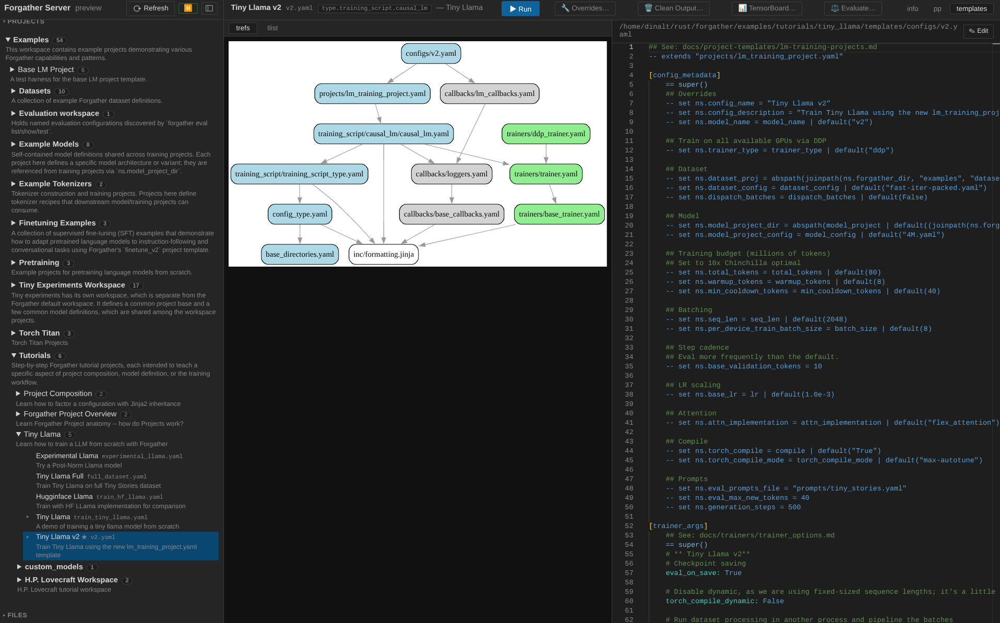

# Forgather ML

Forgather is a configuration-driven ML framework that uses template
inheritance and code generation to eliminate configuration duplication
and enable systematic experimentation. Instead of copying and modifying
entire training scripts, you inherit from base templates and specify
only what changes.

> 📚 **Documentation:**
> [forgather.readthedocs.io](https://forgather.readthedocs.io/en/latest/)
> or [docs/README.md](docs/README.md). New users should head straight
> to **[Getting Started](./docs/getting-started/README.md)**.

> 🖥️ **Web UI included.** Forgather ships with a single-user web
> frontend over the same APIs the CLI uses — project browsing,
> a GPU-aware job queue, live training monitoring with TTY, an in-browser editor with
> Forgather-aware syntax highlighting, and an inference/chat client wired to
> served models. The
> **[Forgather server walkthrough](./docs/guides/forgather-server-walkthrough.md)**
> tours the whole thing end-to-end, from a fresh install through
> training a small model and chatting with it.
>
> 

## Why Forgather?

Most research ML codebases accrete: one training script becomes ten
training scripts, each a near-copy of the others with subtle
differences. Every variation is expensive to try. Small bugs — a loss
function wired wrong, a scheduler silently reset on resume, a CLI flag
that didn't actually reach the tokenizer — hide across forks.

A Forgather project config extends a parent; both are plain YAML
with Jinja2 preprocessing. Every override is named and explicit, so a
silently-reset scheduler shows up as a one-line diff on a documented
knob — not as a buried fork waiting to bite three months later.

## Key Benefits

- **No config duplication.** Inherit from a base template and
  override only what changes — types are hyperparameters too, swap
  optimizers, models, or trainers in YAML via `!partial` / `!factory`
  / `!singleton` with no Python edits.
- **Standalone, framework-portable models.** Each run writes the
  equivalent PyTorch source into `output_models/`, loadable by plain
  `AutoModelForCausalLM` (or convertible to a canonical HF Llama /
  Mistral / Qwen3 / Gemma-3 checkpoint).
- **Pipeline parallelism for bandwidth-limited setups.** Dramatically
  less cross-device communication than DDP or FSDP — Forgather has
  trained a 7B model across two machines linked only by 1 Gbit
  Ethernet.
- **Low-memory training suite.** Full-parameter (not LoRA) finetuning
  of 7B models at ~53 K context on a single 24 GB GPU.
- **Live job control + GPU-aware web UI.** Save, stop, or abort
  running training jobs from another shell, coordinated across DDP /
  FSDP-2 / pipeline workers; the web frontend drops `▶ Run` jobs into
  a priority + GPU-policy queue with live TTY and an in-browser chat
  client.
- **Multi-node out of the box.** `forgather server --cluster <name>`,
  mDNS peer discovery, a `forgather cluster submit` fan-out CLI, and
  a cluster-shared dataset server with O(1) stateful resume.
- **HF-compatible distributed checkpoints.** Standard Safetensors
  shards readable by `transformers`, vLLM, and llama.cpp; explicit
  state-sharing patterns above the on-disk format so PP / FSDP-2 runs
  checkpoint correctly without per-trainer custom code.

## What's new

> ⚠️ **Heads up.** vLLM integration is currently broken — Forgather
> has moved to Transformers v5, which vLLM does not yet support.
> Upstream is working on v5 compatibility; the integration will be
> re-enabled once that lands.

**Latest release: [1.2.0](./docs/release-notes/v1.2.0.md) (May 2026).**
Headline is **multi-node training**: `forgather server --cluster <name>`
puts a node into cluster mode, peers discover each other over mDNS,
and a new `forgather cluster` CLI plus a Cluster panel in the web UI
fan training bundles across selected hosts/GPUs. Native TLS / mTLS,
a cluster-shared **dataset server** with O(1) resume, in-place server
restart, a distributable runtime Docker image, and DGX Spark (GB10,
aarch64) as a first-class cluster member. Multi-node guide:
[`docs/guides/multi-node-training.md`](./docs/guides/multi-node-training.md).

For the full timeline (pre-1.2.0 highlights: web UI, sharded-checkpoint
abstraction, Triton Adafactor, fused linear-CE, model conversion,
packed sequences + Flex Attention, …) see
[`docs/release-notes/`](./docs/release-notes/README.md).

## Table of Contents

- [Why Forgather?](#why-forgather)
- [Key Benefits](#key-benefits)
- [What's new](#whats-new)
- [Quick Start](#quick-start)
- [Key Features](#key-features)
- [Core Concepts](#core-concepts)
- [Learning Forgather](#learning-forgather)
- [Featured Examples](#featured-examples)

## Quick Start

Full install walkthrough and first-training-run tutorial:
**[docs/getting-started/README.md](./docs/getting-started/README.md)**.

```bash
# If running remotely over ssh,
# setup port forwarding
ssh -L 8765:localhost:8765 \
    -L 8137:localhost:8137 \
    -L 6006:localhost:6006 \
    -L 8000:localhost:8000 \
    user@dev-host

# Install with Docker
git clone https://github.com/jdinalt/forgather.git
cd forgather
docker/build                  # generic image; works for any host user
docker/run                    # interactive shell, --gpus all, ports forwarded

# Inside the container:

# Start the webui...
forgather server

# control-click on `http://localhost:8765/?token=4c4febdc07830cdd...` to connect with your browser

# ...or use the CLI
forgather --help
cd examples/tutorials/tiny_llama
forgather -t v2.yaml train
```

Requires Docker Engine 24+ and (for GPU training) the
[NVIDIA Container Toolkit](https://docs.nvidia.com/datacenter/cloud-native/container-toolkit/install-guide.html).
See [`docs/getting-started/docker.md`](./docs/getting-started/docker.md)
for the full breakdown — every CLI flag and env var, the runtime
(distributable) image, multi-node setup, and the release-testing
workflow.

See [`examples/tutorials/tiny_llama/README.md`](./examples/tutorials/tiny_llama/README.md)
for the full "train → monitor → control → eval → inference → export"
walkthrough, or [`docs/getting-started/installation.md`](./docs/getting-started/installation.md)
for the install details.

**Or skip the CLI** — if you'd rather start in a browser, the
[Forgather server walkthrough](./docs/guides/forgather-server-walkthrough.md)
covers the same Tiny Llama flow end-to-end through the web UI: install,
build the SPA, queue the training job, watch it run, then chat with the
trained model from the in-browser inference panel.

## Key Features

### Template inheritance

Create new experiments by inheriting from existing configs and
specifying only the differences:

```yaml
-- extends 'base_experiment.yaml'

[config_metadata]
    == super()
    -- set ns.seq_len = 16384        # longer context

[optimizer]
    == super()
    lr: 1.0e-3                       # override the LR, keep everything else
```

### Dynamic type system

Use any Python class or function directly in configs. Custom YAML tags
(`!partial`, `!factory`, `!singleton`, `!var`, `!call`) describe how to
build live Python objects from the parsed graph:

```yaml
optimizer: !partial:torch.optim.AdamW
    lr: 1.0e-3
    weight_decay: 0.01

[layer_factory]
# Experiment: swap PreLayerNorm for PostLayerNorm
layer_factory: &layer_factory !partial:.post_ln_layer:PostLNLayer@layer_factory
    feedforward_factory: *feedforward_factory
    attention_factory: *attention_factory
    norm_factory: *layer_norm_factory
    dropout: !var "layer_dropout"
    residual_dropout: !var "residual_dropout"
```

See [Syntax Reference](./docs/configuration/syntax-reference.md) for
the full list of line statements and YAML tags.

### Code generation (export, not an interpreter step)

**At runtime Forgather materialises the parsed node graph directly
into Python objects — no intermediate code-generation phase is
involved.** Python-source export is a separate function with two
uses:

1. **Custom model source.** When you construct a model for the first
   time, Forgather writes the equivalent Python source into the
   training run's output directory. The generated code has no
   Forgather dependency: any HF-compatible consumer (`transformers`,
   vLLM, etc.) can load the model without Forgather installed. This
   is what `trust_remote_code=True` resolves.

   ```python
   from transformers import AutoModelForCausalLM
   model = AutoModelForCausalLM.from_pretrained(
       "output_models/v2",
       trust_remote_code=True,
   )
   ```

   If you want plain-HF weights without `trust_remote_code`, convert
   via `forgather convert --reverse --model-type llama <src> <dst>`.
   The converter supports Llama, Mistral, Qwen3, and Gemma-3.

2. **Config debugging / pedagogy.** `forgather code --target X`
   prints the Python equivalent of any node in your config graph —
   useful when you want to understand what a complex `!partial` /
   `!factory` chain actually constructs, or to see how template
   overrides materialise. Not used by training itself.

### Trainers, optimizers, precision

All first-class trainers — `basic` (single-GPU), `ddp` (with optional
PostLocalSGD), `fsdp2` (FSDP-2 with configurable dtypes and CPU
offload), `pipeline` (GPipe / 1F1B / Interleaved-1F1B / zero-bubble),
and **DiLoCo** ([docs](./docs/trainers/diloco.md)) for very-low-
bandwidth multi-machine training — share the same config surface, so
swapping between them is a YAML override, not a rewrite. An
`AccelTrainer` wrapper and a Transformers-Trainer compatibility shim
also exist for legacy code.

On the optimizer side, the distinctive one is a fused **Triton
Adafactor with per-parameter bf16 stochastic rounding** — to our
knowledge the only Adafactor+SR implementation available, and faster
than every other Adafactor we've benchmarked. SR matters for
*pure-bf16* training (no fp32 master weights): without it, updates
below the bf16 precision step round to zero and weight norms drift.
A stochastic-rounding AdamW ships alongside; if you also want
quantized state, `torchao.optim.AdamW4bit` works (see the
[`adam4bit` config](./examples/finetune/samantha/templates/configs/llama3_1b/ddp_adam4bit.yaml)).
Apollo / Apollo-mini (low-rank gradient projection, experimental),
SinkGD, SGD, and Muon are also configurable, plus a regex-based
`multiopt` helper for per-parameter-group assignment. Mixed precision
covers bf16, fp16, and FP8-via-torchao (`tensorwise` / `rowwise` /
`rowwise_with_gw_hp`); schedulers cover Warmup-Stable-Decay, Cosine,
and Infinite-LR with token- or step-budgeted warmup/decay.

### Distributed checkpointing

Weight shards are written as a standard Hugging Face Safetensors
layout, so `transformers`, vLLM, llama.cpp conversion, and remote
eval harnesses all read the trained model directly. Sitting above
the on-disk format, Forgather's coordination layer uses **explicit
state-sharing patterns** (`GLOBAL` / `PER_RANK` / `REPLICATED` /
`PER_GROUP` / `PER_NODE`) — every checkpoint component declares its
sharing pattern and the trainer derives barriers and load paths from
that, so pipeline-parallel and FSDP-2 runs checkpoint correctly
without per-trainer custom code. Resume restores optimizer,
scheduler, dataset iterator, RNG, and step counter; optional
replication validation (`NONE` / `QUICK` / `TENSOR` / `FULL`) hashes
parameters across replicas to catch DDP-sync bugs.

See [`docs/checkpointing/`](./docs/checkpointing/) for the full
abstraction.

## Core Concepts

### Projects

Every Forgather experiment is a **Project** with this structure:

```
my_project/
├── meta.yaml              # Project metadata
├── templates/
│   ├── project.yaml       # Project-wide defaults
│   └── configs/           # Experiment configurations
│       ├── baseline.yaml
│       └── experiment_a.yaml
├── output_models/         # Generated code + runs (per config)
└── project_index.ipynb    # Optional interactive notebook
```

A **workspace** groups related projects and centralises template
search paths. Use `forgather ws create` to scaffold one and
`forgather project create` to add projects to it.

### Template language

Forgather uses **Jinja2 + YAML** with custom syntax:

- `-- extends 'template.yaml'` — template inheritance (single parent)
- `[block_name]` — named override-able sections
- `== super()` — include parent's version of the current block
- `-- set ns.var = value` — set a variable in the namespace
- `-- include 'template.yaml'` — include template content inline
- `#---- inline.template.name ----` — split a document into multiple templates
- `!partial:module:Class` / `!factory:...` / `!singleton:...` — construct Python objects
- `!var "name"` — variable references

### Config pipeline

Every config goes through the same pipeline, and each intermediate
step is inspectable:

```
Templates → YAML → Node Graph → Python Objects
                       │
                       └──> (optional) Python source code
                            - model source export (for HF
                              trust_remote_code loading)
                            - debugging / pedagogy
```

Forgather materialises the node graph *directly* into Python objects
at runtime; the Python-source path is a separate export, not an
intermediary step. Model construction uses the export path so the
resulting model is framework-portable; everything else (trainer,
optimiser, dataset, callbacks) is built by walking the graph.

Inspection commands:

```bash
forgather -t config.yaml pp                      # Preprocess Jinja2 → YAML
forgather -t config.yaml graph --format yaml     # Parsed node graph
forgather -t config.yaml targets                 # Constructable objects in the graph
forgather -t config.yaml code --target model     # Python-source export of a target (debug / model export)
forgather -t config.yaml construct --target model --call
                                                 # Materialise and show the constructed object
```

When you hit a config bug, start with `forgather ls -d` (dumps the
preprocessed file with YAML errors, or the Jinja2 error if
preprocessing itself failed), then escalate to `pp --debug` (dumps
every template in the chain).

## Learning Forgather

### Recommended path

1. **[examples/tutorials/tiny_llama](./examples/tutorials/tiny_llama)**
   — trains a 5M-param Llama in ~10 minutes; covers config anatomy,
   dynamic CLI args, monitoring, control, eval, inference, and
   exporting to plain HF format. Start here.
2. **[examples/tutorials/projects_overview](./examples/tutorials/projects_overview)**
   — how Forgather's multi-project layout is organised.
3. **[examples/tutorials/project_composition](./examples/tutorials/project_composition)**
   — cross-project composition (datasets / models / evals as
   independent projects that reference each other).
4. **[examples/tutorials/hp_lovecraft_project](./examples/tutorials/hp_lovecraft_project)**
   — fine-tune Mistral-7B / Llama-2-7B on the complete works of
   H.P. Lovecraft on a single 24 GB GPU. Long-context (up to 53K
   tokens), YaRN, gradient checkpointing, activation offloading.

### Interactive shell

```bash
forgather -i
```

Drops you into a shell where every subcommand works without the
`forgather` prefix (so `pp`, `ls`, `train` instead of `forgather pp`,
etc.). Convenient for quick iteration inside a single project.

## Featured Examples

Forgather ships with a library of worked examples that go well beyond
the tutorials — each has a detailed README with reproducible commands
and, where relevant, a headline result. The table below picks the
best starting point for each journey. For per-project write-ups (the
"why this is interesting" version of each row), see the
[Featured Examples highlights](./examples/README.md#featured-examples-highlights);
for the full directory map, see
[`examples/README.md`](./examples/README.md).

| Journey | Project | Headline |
|---|---|---|
| Pretrain from scratch | [`examples/pretrain/small-llm`](./examples/pretrain/small-llm/README.md) | 162M Llama on SmolLM, Chinchilla-scaling plots |
| Fine-tune a 7B model (multi-GPU) | [`examples/finetune/samantha`](./examples/finetune/samantha/README.md) | Every trainer backend, ~8.9K tok/s on 4× RTX 4090 |
| Instruction / reasoning fine-tune | [`examples/finetune/open-orca`](./examples/finetune/open-orca/README.md) | 1B Llama, 1B-token budget, ~11h on 4× 4090 |
| Long-context fine-tuning + RoPE recipes | [`examples/tutorials/hp_lovecraft_project`](./examples/tutorials/hp_lovecraft_project/README.md) | 7B at **53 K context** on one 24 GB GPU |
| Cut peak memory | [`examples/tiny_experiments/peak_memory`](./examples/tiny_experiments/peak_memory/README.md) | **81% peak-memory reduction** at ~2.7× throughput |
| Pick an optimizer | [`examples/tiny_experiments/optimizers`](./examples/tiny_experiments/optimizers/README.md) | Ten-optimizer bake-off; Muon wins at small batch |
| Pipeline-parallel recipes | [`examples/tiny_experiments/pipeline_parallel`](./examples/tiny_experiments/pipeline_parallel/README.md) | GPipe / 1F1B / ZBV / interleaved test harness |
| Decentralised / bandwidth-limited training | [`examples/tiny_experiments/diloco`](./examples/tiny_experiments/diloco/README.md) | DiLoCo with pseudo-gradient compression |

### Building your own

- **Scaffold a new project** with `forgather project create` (inside
  an existing workspace) or `forgather ws create` (a brand-new
  workspace). These commands generate a minimum-working `meta.yaml`
  + `templates/` tree that extends the recommended base templates.
  Full walk-through: the [Tiny Llama tutorial](./examples/tutorials/tiny_llama/README.md).
- **[`examples/base_lm_project`](./examples/base_lm_project)** —
  a bare harness that drives the raw `projects/lm_training_project.yaml`
  template with no project-specific overrides. Useful for inspecting
  what the base template does on its own, and for debugging changes
  to the base template itself, but not a typical starting point for
  new work.
