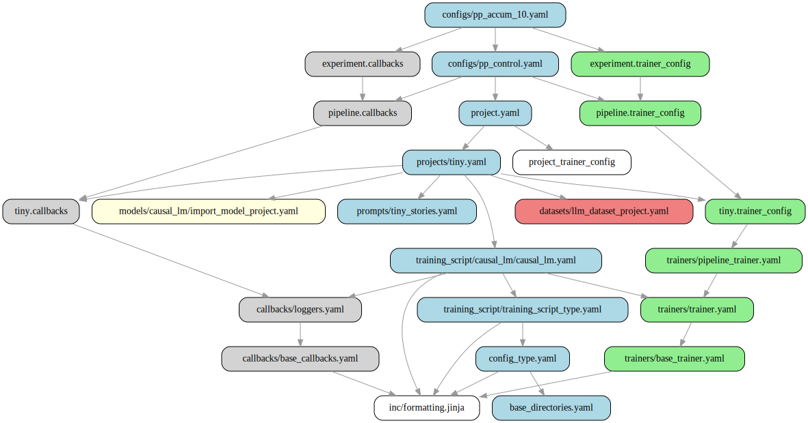
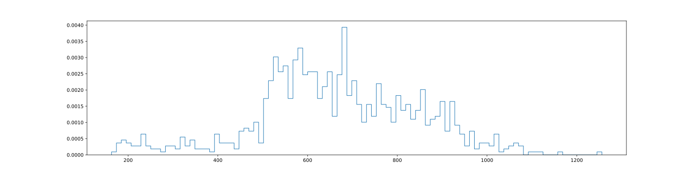

# Debugging Templates

Debugging templates can be a little tricky, as there is often a complex inheritance hierarchy combined with cryptic Jinja/YAML error messages.

Before going any further, it will make your life much easier if you install the Forgather syntax highlighting plugins for vim and VS code, found in "syntax_highlighting."

The "forgather" command-line tool is here to help make this a little less painful. I would strongly recommend running in "interactive" mode from your project directory:

```bash
forgather -i
```

Running the forgather 'ls' command is probably a good place to start. It will list all available configurations and, as it needs to extract config metadata, it implicilty preprocesses and parses all available configurations. If something goes wrong, you will see something like this:

```bash
forgather ls
Grad Accumulation : Test gradient accumulation
    ...
    pp_control.yaml                Pipeline Trainer Control : Test simple pipeline setup
    pp_accum_10.yaml               PARSE ERROR : An error occured while parsing the configuration.
    [control.yaml]                 Baseline : Baseline configuration using Tiny Experiments defaults
```

We can see that an error occurred while parsing the "pp_accum_10.yaml" configuration. "ls" takes a debug flag, "--debug" or just "-d," which will cause it to stop at the first error and dump the backtrace.

```bash
forgather ls -d
...
  File "/home/dinalt/ai_assets/forgather/templatelib/base/trainers/base_trainer.yaml", line 18, in top-level template code
    -- block trainer_header
  File "/home/dinalt/ai_assets/forgather/templatelib/base/trainers/pipeline_trainer.yaml", line 20, in block 'trainer_header'
    # pipeline_layers: {{ ns.pipeline_layers }}
jinja2.exceptions.UndefinedError: 'jinja2.utils.Namespace object' has no attribute 'pipeline_layers'
```

In this case, we can see that Jinja2 is reporting that the namespace object, "ns," does not have an attribute named "pipeline_layers," with the offending line 20 in "pipeline_trainer.yaml," block "trainer_header."

## The PP Command

The pre-process (pp) command is usually a good place to start, if you are seeing a Jinja2 error. To assist with debugging, you can add the --debug flag, which will dump the templates, as Jinja sees them.

This is important, as Forgather's Jinja2 loader performs preprocessing of its own, where things like line-statements are converted to normal Jinja syntax and individual files are split into multiple inline templates.
This can cause the line numbers and file names reported in Jinja to be inaccurate.

```bash
forgather -t pp_accum_10.yaml pp --debug
# Dynamic arguments received: {'log_peak_memory': False}

---------------------------------- meta.yaml -----------------------------------
     1: 
     2: 
     3: 
...
------------------------------ pipeline.callbacks ------------------------------
     1: 
     2: 
     3: 
...
```

If using the CLI, running the "pp" command will automatically send the output to your pager. If you would prefer to send it to vim or VS code, add the "-e" flag, and the output will be opened in your editor.

## The Template References (trefs) Command

It's common to for the inheritance hierarchy to be quite complex. To make it easier to understand where everything is comming from, there is the "trefs" command.

This command will only work if the "pp" command is working, as it requires Jinja2 to trace the dependencies. If you are running into trouble with preprocessing, it can still help. Use the command on the nearest working configuration to the one you are debugging.

```bash
usage: forgather trefs [-h] [--format {md,files,tree,dot,svg}] [-o OUTPUT_FILE] [-e]

List referenced templates

options:
  -h, --help            show this help message and exit
  --format {md,files,tree,dot,svg}
                        Output format: md (markdown), files (file list), tree (hierarchical), dot (graphviz), svg (render SVG).
  -o OUTPUT_FILE, --output-file OUTPUT_FILE
                        Write output to file
  -e, --edit            Write output to temporary file and open in editor

# The image below was generated with this command...
forgather -t pp_accum_10.yaml trefs --format svg -o example_trefs.svg

# If you are using VS Code, you send the generated graph directly to VS Code for rendering with the "-e" option, instead
forgather -t pp_accum_10.yaml trefs --format svg -e
```




Note that for the above command to work, you will need to have installed the "graphviz" package.

```bash
# On Debian Linux derivatives...
sudo apt-get install graphviz
```

Alternatively, you can view the graph like this, but it's not as informative:
```
forgather:grad_accumulation [pp_accum_10.yaml]> trefs --format tree
Executing: forgather -t pp_accum_10.yaml trefs --format tree
Template Hierarchy for configs/pp_accum_10.yaml
===============================================

📁 📄 configs/pp_accum_10.yaml
├── 📄 configs/pp_control.yaml
    ├── 🔄 pipeline.callbacks → templates/configs/pp_control.yaml
    │   └── 🔄 tiny.callbacks → ../forgather_workspace/projects/tiny.yaml
    │   │   └── 🔄 callbacks/loggers.yaml
    │   │       └── 🔄 callbacks/base_callbacks.yaml
    │   │           └── 📋 inc/formatting.jinja
    ├── 🏃 pipeline.trainer_config → templates/configs/pp_control.yaml
    │   └── 🏃 tiny.trainer_config → ../forgather_workspace/projects/tiny.yaml
    │   │   └── 🏃 trainers/pipeline_trainer.yaml
    │   │       └── 🏃 trainers/trainer.yaml
    │   │           └── 🏃 trainers/base_trainer.yaml
    └── 📄 project.yaml
    │   ├── 🏃 project.trainer_config
    │   └── 📄 projects/tiny.yaml
    │       ├── 📊 datasets/llm_dataset_project.yaml
    │       ├── 🧠 models/causal_lm/import_model_project.yaml
    │       ├── 📄 prompts/tiny_stories.yaml
    │       └── 📄 training_script/causal_lm/causal_lm.yaml
    │           └── 📄 training_script/training_script_type.yaml
    │               └── 📄 config_type.yaml
    │                   └── 📄 base_directories.yaml
├── 🔄 experiment.callbacks → templates/configs/pp_accum_10.yaml
└── 🏃 experiment.trainer_config → templates/configs/pp_accum_10.yaml
```

## The Graph Command

Sometimes the issue is at the YAML parsing level, rather than at the Jinja2 level. If the "pp" command succeeds, you can try running the "graph" command, which can trigger a YAML parse error.

At other times, this command can be helpful to understand what values are actually being used, when the raw configuration has many parameter overrides.

```bash
# usage: forgather graph [-h] [--format {none,repr,yaml,fconfig,python}]
forgather -t pp_accum_10.yaml graph --format yaml
```

Here, we can see the final values for all of the trainer_args, which have many overrides in the preprocessed config.

```yaml
...
.define: &trainer_args !singleton:forgather.ml.trainer.pipeline:PipelineTrainingArguments@trainer_args
    save_strategy: 'no'
    max_steps: -1
    output_dir: '/home/dinalt/ai_assets/forgather/examples/tiny_experiments/grad_accumulation/output_models/control'
    logging_dir: '/home/dinalt/ai_assets/forgather/examples/tiny_experiments/grad_accumulation/output_models/control/runs/pp_10_2025-09-15T00-22-44'
    split_spec: *kappa_
    pipeline_chunks: 4
    stages_per_rank: 1
    is_multistage: False
    resume_from_checkpoint: False
    seed: 42
    per_device_train_batch_size: 32
    per_device_eval_batch_size: 64
    logging_steps: 10
    eval_strategy: 'steps'
    eval_steps: 50
    save_steps: 1000
    num_train_epochs: 1
    dataloader_num_workers: 1
    gradient_accumulation_steps: 10
...
```

It can sometimes be more informative to see what the equivalent Python code looks like.

```bash
forgather -t pp_accum_10.yaml graph --target trainer_args --format python
```

## The Code Command

It can sometimes be more informative to see what the equivalent Python code looks like. You can selectively examine different parts of the graph by specifying the "--target."

```bash
forgather -t pp_accum_10.yaml code --target trainer_args
```

```python
from forgather.ml.trainer.pipeline import PipelineTrainingArguments

def construct(
):
    trainer_args = PipelineTrainingArguments(
        save_strategy='no',
        max_steps=-1,
        output_dir='/home/dinalt/ai_assets/forgather/examples/tiny_experiments/grad_accumulation/output_models/control',
        logging_dir='/home/dinalt/ai_assets/forgather/examples/tiny_experiments/grad_accumulation/output_models/control/runs/pp_10_2025-09-15T00-27-47',
        split_spec={
            'causal_lm.layer_stack.layers.2': 'beginning',
        },
        pipeline_chunks=4,
        stages_per_rank=1,
        is_multistage=False,
        resume_from_checkpoint=False,
        seed=42,
        per_device_train_batch_size=32,
        per_device_eval_batch_size=64,
        logging_steps=10,
        eval_strategy='steps',
        eval_steps=50,
        save_steps=1000,
        num_train_epochs=1,
        dataloader_num_workers=1,
        gradient_accumulation_steps=10,
    )
    
    return trainer_args

```

## CLI Edit Command
To make things easier, the interactive CLI has an "edit" command, which can open templates in an editor. By default, it will open the templates in "vim," but if you are running in VS code, it will open the specified templates in your editor.

For example, we can open 3 templates at once, like this:

```
forgather:grad_accumulation> edit

Available templates:
==================================================
...
  19. ../../../templatelib/base/trainers/pipeline_trainer.yaml
...
Project Configs:
...
  38. templates/configs/control.yaml
  39. templates/configs/pp_accum_10.yaml
  40. templates/configs/pp_control.yaml

Project Templates:
  41. templates/project.yaml
  ...
==================================================
You can select multiple files:
  - Single file: 5
  - Multiple files: 1,3,7
  - Ranges: 1-5,8,10-12 
Select template(s) (0-51): 19,39,41
```

## The Construct Command

Sometimes everyhing works fine, until you actually try to construct something. That's where the "construct" command comes in, which allows you to selectivley construct and display targets from the configuration.

First, it may help to know which targets are available for construction. While you could use "pp" for this, it's more direct to just use the "targets" command to get a list of things you can construct.

```
forgather:grad_accumulation [pp_accum_10.yaml]> targets
Executing: forgather -t pp_accum_10.yaml targets
distributed_env
testprompts
generation_config
model_constructor_args
tokenizer
model
tokenizer_args
train_dataset
eval_dataset
data_collator
experiment_info
text_gen_callback_args
trainer_callbacks
optimizer
lr_scheduler
split_spec
trainer_args
model_preprocessor
trainer
dynamic_args
meta
main
```

Let's say that the training_args are not working right or are not doing what you expect...


```
orgather:grad_accumulation [pp_accum_10.yaml]> construct --target trainer_args
Executing: forgather -t pp_accum_10.yaml construct --target trainer_args
PipelineTrainingArguments(output_dir='/home/dinalt/ai_assets/forgather/examples/tiny_experiments/grad_accumulation/output_models/control',
                          logging_dir='/home/dinalt/ai_assets/forgather/examples/tiny_experiments/grad_accumulation/output_models/control/runs/pp_10_2025-09-15T00-53-27',
                          per_device_eval_batch_size=64,
                          per_device_train_batch_size=32,
...
                          debug_model_params=False,
                          debug_model_init=False,
                          pipeline_chunks=4,
                          stages_per_rank=1,
                          pp_stage_type='loop',
                          is_multistage=False)
```


Now we can see all of the arguments, including the ones we did not specify.

Some of the targets may only be for a constructor, where the constructor is materialized, constructor needs to be called. A good example of this is the "model" target, which is a partial function. We can add the "--call" flag to construct the object.

```
forgather:grad_accumulation [pp_accum_10.yaml]> construct --target model --call
Executing: forgather -t pp_accum_10.yaml construct --target model --call
DynamicCasualLM(
  (causal_lm): CasualLM(
    loss_fn=CausalLoss()
    (input_encoder): InputEncoder(
      d_model=256, vocab_size=2000
      (dropout): Identity()
      (embedding): Embedding(2000, 256)
      (positional_encoder): SinusoidalPE(d_model=256, max_sequence_length=2048)
    )
    (output_decoder): Linear(in_features=256, out_features=2000, bias=True)
    (layer_stack): LayerStack(
      gradient_checkpointing=False, checkpoint_stride=1
      (layers): ModuleList(
        (0-3): 4 x PostLNLayer(
          (feedforward): FeedforwardLayer(
            d_model=256, d_feedforward=1024
            (linear1): Linear(in_features=256, out_features=1024, bias=True)
            (dropout): Identity()
            (activation): ReLU()
            (linear2): Linear(in_features=1024, out_features=256, bias=True)
          )
          (attention): CausalMultiheadAttn(
            d_model=256, num_heads=2, d_head=128
            (query_linear): Linear(in_features=256, out_features=256, bias=True)
            (key_linear): Linear(in_features=256, out_features=256, bias=True)
            (value_linear): Linear(in_features=256, out_features=256, bias=True)
            (output_linear): Linear(in_features=256, out_features=256, bias=True)
          )
          (norm1): LayerNorm((256,), eps=1e-05, elementwise_affine=True)
          (norm2): LayerNorm((256,), eps=1e-05, elementwise_affine=True)
          (dropout): Identity()
          (residual_dropout): Identity()
        )
      )
    )
  )
)
```

## Debugging Models

While you can construct a model using the generic "construct" command, there is actually a sub-command for working with models.

```bash
usage: forgather model [-h] [--device DEVICE] [-o OUTPUT_FILE] [-e] {construct,test} ...

Test a model definition

positional arguments:
  {construct,test}      Model subcommands
    construct           Construct a model
    test                Test model forward and backward

options:
  -h, --help            show this help message and exit
  --device DEVICE       Device to construct model on
  -o OUTPUT_FILE, --output-file OUTPUT_FILE
                        Write output to file
  -e, --edit            Write output to temporary file and open in editor
  ```

It can be helful, especially for huge models, to construct them on the "meta" device. This creates a model with meta-data that you can perform forward/backward on, lacks real parameters. This means you can construct and sanity test your model much faster.

```
forgather:deepone> model --device meta construct
Executing: forgather model --device meta construct
------------------------------Model Configuration-------------------------------
DynamicCausalLMConfig {
  "activation_dropout": 0.0,
  ...
parameters={'total': '1729.76M', 'trainable': '1729.76M'}
```

There is also a "test" sub-command

```
forgather:deepone> model --device meta test
Executing: forgather model --device meta test
Testing model with batch: torch.Size([2, 512])
loss = tensor(..., device='meta', size=(), grad_fn=<NllLossBackward0>)
logits = torch.Size([2, 512, 32000])
Model completed forward and backward steps

forgather:deepone> model --device cuda:0 test
Executing: forgather model --device cuda:0 test
Testing model with batch: torch.Size([2, 512])
loss = 10.442408561706543
logits = torch.Size([2, 512, 32000])
Model completed forward and backward steps
```

## Debugging Datasets

In additon to the specialized "model" command, there is a "dataset" command. This is especially useful, if you are testing custom code to process the dataset.

```bash
forgather:QuixiAI> dataset --help
Executing: forgather dataset --help
usage: forgather dataset [-h] [-T TOKENIZER_PATH] [--pp] [-H] [--target TARGET] [--histogram-samples HISTOGRAM_SAMPLES] [-n EXAMPLES] [--features [FEATURES ...]] [-s] [-o OUTPUT_FILE] [-e] [--chat-template CHAT_TEMPLATE]

Dataset preprocessing and testing

options:
  -h, --help            show this help message and exit
  -T TOKENIZER_PATH, --tokenizer-path TOKENIZER_PATH
                        Path to tokenizer to test
  --pp                  Show preprocessed configuration
  -H, --histogram       Generate dataset token length historgram and statistics
  --target TARGET       The dataset to sample from; see "forgather targets"
  --histogram-samples HISTOGRAM_SAMPLES
                        Number of samples to use for histogram
  -n EXAMPLES, --examples EXAMPLES
                        Number of examples to print
  --features [FEATURES ...]
                        Features to show
  -s, --tokenized       The split is already tokenized
  -o OUTPUT_FILE, --output-file OUTPUT_FILE
                        Write output to file
  -e, --edit            Write output to temporary file and open in editor
  --chat-template CHAT_TEMPLATE
                        Path to chat template
```

Some dataset may require custom arguments. In the above example, "--chat-template" is a dynamic-arguments (defined in the configuration).

Load train dataset and dump a few examples

```
forgather:QuixiAI> dataset --target train_dataset_split -n 3
Executing: forgather dataset --target train_dataset_split -n 3
Printing 3 examples from the train dataset:
Tokenizer path not provided, skipping tokenization.
---------------------------------------0----------------------------------------
*conversations**

{'gpt': ["I'd be happy to help if I can. Can you give me some details about the situation you're facing?",
...
```

In the above example, we can see that the examples are actually dictionaries, which require further preprocessing into real examples. This will require both a tokenizer and a chat-template.

```
forgather:QuixiAI> dataset --target train_dataset --chat-template ../../../chat_templates/chatml.jinja -T ../../../tokenizers/wikitext_32k/ -n 3
Executing: forgather dataset --target train_dataset --chat-template ../../../chat_templates/chatml.jinja -T ../../../tokenizers/wikitext_32k/ -n 3
----------------------------------------
<|BOS|><|im_start|>user
Hey Samantha, I've run into a bit of a tricky situation at work, and I'm not sure how to handle it. Do you have any advice?<|im_end|>
<|im_start|>assistant
I'd be happy to help if I can. Can you give me some details about the situation you're facing?<|im_end|>
```

Sometimes is useful to have an idea of the distribution of sequence lengths in a dataset, given a tokenizer. We can generate a histogram like this:
```
forgather:QuixiAI> dataset --target train_dataset --chat-template ../../../chat_templates/chatml.jinja -T ../../../tokenizers/wikitext_32k/ --histogram -s
Executing: forgather dataset --target train_dataset --chat-template ../../../chat_templates/chatml.jinja -T ../../../tokenizers/wikitext_32k/ --histogram -s
Generating token-length histogram: /home/dinalt/ai_assets/forgather/examples/datasets/QuixiAI/samantha.svg
sample size: 1000
min: 163
max: 1256
mean: 664.7750244140625
median: 654.0
std: 180.3797607421875
```



