# Forgather server: end-to-end walkthrough

This guide walks you from a fresh install through training a small model
and chatting with it — all from the Forgather server's web UI. It's
intended as a first introduction to the UI; once you've done the round
trip you'll have seen most of the major panels and how they fit
together.

**What you'll do:**

1. [Install Forgather](#1-install)
2. [Start the server and connect](#2-start-the-server-and-connect)
3. [Serve the docs (optional)](#3-serve-the-docs)
4. [Find the Tiny Llama tutorial project](#4-find-the-tiny-llama-project)
5. [Inspect the configuration](#5-inspect-the-configuration)
6. [Queue and dispatch a training job](#6-queue-and-dispatch-a-training-job)
7. [Watch the run](#7-watch-the-run)
8. [Serve the trained model](#8-serve-the-trained-model)
9. [Generate text from the new model](#9-generate-text)
10. [Train the model for chat](#10-train-the-model-for-chat)

**What you'll need:**

- A Linux machine with at least one CUDA-capable GPU (the example uses
  two; one works too — see below).
- Python 3.12+ and Node.js / npm. See
  [Installation](../getting-started/installation.md) for distro-specific
  install commands.
- A local browser. If your training host is remote, you'll set up SSH
  port forwarding in step 2.

The whole walkthrough takes ~10–15 minutes once everything is
installed, with most of that being the actual training run (~2 min on
an RTX 4090, longer on smaller GPUs).

---

## 1. Install

If you haven't already, follow [Installation](../getting-started/installation.md).

The **Docker install is the recommended method** — the image bundles
Python 3.12, the right CUDA wheels, every Forgather dependency, and a
prebuilt SPA bundle, so the steps below Just Work the moment you
land in the container. See [Docker images](../getting-started/docker.md)
for the full reference (CLI flags, env vars, runtime image for
clusters, troubleshooting).

## 2. Start the server and connect

```bash
forgather server
```

Defaults to `http://localhost:8765/`. On startup you'll see a banner
with a one-shot login URL:

```
    Forgather server is running at:
        http://127.0.0.1:8765/?token=4c4febdc07830cdd…
        http://localhost:8765/?token=4c4febdc07830cdd…

    CLI auth: token in /home/<user>/.config/forgather/server/auth_token (mode 0600)
    First successful token login will prompt to set a password for future browser logins.
```

Click (or paste) that URL into a browser on the same machine. Most
GUI terminals need **Ctrl+click** (rather than a plain click) to
open a link in your browser; on macOS Terminal use **⌘+click**. The
token is stripped from the address bar after it's exchanged for a
session cookie, so it won't end up in your history. On a successful
first login you'll be prompted to **set a password** — handy because
future browser logins can use the password instead of the
64-character token. Skipping is fine; you can always sign in with
the token again.

Without the URL, the same page shows a login form that accepts either
the token or the password. The token sits at
`~/.config/forgather/server/auth_token` (mode 0600); print it with
`cat ~/.config/forgather/server/auth_token` if you ever need it again.

> **Why a token?** A loopback-bound server is reachable by _any_
> local user on the host, not just you. The token gates that
> exposure. CLI commands (`forgather sched`, `forgather job`,
> `forgather train --enqueue`, …) read the token file
> automatically — you never paste it on the command line.

If your training host is remote, set up SSH port forwarding on the remote
 — forwarding the canonical ports for the Forgather server,
inference jobs, TensorBoard, and MkDocs all at once is convenient
because every spawned tool lives at a known port:

```bash
# Forgather Server: 8765
# Inference Server: 8137
# TensorBoard: 6006
# MkDocs: 8000
ssh -L 8765:localhost:8765 \
    -L 8137:localhost:8137 \
    -L 6006:localhost:6006 \
    -L 8000:localhost:8000 \
    user@dev-host
```

Then open <http://localhost:8765/> on the remote. The token printed
on the remote console works as-is over the tunnel — paste it (or the
full URL) into the laptop's browser. If you also want to run
`forgather` CLI commands _from the laptop_ against the tunnelled
server, point them at the remote token file:

```bash
export FORGATHER_SERVER_TOKEN=$(ssh dev-host cat .config/forgather/server/auth_token)
forgather sched status
```

The
[Getting Started SSH section](../getting-started/README.md#accessing-a-remote-server-over-ssh)
has a `~/.ssh/config` snippet you can drop in to make the port
forwarding permanent.

> **Heads-up: prefer `localhost` over `127.0.0.1`.** They're not
> always interchangeable on the client side. Some browser
> environments — Chromebook in particular — resolve `localhost`
> through the SSH tunnel as expected, but `127.0.0.1` hits the
> Chromebook's own loopback (which has nothing listening) and
> fails to connect. macOS and most Linux desktops treat the two
> identically, but `localhost` is the safer default. Same goes
> for the spawned-tool URLs further down (TensorBoard, MkDocs,
> inference servers): if a job card's clickable link doesn't
> resolve, swap any `127.0.0.1` for `localhost` and try again.

The sidebar's collapsible groups (Views, Tools, Services, Search
Roots, Projects, Files) are all closed on first boot — expand the
ones you want. **Tools** holds one-shot model-manipulation actions
(Evaluate, Convert, Finalize, Update). **Services** holds the
launchers for long-running spawned processes (Inference, Dataset,
TensorBoard, MkDocs); each can also be saved as an auto-start
service entry — see *[Saving a service for next time](#saving-a-service-for-next-time)*
below.

At the bottom of the sidebar a footer bar carries four icon
buttons:

- **⟳ Refresh data** — re-reads projects, configs, and templates
  from disk. Use this after editing files outside the webui.
- **▶ / ⏸ Scheduler toggle** — flips the dispatcher loop on/off
  (green when running, muted when paused).
- **↺ Restart server** — re-execs the server process in place.
  PID, TTY, and running subprocesses (training, inference,
  dataset, …) all survive. Useful for picking up changes after
  you edit the config file.
- **⚙ Open server config** — opens `server_config.yaml` in the
  embedded editor. See [Persistent CLI defaults](#persistent-cli-defaults)
  further down.

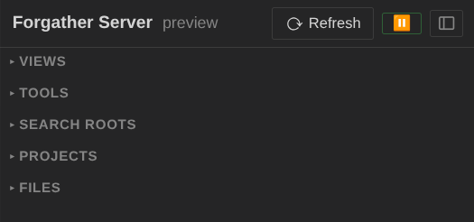

## 3. Serve the docs

This step is optional but useful: the same docs you're reading now
can be served locally from the running server, which is handy for
flipping between the walkthrough and the live UI.

Open the **Services** group in the sidebar and click **📖 MkDocs…**.
The modal pre-fills the right `mkdocs.yml` (the bundled one at the
repo root); leave the rest at defaults and submit.

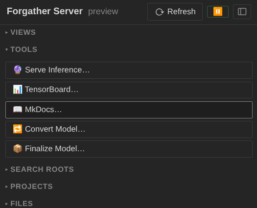

> **Heads-up:** the _first_ `mkdocs serve` build is slow — a couple
> of minutes typically — because it has to render all the example
> notebooks (`mkdocs-jupyter`). Subsequent rebuilds are quick.

Once the job's running, its card in the **Jobs** panel shows a
clickable URL (port 8000 by default). With the SSH forwards in place,
that link resolves transparently from the laptop. You now have these
docs at <http://localhost:8000/> alongside the UI you're using.

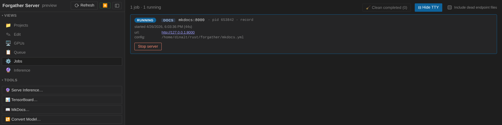

## 4. Find the Tiny Llama project

Expand the **Projects** group in the sidebar. You should see a
workspace tree clustered by `forgather_workspace/` directory; the
bundled examples live under the `examples/` workspace. Drill into
**examples → tutorials → tiny_llama**.

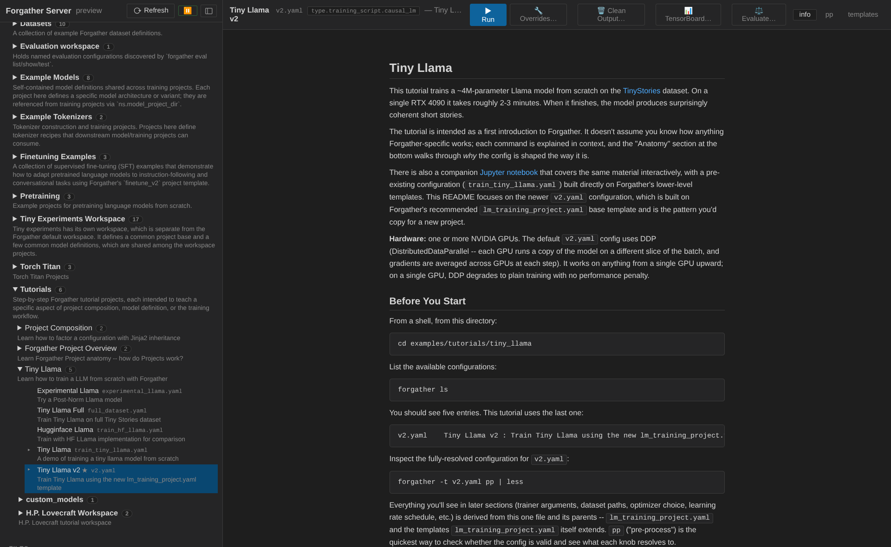

Clicking the project node selects its default config (`v2.yaml`) and
opens the project's README in the **info** tab. Take a moment to skim
it — the project trains a ~4M-parameter Llama on a subset of the
TinyStories dataset, and the README explains what's going on.

## 5. Inspect the configuration

The config viewer has three tabs: `info` (the README, currently shown),
`pp` (preprocessed YAML), and `templates` (template-dependency view).

Click **templates** to see the configuration's template graph. The
left panel shows the trefs view by default — every template that
contributes to `v2.yaml`'s materialized configuration, with arrows
showing inheritance and includes. Clicking a node loads its source
in the right panel.


Switch the left-panel mode bar to **tlist** to see the same templates
listed alphabetically by category instead of as a graph. Both views
are useful — trefs for understanding _which_ templates compose the
config, tlist for finding a specific template by name.

Click **pp** to see the fully preprocessed YAML — the same thing
`forgather pp` would print on the CLI. This is what the training
script actually receives. Worth a quick scroll-through to see how
much the templates expand into.

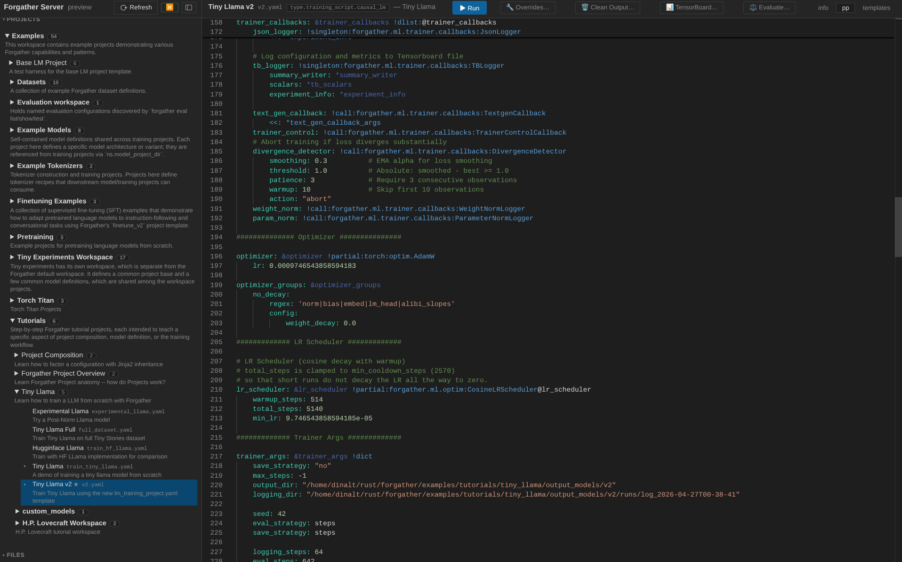

### 5.1 Start TensorBoard (optional)

Before staring training, we can start TensorBoard to monitor the training job.

Expand the **Services** group in the sidebar and click **📊 TensorBoard…**
(or right click on the configuration and select "TensorBoard…"). This
will take you to the "Jobs" panel. You should see a "TB"
card, where you can click on the URL to open TensorBoard. Once your training jobs starts,
you can monitor progress from here.

Now switch back to the Forgather Server WebUI and click on "Projects" in the sidebar to
return to where we left off.

## 6. Queue and dispatch a training job

Before submitting, it's worth understanding the queue/scheduler
split: jobs are _enqueued_ (added to the waiting queue) and then
_dispatched_ (handed to a process and assigned GPUs). The dispatcher
runs on a 2-second tick and picks idle GPUs based on priority + GPU
policies.

You can pause dispatch independently of enqueueing — useful when you
want to inspect what's about to run before it actually starts. Click
the **▶/⏸** button in the sidebar footer (next to ⟳ Refresh) to
toggle. **⏸** means dispatch is paused; new submissions sit in the
queue waiting.

For this walkthrough, pause the dispatcher first so you can see the
job in the queue panel before it kicks off:


If you have already run the Tiny Llama tutorial, clean the output artifacts by
clicking on **Clean Output** first.

Now back to **Projects → examples → tutorials → tiny_llama**. The
config viewer's header has action buttons including **▶ Run**. Click
it to open the submit modal.

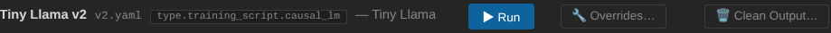

The submit modal exposes the config's dynamic args, requested GPU
count, and priority. The default `v2.yaml` config is set up to use however
many GPUs are assigned; if you have more than one GPU, change the **Requested GPUs** field to
the number of GPUs to use (the config will adapt — single-GPU training still works, just
without DDP). Leave the other fields at their defaults and submit.

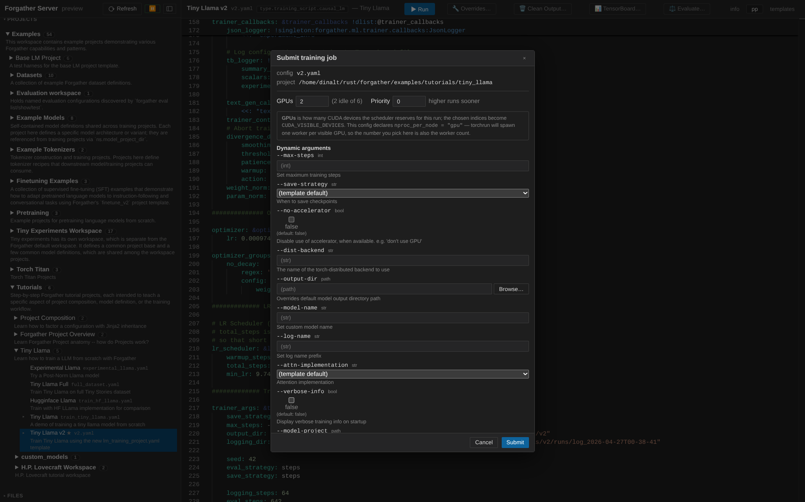

Switch to the **Queue** view (📋 in the sidebar's Views group). The
job appears at the top of the list with status `pending`, waiting
for the dispatcher.

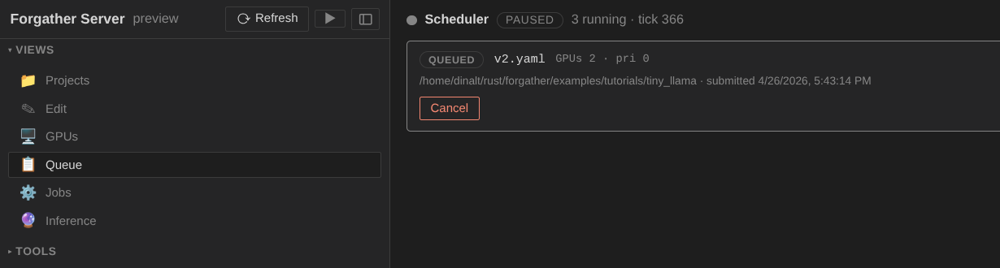

Now click the **⏸/▶** button in the sidebar footer to resume
dispatch. Within a tick or two the scheduler picks GPUs, marks the
job `starting`, and then `running`. The job moves out of the queue
and into the **Jobs** panel.

## 7. Watch the run

Switch to **Jobs** (⚙ in Views). Your training job is the first card,
showing live status pills (loss, lr, grad_norm, epoch, tok/s, peak
memory) plus a progress bar.

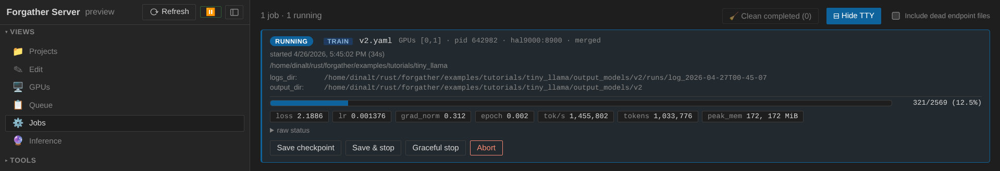

Toggle **⊞ Show TTY** at the top of the panel. The view splits
horizontally; clicking the job card routes its captured stdout/stderr
to the bottom pane. Loss / lr lines stream in as the trainer reports
them — it's the same output `forgather train` would print in your
terminal, just captured server-side so you can scroll back through it.

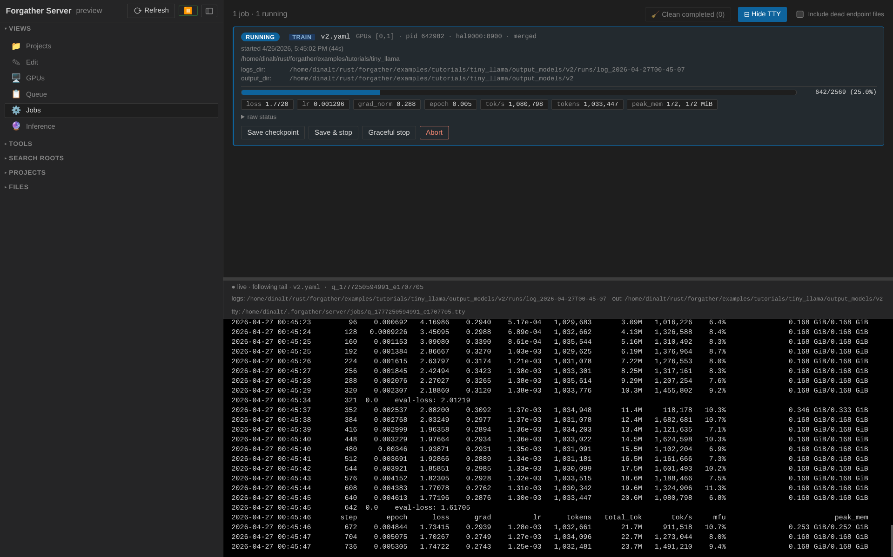

Flip to the **GPUs** view (🖥) to see live utilization, memory, power,
and temperature. The GPUs assigned to your job glow blue and show a
process chip mapping back to the running job's config name; idle
GPUs are dimmed.

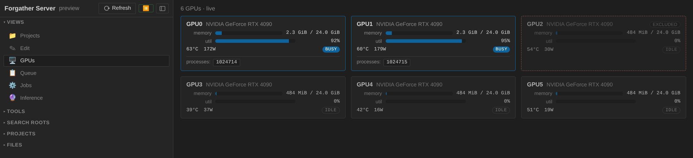

Wait for the run to finish — about 2 minutes on an RTX 4090, longer
on smaller cards. When it does, the job card flips to `done`, the
GPUs go idle, and the loss should have come down to somewhere around
2.5 (TinyStories is friendly to small models).

If you return to the projects panel, you will see that the outputs have been associated with the training run.

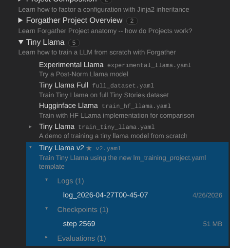

You can summarize the run by clicking on the completed log and selecting the "summary" tab.

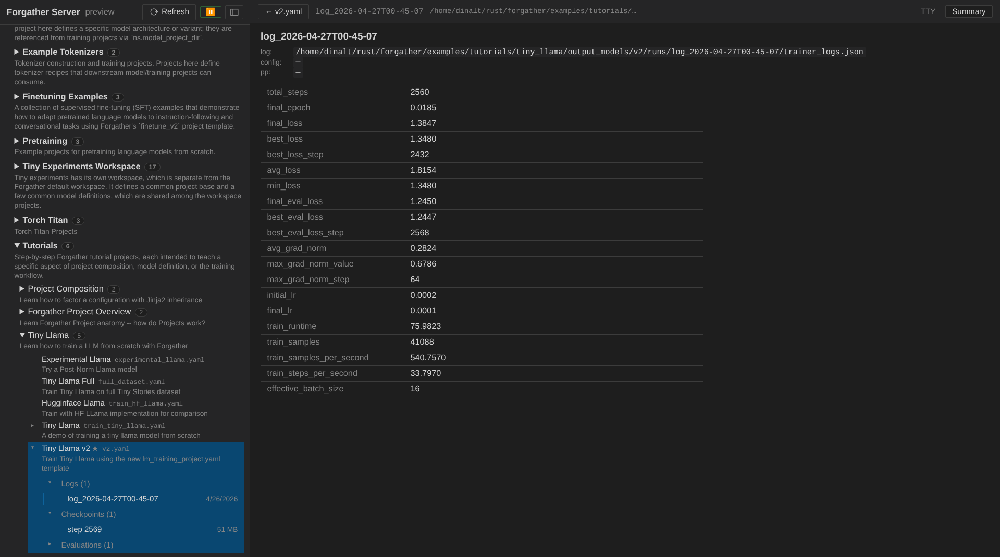

…or scroll the TTY pane in the UI to the bottom to see the trainer's
own summary line.

## 8. Serve the trained model

The trained checkpoint lands at
`examples/tutorials/tiny_llama/output_models/tiny_llama/`. To chat
with it (such as it is), spawn an inference server.

In **Projects**, with `v2.yaml` selected, the config viewer's header
now also shows **🔮 Serve Inference…** and **⚖ Evaluate…** buttons —
they appear once a config has at least one checkpoint on disk.

Click **🔮 Serve Inference…**. The modal pre-fills the model output
dir; leave the dtype / attention / cache impl at defaults and submit.

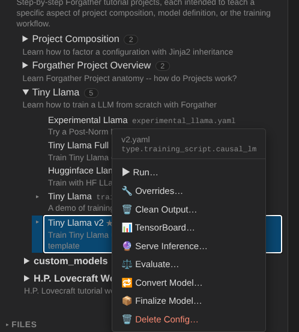

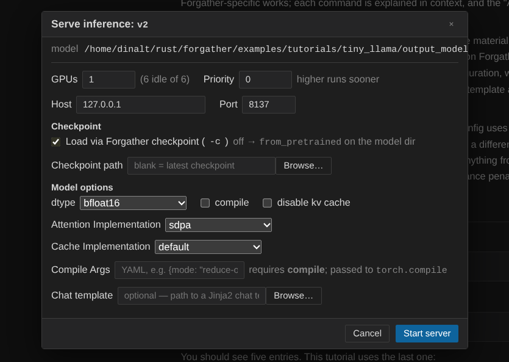

The inference job appears in the **Jobs** panel like the training
job did, but with a clickable URL on its card — port 8137 by default.
Wait for the job to finish loading the model (the TTY shows a "ready"
message); usually takes ~10 seconds for a 4M model.

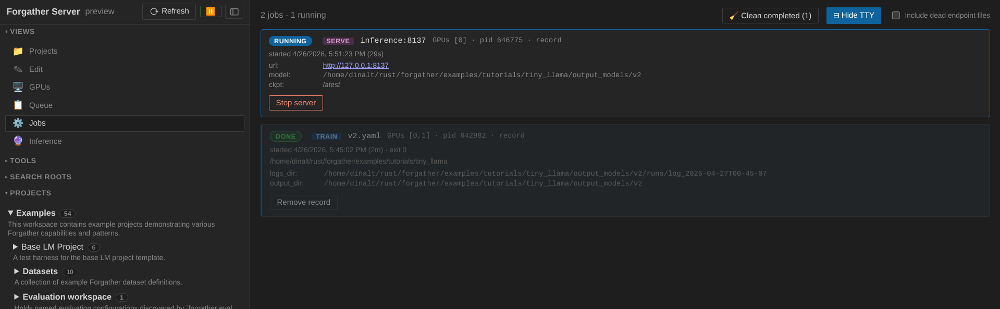

## 9. Generate text

Switch to **Inference** (🔮 in Views). The view has three sub-tabs:
**Model**, **Completion**, **Chat**.

Start in **Model**:

1. Click the **Running inference servers** picker — the inference
   job you just started appears as an option. Selecting it auto-fills
   the base URL.
2. Click **Fetch models** to discover the model id the server
   advertises (`tiny_llama` or similar). Pick it.
3. Optionally apply a generation preset from the picker — `creative`
   produces livelier outputs, `precise` is more deterministic. The
   `creative` preset is a good fit for TinyStories-style stories.

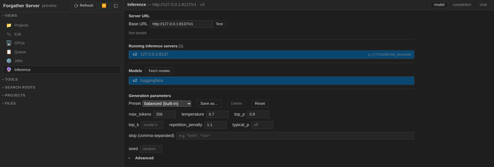

Switch to **Completion**. In the textarea, type:

```
Once upon a time
```

…and click **Send**. The streamed output appears below. With a
4M-parameter model trained for two minutes, you should get a
reasonably coherent (if simple) short story.

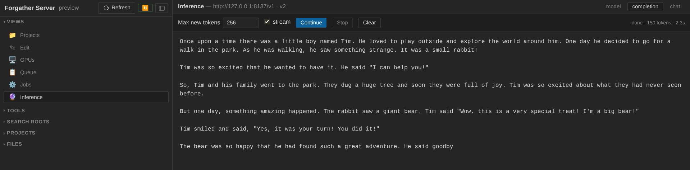

The status line under the textarea reports tokens generated and
elapsed time. Try a few prompts to get a feel for how the model
behaves; flip back to **Model** to swap presets and see how the
distribution changes.

## 10. Train the model for chat

If you tried the inference server's **Chat** tab, you'll have
noticed that the tiny model has no concept of turn-taking — it just
keeps generating. We can fix that by finetuning it on a chat-style
dataset.

### Finalize the base model

Before finetuning, we **finalize** the base model. This builds a
self-contained copy so the original training weights stay intact,
and at the same time:

- adds a chat template (ChatML by default),
- adds chat-related special tokens (`<|im_start|>`, `<|im_end|>`)
  and registers `<|im_end|>` as a stop token alongside the model's
  EOS,
- attaches a generation config preset,
- strips redundant checkpoints, and
- loads with `AutoModelForCausalLM.from_pretrained(...)`.

In the **Projects** tree, right-click the `v2.yaml` config under
`tiny_llama` and choose **Finalize Model…**.

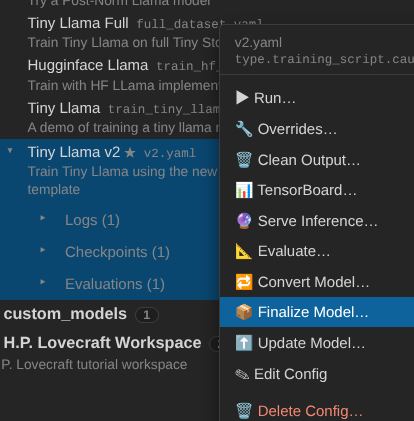

The **Source** field is pre-filled with the trained Tiny Llama
output. Set the **Output directory** (the screenshot uses the
tutorial's `output_models/` directory) and give the new model a
name — `v2_samantha` here.

Leave the chat template at **ChatML** (you can override it if
needed). The default **Add Tokens** entries add the ChatML special
tokens and the `<|im_end|>` stop token. Optionally pick a
**Generation Config** preset — `balanced` is a reasonable starting
point.

I have also checked `--root-copy`, which places the model weights directly in
the root of the output directory, rather than in a `checkponints/` sub-directory.
If you don't check this, symlinks to the checkpoint will be added instead.

When the form looks right, click **Run finalize**. The new model is
built in place and is ready to train on a chat dataset.

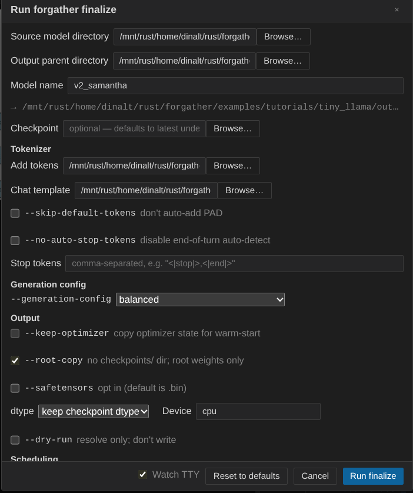

### Set up the finetune config

There's a [Samantha tutorial](../examples/finetune/samantha/README.md)
dedicated to this kind of training, but here we'll use the generic
**Finetune v2** project so you can see how the override system works
from the UI.

Navigate to **Projects → examples → base_lm_project**, right-click
the **Finetune v2** config, and choose **Overrides…**.

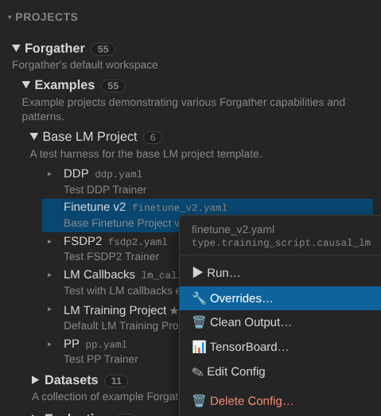

The Overrides panel exposes the config's CLI arguments. **Finetune
v2** has one required argument with no default — `--model-id-or-path`
— so it's pre-expanded and highlighted red on first open.

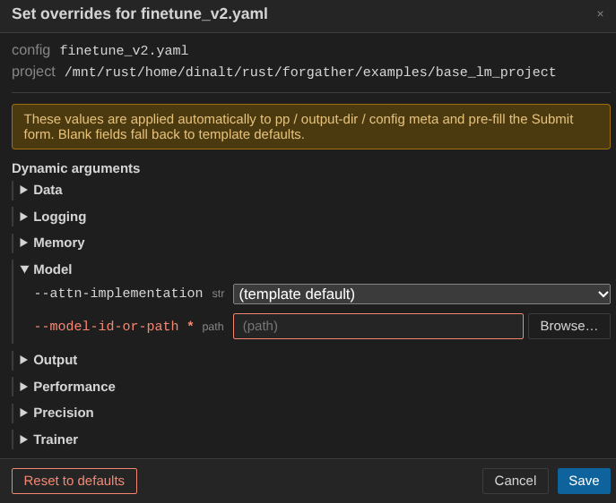

Fill in the fields:

- **`--model-id-or-path`** — path to the finalized model
  (`output_models/tiny_samantha`, or wherever you saved it).
- Under **Data**, set **`--dataset-project`** to
  `examples/datasets/QuixiAI` and **`--dataset-config`** to
  `samantha-packed.yaml`.
- **`--seq-len`** — `2048` (Tiny Llama's maximum sequence length).
- **`--attn-implementation`** — `sdpa`. The project defaults to
  `flex_attention`, which is the preferred setting for packed
  datasets, but the upfront compile cost isn't worth it for a model
  this small.
- **`--compile`** — `false`, for the same reason: skip the Torch
  compile step.

Click **Save**. These overrides persist for this config. Switch to
the **pp** tab to confirm — you'll see the override values baked
into the preprocessed YAML.

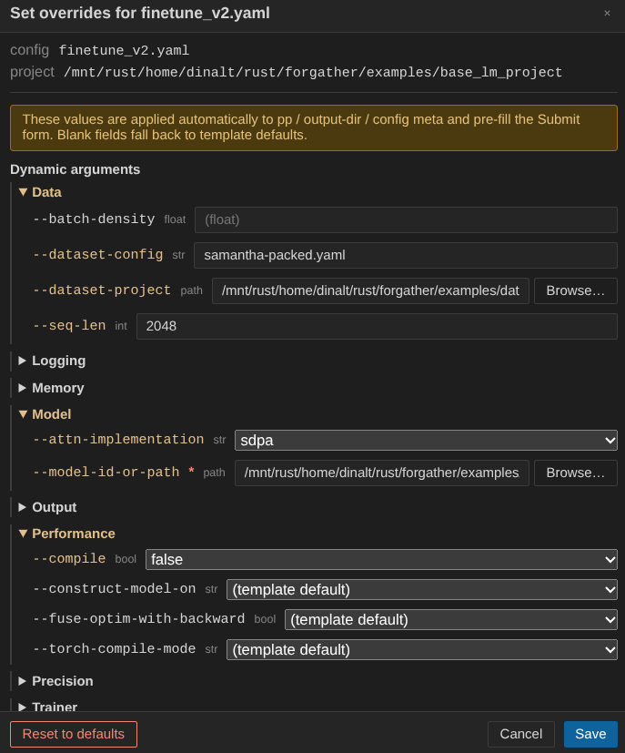

### Run the finetune

If the inference server from the previous section is still running,
switch to **Jobs** and abort it — we want the GPU back.

Click **▶ Run** in the config viewer's header. In the submit modal,
make sure **Requested GPUs** is `1` — the default trainer only
supports a single GPU. (If you'd rather use multiple GPUs, change
the trainer type to **DDP** in the config first.)

The job auto-focuses in the **Jobs** panel once it starts so you
can watch the loss come down. Finetuning is short.

When the job finishes, right-click the **Finetune v2** config and
choose **Serve Inference…**. The pre-filled defaults are fine — just
click **Start server**.

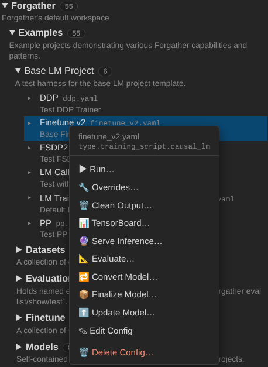

Switch back to the **Inference** view and open the **Chat** tab.
The model should now respect turn-taking.

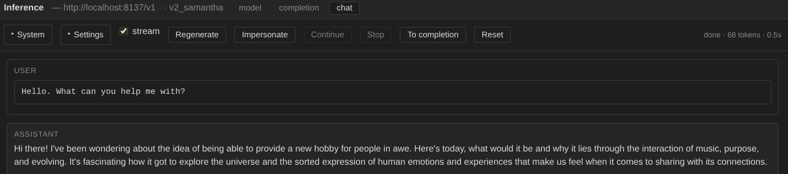

It's still a tiny model with very little training, so don't expect
coherent answers. For something with a fighting chance of holding a
conversation, see the
[Small LLM Pretraining](../examples/pretrain/small-llm/README.md)
example.

## Saving a service for next time

The four service modals (Inference, Dataset, TensorBoard, MkDocs)
each have a **Create service…** button beside their **Start** button.
Click it, give the entry a name, and the modal's current settings are
persisted to `server_config.yaml` as an auto-start service. On every
subsequent server boot the entry is brought up automatically —
without re-opening the modal.

Saved entries appear in the **Services** sidebar group nested under
their type's launcher row, with:

- A right-aligned **pill** on the launcher row showing how many
  instances of that type are running.
- A **chevron** to the left of the launcher row that expands the
  per-type list (hidden when the type has no saved entries).
- A **red/green dot** per entry — green only when the spawned
  process is actually serving (`JobRecord status == "running"`),
  not just queued.
- A **▶ / ⏹** toggle that flips the entry's `enabled` flag and
  starts / stops the running instance accordingly.
- An **×** that deletes the entry (and aborts the running
  instance, if any).

To stop using a service temporarily without losing its config: ⏹.
To remove it entirely: ×. The signature of a saved entry is matched
against running queue items and JobRecords, so a manually-launched
job with the same args counts as "the running instance" — restarting
the server won't double-spawn.

## Persistent CLI defaults

`forgather server` reads `<config>/server/server_config.yaml` on
boot. Anything under `args:` overrides the corresponding CLI default;
values passed on the command line still win. Useful for persistent
preferences like `cluster:`, custom `host:` / `port:`, or
`persist_sessions: true` (the next bullet).

The footer's ⚙ button opens this file in the embedded editor; the
⟳ button next to it re-execs the server so edits take effect without
killing the terminal session (running jobs survive — the new server
re-attaches to them via the standard PID-reattach path).

```yaml
args:
  cluster: my-cluster
  persist_sessions: true       # browser stays logged in across restarts
services:
  inference:
    llama:
      enabled: true
      model_path: /models/llama
      port: 8137
```

`persist_sessions: true` (or `--persist-sessions` on the command
line) keeps the browser session cookie valid across restarts so
hitting ⟳ during development doesn't force a re-login every time.
The 30-day session TTL still applies, and `/api/auth/logout` (or
deleting `<config>/server/sessions.json`) still revokes.

## What's next

You've now seen most of the major panels. Some directions for
follow-up:

- The [Tiny Llama tutorial](../tutorials/tiny_llama/README.md) covers
  the same project from the CLI side, with deeper notes on the
  config's structure, TensorBoard monitoring, loss plots, and
  programmatic model loading.
- The [Forgather server README](../forgather-server.md) is the
  reference for every panel, every endpoint, and every context
  menu — useful when you want to know "what does this button do"
  without reading source.
- Right-click context menus exist on workspaces, projects, configs,
  search roots, file-tree rows, GPU cards, and Job cards. Each has
  scope-appropriate actions (delete, rename, cut/copy/paste, force
  kill, etc.). Worth poking around once you've finished the basic
  flow.
- Try editing a config: right-click the project → **📄 New Config…**
  for a blank, or click ✎ Edit on a template node in the trefs view
  to open it in the **Edit** panel's tabbed Monaco editor with full
  syntax highlighting for Forgather's YAML+Jinja2 dialect.

Have fun.
