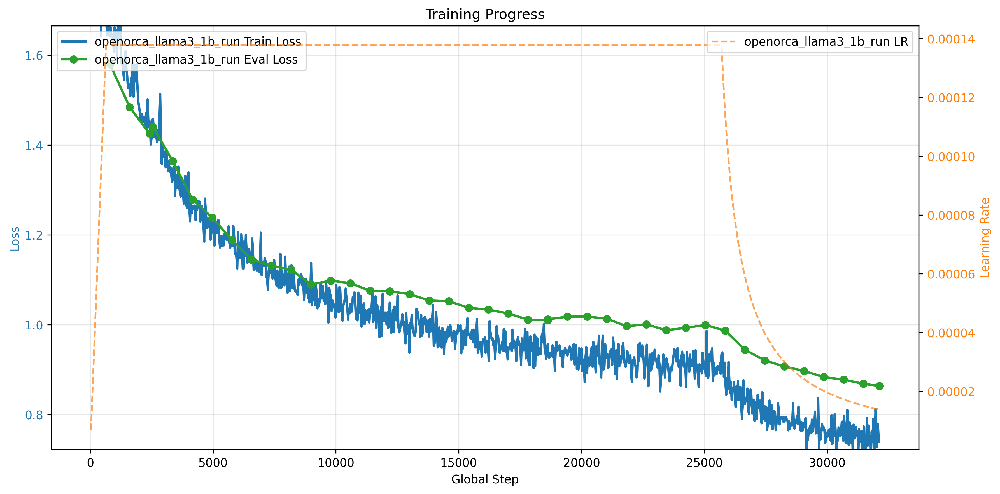

# Open-Orca Finetune

Fine-tune a causal language model on the [Open-Orca](https://huggingface.co/datasets/Open-Orca/OpenOrca)
reasoning dataset using the `finetune_v2` project template and the new
fast-loading packed dataset variant.

Open-Orca is a large collection of augmented FLAN examples distilled through
GPT-4 / GPT-3.5, heavy on chain-of-thought explanations and structured
reasoning prompts. Fine-tuning on it teaches a base LM to produce longer,
more step-by-step responses than a chat-persona dataset would — it's the
natural complement to the [Samantha example](../samantha/README.md), which
teaches conversational style rather than reasoning.

## What's different from the Samantha example

If you've already worked through the Samantha tutorial, the quick tour:

- **Dataset: packed Open-Orca (`openorca-packed.yaml`).** The packed variant
  uses best-fit sequence packing so sequences reach `max_length` without
  relying on padding — substantially better throughput than the padded
  variant whenever the batch size is greater than 1. The dataset was
  recently modernised to use Forgather's fast iterable-dataset loader, so
  initialisation takes seconds rather than the 10+ minutes it took
  historically.
- **Headline experiment is a real run, not a smoke test.** The
  `llama3_1b/4gpu_ddp.yaml` config is sized to burn through ~1 billion
  tokens (roughly half an epoch of packed Open-Orca at seq_len 2048) in
  about 11 hours on the reference 4x 4090 box, leaving plenty of headroom
  inside a 24-hour budget. See *Headline Run* below for the exact command
  and what it produced.
- **Trimmed config set.** Four configs total, one per
  (model-size, execution-mode) combination that actually gets used:
  `llama3_1b/{1gpu_default,4gpu_ddp}` and `llama2_7b/{1gpu_default,4gpu_pp}`.
  No 2-GPU PP variants, no FSDP2 variant — Samantha already covers those.
- **WSD learning-rate schedule with automatic decay-start.** Inherited
  from `finetune_v2.yaml`: linear warmup, stable LR, then harmonic decay
  to `min_lr` over `annealing_tokens`. Because `open_orca.yaml` pins
  `max_steps` to `ns.total_steps` (the run length is exactly the
  configured token budget), the base template can also pre-compute the
  decay-start point as `total_steps - annealing_steps` and wire it into
  the scheduler via `decay_start_step`. The result: decay fires
  automatically about 80% of the way through the run -- you don't need
  to pass `--start-annealing` or send a `forgather control save-stop`
  RPC near the end. Manual triggering is still available for runs where
  you don't know the budget in advance (e.g. epoch-based training); see
  *Triggering the annealing phase* below for the override paths.
- **ChatML reasoning prompts for the textgen eval callback.** The
  default `finetune_v2.yaml` text-generation eval prompts are short
  story openers (`prompts/short_stories.yaml`) intended for raw
  causal-LM continuation -- they don't exercise instruction following
  at all. The Open-Orca project ships
  [`prompts/open_orca_eval.yaml`](../../../prompts/open_orca_eval.yaml),
  a set of 12 ChatML-formatted prompts covering chain-of-thought math,
  logic puzzles, reading comprehension, multiple choice, summarization,
  format-constrained instruction following, translation, ELI5,
  sentiment, and a short control prompt. System prompts are pulled from
  the actual Open-Orca distribution so eval hits the same styles the
  model trains on. Wired in via `ns.eval_prompts_file` /
  `ns.eval_max_new_tokens` in `[config_metadata]` -- override either to
  swap in your own set.

## Setup

You will need:

1. A **base model** in Forgather format. Any of the models used by the
   Samantha tutorial will work — the two I tested against are `fg_llama_7b`
   (a conversion of `meta-llama/Llama-2-7b-hf`) and `fg_llama_1b` (a
   conversion of `meta-llama/Llama-3.2-1B`). Both of these are **raw
   pretrained base models**, not instruction-tuned. Neither has a native
   chat template — ChatML (`<|im_start|>` / `<|im_end|>`) is added
   explicitly during the Forgather conversion step per the instructions in
   the Samantha project, along with a few extra special tokens. This is
   actually what makes Open-Orca interesting as a first fine-tune target:
   the base model has never seen a chat format before, and it has to learn
   the ChatML turn structure *and* the reasoning style in the same run.
   Expect the initial loss to be noticeably higher than it would be on an
   already instruction-tuned checkpoint, and to drop sharply in the first
   few thousand steps as the model picks up the turn structure.
2. The **Forgather repo checked out**; this project's `meta.yaml` expects
   the `forgather_workspace` sibling directory for template search paths.
3. A working **Open-Orca dataset** download path. The dataset lives at
   `examples/datasets/Open-Orca/` inside this repo and is pointed at by
   the base project template automatically.

If you haven't already converted a model to Forgather's format, follow the
*Download a Model / Convert the Model* section of the
[Samantha README](../samantha/README.md#setup) — the tooling and the target
model formats are identical.

```bash
# This tutorial uses environment variables to keep the commands short.
# Adjust to your paths.
export FG_MODEL=/path/to/fg_llama_1b
```

## Configurations

| Config | Model | GPUs | Trainer | seq_len | bs/dev | Intended use |
|---|---|---|---|---|---|---|
| [`llama3_1b/1gpu_default.yaml`](./templates/configs/llama3_1b/1gpu_default.yaml) | Llama3 1B | 1 | basic | 2048 | 4 | Iteration / smoke testing |
| [`llama3_1b/4gpu_ddp.yaml`](./templates/configs/llama3_1b/4gpu_ddp.yaml) | Llama3 1B | 4 | ddp | 2048 | 4 | **Headline run** — real training |
| [`llama2_7b/1gpu_default.yaml`](./templates/configs/llama2_7b/1gpu_default.yaml) | Llama2 7B | 1 | basic | 1536 | 1 | Verification only |
| [`llama2_7b/4gpu_pp.yaml`](./templates/configs/llama2_7b/4gpu_pp.yaml) | Llama2 7B | 4 | pipeline (ZBV) | 2048 | 2 | Real 7B training target |

Each config extends `templates/open_orca.yaml`, which in turn extends
`templatelib/examples/projects/finetune_v2.yaml`. Token budgets, warmup, and
annealing windows are set in the individual configs rather than on the
command line so that a run is fully reproducible from the config template
alone — override them via CLI flags only when you're iterating.

## Examining the Dataset

Before launching any real run it is worth eyeballing what the model is
actually going to see — both to sanity-check the chat template / packing
pipeline and to get a feel for the task distribution. The `forgather
dataset` subcommand operates on the dataset project (not this finetune
project), so you run it from `examples/datasets/Open-Orca/` and pass
the target model's tokenizer with `-T`. See
[examples/datasets/README.md](../../datasets/README.md) for the full
reference.

```bash
cd ../../datasets/Open-Orca

# (a) Raw source examples, before any preprocessing. Useful for seeing
#     the unmodified system_prompt / question / response fields and the
#     range of system prompts the dataset uses.
forgather -t openorca-packed.yaml dataset \
    --target train_dataset_split -n 3

# (b) Post-preprocess examples: rendered through the ChatML template,
#     packed via best-fit, and tokenized with the actual model
#     tokenizer. This is what the trainer feeds to the model. The
#     `-s` (--tokenized) flag tells the dataset CLI that the target is
#     already tokenized so it should decode `input_ids` rather than
#     look for raw text fields.
forgather -t openorca-packed.yaml dataset \
    --target train_dataset \
    -T ~/rust/models/fg_llama_1b \
    --max-length 2048 -s -n 2
```

A typical (b) sample on `fg_llama_1b` looks like this — note the
`<|begin_of_text|>` BOS, the ChatML `<|im_start|>` / `<|im_end|>`
turn markers, and how the packer concatenates *multiple* Open-Orca
examples into a single 2048-token sequence with `<|im_end|><|im_end|>`
at each example boundary (one from the chat template's turn-close,
one from `add_eos=True` adding the tokenizer's EOS):

```
... <|im_start|>assistant
1. Analyze the sentence and identify the main subjects and objects.
   The main subjects and objects in this sentence are tourists, ...
   ...
4. ...the keywords are: tourists, walk, cottages, coastal village.<|im_end|>
<|im_end|><|begin_of_text|><|im_start|>system
You are a helpful assistant, who always provide explanation. Think
like you are answering to a five year old.<|im_end|>
<|im_start|>user
Write a subject line for this message:
...
Subject Line:<|im_end|>
<|im_start|>assistant
Your Mailbox is Almost Full, Time to Make Space!<|im_end|>
<|im_end|>
```

If the model's tokenizer is missing `<|im_start|>` / `<|im_end|>` (or
they decode as `<|reserved_special_token_*|>`), the conversion step
from the [Samantha setup](../samantha/README.md#convert-the-model)
hasn't been applied — the textgen eval prompts and the training data
will both be silently malformed.

## Smoke Testing Before Committing to a Long Run

The user-visible EOS-token / chat-template failure modes are silent until
you try to generate from the resulting model. Always verify the pipeline
end-to-end with a short training + inference round-trip before launching
anything that takes hours:

```bash
# 1. Train a handful of steps, save a checkpoint.
forgather -t llama3_1b/4gpu_ddp.yaml train \
    --save-strategy steps --max-steps 30 --step-cadence 0.001 \
    -M "${FG_MODEL}" -d 0,1,3,4

# 2. Start the inference server against the saved checkpoint.
forgather inf server -c -m "${FG_MODEL}"

# 3. In another terminal, send a test message.
forgather inf client --message "Hello! What is 2+2?" --max-tokens 100
```

What you're looking for in step 3:

- The model **responds in English** (chat template was applied correctly).
- The response **stops after a few lines** rather than running to the full
  `--max-tokens` budget (EOS token is being respected — the server's
  startup log should show `Stop token IDs: [128256]` for a ChatML model).
- No Python tracebacks in either the training or inference logs.

The "correct answer quality" is not the test here — 30 steps of training
won't fix a 1B base model's math ability. You're verifying that the
plumbing works. If any of the three checks above fail, stop and
investigate before committing to a long run; retraining a 12-hour run to
fix a silent EOS bug is exactly the frustration this section exists to
prevent.

## Headline Run: Llama3 1B on 4 GPUs

The experiment: fine-tune `fg_llama_1b` (Llama-3.2-1B base, pretrained-only,
converted to Forgather's format with ChatML added) on packed Open-Orca for
1 billion tokens — roughly 1/8 of an epoch of the packed dataset — using
DDP across 4 GPUs. 1 billion tokens is enough to get well past the
"learning the chat format" phase and into actually learning content. Target
wall-clock is under 24 hours on the reference 4x 4090 box (each card
power-limited to 250 W, GPU 2 excluded for thermals).

**Important gotcha about the token budget.** The `finetune_v2.yaml` base
template defaults `max_steps` to `-1`, which means "train for
`num_train_epochs = 1` worth of data". For a dataset the size of packed
Open-Orca (~8 billion tokens) that's ~87 hours on the reference hardware
— far beyond any 24-hour budget. The `open_orca.yaml` base config in this
project rebinds `max_steps` to `ns.total_steps` so that the `total_tokens`
parameter actually bounds training. If you copy these configs into a
project that extends `finetune_v2.yaml` directly, remember to add the
same override or your "1B token run" will silently become an "8B token
run".

```bash
# One-time setup: stage a clean copy of the base model as the run output
# directory, so the run state (checkpoints, logs) lives separately from
# the source model. Point the target at a large, fast disk -- 1B-token
# training generates several GB of checkpoint + log data.
OO_RUN=/home/dinalt/rust/models/openorca_llama3_1b_run
cp -a "${FG_MODEL}/." "${OO_RUN}/"

# Launch the run. 'nohup ... &' detaches the process so it survives the
# terminal closing; output goes to long_run.log inside the run dir.
nohup forgather -t llama3_1b/4gpu_ddp.yaml train \
    -M "${OO_RUN}" -d 0,1,3,4 \
    > "${OO_RUN}/long_run.log" 2>&1 &
disown
```

### Results from the reference run

Measured end-to-end numbers from the run that produced this README:

| Metric | Value |
|---|---|
| Total steps | 32,124 (= `total_tokens(1000M) / tokens_per_step(31,129)`) |
| Total tokens trained | 1.047 B |
| Wall-clock | ~10.5 h (35,286 s post-resume + ~50 min pre-resume progress) |
| Steady-state throughput | **~27,300 tok/s** across 4 ranks |
| Peak memory | 15.49 GiB / rank (≈ 8.5 GiB below the 24 GiB card ceiling) |
| Effective batch size | 16 (per-device 4 × 4 ranks) |
| Peak LR | 1.38e-4 (sqrt-scaled from `lr=1e-4` at `base_batch_size=16384`) |
| Min LR after decay | 1.38e-5 (= 0.1 × peak) |
| Initial loss (step 32) | 2.17 |
| Best train loss | 0.704 (step 31,776) |
| Best eval loss | **0.863** (step 32,124 final checkpoint) |
| Max grad norm | 45.5 (step 608, inside warmup) |
| Avg grad norm | 1.36 |

Loss curve for the full run (train + eval + LR schedule):



The three phases of WSD are clearly visible: the linear warmup ramp in
the first ~640 steps, the long stable plateau at peak LR, and the
harmonic decay starting automatically at step 25,699 (80% of the
run) and reaching `min_lr` exactly at `max_steps`. There is a small
loss drop visible right at the decay boundary — typical behaviour when
the LR starts coming off its peak. No `--start-annealing` flag or
`forgather control` RPC was needed; the decay schedule was pre-computed
from the token budget in `open_orca.yaml`'s `[globals]` block.

The run was interrupted once about 50 minutes in to apply a corrected
`weight_decay` config, save-stopped cleanly via
`forgather control save-stop`, then resumed from `checkpoint-2560` with
the new config. The WSDScheduler's `load_state_dict` correctly picked
up `last_epoch` from the checkpoint but took the newly-computed
`decay_start_step` from the constructor (per the `_CONFIG_ONLY_KEYS`
split in `wsd_scheduler.py:110-143`), so the decay schedule fired at
the right step regardless of the interruption.

### Post-training eval

The textgen callback logs a sample of responses to TensorBoard on each
eval step, but for a real end-of-run report it's worth running the
prompts through the inference server against the final checkpoint
directly, so the responses stop at `<|im_end|>` naturally and you can
compare the same questions against earlier checkpoints:

```bash
# Start the inference server on a free GPU with the latest checkpoint.
CUDA_VISIBLE_DEVICES=5 forgather inf server -c -m "${OO_RUN}"

# Send the new ChatML prompt set via the /v1/completions endpoint
# (not /v1/chat/completions -- the YAML entries are already fully
# rendered ChatML, we want raw text continuation, not another pass
# through apply_chat_template).
```

Representative responses from `checkpoint-32124`, with
`temperature=0.7, top_p=0.9, stop=['<|im_end|>']` — six of the twelve
prompts, picked to show both the structural patterns the model has
learned and the residual limitations of a 1B-parameter checkpoint on
1B training tokens:

**1. Step-by-step math (prompt #1).** Perfect: correct answer, clean
chain-of-thought, proper numbered steps.

> **User**: Lena has 24 apples. She gives a third of them to her
> brother, then eats 2 herself. How many apples does she have left?
> Show your reasoning step by step.
>
> **Assistant**:
> Step 1: Determine how many apples Lena gave to her brother.
> Since Lena gave a third of her 24 apples to her brother, we can
> calculate this by dividing 24 by 3. 24 ÷ 3 = 8
>
> Step 2: Subtract the number of apples given to her brother.
> 24 - 8 = 16
>
> Step 3: Calculate how many apples Lena has left.
> Therefore, Lena has 16 apples left.

Note that the model still forgets the *second* subtraction (the two
apples Lena ate), so the actual correct answer is 14. The format is
right; the arithmetic-tracking depth isn't — which is consistent with
what you'd expect at 1B scale.

**2. Reading comprehension (prompt #3).** Perfect, concise, single
sentence.

> **User**: Passage: "Marie Curie was born in Warsaw in 1867. She
> later moved to Paris, where she conducted the research on
> radioactivity that earned her two Nobel Prizes, in Physics and in
> Chemistry." Question: In which city did Marie Curie conduct the
> research that won her her Nobel Prizes?
>
> **Assistant**: Marie Curie conducted her research on radioactivity
> in Paris.

**3. Multiple choice with explanation (prompt #4).** The *format* is
exactly right — "correct answer first, then why others are wrong" —
but the model picks the wrong answer (octopus instead of dolphin) and
then self-contradicts in the Option-B explanation ("Dolphin is
incorrect because dolphins are marine mammals..."). Clear evidence
that the Orca structural pattern has been learned even when the
underlying knowledge hasn't.

**4. Summarization (prompt #6).** Perfect single-sentence compression.

> **User**: Summarize the following paragraph in one sentence:
> [honeybee decline paragraph]
>
> **Assistant**: The declining honeybee population is caused by a
> combination of pesticide exposure, habitat loss, and the spread of
> parasitic mites, and researchers warn that the trend could threaten
> global food production unless intervention is implemented.

**5. Logic puzzle (prompt #2).** Wrong answer. The model confidently
says "Alice owns the dog" while directly citing the constraint that
"Alice does not own the dog". The model has learned to *produce
confident structured reasoning* but hasn't learned to *actually track
constraints* at this capacity. Logic puzzles are a known weak spot
for 1B-scale models and this isn't something Open-Orca fine-tuning
alone will fix.

**6. Control prompt — capital of Japan (prompt #12).**

> **Assistant**: The capital of Japan is Tokyo.

Correct. For comparison, the same prompt at `checkpoint-2560` (step
2,560, ~84M tokens in) produced `by Tokugawa Ieyasu.` — a garbled
fragment. The difference between the two checkpoints is a good
summary of what the rest of the 1B-token budget bought.

Of the full 12-prompt set, all 12 stopped at `<|im_end|>` cleanly
(finish_reason=`stop` on every call), and the Orca *structural*
patterns — numbered step-by-step reasoning, "answer first then
explain", structured factual paragraphs — show up consistently.
Factual correctness is roughly 50/50. Strict format-constraint
following (e.g. "comma-separated list on one line") is weak.
Translations and hard logic are unreliable. None of this is a
surprise for a 1B base model seeing 1B tokens of instruction data;
it is what the scale affords.

Monitoring:

```bash
# Follow the live log
tail -F "${OO_RUN}/long_run.log"

# List running Forgather jobs (uses the trainer control interface)
forgather control list

# Inspect the training metrics JSON
forgather logs summary "${OO_RUN}/runs"/*/trainer_logs.json

# Plot the loss curve
forgather logs plot --loss-curves "${OO_RUN}/runs"/*/trainer_logs.json
```

### Triggering the annealing phase

The config uses `finetune_v2.yaml`'s `WSDScheduler` — linear warmup, then a
stable LR, then a harmonic decay to `min_lr` over `annealing_tokens` (200M
in this config).

**The default behaviour is automatic.** `open_orca.yaml` pins `max_steps`
to `ns.total_steps`, so the exact length of the run is known up front,
and the base template uses that to pre-compute
`decay_start_step = max(warmup_steps, total_steps - annealing_steps)`
and pass it to the scheduler. With the headline 4gpu_ddp config (1B
total tokens, 200M annealing, 4-rank DDP, ~31K tokens/step), that lands
at:

```
total_steps:        32,124
warmup_steps:          642
annealing_steps:     6,425
decay_start_step:   25,699   (~80% of the run)
```

Once the run reaches step 25,699 the LR begins decaying from peak
(`global_lr`) toward `min_lr` over the next 6,425 steps and reaches
the floor exactly at `max_steps`. You don't need to do anything for
this -- launching the headline run as documented above is the whole
story.

**To override the auto-computed decay-start step**, set a different
`ns.decay_start_step` (or the underlying `ns.annealing_tokens`) in a
child config or via `--annealing-tokens`. Setting `decay_start_step`
to `-1` in your config falls back to the manual-trigger flow below.

**Manual triggering** is still available for the cases where you don't
know the budget in advance (epoch-based runs that exhaust the dataset
naturally) or want to react to the loss curve mid-run:

```bash
# (a) Start the decay immediately from step 0. Use this only when
#     decay_start_step is set to -1 in the config, since otherwise the
#     constructor's positive value wins and --start-annealing becomes
#     a no-op (per WSDScheduler.load_state_dict's branch logic).
forgather -t llama3_1b/4gpu_ddp.yaml train --start-annealing \
    -M "${OO_RUN}" -d 0,1,3,4

# (b) React to the loss curve mid-run via the control interface.
#     Save the current state and stop the job, then edit the config
#     (or pass --decay-start-step on relaunch) and resume with the
#     new schedule. Auto-resume picks up the checkpoint and the new
#     constructor decay_start_step takes effect.
forgather control list                          # find the job id
forgather control save-stop JOB_ID              # save then exit
# ... edit decay_start_step in the config, then ...
forgather -t llama3_1b/4gpu_ddp.yaml train -M "${OO_RUN}" -d 0,1,3,4
```

The control-callback flow works because `decay_start_step` is *not* in
WSDScheduler's `_CONFIG_ONLY_KEYS`, so it gets restored from the
constructor (the new config) on `load_state_dict`, not from the
checkpoint state. See `src/forgather/ml/optim/wsd_scheduler.py:139`
for the exact logic.

## Serving the Fine-Tuned Model

After the headline run finishes, the latest checkpoint lives at
`${OO_RUN}/checkpoints/checkpoint-N/` (where N is the final step count).
Point the inference server at the run directory with `-c` to auto-select
the latest checkpoint:

```bash
forgather inf server -c -m "${OO_RUN}"
```

A reasoning prompt that exercises the kind of response Open-Orca training
should reinforce:

```bash
forgather inf client --message "Think step by step: a farmer has 17 sheep. All but 9 run away. How many sheep are left?" --max-tokens 200
```

The [Samantha README](../samantha/README.md#testing-the-finetuned-model)
documents the full set of inference CLI options and the interactive chat
mode — the same tooling applies here.

## References

- Dataset: <https://huggingface.co/datasets/Open-Orca/OpenOrca>
- Forgather base templates:
  [finetune_v2.yaml](../../../templatelib/examples/projects/finetune_v2.yaml)
  → [lm_training_project.yaml](../../../templatelib/examples/projects/lm_training_project.yaml)
- LM Training Project documentation:
  [docs/project-templates/lm-training-projects.md](../../../docs/project-templates/lm-training-projects.md)
- Chat template: [chat_templates/chatml.jinja](../../../chat_templates/chatml.jinja)
- WSDScheduler theory:
  *Understanding Warmup-Stable-Decay Learning Rates* (Wen et al. 2024),
  <https://arxiv.org/abs/2410.05192>
