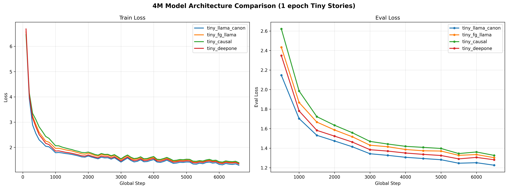
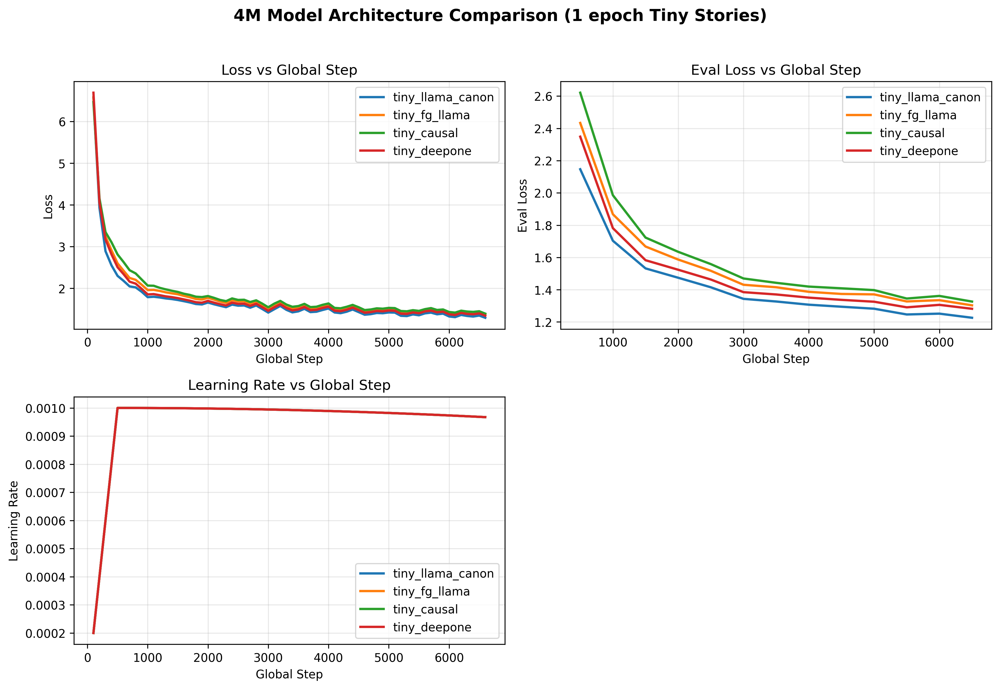

# LlamaCanon

A Forgather implementation of Canon Layers from ["Physics of Language Models: Part 4.1, Architecture Design and the Magic of Canon Layers"](https://arxiv.org/abs/2512.17351) (Allen-Zhu, 2025).

## Architecture

Canon layers are lightweight depthwise causal 1D convolutions that promote horizontal information flow across neighboring tokens. Each Canon layer computes a causal weighted sum of the current and K-1 previous token representations, independently per channel:

```
h'_t = w_0 * h_t + w_1 * h_{t-1} + ... + w_{K-1} * h_{t-K+1}
output = h_t + h'_t   (residual connection)
```

Implemented as `nn.Conv1d(groups=hidden_size)` with kernel_size=4 (default).

### Insertion Points

Canon layers are inserted at four positions within each transformer block:

- **Canon-A**: After input LayerNorm, before attention. Dim: `hidden_size`
- **Canon-B**: After Q/K/V projections, before attention computation. Dim: `(n_heads + 2*n_kv_heads) * d_head`
- **Canon-C**: After post-attention LayerNorm, before MLP. Dim: `hidden_size`
- **Canon-D**: After gate/up projections in SwiGLU MLP, before gating. Dim: `2 * intermediate_size`

### Parameter Overhead

For the 4M config (hidden=256, intermediate=768, 4 layers):
- Canon-A: 256 * 4 = 1,024 per layer
- Canon-B: 768 * 4 = 3,072 per layer
- Canon-C: 256 * 4 = 1,024 per layer
- Canon-D: 1,536 * 4 = 6,144 per layer
- **Total**: ~45K additional parameters (~1% overhead)

## Configuration

```yaml
# Canon hyperparameters (added to model_config)
canon_kernel: 4      # Convolution kernel size (window of tokens)
canon_residual: True  # Add input as residual connection
```

## Commands

```bash
cd examples/models/llama_canon

# List configurations
forgather ls

# Construct model
forgather -t 4M.yaml model --device cpu construct

# Test forward/backward
forgather -t 4M.yaml model --device cuda test --steps 5

# Train (via tiny_experiments)
cd ../../tiny_experiments/tiny_models
forgather -t tiny_llama_canon.yaml train -d 0
```

## Comparison Results (4M models, 1 epoch Tiny Stories)

All models trained on Tiny Stories (abridged) for 1 epoch with identical hyperparameters
(AdamW, lr=1e-3, batch_size=32, InfiniteLR scheduler).

| Model          | Params | Final Loss | Eval Loss | Avg Loss | Tok/s   | Memory |
|----------------|--------|------------|-----------|----------|---------|--------|
| **LlamaCanon** | 4.48M  | **1.2954** | **1.2258**| 1.6905   | 158,811 | 2.24G  |
| DeepOne        | 4.16M  | 1.3445     | 1.2814    | 1.7528   | 239,274 | 1.50G  |
| Llama          | 4.16M  | 1.3733     | 1.3028    | 1.8061   | 287,678 | 1.50G  |
| Causal (Post-LN)| 3.88M | 1.3940     | 1.3262    | 1.8541   | 301,521 | 1.19G  |

### Loss Curves



### Training Metrics



### Key Observations

1. **LlamaCanon achieves the lowest final loss and eval loss** across all four architectures,
   with a 5.7% improvement in final train loss over standard Llama (1.2954 vs 1.3733) and
   a 5.9% improvement in eval loss (1.2258 vs 1.3028).

2. **Convergence speed**: LlamaCanon converges faster throughout training, with lower
   average loss (1.6905 vs 1.8061 for Llama), suggesting the Canon layers help the model
   learn more efficiently from the start.

3. **Throughput tradeoff**: Canon layers add ~1.8x wall-clock overhead compared to
   standard Llama (417s vs 230s), primarily from the additional Conv1d operations and
   tensor concatenation/splitting. This is expected to improve with the `causal-conv1d`
   CUDA kernel (not used in this benchmark).

4. **Memory overhead**: Canon layers increase peak memory by ~49% (2.24G vs 1.50G),
   largely due to intermediate activations from the concatenated QKV and gate/up tensors.

5. **Gradient stability**: LlamaCanon shows the lowest average gradient norm (0.3696),
   suggesting the Canon layers' residual connections contribute to training stability.

6. **DeepOne is a strong baseline**: The DeepNet architecture with ALiBi attention
   places second, outperforming standard Llama by a meaningful margin.

## Project Structure

```
llama_canon/
  meta.yaml                           # Project metadata
  modelsrc/
    canon_layer.py                    # Core Canon layer (depthwise causal Conv1d)
    canon_pre_ln_layer.py             # PreLN layer with Canon-A and Canon-C
    canon_causal_multihead_attn.py    # Multi-head attention with Canon-B
    canon_glu_feedforward.py          # GLU feedforward with Canon-D
  templates/configs/
    default.yaml                      # Default config (extends dynamic_llama)
    4M.yaml                           # 4M parameter tiny model
```

## References

- Paper: [arXiv:2512.17351](https://arxiv.org/abs/2512.17351)
- Code: [github.com/facebookresearch/PhysicsLM4](https://github.com/facebookresearch/PhysicsLM4)
