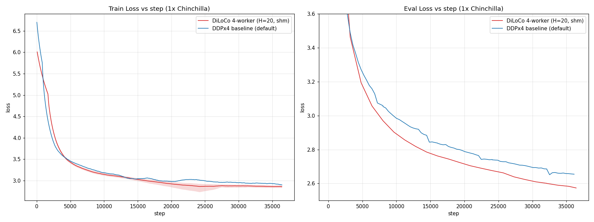
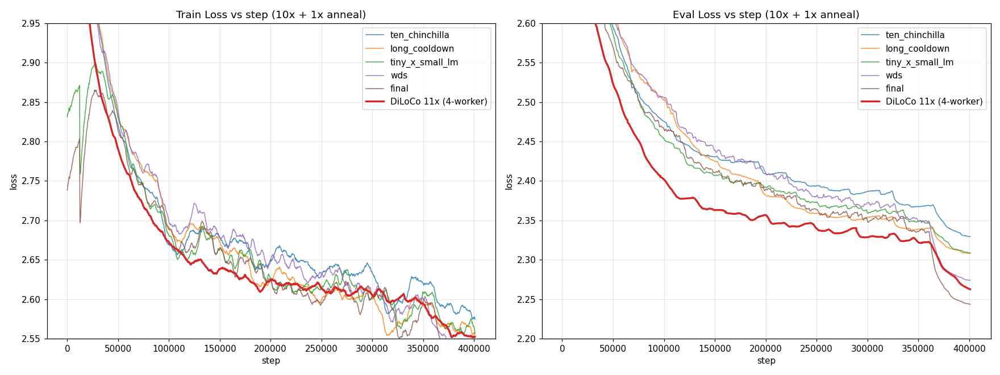

# Small LLM Pretraining

A long-running playground project for pretraining small language models
(~100M-200M parameters) from scratch. Over time it has become the main test
bed for the [LM Training Project
template](../../../project-templates/lm-training-projects.md), and this
README is as much a changelog of what has been tried here as it is a getting-
started guide.

If you are looking for the full reference on every training argument and
dial that the template exposes, read the
[LM Training Project documentation](../../../project-templates/lm-training-projects.md)
and the [Trainer Options Reference](../../../trainers/trainer_options.md).
This README focuses on *this particular project*: its defaults, its
sub-projects, the configs we ship, and the experiments that have been run.

## What This Project Is

- A concrete LM training project that extends `lm_training_project.yaml`
  with choices appropriate for pre-training a small model on a few consumer
  GPUs.
- A set of ready-to-run configurations covering precision experiments, LR
  schedules, alternative architectures, and a curriculum dataset.
- Two sub-projects under this directory that demonstrate how to plug a
  custom model or a custom dataset into a training project without
  vendoring everything into the top-level project:
  - [`custom_canon/`](custom_canon/README.md) - a custom model sub-project
    that shows how to build a Llama variant with Canon-A layers and NoPE
    while inheriting from the regular Llama model project.
  - [`tiny-stories_small-lm/`](tiny-stories_small-lm/) - a dataset
    sub-project that demonstrates a soft curriculum, interleaving Tiny
    Stories with SmolLM corpus via `soft_sequential` sampling.

## Defaults

All experiments below were run on **4 GPUs** (4x RTX 3090 / equivalent), DDP,
with sequence packing at 4K tokens.

| Setting | Default |
|---------|---------|
| Model | vanilla `examples/models/llama/medium.yaml` |
| Trainer | `ddp` |
| Precision | AMP bf16 (`mixed_precision: bf16`), weights in fp32 |
| Attention | `flex_attention` |
| `torch.compile` | enabled, `max-autotune` |
| Sequence length | 4096 |
| Per-device batch size | 4 |
| `base_lr` | `1.5e-4` (sqrt-scaled to global batch) |
| `base_batch_size` | 16384 (LR scaling reference) |
| LR schedule | `InfiniteLRScheduler` with rsqrt annealing |
| Cooldown | `cooldown_p = 0.3`, `min_cooldown_tokens = 6.8B` |
| Token budget | 2.27B (1x Chinchilla for the default model) |
| Fused loss | `forgather.ml.loss:LinearCrossEntropyLoss` |
| Optimizer | `torch.optim.AdamW` |
| Grad clipping | `max_grad_norm: 1.0` |

The default 2.27B-token budget is Chinchilla-optimal for the default model.
From `forgather model construct` on `examples/models/llama/medium.yaml`:

```
Total:             162M
Trainable:         162M
Embedding:         49.2M
Non-embedding:     113M
Tied embeddings:   False
Chinchilla tokens: 2.27G
FLOPs/token:       6.80e+08
```

## Default Model: vanilla Llama (medium)

The project used to default to a custom DeepOne model. It now defaults to the
plain `examples/models/llama/medium.yaml` config - a vanilla Llama at
roughly the same parameter count as the old DeepOne default, but with
predictable behaviour and no bespoke architecture to reason about. The
DeepOne model is still reachable via `-t deepone.yaml`, and the custom
Canon variant lives in the [`custom_canon/`](custom_canon/README.md)
sub-project.

## Default Dataset: SmolLM-Corpus (interleaved + packed)

The default training dataset is the `smollm-corpus/interleaved-packed.yaml`
config of the [`examples/datasets/HuggingFaceTB/`](../../datasets/HuggingFaceTB/README.md)
dataset project. It is the packed variant of an interleaved mix of two
subsets of [HuggingFaceTB/smollm-corpus](https://huggingface.co/datasets/HuggingFaceTB/smollm-corpus):

- **`fineweb-edu-dedup`** - a deduplicated, quality-filtered slice of
  FineWeb-Edu. Real educational web content.
- **`cosmopedia-v2`** - Hugging Face's synthetic-text-books corpus of
  generated educational content, stories, and Q&A.

SmolLM-Corpus is a large (~600B token) curated mix assembled for training
small language models, where sample efficiency matters more than sheer
volume. It trades breadth for signal density, which is the right choice
when you're training a ~100M-parameter model on a consumer-GPU budget.

**Interleaved:** The two subsets are merged with
`forgather.ml.datasets.interleave_datasets` using the
`balance_remaining_examples` sampling policy - on each draw, the
probability of each subset is proportional to its *remaining* unseen
examples. This keeps both subsets at roughly the same depletion rate
rather than exhausting one before the other. `stopping_strategy:
all_exhausted` means the combined iterator continues until every subset
has been seen.

**Packed:** Each subset is pre-tokenised and packed into fixed-length
sequences (default 4096 tokens to match the project's `seq_len`). Packing
concatenates short examples into full-length blocks with attention masks
that prevent cross-example attention, so no tokens are wasted on padding
and every batch is fully utilised. This is what makes the 4K-token
sequence length cheap - without packing, short FineWeb pages would each
produce a mostly-padded batch element.

**First-run download:** The initial load downloads the full dataset
(~100GB+) and tokenises it; subsequent runs hit the on-disk cache and
load near-instantly. Downloads and cached tokenisations live under
`datasets/` at the repo root; see the
[HuggingFaceTB dataset project README](../../datasets/HuggingFaceTB/README.md)
for the full set of available configs (`fineweb-edu-packed`,
`cosmopedia-v2-packed`, the non-packed variants, etc.) and how to select
one via `--dataset-config`.

## Quick Start

Auto-resume is the default: running `forgather train` picks up the latest
checkpoint if one exists, and starts fresh otherwise. There is no need to
pass `--resume` flags in the common case.

```bash
# Train with defaults (vanilla Llama medium, 2.27B tokens, 4 GPUs)
forgather train

# Train for longer (23B tokens instead of 2.3B)
forgather train --total-tokens 23000

# Use SDPA attention and disable torch.compile for faster startup
forgather train --compile false --attn-implementation sdpa

# Swap in a different model project / config
forgather train \
    --model-project ../../models/llama/ \
    --model-config small.yaml

# List the ready-made configs in this project
forgather ls
```

Most options documented in the
[LM Training Project reference](../../../project-templates/lm-training-projects.md)
apply here unchanged - this project only overrides a handful of defaults on
top of `lm_training_project.yaml`. See
[`templates/project.yaml`](templates/project.yaml) for the exact overrides.

## Configurations

```
forgather ls
```

| Config | Purpose |
|--------|---------|
| `default.yaml` | Baseline. Same as `project.yaml` - 1x Chinchilla, AMP bf16, Llama medium. |
| `bf16.yaml` | Pure bf16 weights + SR, Forgather's AdamW. `lr = 4e-4`. |
| `bf16_adafactor.yaml` | Pure bf16 weights + SR, Adafactor. `lr = 1e-3`. |
| `high_lr.yaml` | AMP at the highest non-diverging LR we could find (`3e-4`). |
| `canon.yaml` | Custom Canon-A + NoPE variant from the `custom_canon/` sub-project. |
| `muon.yaml` | Muon optimizer (`torch.optim:Muon`) at `lr = 6e-4`, AdamW for non-matrix params. |
| `deepone.yaml` | Old default - DeepOne medium with trainable ALiBi. |
| `tiny_x_small_lm.yaml` | 10x Chinchilla curriculum: Tiny Stories softly transitioning into SmolLM-corpus, then annealed. |
| `ten_chinchilla.yaml` | Baseline extended to 10x Chinchilla + 1x annealing. |
| `long_cooldown.yaml` | 10x Chinchilla with `cooldown_p = 0.7`. |
| `wsd.yaml` | 10x Chinchilla with the WSD-S scheduler from `forgather.ml.optim:WSDScheduler`. |
| `final.yaml` | 10x Chinchilla combining the most promising knobs: Tiny Stories x SmolLM curriculum, `lr = 3e-4`, WSD-S scheduler. |
| `pp.yaml` | Pipeline Parallel trainer variant of the baseline. |
| `diloco.yaml` | 4-worker DiLoCo (distributed local-SGD) at 1x Chinchilla, shared-memory sync backend. Aggregate token budget split across workers to match the DDPx4 per-rank schedule. |
| `diloco_ten_chinchilla.yaml` | The `diloco.yaml` config extended to the 10x + 1x annealing budget, mirroring `ten_chinchilla.yaml`. |

Unless otherwise noted below, each of the 1x Chinchilla configs uses the
baseline LR schedule, so their loss curves are directly comparable to the
first 1x of the 10x runs.

## Sub-Projects

### `custom_canon/` - custom model demonstrator

[`custom_canon/`](custom_canon/README.md) shows how to build a custom
model architecture *as a sub-project* of a training project, without
forking the underlying model project. It extends
[`examples/models/llama_canon/`](../../models/llama_canon/) and defines
a "Canon-A only + NoPE + QK-Norm" variant sized to match Llama medium
exactly (`hidden_size=768`, `intermediate_size=2048`, 16 layers, 8
heads) so the eval-loss comparison is head-to-head at matched compute.
The sub-project README covers the four Canon insertion points
(A/B/C/D from Allen-Zhu's
[*Physics of Language Models: Part 4.1*](https://arxiv.org/abs/2512.17351),
2025), why this specific subset was chosen (informed by the more
thorough 4M ablation in
[`tiny_experiments/canon`](../../tiny_experiments/canon/README.md)),
and what to try next given the parent project's 1x result.

This sub-project is the intended pattern for adding a custom
architecture to an experiment: treat the custom model as its own
Forgather project, then point the training project at it via
`--model-project` (or by committing a config like `canon.yaml` that
sets `ns.model_project_dir`).

### `tiny-stories_small-lm/` - curriculum dataset demonstrator

[`tiny-stories_small-lm/`](tiny-stories_small-lm/README.md) is a
dataset sub-project that demonstrates a soft curriculum: it
interleaves `roneneldan/TinyStories` with the default
`HuggingFaceTB/smollm-corpus` packed mix using
`forgather.ml.datasets.soft_sequential`, which smoothly transitions
the sampling weight from the first dataset to the second over the
course of training. The geometric framing: each dataset is an
attractor in parameter space, and a soft curriculum slides the
attractor instead of jumping it.

The sub-project README documents the underlying maths (the
two-dataset case collapses to exponential decay of the first
dataset's draw probability with time-constant `N_TS`), the prior-work
landscape (closest neighbour: Saffronwala et al.,
[*Curriculum-Guided Layer Scaling*](https://arxiv.org/abs/2506.11389),
2025; the smooth-vs-concat ablation appears to be an open gap in the
literature), and a proposed experiment design that would fill that
gap.

The `tiny_x_small_lm.yaml` config plugs this sub-project in as the
training dataset. The pattern is the same as for models: the dataset
lives in its own Forgather project, and the training config points at
it via `ns.dataset_proj` / `ns.dataset_config`.

## Experiments

All experiments in this section were run on 4 GPUs. The plots below are
generated with `forgather logs plot`.

### 10x Chinchilla runs

These are long runs at 10x Chinchilla (~22.7B tokens) followed by a 1x
Chinchilla (~2.27B tokens) annealing phase. The LR schedule before the
annealing phase is the same as the 1x baseline (for the Infinite-LR runs),
so the first 10% of training is directly comparable to the 1x runs. The
WSD-based runs (`wsd`, `final`) use a different scheduler shape over the
same total budget.

The LR trace from the baseline `ten_chinchilla.yaml` run makes the Infinite
LR schedule concrete: a short warmup ramp, a cosine cooldown from peak
(~3e-4 at the scaled global batch) down to `constant_lr` (~1e-4) over the
first ~30% of training, a long stable phase, and a final rsqrt annealing
phase that was triggered after the fact via `--start-annealing`. The loss
drops visibly in the annealing region.


Side-by-side comparison of the five 10x configs. `final` (curriculum +
`lr=3e-4` + WSD-S) ends with the lowest eval loss; `wds` (WSD-S on the
default dataset and LR) is next; `long_cooldown` and `tiny_x_small_lm`
finish in a near-tie behind that; `ten_chinchilla` is last. The rising
train-loss noise band from ~step 100K onwards in the Infinite-LR runs is
the `constant_lr` phase - there is no more decay, so per-step variance
stays high even while eval loss keeps improving. The WSD-S runs show a
similar plateau in the stable phase and a sharp drop during the decay
window at the end.


Same eval losses plotted as perplexity on a linear axis (outlier-clipped to
the late-training tail). Perplexity on a linear scale is the natural view
for this data - log-perplexity is just loss, so it would collapse back to
the previous plot. The end-of-run separation between `final` and the rest
is most visible here:


All four non-`final` configs change exactly one variable from
`ten_chinchilla`, so each row's `Δ` column is the marginal effect of
that single change. `final` combines three changes at once and is not
directly attributable.

| Config | Single change vs baseline | Best eval loss | Best perplexity | Δ eval |
|--------|---------------------------|----------------|-----------------|--------|
| `ten_chinchilla.yaml` | (baseline: Infinite-LR, `cooldown_p=0.3`, default dataset, `lr=1.5e-4`) | 2.329 | 10.27 | — |
| `long_cooldown.yaml` | `cooldown_p`: 0.3 → 0.7 | 2.308 | 10.05 | −0.021 |
| `tiny_x_small_lm.yaml` | dataset: SmolLM → Tiny Stories × SmolLM curriculum | 2.309 | 10.06 | −0.020 |
| `wsd.yaml` | LR scheduler: Infinite-LR → WSD-S | 2.274 | 9.72 | −0.055 |
| `final.yaml` | curriculum + WSD-S + `lr` 1.5e-4 → 3e-4 (combined) | **2.244** | **9.43** | **−0.085** |

The single-variable improvements all point in the same direction. Of
the three *recipe* knobs we've tested individually, **WSD-S is the largest
single contributor** (−0.055), with the cooldown-shape and
curriculum-dataset changes coming in roughly equal at about a third of
that. A larger single lever turns out to be the *parallelization strategy*:
swapping DDPx4 for a 4-worker DiLoCo group (`diloco_ten_chinchilla.yaml`) buys
**−0.067**, beating every recipe knob and landing second only to `final` - see
[DiLoCo → Scaling to 11x](#scaling-to-11x-the-advantage-holds).

#### `ten_chinchilla.yaml` - `output_models/ten_chinchilla`

The baseline extended to 10x + 1x with `cooldown_p = 0.3`. Best eval loss
**2.329** at step 400334.

Note: this run was *not* originally launched from `ten_chinchilla.yaml` -
the config was reverse-engineered afterwards to match what actually ran.
The run was started from the baseline with `--total-tokens 24970`, and the
annealing phase was triggered after the fact using the new
`--start-annealing` / `forgather job` path. The TensorBoard logs
appear to have been updated correctly, and the JSON logs should have been
appended to as well, though that has not been confirmed end-to-end. The
baseline config would produce an identical training trajectory if
truncated to 2.27B tokens.

#### `long_cooldown.yaml` - `output_models/long_cooldown`

Same as above, except `cooldown_p = 0.7` - the cosine cooldown runs over
70% of the initial 10x token budget instead of 30%. Best eval loss
**2.308** at step 399131 (lower than `ten_chinchilla`).

As with `ten_chinchilla`, the annealing phase was added after the fact.
The technique was slightly different - `ns.decay_start_step` was edited
from `-1` to trigger annealing - and the resulting rounding error in the
step count produced a small discontinuity at the start of the annealing
phase. The overall profile is still close to `ten_chinchilla`.

The interesting observation is in the validation-loss curve: `long_cooldown`
stays *above* `ten_chinchilla` until around step 140K, at which point it
overtakes and finishes with a notably lower perplexity. This is consistent
with the intuition that stretching the high-LR phase helps late-training
convergence when you have the compute budget to pay for the slower early
progress.

#### `tiny_x_small_lm.yaml` - `output_models/tiny_x_small_lm`

The curriculum-dataset run (Tiny Stories softly transitioning into
SmolLM-corpus, see [`tiny-stories_small-lm/`](tiny-stories_small-lm/)),
extended to 10x Chinchilla + a 1x annealing phase to match the rest of
this group. Best eval loss **2.309** at step 400688. The eval-loss curve
shows a faster early drop than the pure-SmolLM Infinite-LR runs - this is
the Tiny Stories phase keeping the train loss artificially low - but the
curve crosses back as the curriculum hands off to SmolLM, and the run
finishes essentially tied with `long_cooldown` and ahead of
`ten_chinchilla`.

Compared against the matched `ten_chinchilla` baseline (only the
dataset differs), the curriculum buys ~0.020 eval loss (2.309 vs
2.329).

Beyond the eval-loss number, the curriculum also produces qualitatively
different early-training behaviour. Generation samples in the first
half of training carry an obvious children's-story register that the
pure-SmolLM runs don't have, and the model is producing coherent short
narratives noticeably earlier. The eval split is SmolLM-only, so any
Tiny Stories-specific patterns that don't transfer never show up in the
eval-loss number - so the eval-loss delta is plausibly a lower bound on
the actual benefit if you care about mid-training generation quality.

The [dataset sub-project's README](tiny-stories_small-lm/README.md)
documents the soft-sequential maths (exponential decay of the first
dataset's draw probability), the prior-work landscape (the
smooth-vs-concat head-to-head appears to be an open gap), and a
proposed ablation that would isolate the schedule's contribution from
the LR schedule it's run under.

#### `wsd.yaml` - `output_models/wds`

Replaces the Infinite-LR scheduler with WSD-S
(`forgather.ml.optim:WSDScheduler`): linear warmup, then `base_lr` is
held flat through the long stable phase, then a harmonic/rsqrt decay
to `min_lr` over the final 1x budget. Same dataset and `base_lr = 1.5e-4`
as the baseline. Best eval loss **2.274** at step 399485 - a **−0.055**
improvement over `ten_chinchilla`, the largest single-knob effect of
any 10x run.

Both schedules share the *same* decay-phase math - small-llm overrides
`annealing_type: "rsqrt"` in `project.yaml`, so the Infinite-LR runs in
this project use the same harmonic/rsqrt decay formula that WSD-S uses
(linear interpolation of inverse LR; see `wsd_scheduler.py` and
`infinite_lr_scheduler.py`). The difference is what happens *before*
the decay phase:

- **Infinite-LR**: warmup → cosine cooldown from `base_lr` (~3e-4 at
  the scaled global batch) down to `constant_lr` (~1e-4) over the first
  ~30% of training (`cooldown_p = 0.3` for `ten_chinchilla`, 0.7 for
  `long_cooldown`) → long stable plateau at `constant_lr` → rsqrt
  annealing to `min_lr`.
- **WSD-S**: warmup → long stable plateau at `base_lr` (no cosine
  cooldown phase) → rsqrt decay to `min_lr`.

So WSD-S keeps the LR at `base_lr` through the entire pre-decay portion
instead of dropping it to `constant_lr`. The other scheduler-only
change, `long_cooldown`, moves in the same direction by *delaying* when
the cosine drop completes (cooldown over 70% instead of 30%), and gets
a smaller win (−0.021). The pattern across all three is consistent:
spending more of the pre-decay budget at higher LR helps eval loss,
with WSD-S at the extreme end of "all of it at peak" winning by the
largest margin.

#### `final.yaml` - `output_models/final`

The "best knobs we have so far" combination: curriculum dataset + `lr =
3e-4` (matching `high_lr.yaml`) + WSD-S scheduler, run for the same 10x +
1x budget. Best eval loss **2.244** at step 401042 - the best 10x result
in this project so far, an improvement of **−0.085** over
`ten_chinchilla`.

How does that decompose? The single-knob deltas were curriculum −0.020
and WSD-S −0.055; we have no isolated `lr=3e-4` 10x control, only the
1x `high_lr.yaml` result (which beats default 1x by ~0.013, not
necessarily extrapolable to 10x). Naively summing the two known knobs
gives −0.075, leaving roughly −0.010 for the LR change plus any
non-additive interaction. So most of `final`'s lead is the WSD-S
scheduler and the curriculum stacking cleanly; the LR bump from 1.5e-4
to 3e-4 is plausibly a smaller contributor.

A `long_cooldown`-style cooldown shape was *not* combined with the
other knobs here, so the next experiment in this direction would be a
`final.yaml` variant with `cooldown_p = 0.7` (or its WSD-S analogue) to
see whether stacking the cooldown change on top picks up roughly
another −0.020.

### 1x Chinchilla runs

These runs share the baseline LR schedule over the 1x budget, so they are
directly comparable. The `default` series in the plots below is the first
~36.4K steps of the `ten_chinchilla` run, clipped with `--x-max` - since
the cooldown floor (`min_cooldown_tokens = 6.8B`) dominates both the 1x
and 10x configs, the first 1x interval of `ten_chinchilla` is on exactly
the same LR schedule as a standalone default run, so it serves as a
zero-cost stand-in for the baseline.


The standout in the train-loss panel is `muon` - it drops well below every
AdamW-based run for most of training, only converging back into the bundle
near the end. On the eval panel (right) the order tightens up: `high_lr`
and `bf16` finish at the bottom, the AdamW `default` slice is just behind
them, and `muon`, `bf16_adafactor`, `deepone`, `canon` all finish within a
narrow band roughly 0.03-0.06 above the leaders. Despite the dramatic
train-loss lead, Muon's eval loss does not beat the best AdamW run at this
compute budget.

Same eval losses plotted as perplexity on a linear axis. The 1x runs have
fewer eval points than the 10x runs, so the outlier-clip percentile window
is more permissive; `--y-max 25` is used here to force a comparable
y-range to the 10x plot so the tail-end differentiation is legible. Muon's
eval-perplexity curve is the most striking - it drops to the bottom of the
plot well before any other run gets there, then plateaus while the AdamW
runs catch up:


| Config | Best eval loss | Notes |
|--------|----------------|-------|
| `high_lr.yaml` | **2.617** | AMP, `lr = 3e-4`. Highest non-diverging LR for AMP. |
| `bf16.yaml` | 2.622 | Pure bf16 + SR, Forgather AdamW, `lr = 4e-4`. |
| `default.yaml` | ~2.63 | Baseline. Shown via the first 1x slice of `ten_chinchilla`; not rerun separately. |
| `bf16_adafactor.yaml` | 2.649 | Pure bf16 + SR, Adafactor, `lr = 1e-3`. |
| `muon.yaml` | 2.650 | Muon optimizer (`match_rms_adamw`), `lr = 6e-4`. |
| `deepone.yaml` | 2.668 | DeepOne medium with trainable ALiBi. |
| `canon.yaml` | 2.678 | Custom Canon-A + NoPE variant. |

#### `high_lr.yaml` - `output_models/high_lr`

AMP run with PyTorch's AdamW at the highest LR that did not diverge in a
sweep (`lr = 3e-4`). Finished at the best eval loss of any 1x run, but
only modestly better than the default baseline - the default is already
close to the edge.

#### `bf16.yaml` - `output_models/bf16`

Pure bf16 weights + gradients with stochastic rounding, using Forgather's
AdamW (which defaults to SR when optimizer state is in bf16). Less robust
to high LRs than the SR Adafactor run - settled on `lr = 4e-4` after a
sweep - but still tolerated a higher LR than AMP did.

Results confirm the general expectation from the
[SR paper](https://arxiv.org/pdf/2502.20566): pure bf16 + SR can reach
perplexity comparable to mixed precision, at a meaningfully lower
optimizer-memory cost.

#### `bf16_adafactor.yaml` - `output_models/bf16_adafactor`

Same pure-bf16 + SR setup as `bf16.yaml`, but using Forgather's Adafactor.
This run was **unusually stable at high LRs** - we settled on `lr = 1e-3`
as the base, but had tried even higher values without diverging. The
grad-norms are visibly noisier than other configs, which suggests `1e-3`
may still be above the statistical optimum. Finding the optimal LR for
this combination is a TODO.

#### `canon.yaml` - `output_models/canon`

The [`custom_canon`](../small-llm/custom_canon/README.md) model
(Canon-A only, NoPE, QK-Norm) at *exact* parameter count to the
baseline Llama medium. Finished with the highest eval loss of the 1x
runs, and throughput was lower than the baseline (~39 vs ~45-49
samp/s) - the opposite of what the 4M tiny-experiments ablation
predicted, where Canon-A alone runs ~9% faster than plain Llama.
Likely contributors: the causal-convolution kernel has not been
re-tuned for ~162M-scale models, and the LR was inherited from the
baseline rather than swept for this architecture.

The `tiny_experiments/canon` ablation also identifies stronger Canon
subsets at 4M than Canon-A alone: **Canon-B** has the lowest eval
loss of any subset (1.215, beating even full ABCD), and **Canon-AC**
has the best quality-per-throughput. Either is a more obvious next
variant to try at this scale than re-running Canon-A. See the
[`custom_canon/` README](custom_canon/README.md) for design
rationale and follow-up suggestions.

#### `muon.yaml` - `output_models/muon`

Trains the baseline Llama medium with the Muon optimizer
(`torch.optim:Muon`) on the matrix parameters and AdamW on everything
else. `lr = 6e-4`, `adjust_lr_fn = "match_rms_adamw"` so the per-step RMS
update size is matched to AdamW's. Other defaults unchanged. Best eval
loss **2.650** at step 36460.

The result is a textbook example of Muon's training-vs-eval split at this
scale: the train loss drops dramatically faster than any AdamW run (the
Tiny Stories curriculum aside), and the eval-perplexity curve hits the
bottom of the plot well before the others. But by the end of the 1x
budget the AdamW runs have caught up, and `muon` finishes mid-pack rather
than ahead. Worth rerunning at a longer budget and/or with a different LR
schedule to see whether the early-training advantage extrapolates - Muon
is a candidate to fold into a `final.yaml`-style combined run.

This is consistent with the headline finding of Marek et al.,
[*Small Batch Size Training for Language Models: When Vanilla SGD Works,
and Why Gradient Accumulation Is
Wasteful*](https://arxiv.org/abs/2507.07101) (NeurIPS 2025): the gap
between optimizers *grows with batch size*. Their Figure 1a is a
hyperparameter-tuned grid over SGD, Adam, Adafactor, and Muon on a 30M
model trained for 600M tokens (Chinchilla-optimal), at batch sizes from
1 to 4096 - at small batches all four optimizers cluster at nearly the
same loss, and the spread only opens up at larger batches. This project
runs Muon at an effective batch of 16 sequences (~65K tokens/step) on a
~162M model for ~2.27B tokens, and lands in the same regime: Muon's
final eval loss is within ~0.03 of the best AdamW configuration despite
a clearly steeper train-loss trajectory.

The [`examples/tiny_experiments/optimizers/`](../../tiny_experiments/optimizers/README.md)
project explores this more thoroughly with a 30M Llama on FineWeb-Edu:
Muon wins by ~0.06 eval loss at both batch=32 (16K tokens/step) and at
8x grad-accumulation (131K tokens/step). The natural follow-up on this
project is to plug Muon into the 10x Chinchilla bundle - longer training
is the regime where Muon's lead over AdamW is reported to be more
durable, and a `final.yaml`-style combined run with Muon as the
optimizer is the obvious next experiment.

#### `deepone.yaml` - `output_models/deepone`

The previous default model: DeepOne-medium with trainable ALiBi. Best
eval loss **2.668** at step 36460. The eval curve sits near the top of
the bundle but is not far behind `bf16_adafactor` or `muon`.

Throughput is the lowest of the 1x runs (~38.9 samp/s vs ~45-49 for the
Llama variants). This is *after* the `flex_attention + ALiBi`
performance regression was fixed and a best-effort optimization pass
applied; with the regression in place the run was throughput-bound to
single-digit samp/s, which is why the project's default switched to
vanilla Llama. Most of the residual cost is the **trainable** ALiBi: the
slope parameters receive gradients, so the bias term cannot be folded
into the attention kernel as a constant and has to be carried through
the backward pass. Freezing the ALiBi slopes recovers most of the
throughput, but at this scale the eval-loss gap to Llama opens up
notably without the trainable variant - so DeepOne stays slow as long
as it stays competitive.

#### `tiny_x_small_lm.yaml` - moved to the 10x group

The curriculum-dataset config is now run at 10x Chinchilla + cooldown and
appears in the 10x table above. The original 1x run finished at eval loss
~2.66; extending the budget pulls the run into the 10x bundle (best eval
**2.309**), and the curriculum's strongest contribution shows up when
combined with WSD-S and `lr = 3e-4` in `final.yaml`.

#### `pp.yaml` - not currently run end-to-end

The Pipeline Parallel variant of the baseline. Verified to start up, but
not yet run for a full training budget. A useful follow-up would be to add
a matching DDP config with `dispatch_batches = True`, so the DDP and PP
runs see exactly the same sequence of examples and can be compared
head-to-head.

### DiLoCo (distributed local-SGD)

This experiment swaps the *parallelization strategy* rather than an
optimizer or schedule knob: instead of one DDP job all-reducing gradients
every step across 4 GPUs, run **4 independent single-GPU workers** that
train locally and synchronize only every **H = 20** steps via DiLoCo's
outer optimizer (SGD with Nesterov momentum, `lr = 0.7`). The sync uses the
**shared-memory** backend - on a single host the parameter server maps the
same memory region the workers do and runs the outer step in place, so a
sync round is a local memcpy rather than a network round-trip. See the
[DiLoCo guide](../../../docs/trainers/diloco.md) for the mechanism.

The point of DiLoCo is bandwidth efficiency over a slow interconnect; this
single-host run can't show that off (every link here is a fast bus). What
it *can* check is the **quality cost of synchronizing 1800× less often** -
and, at this scale, whether 4 averaged replicas match one tightly-coupled
DDP job at equal data.

**Fair-comparison setup.** A DiLoCo worker is an ordinary trainer that
computes its step budget as if standalone, so N workers would each run the
full schedule and process N× the tokens. The `diloco.yaml` config corrects
for this: it reads `--total-tokens` as the *aggregate* budget and divides it
by `diloco_workers`, so each worker runs **567M tokens / 36,430 steps** -
essentially the same per-rank schedule as each DDPx4 baseline rank (36,460
steps; the ~0.1% / ~1.5% gaps are integer-floor rounding) - and the four
workers together consume the same **2.27B-token (1x Chinchilla)** budget as
the baseline. Same model (`medium.yaml`, 162M), same dataset, same
inner-optimizer LR schedule. The only inherent difference is LR *scaling*:
each DiLoCo worker scales its LR for a single-GPU batch while DDPx4 scales
for the 4-GPU global batch - a property of the strategies, reconciled by the
outer optimizer (the same caveat the
[DiLoCo example](../../tiny_experiments/diloco/README.md) documents).



| metric | DDPx4 baseline (`default`) | DiLoCo 4-worker (H=20) |
|---|---|---|
| strategy | DDP, all-reduce every step | 4 single-GPU workers, sync every 20 steps |
| steps / GPU | 36,460 | 36,430 / worker |
| total tokens | 2.27B | 2.27B (567M × 4) |
| sync rounds | per-step all-reduce | 1,821 (outer SGD) |
| per-GPU step time | 364 ms | **316 ms** |
| wall-clock (training) | 3.68 h | **3.19 h** |
| aggregate throughput | ~179K tok/s | **~205K tok/s** |
| **best eval loss** | 2.651 | **2.573** |
| **best eval perplexity** | 14.18 | **13.11** |

DiLoCo finishes **0.078 eval loss (−1.1 perplexity) below the baseline**,
and the four workers land within 0.0013 of each other (2.5729-2.5742) - the
every-20-steps averaging keeps the replicas coherent. The eval curve
separates below the baseline from about step 5,000 onward and never crosses
back.

That an averaged-replica run with 1,821 sync rounds *beats* an
all-reduce-every-step baseline is consistent with the small-batch optimizer
behaviour already seen in this project (see the `muon.yaml` notes and the
Marek et al. reference below): each DiLoCo worker optimizes on a 16K-token
batch versus DDPx4's 64K-token global batch, and at this 162M / 2.27B regime
the smaller effective batch plus periodic averaging lands in a slightly
better basin. The result conflates three things at once (sync frequency,
effective batch, LR scaling), so it is a *quality sanity check*, not an
attribution - but the headline is clear: at H=20 the shared-memory backend
costs nothing in quality here, and the implementation is correct and stable
at 4-worker / 162M scale. The natural follow-up is the longer
`diloco_ten_chinchilla.yaml` run, where local-SGD's reported late-training
advantage has more room to show.

The plot is rendered by
[`docs/plots/render_diloco.py`](docs/plots/render_diloco.py) (4-worker mean
with a min/max band, against the baseline's 1x slice).

#### Running it

A DiLoCo run needs an initialized master model, a parameter server, and N
workers. Use the **orchestrated path** — a running `forgather server` schedules
the server and workers, assigns GPUs (honoring `forgather gpu` exclusions /
priorities), and wires the auth token / TLS / `DILOCO_*` env automatically. The
worker `diloco.yaml` config carries no server wiring, so it's the same whether
the orchestrator or you launch it. Run from this project directory:

```bash
# 1. Build the initial master model the server holds (fresh random init). This
#    is the *model* project (medium.yaml = the 162M Llama), not this project.
forgather -p ../../models/llama -t medium.yaml \
    model --device cpu --save-checkpoint --safetensors \
    --output-dir output_models/diloco_master \
    construct

# 2. Start the DiLoCo parameter server (scheduled by the forgather server):
#    shared-memory aggregator, 4 workers, H=20. No --local-only, no manual
#    token/port — the orchestrator manages it.
forgather diloco server --backend shared_memory \
    -o output_models/diloco_master -n 4 --sync-every 20 --save-every 200

# 3. Submit the 4 workers as scheduled jobs. The scheduler places them on
#    eligible GPUs and wires DILOCO_* for you; the backend (shared_memory) and
#    sync_every are read from the server, and the aggregate budget is split
#    across workers by the config — no --backend / --total-tokens needed.
forgather submit --diloco --diloco-worker-count 4 -t diloco.yaml
```

Notes:

- Check **`forgather gpu status`** to see the scheduler's GPU pool (which GPUs
  are excluded / reserved) before submitting; reserve one for another task with
  `forgather gpu disable N`. The scheduler queues a worker if no eligible GPU is
  free rather than colliding with an external job — don't infer availability
  from `nvidia-smi`.
- Workers write to `output_models/diloco_<worker_id>/`; the server's global
  model and stats live under `output_models/diloco_master/`. Monitor with
  `forgather diloco servers` / `forgather diloco status`, and follow a job's
  captured output with `forgather job tail <job_id>` (`forgather job dump` to
  dump it).
- For the 10x + 1x run, swap step 3's config for `diloco_ten_chinchilla.yaml`
  (the server command is unchanged — the budget is a worker-side concern).
- See the [DiLoCo guide](../../../docs/trainers/diloco.md) and the
  [DiLoCo example walkthrough](../../tiny_experiments/diloco/README.md) for the
  full orchestrated flow (server discovery, TLS, multi-host).

> Dev/debug only: `forgather diloco server --local-only` runs the server in the
> foreground (own token/port, no orchestrator), and workers can be launched by
> hand with `DILOCO_SERVER` / `FORGATHER_DILOCO_SERVER_TOKEN` /
> `DILOCO_BACKEND=shared_memory` / `DILOCO_WORKER_ID` set and `forgather -t
> diloco.yaml train -d <gpu>`. Use this only for local iteration; it forgoes
> scheduling, GPU-pool awareness, and central logging.

#### Runtime: trading the per-step all-reduce for an occasional sync

The quality result is the headline, but the *runtime* result is the one that
generalizes - and it turns on the interconnect. This box is **PCIe, no
NVLink**, which is the regime where conventional DDP starts to hurt: DDP
all-reduces every parameter's gradient across all ranks **on every step**, and
on PCIe that reduction is slow. DiLoCo's whole premise is to pay that cost
rarely instead of constantly.

Both runs do identical per-GPU work (16,384 tokens/step) on the same 4 GPUs
for the same 2.27B tokens, so the per-step gap is pure synchronization
overhead:

- **DDPx4: 364 ms/step.** A per-step all-reduce of all 162M gradients across 4
  ranks over PCIe - call it ~88 ms/step of the total.
- **DiLoCo: 316 ms/step.** No per-step coordination; the workers run
  independently and synchronize once every H = 20 steps through the
  shared-memory region plus a CPU outer step.

DiLoCo finishes **~13% sooner (3.19 h vs 3.68 h)** and pushes ~205K tok/s vs
~179K.

The DiLoCo sync is **not free**, though - and at H = 20 it is a real fraction
of the budget. Each round moves the pseudo-gradient GPU→host (bf16, ~324 MB)
and the refreshed master host→GPU (fp32, ~648 MB) over the same PCIe bus, plus
the CPU outer-SGD step over 162M parameters. A microbenchmark of those legs on
this hardware puts the worker-blocking cost on the order of tens of ms/step
*amortized* at H = 20 (≈13% of wall-clock, ≈20-25 min over the run). It already
fits inside the 316 ms/step average - i.e. the 3.19 h is the sync-paid number,
not an idealization.

The lever is **H**, and it asymmetrically favors DiLoCo:

- DiLoCo's sync cost amortizes as roughly `(per-round cost) / H` - so raising
  H from 20 → 100 → 500 drives it from ~tens of ms/step toward ~1 ms/step,
  approaching the pure-compute floor (~276 ms/step here).
- DDP's all-reduce **does not amortize** - it is paid every step regardless.

So the runtime gap *widens* with H (as long as eval quality holds across the
longer drift between syncs - the thing to watch), and it compounds in exactly
the directions where DDP is weakest: the all-reduce volume grows with **model
size**, and **across hosts** the per-step reduction moves from PCIe to the
network while DiLoCo's per-H sync keeps its shape. A 162M model on single-host
PCIe is the conservative end of this, and it already points the right way - a
larger model, a higher H, or a multi-host run would all be expected to widen
the margin.

Two measurement caveats: the two runs were collected months apart on the same
machine (possible differing background load), so treat the ~13% as indicative;
and only the upload/outer/download *decomposition* above is a microbenchmark
estimate - the per-round sync *total* now logs inline as the `sync_s` column
(the 11x run below measured ≈1.2-1.6 s/round at H=20), so an H-sweep would make
this table quantitative end-to-end.

#### Scaling to 11x: the advantage holds

Does the 1x edge survive a long run? The 4-worker config was run at the full
10x + 1x annealing budget (`diloco_ten_chinchilla.yaml`: 24.97B aggregate
tokens, H=20, ~36h) - the DiLoCo counterpart of `ten_chinchilla`. It does, and
cleanly:



| run | recipe | best eval | perplexity | Δ vs ten_chinchilla |
|---|---|---|---|---|
| `final` | DDP, WSD-S + curriculum + lr 3e-4 (three knobs) | **2.244** | 9.43 | −0.085 |
| **`diloco_ten_chinchilla`** | **4-worker DiLoCo, H=20, plain recipe** | **2.262** | **9.60** | **−0.067** |
| `wsd` | DDP, WSD-S | 2.274 | 9.72 | −0.055 |
| `long_cooldown` | DDP, cooldown 0.7 | 2.308 | 10.05 | −0.021 |
| `tiny_x_small_lm` | DDP, curriculum | 2.309 | 10.06 | −0.020 |
| `ten_chinchilla` | DDP, plain (DiLoCo's matched baseline) | 2.329 | 10.27 | — |

Two things stand out:

- **The gain holds at 10x.** Against its matched DDP baseline (`ten_chinchilla`,
  identical recipe and 24.97B-token budget), DiLoCo lands **−0.067 eval loss** -
  almost exactly the 1x margin (−0.078). It isn't a small-scale artifact; it
  carries to the long run, at ~13% less wall-clock. The four workers finished
  within 0.0002 eval of each other (2.2620–2.2623) - H=20 keeps the replicas
  essentially identical.
- **As a single change, the parallelization strategy is the *largest* lever.**
  Read DiLoCo as one more single-variable change from `ten_chinchilla` (DDPx4 →
  4-worker DiLoCo): its −0.067 beats *every* other single knob in the 10x table,
  including WSD-S (−0.055), and lands second overall - behind only `final`,
  which stacks three tuned techniques DiLoCo never used (it ran the plain
  InfiniteLR recipe, `lr 1.5e-4`, no curriculum).

Same caveat as the 1x: the strategy swap also shifts the effective batch and LR
scaling, so −0.067 is a *strategy* delta, not a clean attribution. But the
practical reading is hard to miss - on this 162M / 24.97B setup, swapping DDP
for 4-worker DiLoCo bought more than any single LR or dataset knob, and that it
did so on the *plain* recipe is the strongest hint that it **stacks**: a
`final`-knobs-plus-DiLoCo run is the obvious next experiment.

This run also exercised the orchestrated product path end-to-end at 36h scale
(scheduled `diloco server` + `submit --diloco --diloco-worker-count 4`, cluster
dataset routing, GPU-pool exclusion) with no errors over 20,052 sync rounds.

### Reproducing the plots

The plots are rendered from a **source-controlled data file**, not from the
run logs directly. The trained runs live under `output_models/` (gitignored),
so the curves behind these plots - weeks of GPU time - would otherwise exist
only on the machine that produced them. Instead the loss / LR / grad-norm
curves are extracted into a committed
[`docs/plots/curves.csv`](docs/plots/curves.csv) (long format:
`run,metric,step,value`), so the plots regenerate from a clean checkout and the
raw curves are inspectable without re-running anything.

```bash
# Re-render every plot from the committed curves.csv (run from this project dir)
python docs/plots/render.py          # the 10x / 1x comparison + perplexity + LR plots
python docs/plots/render_diloco.py   # the DiLoCo-vs-DDPx4 comparison
```

`render.py` reads `curves.csv` via the small
[`docs/plots/curves_data.py`](docs/plots/curves_data.py) helper and draws thin,
marker-less lines (the CLI `forgather logs plot` defaults are tuned for one or
two runs and get noisy with the five 10x and seven 1x runs here). The
train-smoothing windows are sized for the downsampled CSV resolution; the eval
series are kept full-resolution.

To fold a **new** run into the committed data, re-run the extractor on a machine
that still has the run logs (it reads each run's `trainer_logs.json` under
`output_models/` and rewrites `curves.csv`):

```bash
python docs/plots/extract_curves.py
```

`render.py` is the canonical source for `10x_ten_chinchilla_lr.png`. To explore
a single run interactively from its raw log (when you still have it), use
`forgather logs plot` — point `--output` at a scratch path so it doesn't clobber
the committed image:

```bash
forgather logs plot \
    output_models/ten_chinchilla/runs/log_2026-04-02T00-02-58/trainer_logs.json \
    --loss-curves --smooth 10 \
    --output /tmp/ten_chinchilla_lr.png
```

Flags worth knowing (full reference in
[`docs/guides/logs-analysis.md`](../../../guides/logs-analysis.md)):

| Flag | Purpose |
|------|---------|
| `--loss-curves` | Train + eval loss panels; adds an LR trace on a secondary axis in single-run mode. |
| `--metrics NAME[,NAME...]` | Plot specific metrics instead of the default set. |
| `--compare LOG1 LOG2 ...` | Overlay multiple runs on the same axes. |
| `--labels L1 L2 ...` | Override per-run labels (order matches `--compare`). |
| `--smooth N` | Moving-average smoothing window (raw curve drawn faintly behind). |
| `--perplexity` | Convert loss-like metrics to `exp(loss)`; relabel axes. |
| `--log-scale` | Log y-axis. Note: disables outlier-aware auto-clipping (log scale already handles dynamic range). |
| `--ignore-outliers` / `--no-ignore-outliers` | Default-on 5th/95th-percentile y-axis auto-clipping. Disable for the old full-range behaviour. |
| `--x-min`, `--x-max` | Clip the *data* to a step / epoch / time window. |
| `--y-min`, `--y-max` | Explicit y-axis limits; override auto-clipping. |
| `--grad-norm` | First-class grad-norm plot with optional smoothing and log scale. |

## Parallelism

This project uses DDP by default. For the trainer-level details
(dispatch-batches vs sharding, pipeline schedule selection, memory trade-
offs, text-generation callback compatibility, etc.) see:

- [LM Training Project documentation](../../../project-templates/lm-training-projects.md)
- [Pipeline Parallel guide](../../../trainers/pipeline-parallel.md)
- [Trainer Options Reference](../../../trainers/trainer_options.md)

Everything those documents say about DDP, pipeline parallel schedule
choice, compile-mode compatibility, memory optimisations, and the
text-generation callback applies here without modification.

## Monitoring and Control

```bash
# Tail the trainer log
tail -f output_models/<run>/runs/*/trainer_logs.json

# Summaries and plots
forgather logs summary --all --format one-line
forgather logs plot --loss-curves
forgather logs plot --compare run1/trainer_logs.json run2/trainer_logs.json

# TensorBoard across every model in output_models/
forgather tb --all                 # localhost only
forgather tb --all -- --bind_all   # all interfaces
```

External control of a running job (save / stop / abort / trigger
annealing) uses the standard `forgather job` commands. These work against
any run that exposes a control endpoint -- including a plain foreground
`forgather train` -- as long as the forgather server is running (typically
on the same host); the server discovers the trainer's endpoint and relays
commands to it. A running server is `forgather job`'s only requirement;
`--schedule` (or `forgather submit`) is for when you additionally want the
scheduler to queue and manage the run. See
[Trainer Control](../../../trainers/trainer-control.md).

## References

- [LM Training Project template documentation](../../../project-templates/lm-training-projects.md)
  - full reference for every option exposed by the template this project
    extends.
- [Trainer Options Reference](../../../trainers/trainer_options.md) -
  all training arguments and trainer constructor parameters.
- [Pipeline Parallel guide](../../../trainers/pipeline-parallel.md)
- Hoffmann et al. (2022) *Training Compute-Optimal Large Language Models*
  (Chinchilla). <https://arxiv.org/abs/2203.15556>
- *Beyond Cosine Decay: On the effectiveness of Infinite Learning Rate
  Schedule for Continual Pre-training.* (2025)
  <https://arxiv.org/abs/2503.02844>
- Wen et al. (2024) *Understanding Warmup-Stable-Decay Learning Rates: A
  River Valley Loss Landscape Perspective.* (WSD-S.)
  <https://arxiv.org/abs/2410.05192>
- *Stochastic Rounding for LLM Training: Theory and Practice.* (2025)
  <https://arxiv.org/abs/2502.20566>
- Marek et al. (2025) *Small Batch Size Training for Language Models:
  When Vanilla SGD Works, and Why Gradient Accumulation Is Wasteful.*
  (NeurIPS 2025.) <https://arxiv.org/abs/2507.07101>
- Jordan et al. (2024) *Muon: An optimizer for hidden layers in neural
  networks.* <https://kellerjordan.github.io/posts/muon/>
- [SmolLM-Corpus](https://huggingface.co/datasets/HuggingFaceTB/smollm-corpus)
- [Tiny Stories](https://huggingface.co/datasets/roneneldan/TinyStories)
