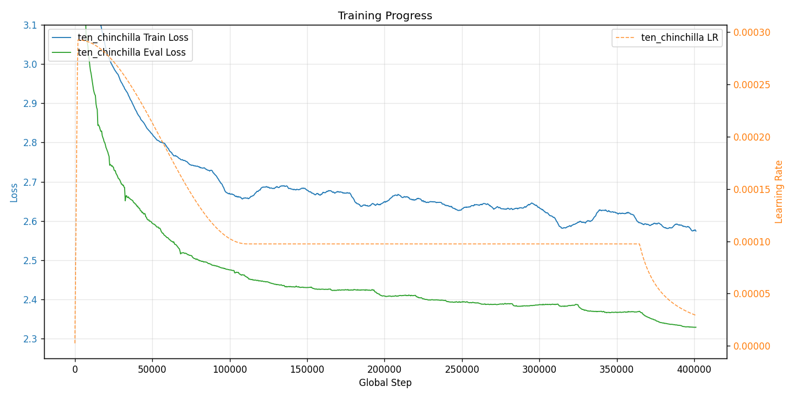
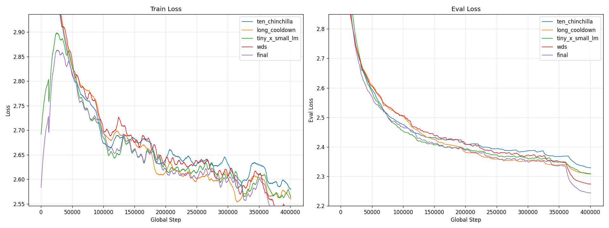
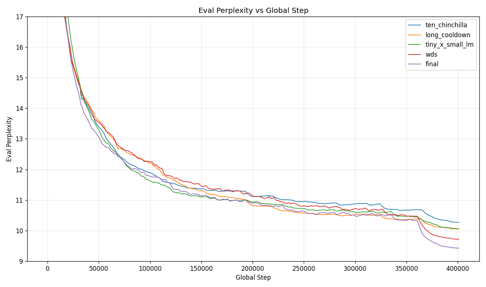
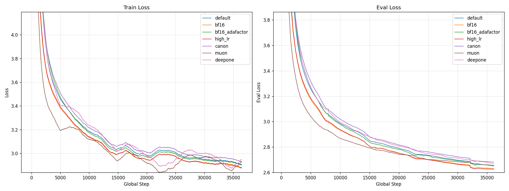
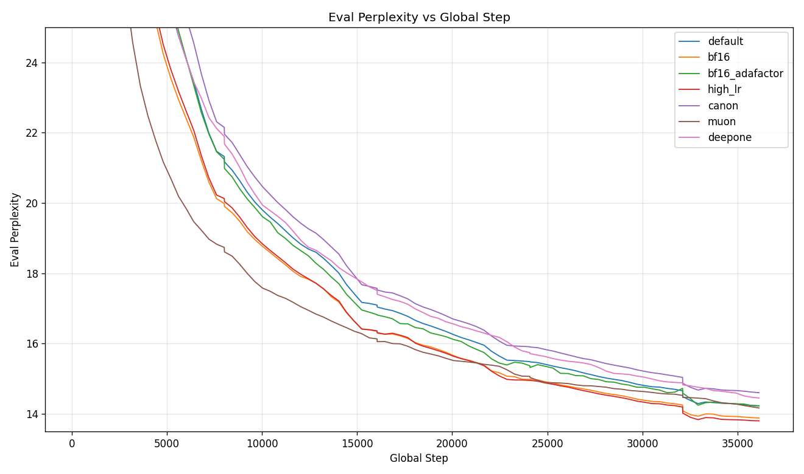

# Small LLM Pretraining

A long-running playground project for pretraining small language models
(~100M-200M parameters) from scratch. Over time it has become the main test
bed for the [LM Training Project
template](../../../project-templates/lm-training-projects.md), and this
README is as much a changelog of what has been tried here as it is a getting-
started guide.

If you are looking for the full reference on every training argument and
dial that the template exposes, read the
[LM Training Project documentation](../../../project-templates/lm-training-projects.md)
and the [Trainer Options Reference](../../../trainers/trainer_options.md).
This README focuses on *this particular project*: its defaults, its
sub-projects, the configs we ship, and the experiments that have been run.

## What This Project Is

- A concrete LM training project that extends `lm_training_project.yaml`
  with choices appropriate for pre-training a small model on a few consumer
  GPUs.
- A set of ready-to-run configurations covering precision experiments, LR
  schedules, alternative architectures, and a curriculum dataset.
- Two sub-projects under this directory that demonstrate how to plug a
  custom model or a custom dataset into a training project without
  vendoring everything into the top-level project:
  - [`custom_canon/`](custom_canon/README.md) - a custom model sub-project
    that shows how to build a Llama variant with Canon-A layers and NoPE
    while inheriting from the regular Llama model project.
  - [`tiny-stories_small-lm/`](tiny-stories_small-lm/) - a dataset
    sub-project that demonstrates a soft curriculum, interleaving Tiny
    Stories with SmolLM corpus via `soft_sequential` sampling.

## Defaults

All experiments below were run on **4 GPUs** (4x RTX 3090 / equivalent), DDP,
with sequence packing at 4K tokens.

| Setting | Default |
|---------|---------|
| Model | vanilla `examples/models/llama/medium.yaml` |
| Trainer | `ddp` |
| Precision | AMP bf16 (`mixed_precision: bf16`), weights in fp32 |
| Attention | `flex_attention` |
| `torch.compile` | enabled, `max-autotune` |
| Sequence length | 4096 |
| Per-device batch size | 4 |
| `base_lr` | `1.5e-4` (sqrt-scaled to global batch) |
| `base_batch_size` | 16384 (LR scaling reference) |
| LR schedule | `InfiniteLRScheduler` with rsqrt annealing |
| Cooldown | `cooldown_p = 0.3`, `min_cooldown_tokens = 6.8B` |
| Token budget | 2.27B (1x Chinchilla for the default model) |
| Fused loss | `forgather.ml.loss:LinearCrossEntropyLoss` |
| Optimizer | `torch.optim.AdamW` |
| Grad clipping | `max_grad_norm: 1.0` |

The default 2.27B-token budget is Chinchilla-optimal for the default model.
From `forgather model construct` on `examples/models/llama/medium.yaml`:

```
Total:             162M
Trainable:         162M
Embedding:         49.2M
Non-embedding:     113M
Tied embeddings:   False
Chinchilla tokens: 2.27G
FLOPs/token:       6.80e+08
```

## Default Model: vanilla Llama (medium)

The project used to default to a custom DeepOne model. It now defaults to the
plain `examples/models/llama/medium.yaml` config - a vanilla Llama at
roughly the same parameter count as the old DeepOne default, but with
predictable behaviour and no bespoke architecture to reason about. The
DeepOne model is still reachable via `-t deepone.yaml`, and the custom
Canon variant lives in the [`custom_canon/`](custom_canon/README.md)
sub-project.

## Default Dataset: SmolLM-Corpus (interleaved + packed)

The default training dataset is the `smollm-corpus/interleaved-packed.yaml`
config of the [`examples/datasets/HuggingFaceTB/`](../../datasets/HuggingFaceTB/README.md)
dataset project. It is the packed variant of an interleaved mix of two
subsets of [HuggingFaceTB/smollm-corpus](https://huggingface.co/datasets/HuggingFaceTB/smollm-corpus):

- **`fineweb-edu-dedup`** - a deduplicated, quality-filtered slice of
  FineWeb-Edu. Real educational web content.
- **`cosmopedia-v2`** - Hugging Face's synthetic-text-books corpus of
  generated educational content, stories, and Q&A.

SmolLM-Corpus is a large (~600B token) curated mix assembled for training
small language models, where sample efficiency matters more than sheer
volume. It trades breadth for signal density, which is the right choice
when you're training a ~100M-parameter model on a consumer-GPU budget.

**Interleaved:** The two subsets are merged with
`forgather.ml.datasets.interleave_datasets` using the
`balance_remaining_examples` sampling policy - on each draw, the
probability of each subset is proportional to its *remaining* unseen
examples. This keeps both subsets at roughly the same depletion rate
rather than exhausting one before the other. `stopping_strategy:
all_exhausted` means the combined iterator continues until every subset
has been seen.

**Packed:** Each subset is pre-tokenised and packed into fixed-length
sequences (default 4096 tokens to match the project's `seq_len`). Packing
concatenates short examples into full-length blocks with attention masks
that prevent cross-example attention, so no tokens are wasted on padding
and every batch is fully utilised. This is what makes the 4K-token
sequence length cheap - without packing, short FineWeb pages would each
produce a mostly-padded batch element.

**First-run download:** The initial load downloads the full dataset
(~100GB+) and tokenises it; subsequent runs hit the on-disk cache and
load near-instantly. Downloads and cached tokenisations live under
`datasets/` at the repo root; see the
[HuggingFaceTB dataset project README](../../datasets/HuggingFaceTB/README.md)
for the full set of available configs (`fineweb-edu-packed`,
`cosmopedia-v2-packed`, the non-packed variants, etc.) and how to select
one via `--dataset-config`.

## Quick Start

Auto-resume is the default: running `forgather train` picks up the latest
checkpoint if one exists, and starts fresh otherwise. There is no need to
pass `--resume` flags in the common case.

```bash
# Train with defaults (vanilla Llama medium, 2.27B tokens, 4 GPUs)
forgather train

# Train for longer (23B tokens instead of 2.3B)
forgather train --total-tokens 23000

# Use SDPA attention and disable torch.compile for faster startup
forgather train --compile false --attn-implementation sdpa

# Swap in a different model project / config
forgather train \
    --model-project ../../models/llama/ \
    --model-config small.yaml

# List the ready-made configs in this project
forgather ls
```

Most options documented in the
[LM Training Project reference](../../../project-templates/lm-training-projects.md)
apply here unchanged - this project only overrides a handful of defaults on
top of `lm_training_project.yaml`. See
[`templates/project.yaml`](templates/project.yaml) for the exact overrides.

## Configurations

```
forgather ls
```

| Config | Purpose |
|--------|---------|
| `default.yaml` | Baseline. Same as `project.yaml` - 1x Chinchilla, AMP bf16, Llama medium. |
| `bf16.yaml` | Pure bf16 weights + SR, Forgather's AdamW. `lr = 4e-4`. |
| `bf16_adafactor.yaml` | Pure bf16 weights + SR, Adafactor. `lr = 1e-3`. |
| `high_lr.yaml` | AMP at the highest non-diverging LR we could find (`3e-4`). |
| `canon.yaml` | Custom Canon-A + NoPE variant from the `custom_canon/` sub-project. |
| `muon.yaml` | Muon optimizer (`torch.optim:Muon`) at `lr = 6e-4`, AdamW for non-matrix params. |
| `deepone.yaml` | Old default - DeepOne medium with trainable ALiBi. |
| `tiny_x_small_lm.yaml` | 10x Chinchilla curriculum: Tiny Stories softly transitioning into SmolLM-corpus, then annealed. |
| `ten_chinchilla.yaml` | Baseline extended to 10x Chinchilla + 1x annealing. |
| `long_cooldown.yaml` | 10x Chinchilla with `cooldown_p = 0.7`. |
| `wsd.yaml` | 10x Chinchilla with the WSD-S scheduler from `forgather.ml.optim:WSDScheduler`. |
| `final.yaml` | 10x Chinchilla combining the most promising knobs: Tiny Stories x SmolLM curriculum, `lr = 3e-4`, WSD-S scheduler. |
| `pp.yaml` | Pipeline Parallel trainer variant of the baseline. |

Unless otherwise noted below, each of the 1x Chinchilla configs uses the
baseline LR schedule, so their loss curves are directly comparable to the
first 1x of the 10x runs.

## Sub-Projects

### `custom_canon/` - custom model demonstrator

[`custom_canon/`](custom_canon/README.md) shows how to build a custom model
architecture *as a sub-project* of a training project, without forking the
underlying model project. It extends `examples/models/llama_canon/` and:

- enables **Canon-A** (a depthwise causal convolution before attention, to
  mix adjacent token representations and facilitate induction head
  formation - see <https://arxiv.org/pdf/2512.17351>);
- disables **Canon-C** (no-op for the pre-FFN position);
- uses **NoPE** (no positional encoder);
- adds **QK-Norm** (RMSNorm on Q and K, Qwen3-style);
- keeps the model at roughly the same size as the baseline Llama medium
  (`hidden_size=768`, `intermediate_size=2048`, 16 layers, 8 heads) so
  training curves can be compared head-to-head.

This sub-project is the intended pattern for adding a custom architecture
to an experiment: treat the custom model as its own Forgather project, then
point the training project at it via `--model-project` (or by committing a
config like `canon.yaml` that sets `ns.model_project_dir`).

### `tiny-stories_small-lm/` - curriculum dataset demonstrator

[`tiny-stories_small-lm/`](tiny-stories_small-lm/) is a dataset sub-project
that demonstrates a soft curriculum: it interleaves the `roneneldan/
TinyStories` dataset with the default `HuggingFaceTB/smollm-corpus`
interleaved-packed dataset using `forgather.ml.datasets.soft_sequential`,
which smoothly transitions the sampling weight from the first dataset to
the second over the course of training.

The `tiny_x_small_lm.yaml` config plugs this sub-project in as the training
dataset. The pattern is the same as for models: the dataset lives in its
own Forgather project, and the training config points at it via
`ns.dataset_proj` / `ns.dataset_config`.

## Experiments

All experiments in this section were run on 4 GPUs. The plots below are
generated with `forgather logs plot`.

### 10x Chinchilla runs

These are long runs at 10x Chinchilla (~22.7B tokens) followed by a 1x
Chinchilla (~2.27B tokens) annealing phase. The LR schedule before the
annealing phase is the same as the 1x baseline (for the Infinite-LR runs),
so the first 10% of training is directly comparable to the 1x runs. The
WSD-based runs (`wsd`, `final`) use a different scheduler shape over the
same total budget.

The LR trace from the baseline `ten_chinchilla.yaml` run makes the Infinite
LR schedule concrete: a short warmup ramp, a cosine cooldown from peak
(~3e-4 at the scaled global batch) down to `constant_lr` (~1e-4) over the
first ~30% of training, a long stable phase, and a final rsqrt annealing
phase that was triggered after the fact via `--start-annealing`. The loss
drops visibly in the annealing region.



Side-by-side comparison of the five 10x configs. `final` (curriculum +
`lr=3e-4` + WSD-S) ends with the lowest eval loss; `wds` (WSD-S on the
default dataset and LR) is next; `long_cooldown` and `tiny_x_small_lm`
finish in a near-tie behind that; `ten_chinchilla` is last. The rising
train-loss noise band from ~step 100K onwards in the Infinite-LR runs is
the `constant_lr` phase - there is no more decay, so per-step variance
stays high even while eval loss keeps improving. The WSD-S runs show a
similar plateau in the stable phase and a sharp drop during the decay
window at the end.



Same eval losses plotted as perplexity on a linear axis (outlier-clipped to
the late-training tail). Perplexity on a linear scale is the natural view
for this data - log-perplexity is just loss, so it would collapse back to
the previous plot. The end-of-run separation between `final` and the rest
is most visible here:



| Config | Best eval loss | Best perplexity | Notes |
|--------|----------------|-----------------|-------|
| `final.yaml` | **2.244** | **9.43** | Curriculum + `lr=3e-4` + WSD-S. Best 10x result so far. |
| `wsd.yaml` | 2.274 | 9.72 | WSD-S scheduler on the default dataset and LR. |
| `long_cooldown.yaml` | 2.308 | 10.05 | Infinite-LR with `cooldown_p = 0.7`. |
| `tiny_x_small_lm.yaml` | 2.309 | 10.06 | Infinite-LR + Tiny Stories x SmolLM curriculum. |
| `ten_chinchilla.yaml` | 2.329 | 10.27 | Infinite-LR baseline, `cooldown_p = 0.3`. |

#### `ten_chinchilla.yaml` - `output_models/ten_chinchilla`

The baseline extended to 10x + 1x with `cooldown_p = 0.3`. Best eval loss
**2.329** at step 400334.

Note: this run was *not* originally launched from `ten_chinchilla.yaml` -
the config was reverse-engineered afterwards to match what actually ran.
The run was started from the baseline with `--total-tokens 24970`, and the
annealing phase was triggered after the fact using the new
`--start-annealing` / `forgather control` path. The TensorBoard logs
appear to have been updated correctly, and the JSON logs should have been
appended to as well, though that has not been confirmed end-to-end. The
baseline config would produce an identical training trajectory if
truncated to 2.27B tokens.

#### `long_cooldown.yaml` - `output_models/long_cooldown`

Same as above, except `cooldown_p = 0.7` - the cosine cooldown runs over
70% of the initial 10x token budget instead of 30%. Best eval loss
**2.308** at step 399131 (lower than `ten_chinchilla`).

As with `ten_chinchilla`, the annealing phase was added after the fact.
The technique was slightly different - `ns.decay_start_step` was edited
from `-1` to trigger annealing - and the resulting rounding error in the
step count produced a small discontinuity at the start of the annealing
phase. The overall profile is still close to `ten_chinchilla`.

The interesting observation is in the validation-loss curve: `long_cooldown`
stays *above* `ten_chinchilla` until around step 140K, at which point it
overtakes and finishes with a notably lower perplexity. This is consistent
with the intuition that stretching the high-LR phase helps late-training
convergence when you have the compute budget to pay for the slower early
progress.

#### `tiny_x_small_lm.yaml` - `output_models/tiny_x_small_lm`

The curriculum-dataset run (Tiny Stories softly transitioning into
SmolLM-corpus, see [`tiny-stories_small-lm/`](tiny-stories_small-lm/)),
extended to 10x Chinchilla + a 1x annealing phase to match the rest of
this group. Best eval loss **2.309** at step 400688. The eval-loss curve
shows a faster early drop than the pure-SmolLM Infinite-LR runs - this is
the Tiny Stories phase keeping the train loss artificially low - but the
curve crosses back as the curriculum hands off to SmolLM, and the run
finishes essentially tied with `long_cooldown` and ahead of
`ten_chinchilla`. Pairing the curriculum with a higher LR and the WSD-S
schedule (in `final.yaml`) recovers the ranking and produces the
best-of-group eval loss.

#### `wsd.yaml` - `output_models/wds`

Replaces the Infinite-LR scheduler with WSD-S
(`forgather.ml.optim:WSDScheduler`): linear warmup, then `base_lr` is held
flat through the long stable phase, then a harmonic decay to `min_lr` over
the final 1x budget. Same dataset and `base_lr = 1.5e-4` as the baseline.
Best eval loss **2.274** at step 399485 - better than either Infinite-LR
run at the same compute. The win shows up almost entirely in the decay
phase: the stable-phase eval is roughly indistinguishable from the
Infinite-LR runs, but the harmonic decay drops further than rsqrt
annealing does.

#### `final.yaml` - `output_models/final`

The "best knobs we have so far" combination: curriculum dataset + `lr =
3e-4` (matching `high_lr.yaml`) + WSD-S scheduler, run for the same 10x +
1x budget. Best eval loss **2.244** at step 401042 - the best 10x result
in this project so far, ~0.03 below the next-best (`wsd.yaml`) and ~0.06
below `long_cooldown`. The curve in the perplexity plot stays at or near
the bottom of the bundle for most of training and pulls clearly ahead in
the decay phase.

### 1x Chinchilla runs

These runs share the baseline LR schedule over the 1x budget, so they are
directly comparable. The `default` series in the plots below is the first
~36.4K steps of the `ten_chinchilla` run, clipped with `--x-max` - since
the cooldown floor (`min_cooldown_tokens = 6.8B`) dominates both the 1x
and 10x configs, the first 1x interval of `ten_chinchilla` is on exactly
the same LR schedule as a standalone default run, so it serves as a
zero-cost stand-in for the baseline.



The standout in the train-loss panel is `muon` - it drops well below every
AdamW-based run for most of training, only converging back into the bundle
near the end. On the eval panel (right) the order tightens up: `high_lr`
and `bf16` finish at the bottom, the AdamW `default` slice is just behind
them, and `muon`, `bf16_adafactor`, `deepone`, `canon` all finish within a
narrow band roughly 0.03-0.06 above the leaders. Despite the dramatic
train-loss lead, Muon's eval loss does not beat the best AdamW run at this
compute budget.

Same eval losses plotted as perplexity on a linear axis. The 1x runs have
fewer eval points than the 10x runs, so the outlier-clip percentile window
is more permissive; `--y-max 25` is used here to force a comparable
y-range to the 10x plot so the tail-end differentiation is legible. Muon's
eval-perplexity curve is the most striking - it drops to the bottom of the
plot well before any other run gets there, then plateaus while the AdamW
runs catch up:



| Config | Best eval loss | Notes |
|--------|----------------|-------|
| `high_lr.yaml` | **2.617** | AMP, `lr = 3e-4`. Highest non-diverging LR for AMP. |
| `bf16.yaml` | 2.622 | Pure bf16 + SR, Forgather AdamW, `lr = 4e-4`. |
| `default.yaml` | ~2.63 | Baseline. Shown via the first 1x slice of `ten_chinchilla`; not rerun separately. |
| `bf16_adafactor.yaml` | 2.649 | Pure bf16 + SR, Adafactor, `lr = 1e-3`. |
| `muon.yaml` | 2.650 | Muon optimizer (`match_rms_adamw`), `lr = 6e-4`. |
| `deepone.yaml` | 2.668 | DeepOne medium with trainable ALiBi. |
| `canon.yaml` | 2.678 | Custom Canon-A + NoPE variant. |

#### `high_lr.yaml` - `output_models/high_lr`

AMP run with PyTorch's AdamW at the highest LR that did not diverge in a
sweep (`lr = 3e-4`). Finished at the best eval loss of any 1x run, but
only modestly better than the default baseline - the default is already
close to the edge.

#### `bf16.yaml` - `output_models/bf16`

Pure bf16 weights + gradients with stochastic rounding, using Forgather's
AdamW (which defaults to SR when optimizer state is in bf16). Less robust
to high LRs than the SR Adafactor run - settled on `lr = 4e-4` after a
sweep - but still tolerated a higher LR than AMP did.

Results confirm the general expectation from the
[SR paper](https://arxiv.org/pdf/2502.20566): pure bf16 + SR can reach
perplexity comparable to mixed precision, at a meaningfully lower
optimizer-memory cost.

#### `bf16_adafactor.yaml` - `output_models/bf16_adafactor`

Same pure-bf16 + SR setup as `bf16.yaml`, but using Forgather's Adafactor.
This run was **unusually stable at high LRs** - we settled on `lr = 1e-3`
as the base, but had tried even higher values without diverging. The
grad-norms are visibly noisier than other configs, which suggests `1e-3`
may still be above the statistical optimum. Finding the optimal LR for
this combination is a TODO.

#### `canon.yaml` - `output_models/canon`

The `custom_canon` model (Canon-A only, NoPE, QK-Norm) at comparable
parameter count to the baseline Llama. Finished with a higher final eval
loss than the vanilla Llama runs. Throughput was also noticeably lower,
which is consistent with the sub-optimal causal-convolution implementation
in the current Canon layer - there is room to revisit this with a better
kernel. Given how well other Canon variants have performed in the
`tiny_experiments/canon` project, this config is worth coming back to with
different hyperparameters.

#### `muon.yaml` - `output_models/muon`

Trains the baseline Llama medium with the Muon optimizer
(`torch.optim:Muon`) on the matrix parameters and AdamW on everything
else. `lr = 6e-4`, `adjust_lr_fn = "match_rms_adamw"` so the per-step RMS
update size is matched to AdamW's. Other defaults unchanged. Best eval
loss **2.650** at step 36460.

The result is a textbook example of Muon's training-vs-eval split at this
scale: the train loss drops dramatically faster than any AdamW run (the
Tiny Stories curriculum aside), and the eval-perplexity curve hits the
bottom of the plot well before the others. But by the end of the 1x
budget the AdamW runs have caught up, and `muon` finishes mid-pack rather
than ahead. Worth rerunning at a longer budget and/or with a different LR
schedule to see whether the early-training advantage extrapolates - Muon
is a candidate to fold into a `final.yaml`-style combined run.

This is consistent with the headline finding of Marek et al.,
[*Small Batch Size Training for Language Models: When Vanilla SGD Works,
and Why Gradient Accumulation Is
Wasteful*](https://arxiv.org/abs/2507.07101) (NeurIPS 2025): the gap
between optimizers *grows with batch size*. Their Figure 1a is a
hyperparameter-tuned grid over SGD, Adam, Adafactor, and Muon on a 30M
model trained for 600M tokens (Chinchilla-optimal), at batch sizes from
1 to 4096 - at small batches all four optimizers cluster at nearly the
same loss, and the spread only opens up at larger batches. This project
runs Muon at an effective batch of 16 sequences (~65K tokens/step) on a
~162M model for ~2.27B tokens, and lands in the same regime: Muon's
final eval loss is within ~0.03 of the best AdamW configuration despite
a clearly steeper train-loss trajectory.

The [`examples/tiny_experiments/optimizers/`](../../tiny_experiments/optimizers/README.md)
project explores this more thoroughly with a 30M Llama on FineWeb-Edu:
Muon wins by ~0.06 eval loss at both batch=32 (16K tokens/step) and at
8x grad-accumulation (131K tokens/step). The natural follow-up on this
project is to plug Muon into the 10x Chinchilla bundle - longer training
is the regime where Muon's lead over AdamW is reported to be more
durable, and a `final.yaml`-style combined run with Muon as the
optimizer is the obvious next experiment.

#### `deepone.yaml` - `output_models/deepone`

The previous default model: DeepOne-medium with trainable ALiBi. Best
eval loss **2.668** at step 36460. The eval curve sits near the top of
the bundle but is not far behind `bf16_adafactor` or `muon`.

Throughput is the lowest of the 1x runs (~38.9 samp/s vs ~45-49 for the
Llama variants). This is *after* the `flex_attention + ALiBi`
performance regression was fixed and a best-effort optimization pass
applied; with the regression in place the run was throughput-bound to
single-digit samp/s, which is why the project's default switched to
vanilla Llama. Most of the residual cost is the **trainable** ALiBi: the
slope parameters receive gradients, so the bias term cannot be folded
into the attention kernel as a constant and has to be carried through
the backward pass. Freezing the ALiBi slopes recovers most of the
throughput, but at this scale the eval-loss gap to Llama opens up
notably without the trainable variant - so DeepOne stays slow as long
as it stays competitive.

#### `tiny_x_small_lm.yaml` - moved to the 10x group

The curriculum-dataset config is now run at 10x Chinchilla + cooldown and
appears in the 10x table above. The original 1x run finished at eval loss
~2.66; extending the budget pulls the run into the 10x bundle (best eval
**2.309**), and the curriculum's strongest contribution shows up when
combined with WSD-S and `lr = 3e-4` in `final.yaml`.

#### `pp.yaml` - not currently run end-to-end

The Pipeline Parallel variant of the baseline. Verified to start up, but
not yet run for a full training budget. A useful follow-up would be to add
a matching DDP config with `dispatch_batches = True`, so the DDP and PP
runs see exactly the same sequence of examples and can be compared
head-to-head.

### Reproducing the plots

The four comparison plots above (`10x_chinchilla_comparison.png`,
`10x_eval_perplexity.png`, `1x_chinchilla_comparison.png`,
`1x_eval_perplexity.png`) are rendered by
[`docs/plots/render.py`](docs/plots/render.py) - a small matplotlib
script using the `forgather.ml.analysis.TrainingLog` API. The CLI
`forgather logs plot` defaults are tuned for one or two runs; with the
five 10x and seven 1x runs collected here, the default markers and
linewidths obscure detail, so we render directly with thin lines, no
markers, and heavier smoothing on the train-loss panel.

```bash
# Re-render all four comparison plots (run from this project directory)
python docs/plots/render.py
```

The single-run LR trace still uses `forgather logs plot`, since one run
fits the CLI defaults fine:

```bash
# 10x ten_chinchilla alone, loss + LR on secondary axis.
# Single-run --loss-curves draws the LR trace; the outlier-aware y-axis
# default focuses on the tail instead of the warmup peak.
forgather logs plot \
    output_models/ten_chinchilla/runs/log_2026-04-02T00-02-58/trainer_logs.json \
    --loss-curves --smooth 10 \
    --output docs/plots/10x_ten_chinchilla_lr.png
```

Flags worth knowing (full reference in
[`docs/guides/logs-analysis.md`](../../../guides/logs-analysis.md)):

| Flag | Purpose |
|------|---------|
| `--loss-curves` | Train + eval loss panels; adds an LR trace on a secondary axis in single-run mode. |
| `--metrics NAME[,NAME...]` | Plot specific metrics instead of the default set. |
| `--compare LOG1 LOG2 ...` | Overlay multiple runs on the same axes. |
| `--labels L1 L2 ...` | Override per-run labels (order matches `--compare`). |
| `--smooth N` | Moving-average smoothing window (raw curve drawn faintly behind). |
| `--perplexity` | Convert loss-like metrics to `exp(loss)`; relabel axes. |
| `--log-scale` | Log y-axis. Note: disables outlier-aware auto-clipping (log scale already handles dynamic range). |
| `--ignore-outliers` / `--no-ignore-outliers` | Default-on 5th/95th-percentile y-axis auto-clipping. Disable for the old full-range behaviour. |
| `--x-min`, `--x-max` | Clip the *data* to a step / epoch / time window. |
| `--y-min`, `--y-max` | Explicit y-axis limits; override auto-clipping. |
| `--grad-norm` | First-class grad-norm plot with optional smoothing and log scale. |

## Parallelism

This project uses DDP by default. For the trainer-level details
(dispatch-batches vs sharding, pipeline schedule selection, memory trade-
offs, text-generation callback compatibility, etc.) see:

- [LM Training Project documentation](../../../project-templates/lm-training-projects.md)
- [Pipeline Parallel guide](../../../trainers/pipeline-parallel.md)
- [Trainer Options Reference](../../../trainers/trainer_options.md)

Everything those documents say about DDP, pipeline parallel schedule
choice, compile-mode compatibility, memory optimisations, and the
text-generation callback applies here without modification.

## Monitoring and Control

```bash
# Tail the trainer log
tail -f output_models/<run>/runs/*/trainer_logs.json

# Summaries and plots
forgather logs summary --all --format one-line
forgather logs plot --loss-curves
forgather logs plot --compare run1/trainer_logs.json run2/trainer_logs.json

# TensorBoard across every model in output_models/
forgather tb --all                 # localhost only
forgather tb --all -- --bind_all   # all interfaces
```

External control of a running job (save / stop / abort / trigger
annealing) uses the standard `forgather control` commands - see
[Trainer Control](../../../trainers/trainer-control.md).

## References

- [LM Training Project template documentation](../../../project-templates/lm-training-projects.md)
  - full reference for every option exposed by the template this project
    extends.
- [Trainer Options Reference](../../../trainers/trainer_options.md) -
  all training arguments and trainer constructor parameters.
- [Pipeline Parallel guide](../../../trainers/pipeline-parallel.md)
- Hoffmann et al. (2022) *Training Compute-Optimal Large Language Models*
  (Chinchilla). <https://arxiv.org/abs/2203.15556>
- *Beyond Cosine Decay: On the effectiveness of Infinite Learning Rate
  Schedule for Continual Pre-training.* (2025)
  <https://arxiv.org/abs/2503.02844>
- Wen et al. (2024) *Understanding Warmup-Stable-Decay Learning Rates: A
  River Valley Loss Landscape Perspective.* (WSD-S.)
  <https://arxiv.org/abs/2410.05192>
- *Stochastic Rounding for LLM Training: Theory and Practice.* (2025)
  <https://arxiv.org/abs/2502.20566>
- Marek et al. (2025) *Small Batch Size Training for Language Models:
  When Vanilla SGD Works, and Why Gradient Accumulation Is Wasteful.*
  (NeurIPS 2025.) <https://arxiv.org/abs/2507.07101>
- Jordan et al. (2024) *Muon: An optimizer for hidden layers in neural
  networks.* <https://kellerjordan.github.io/posts/muon/>
- [SmolLM-Corpus](https://huggingface.co/datasets/HuggingFaceTB/smollm-corpus)
- [Tiny Stories](https://huggingface.co/datasets/roneneldan/TinyStories)
