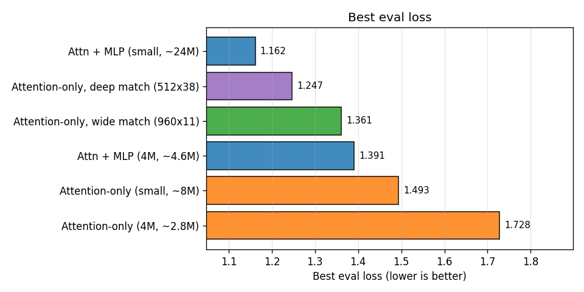
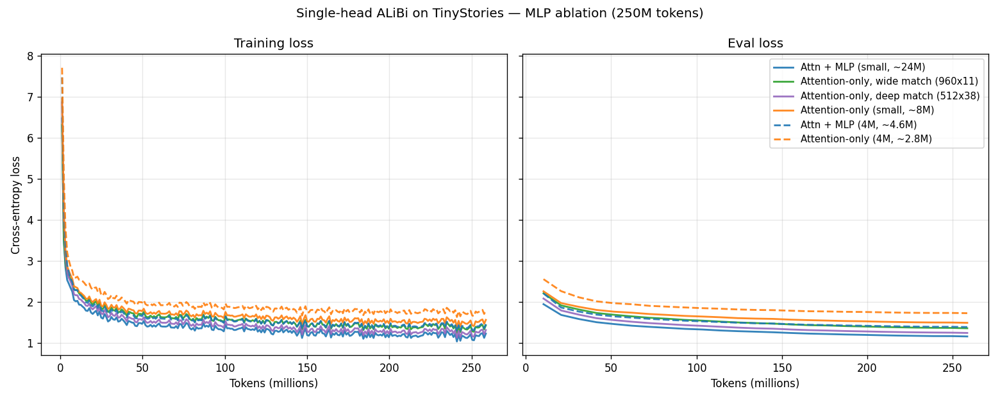

# Attention-Only Ablation

What does the **MLP** actually contribute to a transformer? This experiment
isolates it by training the [`singlehead`](../../models/singlehead) model — a
deliberately simple single-head ALiBi transformer — in two forms, **with** and
**without** the feedforward (MLP) sub-block, and comparing them on
[TinyStories](https://arxiv.org/abs/2305.07759).

The attention-only form is the object studied in Elhage et al.'s
[*A Mathematical Framework for Transformer Circuits*](https://transformer-circuits.pub/2021/framework/index.html)
(2021): a transformer whose residual stream is moved *only* by attention. Adding
the MLP back is the single variable under test.

## The two architectures

Both are pre-LN, RMSNorm, tied-embedding, single-head **ALiBi** transformers
(ALiBi is chosen so position lives entirely in the attention scores and never
muddies the query/key/value content — see the
[singlehead README](../../models/singlehead)). They differ by exactly one thing:

| Block | Update | Layer class |
|---|---|---|
| **Attention + MLP** | `x = x + attn(norm(x))`, then `x = x + mlp(norm(x))` | `PreLNLayer` |
| **Attention-only** | `x = x + attn(norm(x))` | `AttentionOnlyLayer` |

Removing the MLP without compensating drops parameters — at the small width the
MLP is the *majority* of the model. So beyond the plain attention-only model (MLP
simply deleted), the experiment includes **param-matched** attention-only models
that re-spend the MLP's capacity as more attention, matching the +MLP model's
*non-embedding* parameter count. There are two, which also lets us ask whether
**depth or width** is the better way to spend an attention budget:

- a **wide** match — hidden 960 × 11 layers, and
- a **deep** match — hidden 512 × 38 layers (same width as `mlp_small`).

| Run | hidden / layers / inter | MLP? | Non-emb | Params |
|---|---|---|---|---|
| `mlp_4m` | 256 / 6 / 384 | yes | 1.7M | 4.6M |
| `attn_only_4m` | 256 / 6 / — | no | 0.8M | 2.8M |
| `mlp_small` | 512 / 8 / 1280 | yes | 19.9M | 24M |
| `attn_only_small` | 512 / 8 / — | no | 4.2M | 8.3M |
| `attn_only_matched_small` (wide) | 960 / 11 / — | no | 20.3M | 28M |
| `attn_only_deep_small` (deep) | 512 / 38 / — | no | 19.9M | 24M |

Both param-matched models match `mlp_small` on non-embedding parameters (~20M);
the deep one, sharing the 512 width, matches it on *total* parameters too. A
38-layer single-head stack is deep enough to worry about training stability —
which turns out to be a non-issue here (see below).

## Setup

- **Data:** TinyStories (`roneneldan/TinyStories`), packed, ~250M training tokens.
- **Base:** `projects/tinyv2.yaml` (seq 2048, batch 8, WSD-style LR schedule,
  AdamW). The single-head model is **eager-attention only** (no flex/compile, no
  KV cache), so these runs are slower per step than the other tiny experiments.
- **Tokenizer:** shared wikitext-8K BPE (the singlehead model's default).
- **`save_strategy: steps`** so the trained models are written to disk for the
  generation test (the `tinyv2` default is `no`).

## Results

All six runs trained on the same 258M tokens. Best eval loss (cross-entropy):

| Run | Non-emb params | Best eval loss |
|---|---:|---:|
| `mlp_small` (attn + MLP, ~24M) | 19.9M | **1.162** |
| `attn_only_deep_small` (attn-only, 512×38) | 19.9M | 1.247 |
| `attn_only_matched_small` (attn-only, 960×11) | 20.3M | 1.361 |
| `mlp_4m` (attn + MLP, ~4.6M) | 1.7M | 1.391 |
| `attn_only_small` (attn-only, ~8M) | 4.2M | 1.493 |
| `attn_only_4m` (attn-only, ~2.8M) | 0.8M | 1.728 |





Four things stand out:

1. **At equal parameters the MLP still leads — but a well-shaped attention-only
   gets close.** `mlp_small` (1.16) beats every attention-only model on its own
   parameter budget, but the best attention-only model (the deep match, 1.25) is
   only ~0.085 behind, not the 0.20 the *wide* match (1.36) would suggest. The
   MLP's edge is real but smaller than the naive ablation implies.

2. **Depth beats width for attention-only.** At the same ~20M non-embedding
   budget, stacking attention deep (512 × 38 → 1.25) clearly beats spreading it
   wide (960 × 11 → 1.36) — a 0.11 gap. Attention composes information *through
   depth* (an induction head already needs two layers; richer circuits need
   more), so extra layers buy more than extra width. This is the kind of result
   the Transformer Circuits view predicts.

3. **The MLP is strikingly parameter-efficient.** `mlp_4m` carries only **1.7M**
   non-embedding parameters yet reaches 1.39 — essentially tying the *wide*
   attention-only model with **20M** non-embedding parameters (1.36), and beating
   the 8M attention-only model (1.49). A little MLP compute is worth an order of
   magnitude more attention compute.

4. **The 38-layer stack trained perfectly stably.** No DeepNet, no gradient
   clipping, no warmup tricks — just the model's default pre-norm. Grad-norm
   stayed in the 0.30–1.53 band the entire run (mean 0.41) and never spiked. So
   the depth that worried us up front was a non-issue: **pre-norm alone carries an
   attention-only stack to 38 layers**, which is itself the answer to "can it even
   be trained?"

(MFU is low across the board — the single-head model runs eager-only with no
`torch.compile` or flash kernels, so these are not throughput-representative
numbers.)

## Generation (subjective)

The trained models are sampled against
[`prompts/tiny_stories.yaml`](../../../prompts/tiny_stories.yaml) with
`examples/snippets/prompt_test.py`. Training writes weights under
`output_models/<run>/checkpoints/`, so co-locate the final checkpoint with the
model's config/code first:

```bash
RUN=mlp_small
CKPT=$(ls -d output_models/$RUN/checkpoints/checkpoint-* | sort -t- -k2 -n | tail -1)
cp "$CKPT"/pytorch_model*.bin "$CKPT"/pytorch_model.bin.index.json output_models/$RUN/

python ../../snippets/prompt_test.py \
    output_models/$RUN ../../../prompts/tiny_stories.yaml \
    --device cuda:0 --max-new-tokens 128 --no-kv-cache
```

> **Note:** the single-head model does not implement KV-cache decoding, so pass
> `--no-kv-cache` (the harness otherwise feeds attention only the latest token
> and output degenerates). The samples below use it.

The eval-loss numbers understate how different these models *feel* to sample.

**`mlp_small` (attn + MLP, 24M) — coherent and on-topic:**

> Jack wanted to read a book, so he went to **the library. It was very big and had
> lots of books that he liked, but it was too tall for him to reach. He looked
> around, but there were no books here. He noticed a man sitting in the corner…**

**`attn_only_small` (attention-only, 8M) — locally fluent, but unstable:**

> Alice was so tired when she got back home so she went **to bed. But as soon as
> Janielielielium Tri Anderson experered Mart Martsey declared Simon
> Simoniotmondmond 8 8 years1446 degrees 5 degrees 000…**

It produces good local phrases, then falls off a cliff into repetition loops or
token-soup — most often when the prompt is short or the continuation is
uncertain. This is the attention-only failure mode the Transformer Circuits work
predicts: with no per-token MLP, the model behaves like a strong bigram /
skip-trigram copier but has nothing to stabilize a longer trajectory.

**`attn_only_matched_small` (attention-only, 28M) — the degeneration is gone:**

> Alice was so tired when she got back home so she went **to bed with a mischievous
> smile on her face. She closed her eyes and fell asleep, dreaming of all the fun
> she would have tomorrow.**

Crucially, the param-matched model is *coherent and stable* — none of the
token-soup of its smaller sibling. So a good chunk of what looked like "the MLP
matters" is really "enough capacity matters"; given equal parameters, attention
alone can hold a story together.

**`attn_only_deep_small` (attention-only, 512×38) — the best of the attention-only lot:**

> Alice was so tired when she got back home so she went **to the kitchen and found
> a big jar of cookies. She wanted one, but knew she had to wait for her mommy
> before she could open it.**

The deep attention-only model reads as cleanly as the wide one and a notch
sharper — consistent with its lower loss. Same parameter budget as the wide
match, spent on depth instead of width.

**`mlp_4m` (attn + MLP, 4.6M) — coherent despite being tiny:**

> Jack wanted to read a book, so he went to **find an interesting book. He looked
> around and finally found it in the kitchen. He was so excited! But he felt
> frustrated because when he opened the book and saw that it had been empty!**

## Subjective analysis

The MLP plays two separable roles here:

- **A capacity role** — most of the dramatic difference between the *small*
  attention-only model and the others is just that removing the MLP threw away
  ~65% of the model. Give that capacity back as attention (the param-matched run)
  and the worst symptom, degenerate generation, disappears entirely.
- **A qualitative, efficiency role that capacity does *not* buy back** — at equal
  non-embedding parameters the MLP model is still 0.20 nats ahead, and a
  1.7M-parameter MLP model rivals a 20M-parameter attention-only one. The per-token
  nonlinear computation an MLP provides is something attention depth and width
  approximate only inefficiently. (That 0.20-nat edge is clear on the loss curve
  but, per the blind A/B test below, hard for a human to actually perceive.)

The tidy reading, consistent with *A Mathematical Framework for Transformer
Circuits*: **attention moves and copies information; the MLP computes on it.** You
can lean hard on attention and still produce fluent TinyStories, but the MLP is a
much cheaper place to put the "thinking," and at a fixed parameter budget it wins.

The depth result refines this. When you *do* spend the budget on attention,
spend it on **layers, not width**: each additional layer is another round of
compositional reading of the residual stream, and that is where attention's power
lives. The deep attention-only model both trains stably (38 pre-norm layers, no
special machinery) and lands within ~0.085 of the equal-parameter MLP model —
the closest any attention-only model gets. Depth doesn't replace the MLP, but it
narrows the gap far more effectively than width does.

## Blind A/B evaluation: humans vs. an LLM-judge panel

Does the loss ranking match *subjective* quality? We judged the ~20M models with a
blind, shuffled, position-controlled A/B method — both as a **human** (via
[`ab_test.py`](../../snippets/ab_test.py)) and as a panel of independent **Claude
judges** — and they disagree sharply. The disagreement is the result.

### Human (so far: one participant, `mlp_small` vs the wide attention-only model)

| | wins | |
|---|---:|---:|
| `mlp_small` (+MLP, lowest loss) | 32 | 59% |
| wide attention-only (960×11) | 22 | 41% |

Two-sided sign test **p = 0.22 — not significant**, and that *overstates* the
preference: many pairs were *both* badly flawed and got decided by "a weak
gut-feeling and an arbitrary coin flip." A forced binary choice turns near-ties
into coin-flips — unbiased noise that inflates the apparent split while the real
signal stays near 50/50. The honest read: **to a human, these two models are about
indistinguishable**, even though `mlp_small` has 0.20 nat lower eval loss. That
gap is real on the loss curve and invisible across the desk.

### LLM-judge panel (6 Claude judges, both orderings, 18 prompts, 108 votes/pair)

| Match-up | Votes | Winner | sign-test p |
|---|---:|---|---:|
| `mlp_small` vs deep (512×38) | 76–32 | mlp_small (70%) | 3e-5 |
| `mlp_small` vs wide (960×11) | 86–22 | mlp_small (80%) | 4e-10 |
| deep (512×38) vs wide (960×11) | 82–26 | deep (76%) | 6e-8 |

The panel confidently reproduces the loss order (`mlp_small` > deep > wide). But on
the one pair we have human data for, it called an **80–20 rout where the human saw
a coin flip**. Whatever the LLM judges reward — coherence/completeness, which
`mlp_small` produces cleanly — it is *not* what a person picks between two flawed
tiny-model stories. **The LLM-judge panel is a cheap but badly miscalibrated proxy
here; it over-predicts the gap and should not be read as ground truth.** (It's also
near-unanimous within each ordering, so it's a few strong, agreeing readings, not 6
independent ones.)

### Status / contribute

This is one human run on one pair — preliminary. We're pooling more (`mlp_small` vs
deep, and additional participants) in [`human_eval/`](human_eval/): run
`ab_test.py`, drop the JSON there, and aggregate with `ab_aggregate.py`. The numbers
will firm up as data accrues.

> **Loading note (important).** Each model must be loaded in its **own process**.
> Both models' generated code uses the dynamic module name `singlehead`, and Hugging
> Face caches a `trust_remote_code` class by its `auto_map` name — so loading two of
> them in one process rebuilds the second with the *first's* architecture (an
> attention-only model silently gets MLP layers, its checkpoint then reporting
> `MISSING` feedforward weights). `ab_test.py` generates each model in a subprocess
> for exactly this reason. This is a general gotcha for loading multiple same-arch
> Forgather models in one process.

## Reproducing

```bash
cd examples/tiny_experiments/attention_only

# Queue all six runs, one GPU each (needs a running forgather server)
for cfg in mlp_4m attn_only_4m mlp_small attn_only_small \
           attn_only_matched_small attn_only_deep_small; do
    forgather -t "$cfg.yaml" submit --requested-gpus 1
done

# When `forgather job list` shows them all done, regenerate the plots
python assets/generate_plots.py

# Generation test (per model) — see "Generation" above for the checkpoint
# co-location step and why --no-kv-cache is required.
python ../../snippets/prompt_test.py output_models/mlp_small \
    ../../../prompts/tiny_stories.yaml --no-kv-cache

# Blind A/B subjective comparison of two models (interactive human judging).
python ../../snippets/ab_test.py \
    output_models/mlp_small output_models/attn_only_deep_small \
    ../../../prompts/tiny_stories.yaml --trials 3 --seed 42 --no-kv-cache
```

## References

- Elhage et al. 2021, *A Mathematical Framework for Transformer Circuits* — <https://transformer-circuits.pub/2021/framework/index.html>
- Press et al. 2021, *Train Short, Test Long: Attention with Linear Biases (ALiBi)* — [arXiv:2108.12409](https://arxiv.org/abs/2108.12409)
- Eldan & Li 2023, *TinyStories: How Small Can Language Models Be and Still Speak Coherent English?* — [arXiv:2305.07759](https://arxiv.org/abs/2305.07759)
