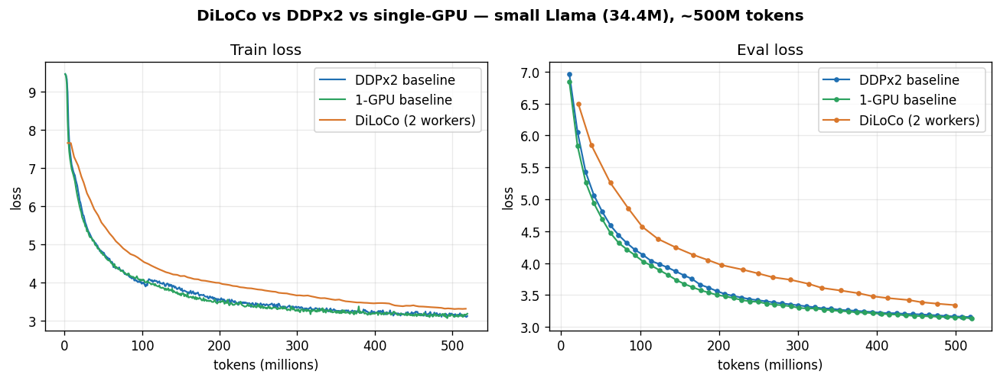
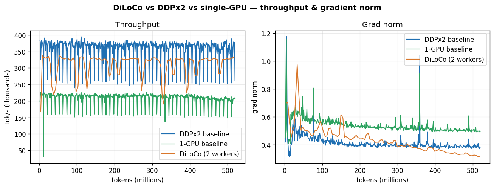
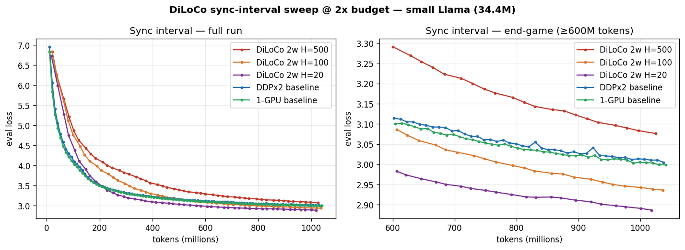
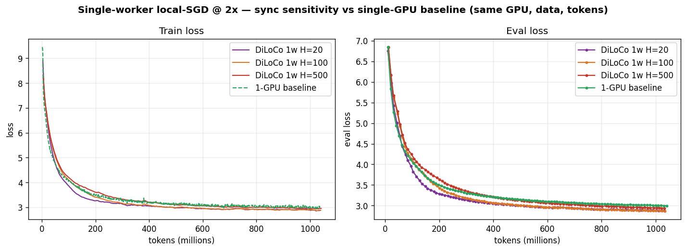
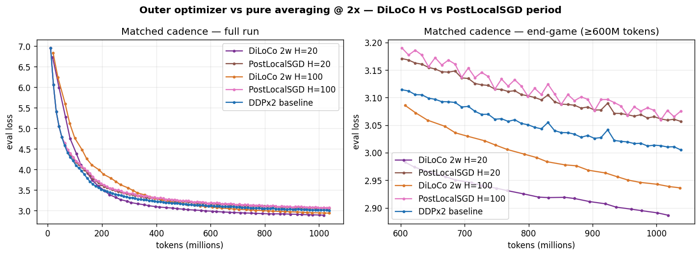

# DiLoCo Distributed Training Example

This project demonstrates **DiLoCo** (Distributed Local-SGD) integration with the
Forgather trainer via `DiLoCoCallback`. It walks through an end-to-end run on a
single node with at least 2 GPUs, driven entirely from the CLI.

The instructions were written for a single node, but the same commands generalize
to multiple nodes — the only differences are that you complete the
[TLS setup](../../../docs/operations/tls.md) first and bind the servers to a routable
interface (`-H 0.0.0.0`) so other machines can reach them.

While this walkthrough uses the Forgather server for coordination, it focuses on the
**CLI** workflow. A separate webui tutorial is in the works. For the authoritative,
exhaustive reference see [`docs/trainers/diloco.md`](../../../docs/trainers/diloco.md)
and the internals in
[`docs/trainers/diloco-architecture.md`](../../../docs/trainers/diloco-architecture.md);
this README is a guided tour, not the spec.

All commands below assume you are in the project directory:

```bash
cd examples/tiny_experiments/diloco
```

---

## How DiLoCo works (theory of operation)

If you just want to run the example, skip to [the walkthrough](#walkthrough). This
section explains *what* the moving parts are and *why* they exist, so the commands
below make sense.

### The problem it solves

Conventional data-parallel training (DDP, FSDP) **all-reduces gradients on every
step**. That is fast on a node wired with NVLink or InfiniBand, but it assumes a
high-bandwidth, low-latency interconnect and tight lock-step between every rank.
Over commodity Ethernet — or between machines in different rooms, buildings, or
regions — synchronizing every step stalls the GPUs waiting on the network.

DiLoCo trades synchronization *frequency* for *bandwidth efficiency*: each worker
trains **locally and independently for many steps**, then synchronizes only
occasionally. Communicating every ~500 steps instead of every step cuts network
traffic by orders of magnitude, which is what makes distributed training practical
over slow or heterogeneous links.

### Inner optimizer, outer optimizer, pseudo-gradients

DiLoCo is a two-level optimization scheme:

- **Inner optimizer** — the ordinary optimizer in the training loop (e.g. AdamW).
  It runs *locally* on each worker for `sync_every` steps (default **H = 500**),
  exactly as it would in non-distributed training. The server never sees it.

- **Outer optimizer** — lives on the **parameter server** and steps once per *sync
  round*. Its "gradient" is the **pseudo-gradient**: the difference between the
  global weights (frozen at the last sync) and the worker's locally-evolved weights
  after H steps. In other words, "how far did local training move the model?" The
  server averages the pseudo-gradients from all workers and applies the outer
  optimizer to the global weights. The default outer optimizer is **SGD with
  Nesterov momentum (`lr=0.7`, `momentum=0.9`)** — momentum across sync rounds
  accelerates convergence the same way it does across steps in ordinary SGD.

A **sync round** is one full cycle: every worker trains H local steps → submits its
pseudo-gradient → the server averages them and steps the outer optimizer → every
worker pulls the fresh global weights and starts the next round. The server is the
single source of truth for the weights; workers hold the only copies of their
*training* state (inner-optimizer state, LR schedule, RNG) and checkpoint that
themselves.

Dataset progress is the exception to "workers own their state." A worker only tracks
its position *within the current work unit*, and that position is ephemeral — lost if
the worker dies. The **server** is authoritative for which work units have been
consumed (it persists that in its own checkpoint), so dataset progress survives a
worker failure even though the worker never checkpoints it. See
[work-unit dispatch](#work-unit-dispatch-how-the-data-is-split) below.

### The pieces

- **DiLoCo server** (`forgather diloco server`, default port **8512**) — the
  parameter server. Owns the global weights and outer-optimizer state, runs the
  sync barrier, tracks the worker registry and the dataset work queues, and is
  **authoritative for the group-wide settings** workers must agree on
  (`sync_every`, `bf16_comm`, `num_fragments`, DyLU). Workers fetch those from the
  server's `/info` endpoint at startup — there are no corresponding worker flags,
  so the whole group can't drift out of agreement. A GPU is *not* required to run
  the server; the outer optimizer is cheap and runs on CPU.

- **DiLoCo worker** — an ordinary Forgather training job with `DiLoCoCallback`
  attached. The callback registers the worker with the server, snapshots the global
  weights, lets the trainer run H local steps, then computes and submits the
  pseudo-gradient and applies the returned global weights. Launching with
  `forgather diloco worker` sets this up for you.

- **Forgather server** (`forgather server`) — the orchestrator. It schedules the
  DiLoCo/dataset/worker jobs, captures their logs, provisions auth tokens and TLS
  automatically, and (in cluster mode) lets workers *auto-discover* the dataset
  server. Using it is optional but strongly recommended — without it you'd wire up
  discovery, tokens, and certificates by hand.

### Work-unit dispatch: how the data is split

Under DiLoCo, every trainer reads from the **same** dataset and must *not* see the
same rows (that would just duplicate work within an epoch). Rather than statically
sharding the dataset (`--shard-index N`, fragile and hard to resize), the DiLoCo
server hands out **work units** on demand: it keeps a queue of K units (default
**1024**) per `(dataset_id, shuffle_seed)`, and each reader pulls the next available
unit, reads those rows, reports completion, and asks for another. No overlap, late
readers just start pulling, and the server — not the reader — records which units
have been consumed.

**Work units are a universal sharding mechanism.** The puller of a unit isn't always
a whole DiLoCo worker: a worker can itself be a multi-GPU DDP job (fast intra-host
interconnect, syncing to other hosts over the slow link via DiLoCo), and in that case
**each DDP rank pulls work units independently**. So the same queue cleanly shards
data across DDP ranks *within* a host and across DiLoCo workers *across* hosts. One
consequence: when a reader dies it forfeits whatever unit it had in flight, so a host
running R DDP ranks can lose up to R units — still a tiny fraction of an epoch at
K=1024, but not "at most one." (DDP-under-DiLoCo is an advanced topology; see the
reference doc.)

Work-unit dispatch is implemented in the dataset wrapper (`ComposableIterableDataset`)
and is **agnostic to its backend** — the backend is just a seekable iterator, whether
it reads from a **local** cache or streams from a remote **dataset server**. This
example uses a dataset server (and cluster mode) on purpose, because it decouples the
data from where training runs:

- The dataset only has to be cached on **one** cluster member, not every host — any
  worker can stream it from there.
- If **more than one** member serves the same dataset, requests are **load-balanced**
  across them automatically.
- The dataset can even be hosted **off-site** (e.g. a cloud dataset server feeding
  on-prem or rented GPUs). Setting up an external/off-site dataset server is outside
  the scope of this demo.

### Sync vs. async, and the knobs you'll see later

The example runs in the default **synchronous** mode: the server waits for every
worker's submission before releasing the next round. Simple and deterministic — the
right choice for a homogeneous node. DiLoCo also supports an **asynchronous** mode
(`--async`) for heterogeneous fleets, where fast workers don't idle waiting for slow
ones, with Delayed-Nesterov (`--dn-buffer-size`) and Dynamic Local Updates
(`--dylu`) to keep stale updates from destabilizing training. A few other
server-side knobs you'll see referenced:

- **`--no-bf16`** — pseudo-gradients are sent in bfloat16 by default (half the
  bytes, negligible quality impact). This disables it.
- **`--num-fragments N`** — split the model into N pieces and sync them on a stagger
  so communication overlaps computation. Default 1 (off).
- **`--sync-every H`** — local steps between syncs (default 500). Bigger H = less
  communication, larger (noisier) pseudo-gradients.

These are out of scope for the basic example; see the reference doc for the full
treatment.

### Fault tolerance & security (in brief)

Workers heartbeat the server; one that goes silent past `--heartbeat-timeout`
(default **120s**) is evicted, the sync barrier shrinks to the survivors (so the
round doesn't deadlock), and `--min-workers` (default 1) is the floor. The server
checkpoints periodically (`--save-every`, default every 10 rounds) and remembers
every worker id it has seen, so after a stop you can bring the whole set back with
`--resume-workers` and each worker resumes from its own checkpoint.

The control plane is authenticated (bearer token, auto-provisioned per port) and
runs over TLS/mTLS when configured. The high-volume pseudo-gradient transfers can
optionally move to a separate cleartext listener (`--bulk-cleartext`) for throughput
on a trusted LAN; the bearer token is **never** sent on that plane by design. When
launched through the Forgather server, all of this is configured for you.

---

## Walkthrough

### Configurations in this project

`forgather ls` lists three configs, all built on the same "small" base (small
Llama model, DDP trainer, WSD schedule) so they're directly comparable:

| Config | DiLoCo | Dataset | Use it for |
|---|---|---|---|
| `default.yaml` | on | Fineweb-Edu (`smollm-corpus`, ~1 TB) | the full DiLoCo run (this walkthrough) |
| `tiny.yaml` | on | **Tiny Stories** (~50 GB) | trying the demo **without** caching ~1 TB |
| `baseline.yaml` | off | Fineweb-Edu | a non-DiLoCo control to compare against |

The walkthrough below uses `default.yaml` (the project default, so no `-t`
needed). **To run the demo without the giant download, substitute
`-t tiny.yaml`** wherever a worker is launched — it's identical except the
dataset is Tiny Stories (cache it in [step 4](#4-cache-and-index-the-datasets)).
`baseline.yaml` is the same setup with DiLoCo turned off, for an apples-to-apples
comparison of a vanilla single-host run vs. an N-worker DiLoCo run.

### 1. Construct the Model (first time only)

The DiLoCo server needs a model with initialized weights to seed the global
parameters — it distributes these to the workers when they register. Build and save
the weights from a **model project** (not this training project):

```bash
# Create a freshly initialized model instance and save its weights.
forgather -p ../../models/llama -t small.yaml \
    model --device cpu --save-checkpoint --safetensors \
    --output-dir ../../../models/small_llama \
    construct
```

The DiLoCo server later points its `--output-dir` at `../../../models/small_llama`,
adopts these weights as the starting global parameters, and writes its checkpoints
back into the same directory.

### 2. Start the Forgather Server

Skip this step if you already have the Forgather server running.

The Forgather server coordinates everything that follows: it schedules the dataset
and DiLoCo servers as managed jobs, captures their logs, and provisions their auth
tokens and TLS. Without it you'd have to handle discovery and security by hand on
the command line.

Use **cluster mode** even on a single node — it enables dataset-server
auto-discovery (so `auto` dataset routing works), and it's required once you scale to
multiple nodes.

If you plan to run across multiple machines, complete the
[TLS setup](../../../docs/operations/tls.md) first so the cluster's control planes
are encrypted and mutually authenticated.

In a secondary terminal session:

```bash
# You can also set `cluster: demo` in the server config instead of passing --cluster.
forgather server --cluster demo
```

### 3. Start the Dataset Server

Skip this step if you already have a dataset server running.

The dataset server holds the training data and streams row-ranges to the workers on
demand — this is what work-unit dispatch reads from, and what lets you train from a
dataset that lives on one machine without mirroring it onto every node.

```bash
# Background, scheduled by the Forgather server, bound to localhost.
forgather dataset-server start

# Or bind to all interfaces so workers on other nodes can reach it.
forgather dataset-server start -H 0.0.0.0
```

By default this enqueues a background job through the Forgather server (it runs as a
managed job and is registered with the cluster, so `auto` dataset routing can reach
it). On a single-node cluster the localhost bind is reachable by the co-located
workers; for multi-node, bind with `-H 0.0.0.0`.

Check its status:

```bash
forgather dataset-server status
service: forgather-dataset-server  version: 1.0.0
status:  ok
policy:
  auth_required:    True
  hf_cache_enabled: True
  allow_paths:      False
  allow_downloads:  False
  local_count:      0
```

### 4. Cache and index the datasets

Work-unit dispatch streams rows from a dataset that is already cached and indexed on
at least one cluster member. If you've loaded these datasets through another project,
they're already cached and you can skip this step.

> **Just want to try the demo?** Use `tiny.yaml`, which trains on **Tiny Stories**
> (~50 GB) instead of Fineweb-Edu (~1 TB) — everything else is identical. Cache
> only Tiny Stories (the first `fast_load_iterable_dataset(...)` call below, or
> `forgather -p ../../datasets/roneneldan/ -t fast-iter-packed.yaml dataset
> --target train_dataset_split`), then pass `-t tiny.yaml` when launching workers
> in [step 6](#6-start-the-workers).

Check what's in the cache:

```bash
forgather dataset-server cache
...
- HuggingFaceTB/smollm-corpus  (1.1 TB)
    fineweb-edu-dedup @ 0.0.0  -- train=190,168,005
...
- roneneldan/tiny_stories  (50.8 GB)
    default @ 0.0.0  -- train=2,119,719, validation=21,990
```

The dataset server can download on demand with `--allow-downloads`, but for large
datasets it's cleaner to fetch and index them explicitly first. Either drive it from
Python:

```python
from forgather.ml.datasets import fast_load_iterable_dataset

# Load, cache, and index Tiny Stories -- a few GB
dataset = fast_load_iterable_dataset("roneneldan/TinyStories", revision="f54c09f", split="train")

# Load Fineweb EDU -- just short of 1 TB!
dataset = fast_load_iterable_dataset("HuggingFaceTB/smollm-corpus", name="fineweb-edu-dedup", split="train")
```

…or load them indirectly via their dataset project definitions (fast if already
indexed):

```bash
forgather -p ../../datasets/roneneldan/ -t fast-iter-packed.yaml dataset --target train_dataset_split
forgather -p ../../datasets/HuggingFaceTB -t smollm-corpus/fineweb-edu-packed.yaml dataset --target train_dataset_split
```

### 5. Start the DiLoCo Server

On any machine in the cluster (no GPU required):

```bash
forgather diloco server --output-dir ../../../models/small_llama --num-workers 2 -H 0.0.0.0
```

- `--output-dir` points at the model we built in step 1. The server adopts those
  weights as the initial global parameters and distributes them to workers as they
  register; its own checkpoints are written back here too.
- `--num-workers 2` (`-n 2`) is the **expected worker count**, which in synchronous
  mode is the size of the sync barrier — the server waits for this many
  pseudo-gradient submissions before stepping the outer optimizer. It is adaptive,
  not a hard cap: workers that register beyond it raise the count, and a worker that
  dies lowers it (but never below `--min-workers`, default 1), so the round can
  still complete. Set it to the number of workers you intend to run.
- `-H 0.0.0.0` binds to all interfaces so workers (and a multi-node cluster) can
  reach it. Omit it to bind to `localhost` only. Because the Forgather server
  provisions TLS, the control plane is encrypted even on `0.0.0.0`.

#### Identify the DiLoCo servers in the cluster

```bash
forgather diloco servers
ID                         SOURCE      STATE              BASE_URL
------------------------------------------------------------------------------------------
local:q_1780289993506_f82969f3 local       alive              https://192.168.9.43:8512
```

#### Check the server status

```bash
forgather diloco status
DiLoCo Server Status
==================================================
  Status:        running
  Mode:          sync
  Sync round:    0
  Workers:       0/2
  Uptime:        0h 0m
  Parameters:    34,417,152 (131.3 MB)
  Outer opt:     SGD(lr=0.7, momentum=0.9, dampening=0, weight_decay=0, nesterov=True, maximize=False, foreach=None, differentiable=False, fused=None)
  Save dir:      /mnt/rust/home/dinalt/rust/forgather/models/small_llama
  HB timeout:    120.0s (min workers: 1)
```

`Workers: 0/2` means zero of the two expected workers have registered yet. Once they
connect and start syncing, `Sync round` advances.

#### Check server logs

Pass the job id from `forgather diloco servers`. `--follow` tails the log (omit it to
dump and exit).

```bash
forgather diloco logs local:q_1780289993506_f82969f3 --follow
```

### 6. Start the Workers

On a single node you can launch N identically-configured workers with
auto-generated names in one command. Each becomes a Forgather training job with the
DiLoCo callback wired in, registers with the server, and pulls its data via
work-unit dispatch:

```bash
# torch.compile is disabled here for faster startup; for a real run, leave it enabled.
forgather diloco worker --count 2 --compile no

# Or, to run on Tiny Stories instead of the ~1 TB Fineweb-Edu dataset:
forgather -t tiny.yaml diloco worker --count 2 --compile no
```

`--compile no` is a dynamic/template argument from the training config (the same ones
`forgather train` accepts); the worker forwards it to the underlying training job.
The workers default to `auto` dataset routing in cluster mode, so they find the
dataset server you started in step 3 automatically.

### 7. Monitor

#### Server status

`--watch` refreshes in place (like `watch`, but in-process); `--queues` adds the
work-unit dispatch breakdown:

```bash
forgather diloco status --queues --watch
forgather diloco status — https://192.168.9.43:8512 — 05:54:36 (every 2s, Ctrl-C to stop)

DiLoCo Server Status
==================================================
  Status:        running
  Mode:          sync
  Sync round:    2
  Workers:       2/2
  Uptime:        0h 4m
  Parameters:    34,417,152 (131.3 MB)
  Outer opt:     SGD(lr=0.7, momentum=0.9, dampening=0, weight_decay=0, nesterov=True, maximize=False, foreach=None, differentiable=False, fused=None)
  Save dir:      /mnt/rust/home/dinalt/rust/forgather/models/small_llama
  HB timeout:    120.0s (min workers: 1)

Training stats (aggregate of 2 reporting):
  Total tokens:  64,396,308
  Total steps:   1,984
  Total FLOPs:   1.013e+16
  Throughput:    240,333 tok/s
  MFU:           16.9%
  Peak memory:   20.31 GB
  Grad norm:     0.582
  Train loss:    5.5406
  Eval loss:     5.4825 (@ step 963)

Workers (registered):
  ID                         Host         Round  Steps/s  Progress                     Last HB
  ----------------------------------------------------------------------------------------------
  glacial-chihuahua          hal9000      2      4.98     [##------]  24% 1,920/8,030   05:54:28
  brown-koa                  hal9000      2      4.91     [##------]  24% 1,904/8,030   05:54:29

Known workers: 2 (2 running)

Work-unit dispatch:
  HuggingFaceTB/smollm-corpus:fineweb-edu-dedup@train@0: 2/1024 issued (0% issued) — 190,158,005 rows
    dataset_id: 357183ce6248a323
    worker                           issued  completed
    brown-koa                             1          0
    glacial-chihuahua                     1          0
```

A few things to read here:
- **Sync round** advances each time both workers submit and the server steps the
  outer optimizer — at H=500 local steps per round, you'll see it tick roughly every
  500 steps × (1 / steps-per-second).
- **Progress** is each worker's own `global_step / max_steps` (with a small bar) —
  reported by the DiLoCo callback, so you can see how far along each worker is and
  its target. Workers can have different targets (e.g. heterogeneous budgets), so
  it's shown per worker rather than aggregated.
- **Training stats** are aggregated across all reporting workers — a server-level
  view of the run (total tokens/steps/FLOPs, throughput, MFU, smoothed train/eval
  loss). The same block appears in the webui DiLoCo view.
- **Work-unit dispatch** shows the queue for each `(dataset_id, shuffle_seed)`: how
  many of the 1024 units have been issued/completed and the per-reader breakdown.
  These are single-GPU workers, so each holds one in-flight unit and requests the
  next when it finishes (a multi-GPU DDP worker would show one in-flight unit per
  rank).

#### Watch a worker's logs

```bash
forgather diloco logs glacial-chihuahua --follow
...
INFO:forgather.ml.diloco.worker:DiLoCoWorker glacial-chihuahua: starting sync (round 3, after 500 local steps)
INFO:forgather.ml.diloco.worker:DiLoCoWorker glacial-chihuahua: sync round 3 complete. Sent 68.8 MB, received 137.7 MB, took 3.3s
2026-06-01 05:56:11      1,504   0.0001928   4.79387    0.6833    1.94e-04   1,038,760       48.8M     114,135   11.1%                         9.456 GiB
2026-06-01 05:56:17      1,536   0.0001973   4.76256    0.5926    1.98e-04   1,038,131       49.9M     170,232   16.6%                         9.456 GiB
2026-06-01 05:56:23      1,568   0.0002017   4.71522    0.4707    2.02e-04   1,034,890       50.9M     172,909   16.9%                         9.456 GiB
2026-06-01 05:56:29      1,600   0.0002061   4.63772    0.5049    2.06e-04   1,039,403       51.9M     168,540   16.5%                         9.456 GiB
2026-06-01 05:56:33      1,605  0.0    eval-loss: 4.66392
```

The `starting sync` / `sync round N complete` lines mark the boundaries of each sync
round — note the bytes sent/received (the bf16 pseudo-gradient up, the fresh global
weights down) and how briefly the worker pauses for it relative to the 500 local
steps in between.

#### Monitor with TensorBoard

```bash
# All workers (each worker writes to its own run dir under output_models/)
tensorboard --bind_all --logdir output_models/ --port 6006 &

# The server's aggregate run (server-level train/eval loss + throughput)
tensorboard --bind_all --logdir ../../../models/small_llama/ --port 6007 &
```

The worker tags (train-loss / eval-loss / grad-norm) match the server's, so you can
overlay them to compare a single worker against the aggregate.

### 8. Stopping

`forgather diloco shutdown` performs a *coordinated* clean stop: it tells every
worker to save a final checkpoint and exit, waits for them (while still servicing
syncs so nobody deadlocks at the barrier), then checkpoints the server and exits.

```bash
forgather diloco shutdown
Save & stop queued for 2 worker(s): glacial-chihuahua, brown-koa
Waiting up to 600s for workers to stop…
  stopped: brown-koa
  stopped: glacial-chihuahua
  2/2 stopped
All workers stopped.
Saving server checkpoint…
  server checkpoint saved.
Stopping server…
Done.
```

### 9. Resume Training

Because the workers saved their training state and the server remembers every worker
id, you can bring the whole run back where it left off:

```bash
# Restart the server. It resumes from the latest checkpoint and remembers the
# config (worker count, outer-optimizer settings, work-queue position).
forgather diloco server --output-dir ../../../models/small_llama --num-workers 2 -H 0.0.0.0

# Relaunch every stopped worker the server knows about, reusing each id so it
# resumes from its own checkpoint. (Dropping `--compile no` brings them back with
# torch.compile enabled.)
forgather diloco worker --resume-workers
```

> **Dynamic args are per-launch — re-pass any non-default ones on resume.**
> Resume restores each worker's training *state* from its checkpoint — global
> step, optimizer, and LR scheduler — so it picks up exactly where it stopped
> (and, given the same `max_steps`, finishes after ~the same number of tokens).
> The dynamic/template args (`--compile`, `--total-tokens`, …) are read from
> *this* command line plus the config defaults on every launch — by design, so
> you can change them on resume (e.g. flip `--compile` back on). The flip side:
> a **non-default** budget must be repeated, or `max_steps` reverts to the
> config default. For the halved-budget run above:
>
> ```bash
> forgather -t tiny.yaml diloco worker --resume-workers \
>     --total-tokens 250 --warmup-tokens 25 --min-cooldown-tokens 100
> ```

### 10. Cleanup

```bash
# Delete all worker logs and checkpoints
rm -rf output_models/

# Delete server checkpoints
rm -rf ../../../models/small_llama/checkpoints/

# Delete server logs (per-run TensorBoard + JSONL stats)
rm -rf ../../../models/small_llama/runs/
```

---

## Results: DiLoCo vs. a DDP baseline

To make this concrete, here's an actual run of this project: the
`baseline.yaml` control (a vanilla **DDP** job across 2 GPUs) against the
`default.yaml` **DiLoCo** config (2 single-GPU workers + parameter server),
trained on the **same token budget** so the only variable is the
parallelization strategy.

### The token-budget caveat (important)

A DiLoCo worker is an ordinary trainer that computes its own step budget as if
it were running standalone — **it does not know it's one of N workers.** So N
workers each run the *full* schedule, processing N× the intended tokens. A DDP
job, by contrast, divides the budget across its ranks (`tokens_per_step` scales
with `world_size`).

To compare fairly, give each DiLoCo worker **`1/N` of the budget**. Here N=2,
so the DiLoCo workers were launched with half of `baseline.yaml`'s 500M-token
budget:

```bash
forgather diloco worker --count 2 --compile no \
    --total-tokens 250 --warmup-tokens 25 --min-cooldown-tokens 100
```

That makes each DiLoCo worker run the *identical* per-device schedule as each
baseline rank — **8030 steps, 803 warmup** — so both runs process ~500M total
tokens over the same number of optimizer steps per GPU.

### Setup

A **third control** — a *single-GPU* baseline at the same token budget — is
included to separate two effects that the DDPx2-vs-DiLoCo comparison conflates:
the **batch-size/LR difference** (1 GPU vs 2) and **DiLoCo's infrequent sync**.
The single-GPU baseline shares the DiLoCo workers' per-device batch and LR
scaling, but trains all 500M tokens sequentially with no averaging.

| | DDPx2 baseline | single-GPU baseline | DiLoCo |
|---|---|---|---|
| Strategy | DDP, 2 GPUs (all-reduce every step) | 1 GPU (sequential) | 2 single-GPU workers + server (sync every 500 steps) |
| Model | small Llama, 34.4M | same | same |
| Dataset | Fineweb-Edu (`smollm-corpus`) | same | same |
| Steps / GPU | 8030 | 16062 | 8030 / worker |
| Total tokens | 519M | 520M | 517M |
| Outer optimizer | — | — | SGD(lr=0.7, momentum=0.9, nesterov) |
| GPUs | 2× RTX 4090 | 1× RTX 4090 | 2× RTX 4090 (+ CPU server) |

> Two honest caveats. (1) The runs use **different random seeds** for weight
> init, so small differences are expected. (2) The DiLoCo workers and the
> single-GPU baseline scale their LR for a *single*-GPU effective batch, while
> DDPx2 scales for the 2-GPU global batch — that LR difference is inherent to
> the strategies, not a bug. The outer SGD is what reconciles the DiLoCo workers.

### Results



| metric | DDPx2 baseline | single-GPU baseline | DiLoCo (2 workers) |
|---|---|---|---|
| final train loss | 3.196 | **3.183** | 3.313 |
| final eval loss | 3.148 | **3.139** | 3.343 |
| total tokens | 520M | 520M | 517M |
| avg throughput | 357K tok/s | 204K tok/s (1 GPU) | 309K tok/s |
| sync rounds | n/a (every step) | n/a | 16 (every 500 steps) |



### What this shows

- **DiLoCo gets close, for ~500× less synchronization.** At an equal token
  budget, DiLoCo's eval loss (3.343) trails the all-reduce baseline (3.148) by
  about **0.20** (~6%). The baseline coordinates *every* step; DiLoCo
  synchronized **16 times** total. That gap is the price of communication
  efficiency — and it's small for the model to have spent almost the entire run
  with no global coordination between sync rounds.
- **The gap is DiLoCo's mechanism, not the batch size.** The single-GPU baseline
  (eval **3.139**) lands essentially on top of the DDPx2 baseline (**3.148**) —
  their curves are nearly indistinguishable — so going from 1 to 2 GPUs (a 2×
  global batch, different LR scaling) barely moves the result here. Since the
  DiLoCo workers share the single-GPU baseline's per-device batch and LR, the
  ~0.20 DiLoCo gap can't be blamed on batch/LR; it comes from training two
  half-data replicas and averaging them only every 500 steps. (If anything the
  single-GPU run edges out DDPx2 — 2× as many optimizer updates over the same
  tokens.)
- **Throughput is in the same ballpark for both 2-GPU runs (~310–360K tok/s)** —
  the spread is single-host scheduling/measurement noise, not a strategy effect.
  Which is exactly the point the single-host setup *can't* show off. DiLoCo's
  advantage is bandwidth, not compute: on this box both strategies share a fast
  bus, so DiLoCo's
  every-500-steps sync buys nothing over DDP's every-step all-reduce. The win
  appears when the interconnect is slow (multi-host / WAN), where DDP stalls on
  the network every step and DiLoCo keeps the GPUs busy. This run is an
  apples-to-apples *quality* check, not a throughput demo.
- **The gap narrows over training** (see the converging loss curves) and would
  likely shrink further with outer-optimizer / `sync_every` tuning — left as an
  exercise.

### Two patterns worth a follow-up

Suggestive, not conclusive at this scale and budget — but they line up with
known local-SGD behavior and would make good follow-up studies:

- **DiLoCo is still descending faster than the baseline at the end of the run.**
  The gap shrinks throughout and the late-run slope is steeper, so the curves
  hint that DiLoCo could *catch up to or overtake* the baseline given a larger
  token budget. The obvious test: a longer run at the same model size.
- **DiLoCo's gradient norm keeps falling and sits well below the baseline's,
  which has flattened.** Local-SGD theory associates the averaging of
  independently-evolved replicas with settling into *flatter* minima, which tend
  to generalize better. A held-out / downstream eval on a longer run would be
  the way to probe whether that shows up here.

That a model synchronizing only **16 times** over the whole run lands this close
to an all-reduce-every-step baseline is, on its own, a striking result.

The plots and a CSV of the parsed curves are in [`assets/`](assets/); the
analysis script that produced them is
[`analysis/plot_experiment.py`](analysis/plot_experiment.py).

---

## Extended sweep: budget, sync interval, and single-worker local-SGD

The 1× comparison above is a *conservative* budget (≈1× Chinchilla, 500M
tokens). The papers report that DiLoCo's advantage shows up in the **end-game**
of longer runs, so this sweep doubles the budget to **2× (≈1B tokens)** and
varies three things: the **sync interval** `H` (`--sync-every` 500 / 100 / 20),
the **worker count** (2-worker vs a single worker, the latter also swept across
`H`), and the **synchronization mechanism** (DiLoCo's pseudo-gradient + outer
Nesterov vs PyTorch's PostLocalSGD, which is pure periodic weight averaging).
Every run uses the same 34.4M model, the same seed init, the same data (every
worker sees the same examples in the same order), and the same constant learning
rate (warmup-stable, **no annealing** — so there is no end-of-run LR-decay
confound on any curve).

### Final eval loss @ 2× (~1B tokens)

| run | eval loss |
|---|---|
| **DiLoCo, 1w, H=100** | **2.870** |
| DiLoCo, 1w, H=20 | 2.877 |
| DiLoCo, 2w, H=20 | 2.887 |
| DiLoCo, 2w, H=100 | 2.936 |
| DiLoCo, 1w, H=500 | 2.938 |
| single-GPU baseline | 2.999 |
| DDPx2 baseline | 3.005 |
| PostLocalSGD, H=20 | 3.057 |
| PostLocalSGD, H=100 | 3.075 |
| DiLoCo, 2w, H=500 | 3.076 |

### 1. DiLoCo catches up — and overtakes — at a longer budget



This is the headline. **At 1×, DiLoCo trailed the baseline** (eval 3.343 vs
3.156). **At 2×, DiLoCo with `H ≤ 100` overtakes both baselines** (2.887 / 2.936
vs 3.005 / 2.999). The end-game panel makes the ordering unambiguous: H=20 and
H=100 pull *below* the baselines in the back half of the run, exactly where the
literature says the gain appears. (H=500 is the exception — it's still slightly
behind the baselines at 2×; see below.)

### 2. Shorter sync intervals converge better (for more bandwidth)

The sync interval is monotonic: **H=20 (2.887) < H=100 (2.936) < H=500
(3.076)**. More frequent synchronization keeps the workers' replicas from
drifting as far between averages, so the global model tracks an all-reduce run
more closely — at the cost of proportionally more communication (H=20 syncs
**25× more often** than H=500). That's the core DiLoCo dial: trade bandwidth for
convergence. The paper's recommended `H≈500` is the bandwidth-frugal end; on a
fast interconnect you can afford a shorter `H` and close the gap.

### 3. Single-worker local-SGD generalizes better — and also likes a shorter sync



The cleanest test of the "local-SGD finds flatter minima" idea: a **1-worker**
DiLoCo run vs the **single-GPU baseline** — *same* GPU, *same* data, *same* 1B
tokens; the only difference is DiLoCo's outer SGD-with-Nesterov wrapped around
the inner trajectory. **Every single-worker run lands below the baseline on eval
loss** (2.870–2.938 vs 2.999) without fitting the training data any more tightly
— the flatter-minima signature, with no data parallelism involved at all.

The sync interval matters here too, though weakly: **H=100 (2.870) and H=20
(2.877) edge out H=500 (2.938)** — a shorter outer step tracks the inner
trajectory's flat directions a little more closely. H=100 vs H=20 is a wash
within run-to-run noise; the meaningful gap is shorter-than-500 vs the
bandwidth-frugal 500.

### 4. The gain is the outer optimizer, not the averaging



DiLoCo's outer step is a **pseudo-gradient** (the net change a worker
accumulated over `H` steps) fed to an **SGD-with-Nesterov** optimizer. PyTorch
ships a simpler local-SGD — [`PostLocalSGD`](https://pytorch.org/docs/stable/distributed.algorithms.join.html)
— that just **averages** the workers' weights every `period` steps: no
pseudo-gradient, no outer momentum. Running it at the *same* cadence isolates
exactly what the outer optimizer contributes.

At matched cadence it isn't close. **PostLocalSGD H=100 (3.075) and H=20 (3.057)
both finish *above* even the every-step DDP baseline (3.005)**, while DiLoCo at
the same `H` lands well below it (2.936 / 2.887). Tightening the sync barely
helps the averaging run (3.075 → 3.057); the entire ~0.15 gap to DiLoCo is the
outer Nesterov update. This is **not** a divergence — PostLocalSGD trains stably
the whole way (each run does an 800-step full-DDP warmup before averaging
engages), it just converges *inefficiently* to a worse optimum at constant LR.
Pure periodic averaging keeps the replicas close; it does **not** supply the
implicit regularization the slow-momentum outer step does. That is the
mechanism behind the whole sweep: DiLoCo's edge is the outer optimizer
([SlowMo](#background-why-this-happens-and-where-to-read-more), below), not the
fact of periodic synchronization.

### Caveats & next step

One model, one seed per config, eval loss as the generalization proxy — this is
suggestive, not a benchmark. But the four effects are consistent with the
local-SGD literature and reproduce from the CLI in under an hour per run. The
natural next step is a **5× budget** to see how far the overtake widens (the 2×
gap is already growing at the end of these curves). The three plots, the parsed
`assets/sweep_curves.csv`, and the analysis script
[`analysis/plot_sweep.py`](analysis/plot_sweep.py) are in the repo — the script
regenerates every figure in this section from the raw run logs, so adding a run
or a new comparison is a matter of editing one dict. The PostLocalSGD knob lives
in [`templates/configs/postlocalsgd.yaml`](templates/configs/postlocalsgd.yaml)
(the DDP baseline plus PyTorch PostLocalSGD, nothing else changed).

### Background: why this happens, and where to read more

None of this is new — these toy-scale runs replicate effects that are
well-established in the local-SGD literature. The pointers below map each
observation to the work that explains (or first reported) it.

- **Flat vs. sharp minima → generalization.** The framing that wide/flat optima
  generalize better than sharp ones, and that small-batch noise finds the flat
  ones, is from Keskar et al., *On Large-Batch Training for Deep Learning:
  Generalization Gap and Sharp Minima* (ICLR 2017,
  [arXiv:1609.04836](https://arxiv.org/abs/1609.04836)).

- **Why local SGD generalizes better — and when.** Gu, Lyu, Huang & Arora, *Why
  (and When) does Local SGD Generalize Better than SGD?* (ICLR 2023,
  [arXiv:2303.01215](https://arxiv.org/abs/2303.01215)) show that periodic
  averaging induces a drift that accelerates sharpness reduction — **but only
  with a small learning rate and a long enough run.** That conditional is
  exactly our curve: at 1× DiLoCo trailed; the win only emerged in the **2×
  end-game**. See also Lin, Stich, Patel & Jaggi, *Don't Use Large Mini-Batches,
  Use Local SGD* (ICLR 2020, [arXiv:1808.07217](https://arxiv.org/abs/1808.07217)),
  which reports the same generalization edge over large-batch training.

- **The single-worker result is Lookahead / weight averaging.** A 1-worker
  DiLoCo step — `H` inner steps, then a slow outer update — is precisely the
  Lookahead optimizer of Zhang, Lucas, Ba & Hinton, *Lookahead Optimizer: k
  steps forward, 1 step back* (NeurIPS 2019,
  [arXiv:1907.08610](https://arxiv.org/abs/1907.08610)), which is shown to
  amplify SGD's implicit regularization at negligible cost. Stochastic Weight
  Averaging — Izmailov et al., *Averaging Weights Leads to Wider Optima and
  Better Generalization* ([arXiv:1803.05407](https://arxiv.org/abs/1803.05407)) —
  is the same "averaging finds flatter optima" idea. Both support the practical
  reading: a DiLoCo-style outer step is worth folding into ordinary single-node
  training, no parameter server required.

- **The outer optimizer is SlowMo.** DiLoCo's outer step (Nesterov momentum on
  the pseudo-gradient) is the slow-momentum update of Wang, Tantia, Ballas &
  Rabbat, *SlowMo* (ICLR 2020, [arXiv:1910.00643](https://arxiv.org/abs/1910.00643)),
  which likewise improves both optimization and generalization. Section 4 above
  is the controlled version of that claim: swapping the slow-momentum outer step
  for plain weight averaging (PyTorch PostLocalSGD) at the same cadence gives up
  the entire advantage, landing below even the every-step DDP baseline.

- **DiLoCo itself, and at scale.** The method: Douillard et al., *DiLoCo:
  Distributed Low-Communication Training of Language Models*
  ([arXiv:2311.08105](https://arxiv.org/abs/2311.08105)). At real scale the
  overtake we see in miniature is corroborated by Charles et al., *Scaling Laws
  for DiLoCo* (2025, [arXiv:2503.09799](https://arxiv.org/abs/2503.09799)), which
  finds DiLoCo can beat data-parallel training for a fixed token budget and
  improves downstream generalization with scale.

---

## Going further

This example deliberately sticks to the simple path: a single homogeneous node, two
synchronous workers, default settings. The reference docs cover the rest:

- **Async training, Delayed Nesterov, DyLU** — heterogeneous fleets where workers
  train at different speeds.
- **Streaming sync (`--num-fragments`)** — overlap communication with computation on
  slow links.
- **Pipeline-parallel + DiLoCo** — each pipeline rank as a slice-aware worker.
- **Multi-node + TLS/mTLS** — the cluster security model and certificate setup.

See [`docs/trainers/diloco.md`](../../../docs/trainers/diloco.md) for the user-facing
reference and [`docs/trainers/diloco-architecture.md`](../../../docs/trainers/diloco-architecture.md)
for the internals. TLS setup lives in
[`docs/operations/tls.md`](../../../docs/operations/tls.md).
