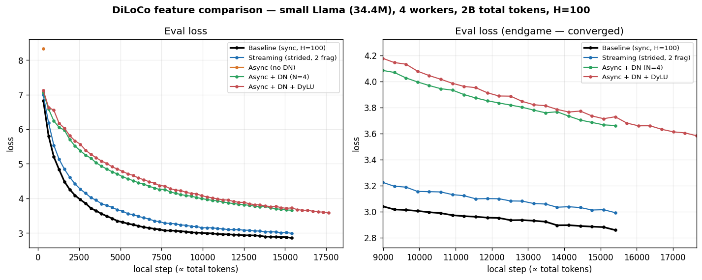
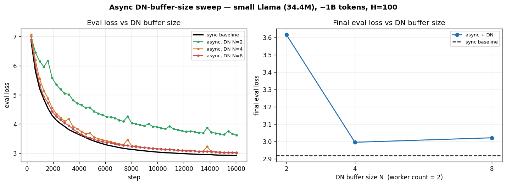
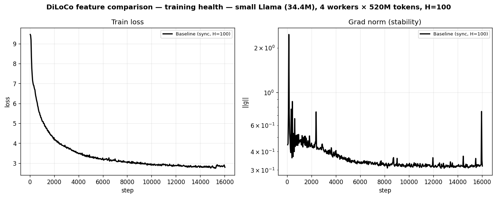
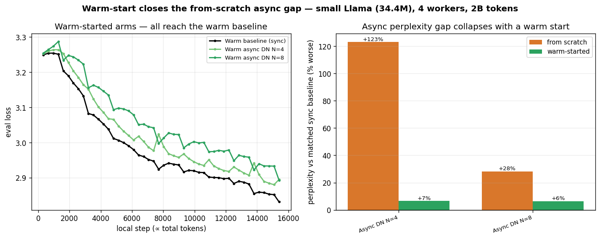
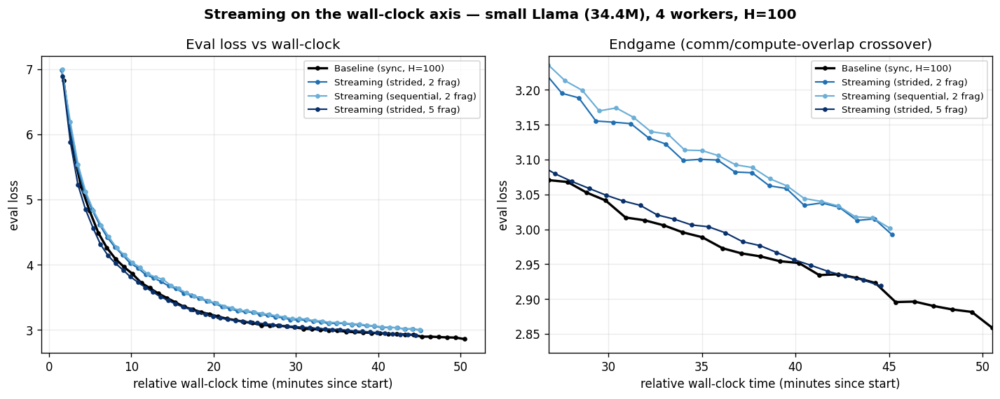
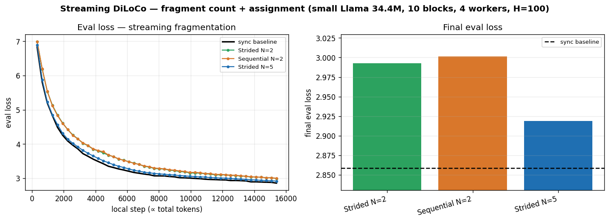
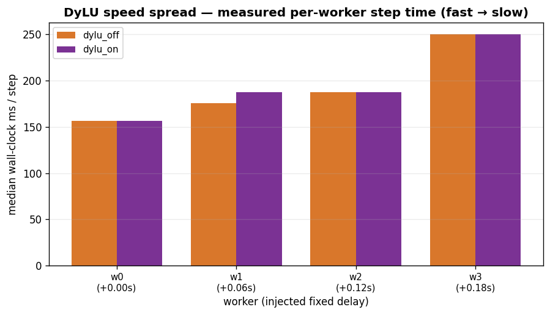
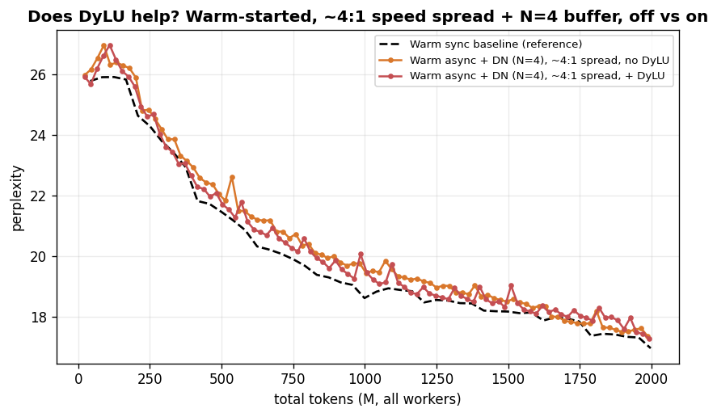

# Validating Async and Streaming DiLoCo at Small Scale

A controlled reproduction study of two communication-efficient extensions to
DiLoCo — **asynchronous local-SGD** (Delayed Nesterov + Dynamic Local Updates +
a server-side grace period; [arXiv:2401.09135](https://arxiv.org/abs/2401.09135))
and **Streaming DiLoCo** (block-boundary fragment sync;
[arXiv:2501.18512](https://arxiv.org/abs/2501.18512)) — measured against
synchronous DiLoCo as the reference, on a single small Llama (34.4M) trained from
scratch on Fineweb-Edu across 4 workers.

> **Status.** The experimental *design* below is final, the harness is built
> ([`experiment.sh`](experiment.sh), [`analysis/`](analysis)), and the run matrix
> has been executed — the **Results** tables and figures are filled: the
> from-scratch matrix (§3.7, including the DN-buffer depth sweep) and the
> warm-start follow-up (§3.7.1). The design was fixed as a pre-registration *before*
> the GPU time was spent: methodology, controls, and the pass/fail gates predate
> the numbers. One run per arm at a single small scale: **suggestive, not a
> benchmark.** Headline: async DiLoCo trails sync from scratch but ≈ sync once
> warm-started (§3.7.1) — the from-scratch *regime*, not async, was the obstacle.

All commands assume you are in this project directory:

```bash
cd examples/tiny_experiments/diloco_features
```

---

## Abstract

DiLoCo cuts inter-worker communication by synchronizing only every `H` local
steps instead of every step. Three further extensions reduce or *restructure*
that communication: **streaming** spreads each sync across the local-training
window as block-boundary fragments instead of one all-at-once burst; **async**
drops the cross-worker barrier (so fast workers never wait on a straggler), made
stable by a **Delayed-Nesterov (DN)** outer-optimizer buffer, optionally tightened
by a **grace period** (a soft barrier that coalesces near-simultaneous
submissions) and **Dynamic Local Updates (DyLU)** (per-worker sync rate matched to
throughput). Each buys something — smoother bandwidth, no straggler waits,
tolerance for uneven hardware — at some cost in convergence. This study measures
those costs at small scale, reproducing the two source papers' qualitative
*convergence* trends under a real worker count and synthetically-induced staleness,
from a random initialization.

**Scope, stated plainly.** On 4 identical 4090s, synchronous DiLoCo is genuinely
fine — there is no straggler tail, no mixed-speed GPU pool, no bandwidth wall. The
hardware is a test rig, not a deployment. Async, grace, and DyLU exist to solve
problems this rig *does not have* (heterogeneous "slow + fast" GPU populations,
large worker counts, constrained WAN links). So this study **validates that the
mechanisms function and reproduce the papers' convergence trends** — it does **not**
demonstrate their real-world *payoff*, which lives on the **wall-clock** axis under
conditions absent here (the async paper's own headline, Fig 2: "matches sync per
update step, **significantly surpasses it in wall-clock time**"). We do not
manufacture synthetic stragglers to fake a benefit we can't measure; that
demonstration is deferred to a two-population (e.g. RTX 4090 + 3090) / WAN setup
(Future Directions). Every arm below is tagged a convergence-trend reproduction or
a mechanism-validation under a synthetic-but-measurable condition.

**Practitioner TL;DR.** What each knob buys, what it costs, and what we measured
(the "Measured here" column is the from-scratch run matrix, §3.7; from a random
init at this small scale — suggestive, single seed):

| Knob | Flag (on `diloco server`) | Buys you | Costs | Measured here |
|---|---|---|---|---|
| **Streaming** | `--num-fragments N` `--fragment-assignment {strided,sequential}` | smooths bandwidth — fragments sent across the compute window, no all-at-once burst | a small, steady convergence cost; strided ≥ sequential, gap grows at finer grain | small per-token gap (+0.06–0.14 eval); **faster wall-clock**; strided N=5 closest + fastest |
| **Async + DN** | `--async --dn-buffer-size N` | drops the barrier — fast workers don't wait on stragglers | needs the DN buffer (required with `--async`); some convergence cost under staleness | from scratch trails sync (depth a non-monotonic lever, **N=8 optimum** +28% ppl vs +123% for N=4); **warm-started ≈ sync** (~+7% ppl), and depth stops mattering (§3.7.1) |
| **Grace period** | `--grace-period S` | a brief, opportunistic wait so a finished worker can coalesce with a near-simultaneous finisher — cuts the slow-worker *tail* in a heterogeneous / large-N pool | only pays off when the tail is real (large N, mixed speeds); its benefit is **wall-clock**, not convergence | **not a study arm** — the rig has no tail to cut; validated functional only, real benefit → Future Directions |
| **DyLU** | `--dylu` | matches each worker's sync rate to its throughput, cutting staleness | only helps heterogeneous / unevenly-loaded workers | **mechanism fires, convergence-neutral**: at a verified 4:1 spread DyLU cuts mean staleness 2.33→1.50 (and ~2× the sync rounds), but eval is unmoved (Δ 0.004); per-token payoff unmeasurable here, real benefit is wall-clock → Future Directions |

These are all **server-authoritative**: you select them with flags on `forgather
diloco server`, and every worker adopts them from the server's `/info`. The same
worker config (`default.yaml`) runs all of them. They are features of the **HTTP
sync backend** — streaming in particular is only implemented there (the
shared-memory and collective backends raise `NotImplementedError` on fragment
sync).

---

## 1. Introduction

DiLoCo (Distributed Low-Communication training) replaces the per-step all-reduce
of data-parallel training with an inner/outer optimization: each worker trains a
local replica with AdamW for `H` steps, then the workers' *pseudo-gradients*
(local drift, `global − local`) are averaged and applied by an outer
SGD-with-Nesterov-momentum step. Communication drops by a factor of `H`. The
sibling [`../diloco`](../diloco) project walks through the mechanism and shows the
headline result at a longer budget — DiLoCo's infrequent sync acts as a
*regularizer* and can match or beat an all-reduce baseline outright.

That baseline is **synchronous**: every worker waits at a barrier each sync round.
Two lines of follow-up work attack the two remaining costs:

1. **The barrier.** On heterogeneous hardware or a busy cluster, a synchronous
   round runs at the speed of the slowest worker. *Asynchronous* local-SGD
   ([arXiv:2401.09135](https://arxiv.org/abs/2401.09135)) drops the barrier:
   each worker submits its pseudo-gradient when ready and immediately pulls the
   latest global weights. The hazard is *staleness* — a submission computed
   against weights that have since moved — which a naive outer step handles
   badly. The paper's fixes are the **Delayed-Nesterov** outer optimizer, a
   **grace period**, and **Dynamic Local Updates**.

2. **The burst.** A synchronous round transfers the whole model at once; the link
   sits idle through the `H`-step window, then is slammed at sync time.
   *Streaming DiLoCo* ([arXiv:2501.18512](https://arxiv.org/abs/2501.18512))
   partitions the model into block-boundary **fragments** and overlaps each
   fragment's transfer with ongoing compute, so the link is used steadily.

Both papers validate at scale and (for async) largely in a *finetuning* regime
warm-started from a pretrained checkpoint. **This study asks the narrower
question:** do the qualitative findings hold at small scale, at a real worker
count, under real staleness, **trained from scratch**? It is deliberately scoped
to *synchronous DiLoCo as the reference* versus *async + streaming*; the
DiLoCo-vs-DDP token-efficiency comparison is out of scope here (covered at larger
scale in [`../../pretrain/small-llm`](../../pretrain/small-llm): 4×DDP vs 4-worker
sync DiLoCo, 150M, ~11× Chinchilla — cross-referenced in §3).

Like the other [Tiny Experiments](..), this does double duty: every arm drives
the full orchestrated path (scheduler → param server → workers), so the same
matrix that *measures* what each knob costs also serves as an end-to-end exercise
of it.

---

## 2. Background

### 2.1 Synchronous DiLoCo

Each of `k` workers holds a replica. For `H` inner steps it trains locally
(AdamW). At the sync round, worker *i* computes its pseudo-gradient `Δᵢ = θ_global
− θ_local,i`; the server averages them, `Δ̄ = (1/k) Σ Δᵢ`, and applies one outer
step with SGD + Nesterov momentum (here outer LR 0.7, momentum 0.9). Workers then
pull the updated `θ_global` and continue. The barrier makes every outer step an
average over *exactly* `k` fresh pseudo-gradients.

### 2.2 Asynchronous local-SGD and the Delayed-Nesterov buffer

Drop the barrier and each pseudo-gradient arrives *alone* and possibly *stale*
(computed against an older `θ_global`). Applying full-LR Nesterov momentum to each
lone submission the instant it arrives is unstable — pseudo-gradients are applied
sequentially rather than aggregated, and under real staleness the run can diverge.

The **Delayed-Nesterov (DN)** outer optimizer (paper Algorithm 3, with `c = 0`)
decouples the momentum update from the per-submission update. Maintaining a
running accumulator `Δ` and a momentum buffer `m`, for each submission `g`:

- apply a small immediate gradient step: `θ ← θ − ε·g/N`, and accumulate `Δ ← Δ + g`;
- every `N`-th submission, fold the accumulator into momentum and apply it:
  `m ← β·m + Δ/N`, `θ ← θ − ε·β·m`, then reset `Δ ← 0`.

`N` is the **DN buffer size**. At `N = 1` this reduces to plain Nesterov; as `N`
grows, each momentum step aggregates more submissions, behaving more like a
synchronous "aggregate, then one step." Crucially the buffer is **O(model)
memory** — a single running `Δ` and `m`, not `N` retained pseudo-gradients — so
its memory cost is independent of `N` (this corrects an earlier implementation
that retained an `N`-deep list; the faithful Algorithm-3 form holds only the
accumulator). With the memory penalty removed, the expectation under real
staleness at `N = k` is **async + DN ≈ sync**, not the "N must be several×
workers" behavior an O(N·model) list-based buffer exhibited.

### 2.3 Grace period (soft barrier)

A pure async server applies one outer step per submission. The **grace period**
is a wall-clock soft barrier: when a submission arrives, the server waits up to
`S` seconds and *coalesces* any other submissions that land in the window into a
**single** outer step (one DN tick over their average). The window is anchored to
the *first* arrival. This reduces the number of stale, lonely outer steps without
reintroducing a hard barrier — provided `S` is tuned so it coalesces a *few* near-
simultaneous stragglers (2–3 of `k`), **not** all `k` every round (which would be
synchronous DiLoCo in disguise — see the methodology in §3.3).

### 2.4 Dynamic Local Updates (DyLU)

Under heterogeneous worker speeds, a fast worker completes many more `H`-step
cycles than a slow one between the slow worker's submissions, so the slow worker's
pseudo-gradient is very stale. **DyLU** sets each worker's `sync_every` inversely
to its measured throughput, so all workers return pseudo-gradients at roughly the
same wall-clock cadence — reducing staleness at the source instead of buffering it
away. It only helps when worker speeds genuinely differ; on identical workers it
has nothing to adapt.

### 2.5 Streaming fragments

Streaming partitions the model into `N` fragments **at transformer-block
boundaries** (derived from the model's `_no_split_modules`, so a fragment is a
whole number of blocks — never a split inside attention/MLP) and syncs one
fragment per portion of the window, overlapping transfer with compute. Blocks are
assigned to fragments either **strided** (round-robin: fragment *f* gets blocks
*f, f+N, f+2N, …*) or **sequentially** (contiguous slabs). The paper reports
strided slightly better, with the gap growing at finer grain / smaller fragments.
Our 34.4M model has **10 transformer blocks**, giving faithful (block-divisible)
fragment counts `N ∈ {2, 5}` (5 blocks/fragment and 2 blocks/fragment
respectively); embeddings attach to the first fragment and the LM head to the
last.

### 2.6 Why from scratch

The source papers mostly study a *finetuning* regime warm-started from a
pretrained checkpoint, and the async paper inherits the original DiLoCo's caution
of pretraining ~24K steps before the local-SGD phase. We train **everything from a
random initialization**, for three reasons:

1. **The original DiLoCo sweep favors it.** DiLoCo swept the pretrain budget
   `{0, 12K, 24K, 48K}` steps and found performance grew *monotonically worse*
   with more pretraining — `0` (from scratch) was best, and "from scratch" not
   only matched but led the other curves.
2. **The 24K figure is inherited caution, not optimization.** Post-local-SGD
   (PyTorch) defaults to a 500-step warmup; the async paper's 24K is in that
   lineage. At 150M with seq 256 / batch 512 it is ~1× Chinchilla — not the
   4×/12.5-billion-token checkpoint a seq-1024 reading would imply.
3. **From scratch *is* the test.** Plain local-SGD is known to struggle from a
   cold start; DiLoCo does not. Whether async preserves that random-init
   robustness is itself a small contribution — and the cleaner, more reproducible
   protocol.

**Pre-registration (regime confound).** For *streaming* the from-scratch choice is
clean — the Streaming paper is itself from-scratch, Chinchilla-optimal. For *async*
it is a genuine hazard: the async paper's tiny ≈sync gaps are measured *late in
finetuning from a 24K-step checkpoint*, where pseudo-gradients are small and
well-aligned. From scratch, early pseudo-gradients are large and poorly-aligned —
exactly where sequentially-applied stale gradients do the most damage. So a
from-scratch async **≈sync *failure* on the DN arm is INCONCLUSIVE** (a regime
confound), **not** a refutation of DN. We pre-register that reading now, and a
reactive fallback: if the from-scratch async headline shows a surprising gap, add a
warm-start diagnostic for the DN arm and report it (a dedicated async warm-start /
pretrain-budget sweep is in Future Directions).

---

## 3. Experiments

### 3.1 Fixed setup (all arms, from scratch)

Every arm uses **4 workers** (= 4 GPUs/run, so arms run **serially** on one param
server, `:8512`), from a fresh master copy (pristine for the from-scratch arms, the
500M checkpoint for the warm set) and a fixed seed; only the server flags (+ the
async jitter / DyLU spread worker env) differ. Training stops
on the server's **`--token-budget`** for every arm (not a per-worker `--max-steps`),
so all arms train to equal total tokens — the basis of the total-tokens axis. The
heartbeat-driven one-shot stop may slightly overshoot, so analysis aligns the axis
to the **actual** harvested `total_tokens`.

**Hyperparameters, and why these values** (every number has a reason; cross-check
against [`experiment.sh`](experiment.sh)):

| Quantity | Value | Why this value |
|---|---|---|
| Model | small Llama, **34.4M** (26.2M non-embedding), **10 blocks** | small enough for a 4-GPU study; 10 blocks ⇒ block-divisible fragment counts `N ∈ {2,5}`. Chinchilla-optimal ≈ **525M tokens** (20 × 26.2M non-embedding; reported by `forgather -t small.yaml model construct`) |
| Workers `k` | **4** | the async paper's main worker count (`k = 4`); enough to produce staleness ≈ `k−1` ≈ 3 |
| Sync interval `H` | **100** | matches the sibling [`../diloco`](../diloco) project's `h100` reference; DiLoCo's regime (sync every ~100 local steps) |
| Outer optimizer | SGD-Nesterov, **LR 0.7, mom 0.9** | DiLoCo's outer-optimizer settings (the `diloco server` defaults) |
| Inner optimizer | AdamW, **lr 2.07e-4** (peak) | per-worker local optimizer. The lr is `base_lr` 1.5e-4 scaled for the 32,768-tok batch by the **sqrt rule** (`lr_alpha 0.5`, ref batch 16,384) → 2.07e-4; **WSD** schedule (warmup **1606** steps, `min_lr` 2.07e-5) |
| Batch × seq | **8 × 4096** = 32,768 tok/step/worker | `per_device_train_batch_size = 8` (set in `small.yaml`), packed 4096-token sequences; note this is **2× the 16,384-token LR reference**, which is what upscales the inner lr by √2 (next row) |
| Token budget | **2B total** | **~4× Chinchilla** (the model's Chinchilla-optimal is 525M tokens, from its 26.2M non-embedding params) — chosen to capture async's **longer-term dynamics** (DiLoCo-family benefits emerge over a longer budget), which the measured runtime makes affordable. At 4 workers ≈ 500M tok/worker ≈ 150 sync rounds |
| DN buffer `N` | **4** (= `k`) | the async paper's main config; tests the derived `N = k ≈ sync` prediction (§2.2) |
| Fragments `N` | **{2, 5}** | the only block-divisible counts ≤ 10 blocks (5 / 2 layers per fragment); N=5 is the fine grain where striding should show |
| Seed | **42** | fixed; one run/arm; varies data-order/dropout, not init (§3.5) |
| Jitter `J` | **0.15 s** | tuned so the *measured* staleness lands ≈ `k−1` — the staleness **gate** (§3.3) is the check, not the exact value |
| DyLU spread | **0 / .24 / .40 / .56 s** | a **verified ~4:1** slowest/fastest step-time ratio (RTX 4090 + 3090-style; §3.7.3). Delays land ~`(delay − 0.09s)` of wall-clock (the per-step CPU sleep partially overlaps async GPU compute), chosen to land ~1×/2×/3×/4×. (An earlier ~1.6× spread was too mild to exercise DyLU — re-run at 4:1.) DyLU arms run warm-only |
| Transport | gRPC + safetensors | the fast/safe path; lossless (already validated against HTTP+pickle in the sibling project — not re-tested here) |
| `torch.compile` | on | real-run default (`--compile no` is smoke-only) |

### 3.2 The primary axis: total tokens = "Total Local Updates"

The async paper plots convergence against **Total Local Updates** — local
optimizer steps, which (at fixed batch/sequence) are directly proportional to
tokens consumed. The token-budget global stop trains every arm to equal total
tokens, so **eval loss vs total tokens** is the faithful primary axis. The
outer/global-step count appears only as an optional secondary diagnostic (how much
each arm coalesces), never as a competing axis.

### 3.3 Methodology: inducing staleness vs inducing heterogeneity

The GPUs here are identical, so we synthesize the two conditions async and DyLU
respectively target, using debug-only per-step worker throttles (delivered via
`submit --env`; see Appendix B):

- **Phase jitter** (`DILOCO_DEBUG_STEP_JITTER`, the *same* value on every worker,
  seeded *per worker* so they differ): a random `uniform(0, J)` s sleep per step.
  The randomness decorrelates the workers' phase so they drift out of lock-step
  and the server sees genuine **staleness ≈ k − 1**, while every worker keeps the
  same *average* speed — so there is no slow-worker solo tail confounding the
  result. This is how the async staleness arms (5–6) are run (`J = 0.15`). It
  *measures async's impact*; it is not a faithful real deployment (which would also
  have real device-timing variance).

- **Speed spread** (`DILOCO_DEBUG_STEP_DELAY`, a *fixed* per-worker delay): creates
  genuine *average-speed* differences. The (warm-only) DyLU arms use a spread
  calibrated from the measured base step time to a **verified ~4:1** slowest/fastest
  ratio — a realistic mixed-GPU cluster (e.g. RTX 4090 + RTX 3090), which is DyLU's
  real target (§3.7.3 verifies the ratio from the run data). (Jitter, equal average
  speed, would give DyLU nothing to adapt to.) This spread is *synthetic* — it
  validates DyLU's mechanism, it is not the real heterogeneity payoff (that's
  Future Directions).

**Staleness is a pass/fail gate.** The async conclusions *depend on* the workers
actually running out of lock-step, so we verify it from the captured `/status`
snapshot (`server sync_round − worker.last_sync_server_round`,
[`analysis/staleness.py`](analysis/staleness.py)) — with a round-robin subtlety
worth stating precisely. For `k` **equal-average-speed** workers (the jitter arms),
at any instant the workers occupy staleness `{0, 1, …, k−1}`, one per phase of the
`k`-step sync cycle. So the **snapshot mean is `(k−1)/2`** (= 1.5 at k=4) — the
signature of *full* decorrelation (a synchronized run collapses it toward 0) —
while the async paper's "staleness ≈ `k−1`" is the **per-submission** staleness, i.e.
how stale a gradient is *when applied*, which is the **max** of the cycle (= 3 at
k=4). We therefore gate the jitter arms (`async_nodn`, `async_dn4`) on **snapshot
mean ≈ (k−1)/2** *before* the headline tier and report the per-submission **max ≈
k−1**. (More jitter can't raise the snapshot mean above `(k−1)/2` at equal average
speed — the workers stay round-robin — so a *low* mean means weak jitter, not a low
cap.) The DyLU arms use a *delay spread* (not jitter), so they're **not**
round-robin; `warm_dylu_off` isn't gated at a fixed value — it's the control, and
the reducer `warm_dylu_on` succeeds by landing at **lower** mean staleness than
`warm_dylu_off` (it does: 1.50 vs 2.33 — §3.7.3).

**Grace is validated, not measured.** Grace is **not a study arm** (see §3.5 and
the scope note in the Abstract) — its payoff is wall-clock tail-reduction in a
heterogeneous / large-N pool, which 4×4090 doesn't have and loopback can't measure.
The `validate` run includes a short async+grace probe, and
[`analysis/grace_batches.py`](analysis/grace_batches.py) confirms the **mechanism
works to the paper's spec** — it *coalesces* near-simultaneous finishers (a
grace-batch histogram with mass at 2+) **and** *proceeds immediately* when none
arrive within `S` (mass at 1). That is the whole grace check here; the real
demonstration is Future Directions.

### 3.4 Run matrix (8 from-scratch arms + a warm-start set, single run each)

**Every arm shares one reference command** — a 4-worker sync DiLoCo run to the
token budget — and differs *only* in the `diloco server` flags (and, for the async
arms, a worker `--env` throttle). The reference:

```bash
# Server (one per arm), started fresh from a pristine master copy:
forgather diloco server -o <fresh master> -n 4 --save-every 0 \
    --grpc --wire-format safetensors --sync-every 100 --token-budget 1B \
    --run-name <arm>  [+ the arm's server flag(s)]

# 4 workers against it (the same default.yaml worker, max_steps=-1 so the
# server's budget is the sole stop):
forgather -t default.yaml submit --diloco --diloco-server 127.0.0.1:8512 \
    --diloco-worker-count 4 --seed 42  [+ the arm's --env, for async/DyLU]
```

The matrix is the deltas on that base. Each arm is tagged **[trend]** (a measurable
convergence-trend reproduction) or **[mech]** (a mechanism-validation under a
synthetic-but-measurable condition).

| # | Arm | Kind | `diloco server` delta | worker `--env` | Tests |
|---|---|---|---|---|---|
| 1 | `baseline` | — | *(none — the reference)* | — | reference |
| 2 | `stream_str2` | trend | `--num-fragments 2 --fragment-assignment strided` | — | streaming, coarse |
| 3 | `stream_seq2` | trend | `--num-fragments 2 --fragment-assignment sequential` | — | assignment A/B vs #2 |
| 4 | `stream_str5` | trend | `--num-fragments 5 --fragment-assignment strided` | — | finer grain (strided edge) |
| 5 | `async_nodn` | trend | `--async` | jitter 0.15 | no-DN control (expect divergence) |
| 6 | `async_dn4` | trend | `--async --dn-buffer-size 4` | jitter 0.15 | async + DN, paper default N=k=4 |
| 7 | `async_dn8` | trend | `--async --dn-buffer-size 8` | jitter 0.15 | **DN-depth sweep** (optimum) |
| 8 | `async_dn16` | trend | `--async --dn-buffer-size 16` | jitter 0.15 | DN-depth sweep (over-buffered) |

Async arms (5–8) all run to the token budget and use **jitter** (equal average
speed, staleness ≈ 3, no speed-spread confound). Arms 6–8 form a **DN-buffer depth
sweep** at fixed staleness (N ∈ {4, 8, 16}), isolating buffer depth from every other
knob — the paper's main config is N = k = 4, and the sweep tests whether that
default is well-tuned for the from-scratch + staleness regime (§3.7.1: it is not —
N=8 is the empirical optimum).

**Warm-start set** (run from a 500M-token 4×DDP checkpoint, not random init; §3.7.1):
a warm sync `warm_baseline` and the warm async arms `warm_async_dn4` / `warm_async_dn8`
(same flags as 6–7), plus the **DyLU A/B** `warm_dylu_off` / `warm_dylu_on` under a
**verified ~4:1 speed spread** (`--env DILOCO_DEBUG_STEP_DELAY` per worker, dn-buffer
4, `dylu_on` adds `--dylu --dylu-base-sync-every 100`). DyLU is run **warm-only** —
the scratch-vs-warm story is settled by the async arms, and DyLU needs uneven
*speeds* (the spread) rather than the equal-speed jitter the async arms use.

**Deliberately not in the matrix** (kept the study focused on the two papers'
communication mechanisms): grace (validate-only — §3.5); a 2-vs-4-worker
token-efficiency scaling arm (DiLoCo's own batch-scaling penalty is covered in the
sibling [`../diloco`](../diloco) / [`../../pretrain/small-llm`](../../pretrain/small-llm)
projects, not here); and a wire/transport lossless check (gRPC+safetensors was
already validated against HTTP+pickle in the sibling project — it was never an
experiment, just a transport-correctness validation).

### 3.5 Metrics, controls, statistics

- **Metrics.** Eval loss and **perplexity** = `exp(loss)`; eval loss vs total
  tokens (primary). Per-arm mean **staleness** (the gate; reducer semantics per
  §3.3). Throughput / wall-clock from the server JSONL. (Grace's batch histogram is
  a `validate`-only mechanism check, §3.3 — not a study metric.)
- **Controls (each isolates one knob, everything else fixed).** DN on/off (5 vs 6);
  DyLU off/on (warm A/B, same ~4:1 spread + N=4); streaming assignment (2 vs 3); grain
  (2 vs 4).
- **Statistics.** **One run per arm, no multi-seed.** Re-running is a poor use of
  GPU time: seed noise is typically small and the effects we want are larger than
  it. An effect visible only by averaging seeds is, by construction, a *small-effect
  finding* (flag and understand it), not a re-run trigger; a large effect won't
  change with more seeds. Reported framing throughout: **"suggestive at small
  scale."**

### 3.6 What this can and cannot validate

**Can** (relative *convergence* trends, single small scale): *whether* async + DN
reaches sync at N = k *per token*, and how it moves with buffer depth (with the
regime caveat in §2.6 — a from-scratch *failure* is inconclusive); streaming's
small steady cost and strided ≥ sequential; *whether* DyLU reduces staleness under
a synthetic spread (A/B, mechanism-validation); and, suggestively, whether a
from-scratch async≈sync result would extend DiLoCo's random-init robustness to
async. (Answers: §3.7.)

**Cannot** (stated plainly): **any wall-clock / scheduling *benefit*** — grace's
tail-reduction, async's no-barrier win, streaming's peak-smoothing — because the rig
is homogeneous and loopback (the async paper's win is *per wall-clock*, Fig 2; we
can only show the convergence *tie*, not the wall-clock win); the fp4 / "400× bits"
claim (no fp4 codec; wire dtypes fp32/bf16 only); exact peak-bandwidth absolute
numbers (structural ~1/N argument only); the papers' finetuning regime (we train
from scratch, §2.6); deterministic device-trace heterogeneity levels (synthetic
jitter/delay model); and large scale. These benefits are Future Directions.

### 3.7 Results

The matrix spans **three orthogonal axes**, each its own comparison against its own
reference — *not* a single ranking, and deliberately not one combined table:

- **Streaming** restructures *synchronous* DiLoCo's communication (it keeps the
  barrier) — a different question from dropping it, so it is not comparable to the
  async arms.
- **Async + DN** drops the barrier under **equal-speed** workers with injected
  staleness — comparable to the equal-speed sync baseline.
- **DyLU** runs under **unequal** worker speeds (a verified ~4:1 spread, §3.7.3),
  warm-started; not comparable to the equal-speed arms — an A/B between DyLU *off*
  and *on* at the same spread.

Each is reported in its own subsection below; the warm-start runs are folded in
alongside their from-scratch counterparts (async in §3.7.1, DyLU in §3.7.3) rather
than split off into a separate section.
Single run per arm (4 workers, 2B tokens, H=100, from scratch); eval loss is the
final eval, perplexity the best eval perplexity. The harvest + plot scripts
regenerate every table and figure from `assets/curves.csv`
([`analysis/harvest.py`](analysis/harvest.py)).

#### 3.7.1 Async + the Delayed-Nesterov buffer

Equal-speed workers with injected per-step jitter (staleness ≈ 3); the sync
baseline is the reference (same equal-speed condition). "vs sync" is the final-eval
delta.

| Configuration | eval loss | perplexity | ppl vs sync | mean staleness | notes |
|---|---|---|---|---|---|
| Sync DiLoCo (baseline) | 2.859 | 17.4 | — | — | reference |
| Async without DN | 8.323 | 4118 | diverged | 3.0 | diverged (control) |
| Async + DN (N=4) | 3.661 | 38.9 | +123% | 1.5 | paper default (N=k) |
| Async + DN (N=8) | **3.107** | **22.4** | **+28%** | 1.5 | **DN-sweep optimum** |
| Async + DN (N=16) | 3.373 | 29.2 | +67% | 1.3 | over-buffered |



*Async + DN eval-loss comparison (full + converged endgame zoom) —
[`analysis/plot_experiment.py`](analysis/plot_experiment.py).*

**The DN buffer stabilizes async, and its depth is a real, non-monotonic lever.**
Without the Delayed-Nesterov buffer, async with induced staleness ~3 diverges (eval
8.32, the run trips the divergence detector ~3% in) — the control that motivates
DN. With DN the run is stable, but depth matters more than the paper's `N = k`
default suggests: sweeping N ∈ {4, 8, 16} (figure below) is **non-monotonic**, with
**N=8 the optimum** — it roughly halves the from-scratch perplexity gap to the
baseline (**+28%** worse ppl vs N=4's **+123%**), while N=16 *regresses* (+67%). The
sweet spot sits near ~2× the mean staleness: too shallow under-absorbs stale
pseudo-gradients, too deep
over-delays the Nesterov momentum. The paper's `N = k = 4` is thus *under*-buffered
for the from-scratch + staleness regime, but "deeper is always better" is false.
(Single seed; the N=8 < N=16 ordering carries a noise caveat, but the N=4 → N=8
improvement is large.)



*DN-buffer depth sweep — non-monotonic optimum at N=8
([`analysis/dn_sweep.py`](analysis/dn_sweep.py)).*

**Async from scratch does not reach the sync baseline.** Even the best async arm
(N=8, +28% perplexity) trails the baseline. This is consistent with the from-scratch premise
being the hard part for async specifically (§2.6): sync DiLoCo reaches the baseline
from scratch, but async — even DN-stabilized and depth-tuned — does not, in this
budget. Whether that is *async* or the *from-scratch regime* is tested with a warm
start just below.



*Training health (async arms) — train loss + grad norm; the no-DN control's
grad-norm blow-up is the divergence ([`analysis/plot_experiment.py`](analysis/plot_experiment.py)).*

**Warm-started: the from-scratch gap closes.** To separate *async* from the
*from-scratch regime* (§2.6), we pretrained the **same architecture** with plain
4×DDP to ~500M tokens (≈1× Chinchilla,
[`templates/configs/warm_pretrain.yaml`](templates/configs/warm_pretrain.yaml)),
then re-ran the async arms **and a warm sync baseline** from that checkpoint (2B
further tokens; the checkpoint is assembled into a server master by
[`make_warm_master.py`](make_warm_master.py) and selected via `experiment.sh`'s
`WARM_MASTER` knob). **The two regimes' raw losses are not directly comparable** —
the warm group trained ~500M tokens *more* (the checkpoint) than the scratch group.
The fair, log-aware metric is **relative perplexity vs each group's own sync
baseline** — "how much worse than the matched baseline" — which normalizes out the
different starting points (and perplexity is the DiLoCo paper's reporting unit):

| Arm | warm eval loss | warm perplexity | warm: % worse ppl vs base | from scratch: % worse ppl vs base |
|---|---|---|---|---|
| Sync baseline | 2.831 | 17.0 | — | — |
| Async + DN (N=4) | 2.895 | 18.1 | **+6.6%** | +123% |
| Async + DN (N=8) | 2.893 | 18.0 | **+6.4%** | +28% |



*Warm-started arms on their own scale (left); the perplexity gap to each group's
own baseline, scratch vs warm (right, % worse — the comparable cross-regime metric)
— [`analysis/warm_compare.py`](analysis/warm_compare.py).*

Warm-started, every async arm is within **~+7% perplexity** of the warm sync
baseline — versus **+123%** (N=4) and **+28%** (N=8) from scratch. So **async DiLoCo
≈ sync once warm-started**: the large from-scratch gap was the *regime*, not async
itself — exactly the pre-registered §2.6 reading, and why the source papers
warm-start their async runs. And the DN-buffer depth that was a strong lever from
scratch (N=4's +123% vs N=8's +28%) **collapses** warm — warm dn4 (+6.6%) and dn8
(+6.4%) are within 0.2 points. A warm start means small, well-aligned
pseudo-gradients, so sequentially-applied staleness does little damage and the
buffer that absorbs it is barely needed. (Single seed, ~1× Chinchilla of
pretraining; a pretrain-budget sweep — *how warm is warm enough?* — is the natural
follow-up, §6.)

#### 3.7.2 Streaming (orthogonal axis: synchronous DiLoCo, fragmented comm)

Streaming is **not** an async arm — it keeps the synchronous barrier and instead
splits each sync into block-boundary fragments sent across the compute window. It
is a separate axis, compared to the sync baseline on its own terms (equal speed, no
jitter); it does not belong in the async table above.

| Configuration | eval loss | perplexity | ppl vs sync | wall-clock | notes |
|---|---|---|---|---|---|
| Sync DiLoCo (baseline) | 2.859 | 17.4 | — | 50.5 min | reference |
| Streaming (strided N=2) | 2.992 | 19.9 | +14% | 45.1 min | |
| Streaming (sequential N=2) | 3.001 | 20.1 | +15% | 45.1 min | assignment A/B |
| Streaming (strided N=5) | 2.919 | 18.5 | +6% | 44.5 min | finer grain |

**Streaming trades per-token quality for wall-clock — and at fine grain nearly
erases the trade.** All streaming arms are slightly worse *per token* (+6% to +15%
perplexity), as expected: fragment-wise outer steps update each parameter against a
slightly staler global view. But they all finish *faster in wall-clock* (44.5–45.1
min vs 50.5) because the per-fragment barriers overlap communication with compute.
On the fair loss-vs-wall-clock axis (figure below) the finest grain, strided N=5,
lands closest per token (+6% ppl) *and* finishes first — it essentially matches the
baseline's loss trajectory in real time. The strided-vs-sequential assignment A/B
is a wash at N=2 (~1% ppl in favor of strided), so fragment *grain* matters more
than assignment here.



*Streaming eval loss vs relative wall-clock — the fair axis for the comm/compute
overlap ([`analysis/plot_walltime.py`](analysis/plot_walltime.py)).*



*Streaming fragment count + assignment (strided vs sequential), per token —
[`analysis/streaming.py`](analysis/streaming.py).*

#### 3.7.3 DyLU (A/B under a ~4:1 worker-speed spread)

The DyLU arms run under an injected per-worker speed spread (a 4090+3090-style mix),
so they are **not** comparable to the equal-speed baseline or the jitter async
arms — this is a controlled A/B between DyLU **off** and **on** at the *same*
spread. They are run **warm-only** (from the §3.7.1 500M checkpoint): the
scratch-vs-warm story is already established by the async arms, DyLU is no
exception, and dropping the from-scratch DyLU pair halves the runs. The async arms
above also use equal-speed jitter (staleness without a speed confound); DyLU needs
genuinely uneven *speeds*, which only this spread provides.

**The speed spread, verified.** We confirm the workers actually ran at different
speeds before trusting the A/B. The median wall-clock time per step
([`analysis/worker_speeds.py`](analysis/worker_speeds.py)) recovers the injected
order exactly — step time rises monotonically with the fixed delay
`DILOCO_DEBUG_STEP_DELAY` ∈ {0, .24, .40, .56}s, giving a clean **4.0×**
slowest/fastest ratio (the fastest worker completes ~3.8× more steps than the
slowest). The same spread is present in both arms (DyLU changes sync *cadence*, not
compute speed), so the A/B is on equal footing.

| Worker (injected delay) | median ms/step | steps/s | steps (off arm) |
|---|---|---|---|
| w0 (+0.00 s) | 156 | 6.40 | 28,768 |
| w1 (+0.24 s) | 312 | 3.20 | 15,264 |
| w2 (+0.40 s) | 469 | 2.13 | 10,112 |
| w3 (+0.56 s) | 625 | 1.60 | 7,552 |



*Measured per-worker step time — a clean 4.0× spread, consistent across the off/on
A/B ([`analysis/worker_speeds.py`](analysis/worker_speeds.py)).* (Calibration note:
the per-step CPU `sleep` partially overlaps async GPU compute — landed wall-clock ≈
`delay − 0.09 s` on a 0.156 s base step — so the delays 0/.24/.40/.56 were chosen to
land ~1×/2×/3×/4×. An earlier ~1.6× spread was too mild to exercise DyLU; this is
the re-run at 4:1.)

| Configuration | eval loss | perplexity | % worse ppl vs warm base | mean staleness | sync rounds |
|---|---|---|---|---|---|
| Warm async + DN, ~4:1 spread, DyLU off | 2.855 | 17.4 | +2.4% | 2.33 | 615 |
| Warm async + DN, ~4:1 spread, DyLU on | 2.851 | 17.3 | +2.0% | **1.50** | **1220** |



*DyLU off vs on at a ~4:1 spread, warm-started (A/B) —
[`analysis/dylu_control.py`](analysis/dylu_control.py).*

**The mechanism fires, but the convergence payoff is unmeasurable here.** At a real
4:1 spread DyLU does exactly what it is designed to: it **cuts mean staleness from
2.33 to 1.50** and roughly **doubles the sync rounds** (1220 vs 615) — the adaptive
per-worker `sync_every` raising the fast workers' sync rate to stay aligned with the
stragglers. (This is a cleaner signal than the discarded ~1.6× run, where the
spread was too mild and the snapshot staleness was noise.) **Yet the loss is
unmoved**: dylu_on and dylu_off land at +2.0% and +2.4% perplexity vs the warm
baseline — a 0.4-point difference (0.004 eval), within seed noise — and both reach
the warm baseline. The DN buffer already absorbs the staleness well
enough that reducing it further does not change per-token convergence — consistent
with the design's caveat (§3.5–3.6) that DyLU's payoff is wall-clock tail reduction
under genuine large-scale heterogeneity (off-rig), not a per-token win. The cost it
*does* show here is throughput: the spread drags aggregate tok/s to ~0.42M (vs
~0.71M equal-speed), the straggler tax DyLU and grace exist to recover on the
wall-clock axis.

(One more figure, `grace_hist.png`, is **`validate`-only** — the grace coalescing
histogram, a mechanism check, not a results figure:
[`analysis/grace_batches.py`](analysis/grace_batches.py).)

---

## 4. Related Work

**DiLoCo** (Douillard et al., 2023) introduced the inner-AdamW / outer-SGD-Nesterov
split with periodic pseudo-gradient averaging; the sibling [`../diloco`](../diloco)
project reproduces its regularization-at-longer-budget result. **Asynchronous
Local-SGD** (Liu et al., 2024;
[arXiv:2401.09135](https://arxiv.org/abs/2401.09135)) identifies staleness as the
core obstacle to dropping the barrier and contributes the Delayed-Nesterov outer
optimizer, DyLU, and the grace period. We evaluate DN (arms 5–8) and DyLU (a
warm-only off/on A/B under a ~4:1 speed spread, §3.7.3); the grace period — an
Algorithm-2 input the paper never ablates, whose payoff
is wall-clock tail-reduction — is validated functional only and deferred (§3.5).
**Streaming DiLoCo** (Douillard et al., 2025;
[arXiv:2501.18512](https://arxiv.org/abs/2501.18512)) overlaps fragment
communication with compute and additionally quantizes the wire transfer (fp4/E3M0);
we evaluate the fragmentation (arms 2–4) but not the quantization codec. The
DiLoCo-vs-DDP token-efficiency question — orthogonal to the communication-schedule
knobs studied here — is covered at larger scale in
[`../../pretrain/small-llm`](../../pretrain/small-llm).

---

## 5. Conclusions

**Scope boundary (restated):** these are *convergence*
conclusions on a homogeneous test rig — they validate that the mechanisms function
and reproduce the papers' per-token trends; the wall-clock *benefits* (grace's tail,
async's no-barrier, streaming's peak-smoothing) are out of reach here and are
Future Directions. The study is structured to support (or refute) a small set of
pre-registered hypotheses, each with a fixed control:

1. **Async + DN matches sync at N = k = 4** *per token* under induced staleness
   (arm 6 vs 1), with the no-DN control (arm 5) diverging.
   *Result: partially refuted.* The no-DN control diverges as predicted (DN is
   necessary), but the Algorithm-3 N = k = 4 form is **not** sufficient from
   scratch — it trails sync by +123% perplexity. Buffer depth turned out to be a
   non-monotonic lever (the §3.4 sweep): **N=8 is the optimum** (+28%, ~half the
   gap closed), N=16 regresses (+67%). Per the §2.6 regime caveat, the from-scratch
   gap is not a refutation of the paper (which warm-starts): **warm-started, N = k =
   4 ≈ sync** (+6.6% ppl) and the depth dependence collapses (§3.7.1) — so the
   paper's default is right *in its own warm regime*, only under-buffered from scratch.
2. **Streaming costs little and strided ≥ sequential**, the assignment gap visible
   at the finer N=5 grain (arms 2–4 vs 1).
   *Result: supported.* Small per-token cost (+6–15% perplexity), strided N=5
   closest (+6%); on the wall-clock axis streaming finishes faster and N=5
   nearly matches the baseline trajectory. The N=2 assignment A/B is a wash
   (~1% ppl), so grain dominates assignment at this scale.
3. **DyLU cuts staleness under a synthetic speed spread** (warm-only off-vs-on A/B,
   §3.7.3) — a mechanism-validation; the real mixed-GPU benefit is future work.
   *Result: mechanism confirmed, convergence-neutral.* At a verified 4:1 spread DyLU
   does cut mean staleness (2.33 → 1.50) and ~doubles the sync rounds — the
   mechanism fires as designed — but eval is unmoved (Δ 0.004, within seed noise):
   the DN buffer already absorbs the staleness, so the per-token payoff is
   unmeasurable here. The benefit it targets is wall-clock (off-rig) → §6.
4. **Suggestively:** a from-scratch async≈sync result would extend DiLoCo's
   random-init robustness to async (the whole study trains from scratch).
   *Result: refuted from scratch, recovered warm.* Async≈sync does **not** hold
   from random init (§3.7); but warm-started from a ~500M-token checkpoint it does
   (§3.7.1) — every warm async arm within ~+7% perplexity of a warm sync baseline
   (vs +123%/+28% from scratch). So async's robustness is regime-dependent: the
   from-scratch phase is the obstacle,
   not async per se, which is exactly why the source papers warm-start.

Any headline result ambiguous within plausible seed noise is reported as a
documented small-effect finding, not re-run.

---

## 6. Future Directions

- **Real WAN, two-population run (headline) — and grace's true home.** The
  synthetic knobs here become real at once on a genuinely distributed, heterogeneous
  cluster: the author has RTX 3090 machines at a separate physical site (the "slow"
  population to the local 4090s' "fast"). Running this matrix over a WAN turns the
  synthetic conditions real simultaneously — real 3090-vs-4090 heterogeneity (DyLU's
  actual target), a real bandwidth-constrained link (streaming's peak-smoothing),
  real device-timing staleness, and a real slow-worker **tail** — and the tail is
  exactly what the **grace period** cuts (a finished worker briefly coalesces with a
  near-simultaneous finisher, else proceeds immediately). On this setup the payoff is
  measurable where it isn't on loopback: **eval loss / perplexity vs wall-clock
  time** (the async paper's Fig-2 axis), where sync pays the tail and async+grace
  do not. This is DiLoCo's actual deployment scenario.
- **DN-buffer sweep, extended.** The N ∈ {4, 8, 16} sweep here (§3.7) found a
  non-monotonic optimum at N=8; open follow-ups are multi-seed confirmation of the
  N=8 < N=16 ordering and the N → ∞ limit (toward synchronous), plus whether the
  optimal N tracks the mean staleness across staleness levels.
- **Async pretrain-budget sweep.** §3.7.1 already answers the from-scratch premise
  (§2.6): a ~500M-token (≈1× Chinchilla) warm start closes the async gap to ~+7%
  perplexity of a warm sync baseline (from +123%/+28% scratch). The open follow-up
  is the *budget* axis —
  how warm is warm enough? Sweep the pretrain budget (e.g. 0 / 100M / 500M / 1B)
  and map where async≈sync emerges. The tooling is in place:
  [`templates/configs/warm_pretrain.yaml`](templates/configs/warm_pretrain.yaml)
  (plain 4×DDP pretrain) + [`make_warm_master.py`](make_warm_master.py) (assemble a
  warm server master) + `experiment.sh`'s `WARM_MASTER` arm set.
- **Heterogeneity-level sweep:** beyond the single ~4:1 spread, map DyLU's benefit
  across spreads.
- **Bandwidth-constrained link simulation:** measure real token throughput / time
  saved (not just the structural ~1/N peak argument) under a throttled link.
- **fp4 / E3M0 streaming codec** and **larger scale.**

---

## 7. References

- Douillard et al., *"DiLoCo: Distributed Low-Communication Training of Language
  Models"* (2023). [arXiv:2311.08105](https://arxiv.org/abs/2311.08105)
- Liu et al., *"Asynchronous Local-SGD Training for Language Modeling"* (2024).
  [arXiv:2401.09135](https://arxiv.org/abs/2401.09135) — async, the
  Delayed-Nesterov buffer, the grace period, and DyLU.
- Douillard et al., *"Streaming DiLoCo with overlapping communication: Towards a
  Distributed Free Lunch"* (2025).
  [arXiv:2501.18512](https://arxiv.org/abs/2501.18512) — fragmented overlapped sync.

The authoritative Forgather reference for the trainer is
[`docs/trainers/diloco.md`](../../../docs/trainers/diloco.md).

---

## Appendix A — Reproducing it

Prerequisites: a running **forgather server** + **dataset server** (the standard
cluster setup the `../diloco` walkthrough establishes), and a **master model** the
param server initialises from, built once:

```bash
forgather -p ../../models/llama -t small.yaml \
    model --device cpu --save-checkpoint --safetensors \
    --output-dir ../../../models/small_llama_features_master \
    construct
```

Then run the matrix through the scheduler — [`experiment.sh`](experiment.sh) starts
each param server with the right flags, submits the workers, waits, captures the
worker + server logs and a live `/status` snapshot under `runs/<arm>/`, and tears
down, copying the master fresh per run (identical init). 4 workers = 4 GPUs/run, so
runs are **serial**:

```bash
./experiment.sh validate          # short plumbing check (each feature FIRES)
./experiment.sh run               # the 8-arm from-scratch matrix (~7-9 h on 4x4090s)
./experiment.sh run async_dn8     # or a single arm by name

# Warm-start set (run from the 500M checkpoint; §3.7.1). The DyLU arms use a ~4:1
# spread — smoke-verify it first (see DYLU_SPREAD in experiment.sh):
WARM_MASTER=models/small_llama_features_warm_master ./experiment.sh run warm_baseline
WARM_MASTER=models/small_llama_features_warm_master ./experiment.sh run warm_dylu_off

python analysis/harvest.py && python analysis/plot_experiment.py  # main comparison
python analysis/staleness.py           # the async staleness gate (should-be-stale vs reducer)
python analysis/streaming.py           # fragment count + assignment (strided vs sequential)
python analysis/dn_sweep.py            # DN-buffer depth sweep (N=4/8/16)
python analysis/warm_compare.py        # warm-start gap collapse (async)
python analysis/worker_speeds.py       # verify the DyLU ~4:1 speed spread from the logs
python analysis/dylu_control.py        # the DyLU off-vs-on eval overlay (warm, ~4:1)
python analysis/grace_batches.py       # VALIDATE-only: grace mechanism check (on v_grace)
```

**Order of execution (do not skip the gates).** `validate` (each feature fires:
fragments engaged with no `NoBlockPlanError` fallback; the token-budget
`save_and_stop` relay; and the **grace mechanism check** on the `v_grace` run —
`grace_batches.py` confirms it coalesces near-simultaneous finishers *and* proceeds
immediately when alone, all-k fraction below the guardrail) → **staleness gate**
(`staleness.py`: should-be-stale arms mean ≈ workers − 1; the reducer
`warm_dylu_on` below its control) → then the headline tier. **No long GPU runs until validate +
the staleness gate pass.** (Grace is validated here only — not a study arm; its
real demonstration is the two-population / WAN future work.)

For a fast smoke (does each feature engage, in minutes rather than hours) without
the convergence study, [`harness.sh`](harness.sh) runs short versions:
`./harness.sh all` or `./harness.sh streaming`.

## Appendix B — Inducing async timing and heterogeneity (debug knobs)

The GPUs here are identical, but the async arms need workers to submit at
*different times* (real staleness) and DyLU needs workers at different *speeds*.
Two debug-only worker env knobs provide this, delivered via `submit --env`:

- **`DILOCO_DEBUG_STEP_JITTER=J`** — sleep a random `uniform(0, J)` s per step, from
  a *per-worker-seeded* RNG. Set the **same** `J` on every worker (the async arms
  use `0.15`): the randomness decorrelates the workers' phase so they drift out of
  lock-step (staleness ~ workers − 1) while keeping the same *average* speed — no
  slow-worker solo tail. This is what makes the async arms actually async.
- **`DILOCO_DEBUG_STEP_DELAY=D`** — a *fixed* per-step delay, set **differently per
  worker** (the DyLU arms use a verified ~4:1 spread — §3.7.3) to create
  the average-speed differences DyLU adapts to.

Both are debug-only — they throttle real training and are never set in production.
`submit --env KEY=VALUE` (repeatable) forwards env to the scheduled worker process
via `job_params.extra_env`; honoured on plain `--diloco` worker submits only (the
`--global` compose and collective paths reject it rather than silently dropping it).
The per-worker RNG seed matters: a *shared* seed would give every worker the
identical jitter sequence — they'd stay phase-locked and the jitter would do
nothing.

## Appendix C — Confirming a feature is active

Each feature is selected at the server, so the worker echoes the settings it
adopted from `/info` once at startup — a quick way to confirm your config took:

```
DiLoCoCallback: using server settings sync_every=100 up=bf16 down=fp32 \
    dylu=False num_fragments=2 transport=grpc(127.0.0.1:NNNNN) wire=safetensors
```

| Feature | Where to see it |
|---|---|
| wire / transport | the `transport=…(…) wire=…` echo matches your flags; server log: `grpc_enabled`, `wire_format`, `gRPC bulk listener on …` |
| streaming | `num_fragments=N` in the echo; the server (`--verbose-sync`) advances per-fragment rounds; **no** `NoBlockPlanError` fallback in the server log (= block-faithful fragmentation engaged) |
| async | server log shows async mode; sync round advances as submissions arrive, so workers can reach **different** rounds |
| DN buffer | the server applies the momentum outer step only every `dn-buffer-size` submissions (visible with `--verbose-sync`) |
| grace | the server logs a grace flush coalescing *k* submissions into one outer step; the `/status` snapshot carries `grace_batch_histogram` |
| token budget | the server relays `save_and_stop` once the aggregated `total_tokens` crosses `--token-budget` |
| DyLU | the server emits a per-worker `recommended_sync_every`; the slow worker logs a `DyLU adjusted sync_every …` line below the fast worker's |

## Appendix D — Files

- `templates/configs/default.yaml` — the single small-Llama DiLoCo worker config
  (extends `projects/small.yaml`, `enable_diloco=True`); every feature is chosen by
  server flags, not here.
- `templates/configs/warm_pretrain.yaml` — plain 4×DDP pretrain of the same arch
  (`enable_diloco=False`) that emits the warm-start checkpoint (§3.7.1).
- `make_warm_master.py` — assemble a trained checkpoint into a warm DiLoCo server
  master (root safetensors); used with `experiment.sh`'s `WARM_MASTER` knob.
- `experiment.sh` — the run-matrix driver (`validate` / `run` / `run <arm>`),
  token-budget global stop, `GRACE_S` env knob, `WARM_MASTER` for the warm arms.
- `harness.sh` — the fast functional smoke driver (incl. a `token-budget` recipe).
- `analysis/` — `harvest.py`, `plot_experiment.py`, `streaming.py`, `dn_sweep.py`,
  `plot_walltime.py`, `warm_compare.py`, `dylu_control.py`, `worker_speeds.py`
  (verify the DyLU speed spread from the data), `staleness.py` (the gate),
  `grace_batches.py` (validate-only), `regen_tb.py` (rebuild per-worker TB from
  captured logs).
- `assets/` — `curves.csv` (the committed source of truth) + the plots
  (`loss_comparison.png`, `training_health.png`, `streaming.png`, `dn_sweep.png`,
  `walltime_comparison.png`, `dylu_control.png`, `worker_speeds.png`,
  `warm_compare.png`); `grace_hist.png`/`grace_hist.csv` are `validate`-only.
- `runs/` — captured per-run logs + `status.json` (gitignored scratch).
