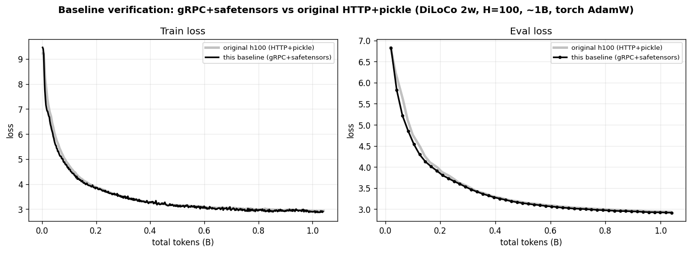
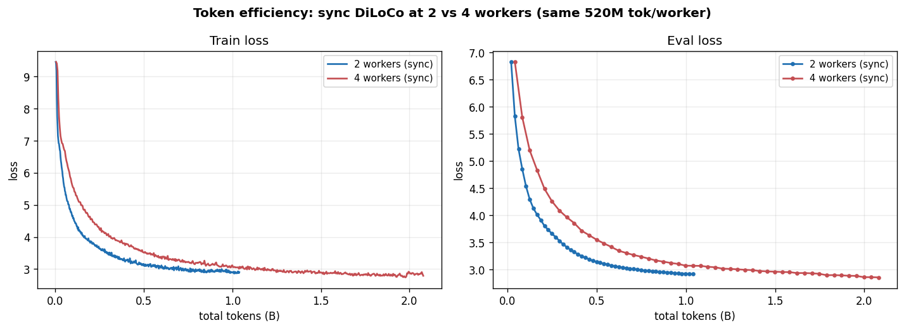

# DiLoCo Features

DiLoCo already cuts communication by syncing only every `H` steps instead of
every step. On top of that it offers several knobs that reduce or *restructure*
communication further — each buying you something (smoother bandwidth use, no
straggler waits, tolerance for uneven hardware) at some cost in convergence.
**This project measures that cost**, on a controlled 4-worker run, so you can
decide which to turn on for your network and cluster.

| Knob | Flag (on `diloco server`) | What it buys you |
|---|---|---|
| **Streaming sync** | `--num-fragments N` | spreads the sync over N fragments sent in the background across the local-training window, instead of transferring the whole model in one burst at sync time — smooths bandwidth use on a slow link |
| **Async** | `--async` | drops the cross-worker barrier — fast workers don't wait on stragglers (requires the DN buffer, and the convergence cost is real — see below) |
| **DN buffer** | `--dn-buffer-size N` | the Delayed-Nesterov buffer that makes async usable — **required** with `--async`. Its *size* is the dial that trades async-responsiveness for convergence; under real staleness N must be **several × the worker count**, not N = workers (see below) |
| **DyLU** | `--dylu` | adapts each worker's sync interval to its own throughput, reducing staleness — for heterogeneous / unevenly-loaded workers |
| **Wire + transport** | `--wire-format`, `--grpc` | how the bulk tensors move (pickle vs safetensors; HTTP vs gRPC) — a speed/safety choice that's **free** (see below) |

These are all server-authoritative: you select them with flags on
`forgather diloco server`, and every worker adopts them from the server's
`/info`. The same worker config (`default.yaml`) runs all of them. They are
features of the **HTTP sync backend** — streaming in particular is only
implemented there (the shared-memory and collective backends raise
`NotImplementedError` on fragment sync).

Like the other [Tiny Experiments](..), this does double duty: every run below
drives the full orchestrated path (scheduler → param server → workers) for one
feature, so the same sweep that *measures* what each knob costs also serves as an
end-to-end exercise of it.

New to DiLoCo here? Start with the sibling [`../diloco`](../diloco) walkthrough
(server / worker / forgather-server roles, the inner/outer optimizer split,
work-unit dispatch); the authoritative reference is
[`docs/trainers/diloco.md`](../../../docs/trainers/diloco.md). All commands below
assume you are in this project directory:

```bash
cd examples/tiny_experiments/diloco_features
```

---

## What each feature buys — and what it costs

Seven configurations, same everything except the feature under test — small Llama
(34.4M) on Fineweb-Edu, **4 workers**, **H = 100**, **520M tokens/worker** (~2B
total), gRPC + safetensors, `torch.compile` on (the config default), identical
pristine init and the same seed/data. Only the one flag varies, so the loss gap
*is* the feature's cost. (Driven through the scheduler by
[`experiment.sh`](experiment.sh); harvested by
[`analysis/harvest.py`](analysis/harvest.py) →
[`assets/curves.csv`](assets/curves.csv) →
[`analysis/plot_experiment.py`](analysis/plot_experiment.py).)

**Async is exercised under *real* staleness.** With identical GPUs, async workers
finish their `H` steps in lock-step and submit near-simultaneously — staleness ≈
1, barely async at all. So the async runs add a small per-step **jitter** (`--env
DILOCO_DEBUG_STEP_JITTER`, the same on every worker, seeded per-worker): the
randomness decorrelates their phase so they drift out of lock-step and the server
sees genuine staleness (~3 = workers − 1), while they keep the same *average*
speed (no slow-worker tail). This *measures async's impact*; it is **not** a
faithful real-deployment async — that would also want real device-timing variance
and the server-side grace period the paper specifies, which Forgather doesn't yet
implement ([issue #221](https://github.com/jdinalt/forgather/issues/221)). DyLU
instead uses a per-worker speed *spread*.

Every run shares the same base — `forgather diloco server -o <master> -n 4 --grpc
--wire-format safetensors`, a fresh master copy, config defaults (`torch.compile`
on, the ~16k-step/worker budget) — and adds:

| Run | `diloco server` flag(s) | worker `--env` |
|---|---|---|
| Sync DiLoCo (baseline) | `--sync-every 100` | — |
| Streaming | `--sync-every 100 --num-fragments 2` | — |
| Async (no DN buffer) | `--sync-every 100 --async` | jitter 0.15 |
| Async + DN (N=4/8/16) | `--sync-every 100 --async --dn-buffer-size N` | jitter 0.15 |
| Async + DN + DyLU | `--async --dylu --dylu-base-sync-every 100 --dn-buffer-size 4` | per-worker delay spread |

| Configuration | eval loss | vs sync | what you buy | the catch |
|---|---|---|---|---|
| **Sync DiLoCo** (baseline) | **2.857** | — | the reference (sync every H steps) | — |
| **+ Streaming** (2 frag) | **2.990** | **+0.13** | spreads the sync over compute — no all-at-once bandwidth burst | a small, steady convergence cost |
| **+ Async + DN** (N=16) | **3.062** | **+0.21** | no barrier — fast workers never wait on a straggler | needs a **large** DN buffer (~4× workers); the cost balloons as it shrinks (below) |
| **+ DyLU** (N=4, uneven HW) | **4.301** | +1.44 † | adapts per-worker sync rate, cutting staleness | for heterogeneous workers; at its small N=4 buffer it still beats plain async (below). † not comparable to the N=16 row |
| Async **without** DN | **~11 ✗** | — | — | **catastrophic** — explodes and aborts in ~20 rounds; never (below) |

> One run per config, one seed — **suggestive, not a benchmark**. The async
> staleness is jitter-induced (~3), a controlled stand-in for real device-timing
> variance. † The DyLU row used a small N=4 buffer *and* a speed spread, so its
> raw "+1.44" isn't comparable to the N=16 async row — compare it to plain
> async+DN at N=4 (below).


**The trade, in one line.** Two of these knobs are cheap and one is not. Base
DiLoCo's traffic is bursty — the link sits idle through the local-training window,
then every worker ships the whole model at once at sync time; harmless on a fat
interconnect, the bottleneck on a slow one. **Streaming** spreads that transfer
across the window so the link is used steadily instead of slammed — **~0.13** eval
loss, genuinely cheap. **Async** drops the barrier so no one waits on a straggler,
but under real staleness that is **not** cheap: the best we got (a large DN
buffer) still cost **+0.21**, and a poorly-sized buffer costs *much* more or
diverges outright (next section). So async is a real trade — worth it only when
straggler waits or barrier latency actually dominate your step time, and only if
you size the buffer generously. (The sibling [`../diloco`](../diloco) project shows
the other half: at a longer budget DiLoCo's infrequent sync becomes a
*regularizer* and can overtake an all-reduce baseline outright.)

### Async needs a DN buffer — and under real staleness it must be large

This is the headline finding, and it's the part with little in the literature for
async DiLoCo at a real worker count. Two things go wrong without enough buffering:

**Without the DN buffer, async is catastrophic.** Each worker's pseudo-gradient is
applied with full-LR Nesterov momentum the instant it arrives, with no
cross-worker averaging. At 4 workers and staleness ~3 the run doesn't merely
stagnate — it **explodes**: eval loss climbs *above* its starting value (~11.5)
and the trainer's divergence detector aborts it after ~20 rounds. (The paper shows
even *homogeneous* async lags sync because pseudo-grads are applied sequentially
rather than aggregated; under real staleness the effect is violent.) Never run
`--async` without `--dn-buffer-size`.

**With the buffer, the *size* is a strong convergence dial — and N = worker count
is nowhere near enough.** The DN buffer accumulates N submissions before firing one
momentum outer step (simple GD in between); the larger N is, the more it behaves
like a synchronous "aggregate, then one step." Sweeping N at 4 workers, staleness
~3 (same budget/seed/jitter, only N varies):

| DN buffer N | eval loss | vs sync |
|---|---|---|
| N=4 (= workers) | 5.135 | **+2.28** |
| N=8 (2× workers) | 3.366 | +0.51 |
| N=16 (4× workers) | 3.062 | **+0.21** |


The relationship is **monotonic and far from saturated**: N = workers is nearly
useless (+2.28 — stable, but it never catches up), and convergence improves
steadily as the buffer grows, approaching sync only as N → ∞ (at which point the
buffer *is* a synchronous round). Even N = 4× workers still leaves a real **+0.21**
residual. This is the async tradeoff in one curve: **a bigger DN buffer recovers
convergence but makes async more sync-like** (each outer step waits on more
submissions). Practical guidance under genuine staleness: size the DN buffer to
**several × the worker count** and treat its convergence cost as the price of the
no-barrier schedule — not the near-free knob a low-staleness (near-synchronous)
test would suggest.

**What a large buffer costs: server memory, not compute.** The buffer lives
entirely on the parameter server (workers are unaffected by N), and it holds **N
full pseudo-gradients** — `server.py` accumulates a `List` of N model-sized
tensors at the upload dtype (bf16) before averaging them into one outer step. So
its memory is **O(N × model size)**: at N=16 for this 34.4M model that's already
~1.1 GB — several × the model itself (131 MB) and its momentum buffer — and on a
multi-billion-parameter model it is N × the gradient footprint, the param
server's dominant cost. Compute, by contrast, is **negligible**: the momentum
step fires only every N submissions, so the averaging is amortized to O(model)
per submission, and throughput was flat across the sweep (760 / 744 / 749 K
tok/s at N = 4 / 8 / 16). So the practical ceiling on "just use a bigger buffer"
is **server RAM**. (Mathematically the buffer only needs a running *sum* +
counter — O(1) memory, as in the paper's Δ accumulator — so this O(N) list is a
straightforward but memory-heavy implementation, [issue #222](https://github.com/jdinalt/forgather/issues/222).)

### DyLU: cut the staleness instead of buffering it away

DyLU attacks the same problem from the other side: instead of buffering stale
gradients, it **reduces the staleness**. It adapts each worker's `sync_every` to
its measured throughput so workers return pseudo-gradients closer together — here,
with a deliberate per-worker speed spread, all four workers re-tuned continuously
(hundreds of `sync_every` adjustments each, e.g. `100 → 35`). At the **same small
N=4 buffer** where plain async lands a dismal 5.14, DyLU reaches **4.30** — a clear
win from staleness reduction alone. But it's only a partial fix: a large buffer
(N=16, 3.06) still beats DyLU-with-a-small-buffer, so on truly heterogeneous
hardware you'd want **both** — DyLU to align the workers *and* a generous DN
buffer. (DyLU is also for uneven hardware specifically; on identical workers it has
nothing to adapt and is a no-op.)

### Wire format and transport are free

The bulk tensors can move as pickle or **safetensors**, over HTTP or **gRPC**.
This is a pure speed/safety choice with **no convergence cost**: safetensors
carries the identical bf16 bytes (no arbitrary-code deserialization), and gRPC is
just a faster pipe. A dedicated **2-worker** sync run on gRPC + safetensors
(matching the sibling `diloco` project's 2-worker `h100` reference, which used the
historical **HTTP + pickle**) overlays it across the entire 1B-token run
([`analysis/verify_baseline.py`](analysis/verify_baseline.py)):



Final eval **2.918 vs 2.936** — a −0.018 gap, on the good side and within the
run-to-run variance these toy runs show elsewhere (e.g. ~0.007 from a torch- vs
Forgather-AdamW swap between the same two references). One run can't *prove*
they're bit-identical, but it rules out any lossy effect — which would raise loss
or diverge, as the no-DN async run does. **Use gRPC + safetensors for the speed
and safety; it costs you nothing in quality.**

### More workers cost token efficiency (like DDP)

Adding workers raises DiLoCo's effective global batch — each sync round averages
pseudo-gradients over more workers — so, as in DDP's large-batch regime, it buys
*less per token*. The synchronous baseline at 2 vs 4 workers (same 520M
tokens/worker, same LR), on a total-tokens axis
([`analysis/worker_scaling.py`](analysis/worker_scaling.py)):



At a **matched** total-token budget (1.04B) the 2-worker run wins — eval **2.918**
vs the 4-worker's **3.071** at that point. The 4-worker run reaches a lower *final*
loss (2.857) only by spending **2×** the tokens, and even then by just 0.06 —
sharp diminishing returns. So DiLoCo inherits the data-parallel token-efficiency
penalty: more workers converge to a better model but cost proportionally more
total tokens to get there. (We held LR fixed; a large-batch LR boost might recover
some, as it partly does for DDP — untested here.) Practically: scale workers for
**wall-clock throughput**, not token efficiency.

---

## Reproducing it

Prerequisites: a running **forgather server** + **dataset server** (the standard
cluster setup the `../diloco` walkthrough establishes), and a **master model**
the param server initialises from, built once:

```bash
forgather -p ../../models/llama -t small.yaml \
    model --device cpu --save-checkpoint --safetensors \
    --output-dir ../../../models/small_llama_features_master \
    construct
```

Then run the sweep through the scheduler — [`experiment.sh`](experiment.sh) starts
each param server with the right flags, submits 4 workers, waits, captures logs
under `runs/<name>/`, and tears down, copying the master fresh per run (identical
init). 4 workers = 4 GPUs/run, so the runs are **serial**:

```bash
./experiment.sh validate   # short plumbing check (max-steps 120, compile off)
./experiment.sh run        # the full 7-config sweep (~8 h on 4 idle 4090s)
python analysis/harvest.py && python analysis/plot_experiment.py  # main comparison
python analysis/dn_sweep.py            # the DN-buffer-size sub-study (N=4/8/16)
python analysis/verify_baseline.py     # the 2-worker wire/transport overlay
```

For a fast smoke (does each feature engage, in minutes rather than hours) without
the convergence study, [`harness.sh`](harness.sh) runs short versions:
`./harness.sh all` or `./harness.sh streaming`.

### Inducing async timing and heterogeneity (debug knobs)

The GPUs here are identical, but the async runs need workers to submit at
*different times* (real staleness) and DyLU needs workers at different *speeds*.
Two debug-only worker env knobs provide this, delivered via `submit --env`:

- **`DILOCO_DEBUG_STEP_JITTER=J`** — sleep a random `uniform(0, J)` s per step,
  from a *per-worker-seeded* RNG. Set the **same** `J` on every worker (the async
  runs use `0.15`): the randomness decorrelates the workers' phase so they drift
  out of lock-step (staleness ~ workers − 1) while keeping the same *average*
  speed — so there's no slow-worker solo tail. This is what makes the async runs
  actually async.
- **`DILOCO_DEBUG_STEP_DELAY=D`** — a *fixed* per-step delay, set **differently
  per worker** (the DyLU run uses a `0 / 0.05 / 0.10 / 0.15` spread) to create the
  average-speed differences DyLU adapts to.

Both are debug-only — they throttle real training and are never set in production.
`submit --env KEY=VALUE` (repeatable) forwards env to the scheduled worker
process via `job_params.extra_env`; honoured on plain `--diloco` worker submits
only (the `--global` compose and collective paths reject it rather than silently
dropping it). The per-worker RNG seed matters: a *shared* seed would give every
worker the identical jitter sequence — they'd stay phase-locked and the jitter
would do nothing.

### Confirming a feature is active

Each feature is selected at the server, so the worker echoes the settings it
adopted from `/info` once at startup — a quick way to confirm your config took:

```
DiLoCoCallback: using server settings sync_every=100 up=bf16 down=fp32 \
    dylu=False num_fragments=2 transport=grpc(127.0.0.1:NNNNN) wire=safetensors
```

| Feature | Where to see it |
|---|---|
| wire / transport | the `transport=…(…) wire=…` echo matches your flags; server log: `grpc_enabled`, `wire_format`, `gRPC bulk listener on …` |
| streaming | `num_fragments=N` in the echo; the server (`--verbose-sync`) advances per-fragment rounds |
| async | server log shows async mode; sync round advances as submissions arrive, so the two workers can reach **different** rounds |
| DN buffer | the server applies the momentum outer step only every `dn-buffer-size` submissions (visible with `--verbose-sync`) |
| DyLU | the server emits a per-worker `recommended_sync_every`; the slow worker logs a `DyLU adjusted sync_every …` line below the fast worker's |

---

## Files

- `templates/configs/default.yaml` — the single small-Llama DiLoCo worker config
  (extends `projects/small.yaml`, `enable_diloco=True`); every feature is chosen
  by server flags, not here.
- `experiment.sh` — the real-budget comparison driver (`run` / `dnsweep` / `dylu`
  / `validate`).
- `harness.sh` — the fast functional smoke driver.
- `analysis/` — `harvest.py`, `plot_experiment.py`, `dn_sweep.py`,
  `verify_baseline.py`, `worker_scaling.py`.
- `assets/` — `curves.csv` (the committed source of truth) + the plots
  (`loss_comparison.png`, `training_health.png`, `dn_sweep.png`,
  `baseline_vs_h100.png`, `worker_scaling.png`).
- `runs/` — captured per-run logs (gitignored scratch).
