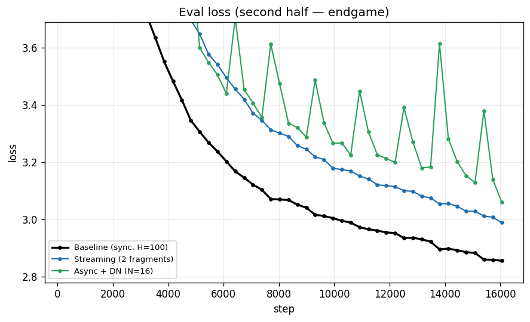

# DiLoCo Features

DiLoCo already cuts communication by syncing only every `H` steps instead of
every step. On top of that it offers several knobs that reduce or *restructure*
communication further — each buying you something (smoother bandwidth use, no
straggler waits, tolerance for uneven hardware) at some cost in convergence.
**This project measures that cost**, on a controlled ~1B-token run, so you can
decide which to turn on for your network and cluster.

| Knob | Flag (on `diloco server`) | What it buys you |
|---|---|---|
| **Streaming sync** | `--num-fragments N` | spreads the sync over N fragments sent in the background across the local-training window, instead of transferring the whole model in one burst at sync time — smooths bandwidth use on a slow link |
| **Async** | `--async` | drops the cross-worker barrier — fast workers don't wait on stragglers (needs the DN buffer, below) |
| **DN buffer** | `--dn-buffer-size N` | the Delayed-Nesterov buffer that makes async stable — **required** whenever you use `--async` (set N = worker count) |
| **DyLU** | `--dylu` | adapts each worker's sync interval to its own throughput — for heterogeneous / unevenly-loaded workers |
| **Wire + transport** | `--wire-format`, `--grpc` | how the bulk tensors move (pickle vs safetensors; HTTP vs gRPC) — a speed/safety choice that's **free** (see below) |

These are all server-authoritative: you select them with flags on
`forgather diloco server`, and every worker adopts them from the server's
`/info`. The same worker config (`default.yaml`) runs all of them. They are
features of the **HTTP sync backend** — streaming in particular is only
implemented there (the shared-memory and collective backends raise
`NotImplementedError` on fragment sync).

Like the other [Tiny Experiments](..), this does double duty: every run below
drives the full orchestrated path (scheduler → param server → workers) for one
feature, so the same sweep that *measures* what each knob costs also serves as an
end-to-end exercise of it.

New to DiLoCo here? Start with the sibling [`../diloco`](../diloco) walkthrough
(server / worker / forgather-server roles, the inner/outer optimizer split,
work-unit dispatch); the authoritative reference is
[`docs/trainers/diloco.md`](../../../docs/trainers/diloco.md). All commands below
assume you are in this project directory:

```bash
cd examples/tiny_experiments/diloco_features
```

---

## What each feature buys — and what it costs

Five configurations, same everything except the feature under test — small Llama
(34.4M) on Fineweb-Edu, 2 workers, **H = 100**, **~1B tokens** (2× Chinchilla,
520M/worker), gRPC + safetensors, `torch.compile` on (the config default), identical pristine init and
the same seed and data order. Only the one flag varies, so the loss gap *is* the
feature's cost. (Driven through the scheduler by
[`experiment.sh`](experiment.sh); harvested by
[`analysis/harvest.py`](analysis/harvest.py) →
[`assets/curves.csv`](assets/curves.csv) →
[`analysis/plot_experiment.py`](analysis/plot_experiment.py).)

Every run shares the same base — `forgather diloco server -o <master> -n 2 --grpc
--wire-format safetensors`, a fresh master copy, and workers submitted with the
config's defaults (`torch.compile` on, the ~16k-step budget) — and adds the
flag(s) that define it:

| Run | `diloco server` flag(s) added |
|---|---|
| Sync DiLoCo (baseline) | `--sync-every 100` |
| Streaming | `--sync-every 100 --num-fragments 2` |
| Async (no DN buffer) | `--sync-every 100 --async` |
| Async + DN buffer | `--sync-every 100 --async --dn-buffer-size 4` ‡ |
| Async + DN + DyLU | `--async --dylu --dylu-base-sync-every 100 --dn-buffer-size 2` † |

‡ the DN buffer size matters a lot and is swept separately — N=4 (the sweet
spot) is shown here; see [Async needs the DN buffer](#async-needs-the-dn-buffer--and-its-size-matters).
† the DyLU run also throttles one worker via `--env DILOCO_DEBUG_STEP_DELAY`
(see [Reproducing it](#reproducing-it)) to create the speed gap DyLU responds to.

| Configuration | eval loss | vs sync | what you buy | the catch |
|---|---|---|---|---|
| **Sync DiLoCo** (baseline) | **2.918** | — | the reference (sync every H steps) | — |
| **+ Async + DN** (N=4) | **2.995** | **+0.08** | no barrier — fast workers never wait on a straggler | needs a DN buffer, sized right (below) |
| **+ Streaming** (2 frag) | **3.049** | **+0.13** | spreads the sync over compute — no all-at-once bandwidth burst | a small, steady convergence cost |
| **+ Async + DN + DyLU** | **3.225** † | +0.31 † | per-worker sync rate — tolerates uneven workers | only helps when workers differ; † not a clean cost (below) |
| Async **without** DN | diverged | — | — | unstable — never run async without a DN buffer (below) |

> One run per config, one seed — **suggestive, not a benchmark** (same caveat as
> the sibling `diloco` sweep). The coarse ordering is robust; the small deltas
> (≤~0.1 among the healthy runs) are single-sample. † The DyLU row used a
> different buffer (N=2) and a deliberately throttled worker, so it isn't directly
> comparable to the others — see its section below.




**The trade, in one line:** these knobs cost a little convergence to make better
use of a constrained network. Base DiLoCo's traffic is bursty — the link sits
idle through the local-training window, then every worker ships the whole model
at once at sync time. Harmless on a fat interconnect; on a slow or contended link
that all-at-once burst *is* the bottleneck, and fast workers also stall at the
barrier waiting for the slowest. **Streaming** spreads the transfer across the
window so the link is used steadily instead of slammed (~0.13 eval loss).
**Async** drops the barrier so no one waits on a straggler (~0.08, once the DN
buffer is sized right). **DyLU** goes further for *heterogeneous* clusters,
adapting each worker's sync rate to its speed. So the question isn't "is it
cheap?" — it's "is my network the bottleneck?" The slower and more contended the
link, the more these trades pay back the small convergence cost. (The sibling
[`../diloco`](../diloco) project shows the other half: at a longer budget DiLoCo's
infrequent sync becomes a *regularizer* and can overtake an all-reduce baseline
outright.)

### Async needs the DN buffer — and its size matters

Async has a hard requirement and a soft one. The hard one: it **must** be paired
with the Delayed-Nesterov buffer (`--dn-buffer-size N`). Without it, each worker's
pseudo-gradient is applied with full-LR Nesterov momentum and no cross-worker
averaging — unstable; the no-DN run above never drops below ~6.9 and the trainer's
divergence detector aborts it. Always set `--dn-buffer-size` with `--async`.

The soft one — and the part that bites quietly — is **how big**. The docs suggest
N = worker count, but that minimum converges much worse than a slightly larger
buffer. Sweeping N at the same budget/seed:

| DN buffer N | eval loss | vs sync |
|---|---|---|
| N=2 (= workers, the minimum) | 3.616 | **+0.70** |
| **N=4** (2× workers) | **2.995** | **+0.08** |
| N=8 (4× workers) | 3.020 | +0.10 |


There's a **sweet spot at ~2× the worker count**: the bare minimum (N=2) costs a
full +0.70 eval loss over sync — enough to wipe out async's point — while N=4
recovers almost all of it (+0.08), and going bigger (N=8) doesn't help. The buffer
sets how many submissions accumulate before the momentum outer step fires; too few
and the outer step is noisy, so the practical guidance is **size the DN buffer to
about twice your worker count**, not the documented minimum. (This is why the
headline async row above uses N=4.)

### DyLU: a tool for uneven hardware

DyLU adapts each worker's `sync_every` to its measured throughput, so a slow
worker syncs less often and stops dragging the group. It only does anything when
workers actually differ in speed — so this run deliberately throttled one worker
(`DILOCO_DEBUG_STEP_DELAY`, below) to create a gradient. Two confounds make its
3.225 not directly comparable to the N=4 async row above: it ran at the **N=2**
buffer (the bad one), and on **heterogeneous** workers. The fair comparison is to
plain async+DN *at the same N=2 buffer* — and there DyLU helped: **3.225 vs
3.616**, i.e. under induced heterogeneity the adaptive schedule landed well below
uniform async at the same (undersized) buffer. Its grad norm is also the smoothest
of any run and its loss is still descending — stable and learning, just
under-trained relative to the N=4 sweet spot. Net: reach for DyLU when your
workers are **genuinely heterogeneous**; on uniform hardware a well-sized DN
buffer is the simpler win.

### Wire format and transport are free

The bulk tensors can move as pickle or **safetensors**, over HTTP or **gRPC**.
This is a pure speed/safety choice with **no convergence cost**: safetensors
carries the identical bf16 bytes (no arbitrary-code deserialization), and gRPC is
just a faster pipe. The baseline above ran on gRPC + safetensors; the sibling
`diloco` project's 1B run at the same settings used the historical HTTP + pickle.
Their loss curves overlay across the entire run
([`analysis/verify_baseline.py`](analysis/verify_baseline.py)):


Final eval **2.918 vs 2.936** — a −0.018 gap, on the good side and within the
run-to-run variance these toy runs show elsewhere (e.g. ~0.007 from a torch- vs
Forgather-AdamW swap between the same two references). One run can't *prove*
they're bit-identical, but it rules out any lossy effect — which would raise loss
or diverge, as the no-DN async run does. **Use gRPC + safetensors for the speed
and safety; it costs you nothing in quality.**

---

## Reproducing it

Prerequisites: a running **forgather server** + **dataset server** (the standard
cluster setup the `../diloco` walkthrough establishes), and a **master model**
the param server initialises from, built once:

```bash
forgather -p ../../models/llama -t small.yaml \
    model --device cpu --save-checkpoint --safetensors \
    --output-dir ../../../models/small_llama_features_master \
    construct
```

Then run the sweep through the scheduler — [`experiment.sh`](experiment.sh) starts
each param server with the right flags, submits workers, waits, captures logs
under `runs/<name>/`, and tears down. It runs two experiments at a time across
free GPUs (distinct server ports), copying the master fresh per run so every
config starts from identical init:

```bash
./experiment.sh run       # baseline, streaming, async (no DN), async+DN (N=2)
./experiment.sh dnsweep   # async+DN at N=4 and N=8 (the DN-buffer-size study)
./experiment.sh dylu      # async+DN+DyLU (throttled worker)
python analysis/harvest.py && python analysis/plot_experiment.py  # main comparison (async+DN = N=4)
python analysis/dn_sweep.py            # the DN-buffer-size sub-study
python analysis/verify_baseline.py     # the wire/transport overlay
```

For a fast smoke (does each feature engage, in minutes rather than hours) without
the convergence study, [`harness.sh`](harness.sh) runs short versions:
`./harness.sh all` or `./harness.sh streaming`.

### Simulating heterogeneous workers (for DyLU)

DyLU needs workers at **different speeds**, but the GPUs here are identical. The
worker honours a debug-only throttle, `DILOCO_DEBUG_STEP_DELAY` (seconds of
`sleep` per local step), delivered to one worker via `submit --env`:

```bash
forgather submit --diloco --diloco-worker-count 1 --worker-id feat-slow \
    --env DILOCO_DEBUG_STEP_DELAY=0.10 --heartbeat-interval 5 ...
forgather submit --diloco --diloco-worker-count 1 --worker-id feat-fast \
    --heartbeat-interval 5 ...
```

`DILOCO_DEBUG_STEP_DELAY` is debug-only — it throttles real training and is never
set in production. `submit --env KEY=VALUE` (repeatable) forwards env to the
scheduled worker process via `job_params.extra_env`; honoured on plain `--diloco`
worker submits only (the `--global` compose and collective paths reject it rather
than silently dropping it).

### Confirming a feature is active

Each feature is selected at the server, so the worker echoes the settings it
adopted from `/info` once at startup — a quick way to confirm your config took:

```
DiLoCoCallback: using server settings sync_every=100 up=bf16 down=fp32 \
    dylu=False num_fragments=2 transport=grpc(127.0.0.1:NNNNN) wire=safetensors
```

| Feature | Where to see it |
|---|---|
| wire / transport | the `transport=…(…) wire=…` echo matches your flags; server log: `grpc_enabled`, `wire_format`, `gRPC bulk listener on …` |
| streaming | `num_fragments=N` in the echo; the server (`--verbose-sync`) advances per-fragment rounds |
| async | server log shows async mode; sync round advances as submissions arrive, so the two workers can reach **different** rounds |
| DN buffer | the server applies the momentum outer step only every `dn-buffer-size` submissions (visible with `--verbose-sync`) |
| DyLU | the server emits a per-worker `recommended_sync_every`; the slow worker logs a `DyLU adjusted sync_every …` line below the fast worker's |

---

## Files

- `templates/configs/default.yaml` — the single small-Llama DiLoCo worker config
  (extends `projects/small.yaml`, `enable_diloco=True`); every feature is chosen
  by server flags, not here.
- `experiment.sh` — the real-budget comparison driver (`run` / `dnsweep` / `dylu`
  / `validate`).
- `harness.sh` — the fast functional smoke driver.
- `analysis/` — `harvest.py`, `plot_experiment.py`, `dn_sweep.py`,
  `verify_baseline.py`.
- `assets/` — `curves.csv` (the committed source of truth) + the plots
  (`loss_comparison.png`, `eval_tail.png`, `dn_sweep.png`, `baseline_vs_h100.png`).
- `runs/` — captured per-run logs (gitignored scratch).
