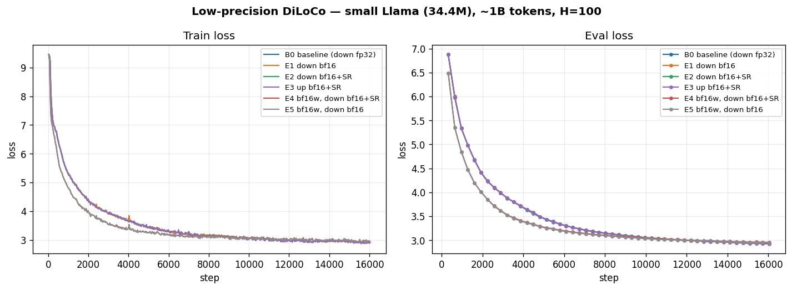
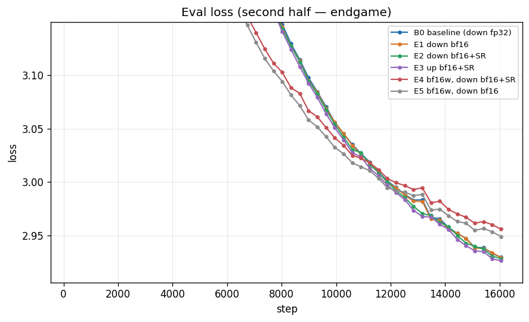

# DiLoCo Low-Precision Wire Transport

This project tests **low-precision communication** for DiLoCo: sending the
worker→server pseudo-gradient and the server→worker averaged parameters in
**bf16** instead of fp32, with optional **stochastic rounding (SR)** on the
narrowing cast — and, separately, training the workers in **true bf16 weights**
with Forgather's SR-capable AdamW.

It is a sibling of [`../diloco`](../diloco), which is the end-to-end DiLoCo
walkthrough and the place to start if you have never run DiLoCo here. This README
assumes that mechanics (server / worker / Forgather-server roles, work-unit
dispatch, the inner/outer optimizer split) and focuses on the **precision**
dimension. For the authoritative reference see
[`docs/trainers/diloco.md`](../../../docs/trainers/diloco.md).

All commands assume you are in this project directory:

```bash
cd examples/tiny_experiments/diloco_lowprec
```

---

## Background

### The two transport legs

Each DiLoCo sync round moves the full model across the network twice:

- **Upload** — every worker sends its **pseudo-gradient** (the delta between its
  pre-sync snapshot and its locally-trained weights) up to the parameter server.
- **Download** — the server steps its outer optimizer and sends the new
  **averaged parameters** back down to every worker.

For the 34.4M-parameter small Llama used here, one full-model transfer is
**131 MB in fp32** and **66 MB in bf16**. DiLoCo already syncs infrequently
(every `H` steps), so per-round bandwidth is the dominant cost when it does sync.
Halving each leg with bf16 directly halves that cost — *if* convergence holds up.
Whether it does is the open research question this project exists to answer.

### The four wire-precision knobs

Transport precision is **server-authoritative**: the four knobs below are set on
the DiLoCo server (`forgather diloco server`) and adopted by every worker via the
server's `/info` response, so the whole group agrees on the wire format. They are
**not** training-config keys — the same `amp.yaml` / `bf16.yaml` config runs at
any wire precision depending on how the server was launched.

| Knob | Default | Leg | Effect |
|---|---|---|---|
| `upload_dtype` | `bf16` | worker → server | dtype of the pseudo-gradient on the wire |
| `upload_sr` | off | worker → server | SR on the fp32→bf16 upload cast |
| `download_dtype` | `fp32` | server → worker | dtype of the averaged params on the wire |
| `download_sr` | off | server → worker | SR on the fp32→bf16 download cast |

The defaults reproduce the historical wire format: pseudo-grads already went up
in bf16 (round-to-nearest), params came back in fp32.

CLI flags on `forgather diloco server`: `--upload-dtype {fp32,bf16}`,
`--upload-sr`, `--download-dtype {fp32,bf16}`, `--download-sr`.

### Stochastic rounding, briefly

Casting fp32→bf16 by round-to-nearest (RNE) discards the low mantissa bits and
introduces a **systematic, same-signed bias** wherever many small updates share a
direction — exactly the regime of an averaged pseudo-gradient or a small
parameter delta. **Stochastic rounding** instead rounds up or down with
probability proportional to the discarded fraction, so the cast is **unbiased in
expectation** and sub-ULP signal is preserved across many casts. The cost is a
little extra variance per cast. The same helper
(`forgather.ml.optim.rounding_utils.fp32_to_bf16_stochastic_round`) is used for
the wire casts and inside Forgather's AdamW.

### bf16 weights + Forgather AdamW

The `bf16.yaml` config constructs and trains the model in **true bf16**
(`default_dtype: bfloat16`) with no fp32 master copy. That is only numerically
viable because **Forgather's AdamW** (`forgather.ml.optim:AdamW`,
`bf16_stochastic_round=True` by default) does an SR write-back on every parameter
and moment update, recovering most of the quality an fp32 master would give. See
`examples/pretrain/small-llm:bf16.yaml` for the standalone version of this idea.

We use Forgather's AdamW for **every** config in this project (set once in the
shared base `templates/projects/diloco_lowprec.yaml`). On the AMP baseline its SR
path is inert (the master weights are fp32), so this holds the optimizer constant
across the whole sweep.

### Why the bf16 config uses a higher learning rate

bf16+SR training is not just "AMP at lower precision" — it has a different
optimal learning rate, and using the AMP LR would handicap it. Ozkara, Yu & Park
(2025), [*Stochastic Rounding for LLM Training: Theory and Practice*][srpaper]
(arXiv:2502.20566), show that **bf16+SR benefits from a 2–4× higher LR than
mixed precision** (their Table 2: GPT-2 350M trains at 7e-4 under SR vs 3e-4
under MP), for two linked reasons:

- **Stagnation at small LR.** SR is unbiased — `E[Q_SR(x+u)] = x+u` — but a
  single update `u` much smaller than the bf16 ULP still rounds to a no-op most
  of the time. Their Theorem 1 casts SR as implicitly minimizing the loss plus a
  *quantization penalty that scales inversely with the LR*, so a small LR makes
  that penalty dominate and training stalls. A larger LR keeps updates large
  relative to the ULP; the quantization error is then "subsumed by Adam's
  convergence bound" (their Corollary 1). "Choosing a higher learning rate for
  SR training is critical for competitive performance."
- **Stability headroom.** SR's rounding noise *decorrelates* successive
  gradients (their Proposition 1), so learning rates that would destabilize MP
  training stay stable under SR.

So `bf16.yaml` sets `base_lr = 4.0e-4` against the inherited AMP `1.5e-4`
(≈2.7×, within the paper's range), exactly mirroring
`examples/pretrain/small-llm:bf16.yaml`. This means the AMP-vs-bf16 *cross*
comparison varies both precision and LR by design — it is a **best-practice vs
best-practice** comparison (each precision at its recommended LR), which is the
operationally meaningful one. The wire-precision experiments *within* a precision
class (B0/E1/E2/E3 on AMP; E4/E5 on bf16) all share one LR, so there each
group's comparison still isolates a single knob.

[srpaper]: https://arxiv.org/abs/2502.20566

---

## Experimental design

### Configs

Two leaf configs, both DiLoCo x2-worker, both inheriting the shared optimizer +
WSD-without-decay schedule from `projects/diloco_lowprec.yaml`:

| Config | Weights | Optimizer | `base_lr` | Notes |
|---|---|---|---|---|
| `amp.yaml` (default) | fp32 master + bf16 autocast (**AMP**) | Forgather AdamW (SR inert) | 1.5e-4 | identical to `diloco/default.yaml` but for the optimizer swap |
| `bf16.yaml` | **true bf16** | Forgather AdamW (**SR active**) | 4.0e-4 | `default_dtype: bfloat16`; higher LR per [arXiv:2502.20566][srpaper] (see [above](#why-the-bf16-config-uses-a-higher-learning-rate)) |

### Experiment matrix

Each experiment is `(config) × (diloco-server flags)`. All compare against **B0**.
Everything else is held fixed: same 34.4M model, same seeded init weights, same
data order, constant LR (warmup→stable, no decay) at each config's `base_lr`, and
a **sync interval `H = 100`** — a good middle ground between the every-20 and
every-500 extremes the sibling project swept. `H` is a server flag
(`--sync-every 100`), not a config key. 2 workers throughout.

| ID | Config | upload | up-SR | download | down-SR | Extra `diloco server` flags |
|---|---|---|---|---|---|---|
| **B0** baseline | `amp` | bf16 | – | fp32 | – | *(defaults)* |
| **E1** down-bf16 | `amp` | bf16 | – | bf16 | no | `--download-dtype bf16` |
| **E2** down-bf16+SR | `amp` | bf16 | – | bf16 | yes | `--download-dtype bf16 --download-sr` |
| **E3** up-SR | `amp` | bf16 | yes | fp32 | – | `--upload-sr` |
| **E4** bf16w + down-bf16+SR | `bf16` | bf16 | – | bf16 | yes | `--download-dtype bf16 --download-sr` |
| **E5** bf16w + down-bf16 | `bf16` | bf16 | – | bf16 | no | `--download-dtype bf16` |
| *R-fp32* (optional ref) | `amp` | **fp32** | – | fp32 | – | `--upload-dtype fp32` |

The three questions, by group:

- **Download bf16 ±SR — E1, E2 vs B0.** Does sending the averaged params down in
  bf16 hurt convergence, and does SR on that cast recover it? This is the
  headline question: the download leg defaults to fp32 precisely because its
  convergence impact was unmeasured.
- **Upload SR — E3 vs B0 (and R-fp32).** The upload leg is already bf16 by
  default (RNE). Does adding SR to that cast measurably help? R-fp32 bounds the
  total cost of bf16 upload by sending the pseudo-grad at full precision.
- **bf16 weights + bf16 download ±SR — E4 vs E5.** When the workers already train
  in bf16, does download SR still matter, or is RNE good enough? Note: with bf16
  *weights* the upload SR cast is inert (the pseudo-grad is already bf16), so the
  only live SR knob in this group is `download_sr`.

### Token budget and the per-worker accounting

A DiLoCo worker is an ordinary trainer that runs its **full** step budget — it
does not know it is one of N. With 2 workers, the model collaboratively sees ≈2×
a single worker's budget. To reach the budget where the sibling project shows
DiLoCo's advantage established (≈1B total tokens, well past the crossover), each
worker runs the default **500M** schedule (`small.yaml`'s `total_tokens=500`),
for ≈1B total — no
`--total-tokens` override needed. Using the default also guarantees identical
step counts across every experiment, which is what makes the curves directly
comparable.

---

## Hypotheses

- **B0** is the reference; its numbers should match the sibling `diloco`
  project's 2-worker run at the same budget (modulo the optimizer swap, which we
  expect to be a no-op at fp32).
- **E1 (download bf16, RNE):** small but real convergence penalty vs B0. RNE on
  the averaged params injects a same-signed quantization bias into every worker's
  starting point each round; over ~1B tokens we expect a measurable eval-loss
  gap (hypothesis: on the order of the sibling's run-to-run noise to ~0.02).
- **E2 (download bf16 + SR):** recovers most or all of E1's penalty — eval loss
  back within noise of B0 — at the same halved download bandwidth. If true, this
  is the recommended low-bandwidth setting and the project's main result.
- **E3 (upload SR):** marginal. The pseudo-gradient is an average over H local
  steps and is already bf16 by default; SR should help less here than on the
  download leg, and possibly fall within noise of B0. R-fp32 should be
  statistically indistinguishable from B0, confirming the default bf16 upload is
  already near-lossless.
- **E4 vs E5 (bf16 weights):** E4 (download SR) ≥ E5 (download RNE). With bf16
  weights the model is already operating at bf16 resolution, so the *relative*
  benefit of download SR may shrink versus the AMP case (E2 vs E1) — an
  interesting second-order question. At the paper-recommended higher LR we expect
  the bf16-weight runs to be **competitive with** the AMP baseline, not to trail
  it — arXiv:2502.20566 reports bf16+SR matching or beating mixed precision once
  the LR is tuned. (At the AMP LR they would stagnate; that is precisely why
  `bf16.yaml` raises it.)
- **Overall:** SR is cheap insurance whose value rises with how lossy the cast is
  and how biased the cast input is — largest on the download leg (small,
  coherent param deltas), smaller on the upload leg (noisy averaged grads),
  smaller again once weights are already bf16.

---

## Runbook

This follows the sibling [`../diloco`](../diloco) walkthrough (model construction,
Forgather server, dataset server, DiLoCo server, workers); only the
precision-specific differences are spelled out here.

### 0. One-time setup

Build the init model **once** and keep a pristine copy — every experiment must
start from the *same* weights so the comparison is clean:

```bash
forgather -p ../../models/llama -t small.yaml \
    model --device cpu --save-checkpoint --safetensors \
    --output-dir ../../../models/small_llama_lowprec_init construct
```

Start the Forgather server and dataset server (Fineweb-Edu is already cached on
this box — see the sibling README's cache listing):

```bash
forgather server                 # in its own terminal
forgather dataset-server start
```

### 1. Per experiment

Each experiment needs its **own** DiLoCo server (own port + own `--output-dir`,
seeded from the pristine init copy so concurrent runs don't clobber each other):

```bash
# Seed a fresh model dir for this experiment from the pristine init copy.
cp -r ../../../models/small_llama_lowprec_init ../../../models/small_llama_<EXP>

# Launch the server with H=100 + this experiment's wire-precision flags (matrix).
forgather diloco server --output-dir ../../../models/small_llama_<EXP> \
    --num-workers 2 --sync-every 100 -H 0.0.0.0  <EXTRA FLAGS>

# Note the server id, then submit its 2 workers on the matching config.
forgather -t <amp|bf16>.yaml submit --diloco --diloco-worker-count 2 \
    --diloco-server <server-id>
```

**Leave `torch.compile` enabled** (the configs default `compile=True`) — over
≈1B tokens the compile cost pays for itself many times over. Do **not** add
`--compile no` to a real run.

> **Restart the forgather server first** if it has been running since before the
> wire-precision feature landed: a long-lived server spawns diloco-servers with
> the code it loaded at startup, so a stale one silently ignores the four wire
> knobs (runs fp32, no error). See [#150][i150]. Alternatively run each diloco
> server with `--local-only` (foreground/direct, fresh CLI code), which is what
> this project's sweep did.

### 1a. Smoke test first

Before each real run, do a throwaway short run to verify the wiring — flags
negotiate via `/info`, both workers register, and one sync round completes in the
configured up/down dtypes with no cast/shape errors:

```bash
forgather -t <amp|bf16>.yaml submit --diloco --diloco-worker-count 2 \
    --diloco-server <server-id> --compile no --total-tokens 5
```

`--compile no` is appropriate **only here** (fast startup, throwaway). Tear it
down, then launch the real run with compile enabled.

### 2. Parallelism (5 GPUs)

`forgather submit` enqueues each worker on the Forgather scheduler, which places
it on a free GPU as resources become available — **you do not pin devices.** The
caveat is that the scheduler does **not** know two workers form a DiLoCo team, so
it can start one worker of a pair and leave its partner queued.

This is a footgun, because of how the DiLoCo server's `--min-workers` (default
**1**) interacts with it: with `min-workers=1` a lone worker does **not** wait
for its partner — it sails through the sync barrier on its own and trains as a
1-worker run until the partner finally registers. The job doesn't hang; it
**silently produces the wrong experiment** (some rounds with N=1, then N=2),
skewing the curve. Setting `--min-workers 2` instead blocks the first worker at
the barrier until the second shows up — correct for integrity, but it will
**deadlock** if the second never gets scheduled (e.g. all GPUs occupied).

The safe rule with 5 GPUs: each experiment is 2 GPU workers, so run **two
experiments concurrently** (4 GPUs) and never let more than ~5 GPUs of work be
in flight at once. Submit a pair only once **2 GPUs are free for the whole
pair** (check `forgather gpu status` first) — don't queue a third pair against a
single free GPU. As a belt-and-suspenders guard against a silent solo run, you
can launch each server with `--min-workers 2`, but only when you're sure both
workers will get scheduled, since that trades the silent-skew failure for a
hard deadlock. (See [issue #149](https://github.com/jdinalt/forgather/issues/149)
for the underlying scheduler/DiLoCo-team coupling.)

Monitor placement and the queue with:

```bash
forgather gpu status               # which GPUs are busy / free
forgather job list                 # queued + active jobs (worker placement)
forgather job scheduler            # scheduler status (pause/resume if needed)
forgather diloco servers           # the running DiLoCo servers
forgather diloco status --queues --watch   # sync rounds + work-unit dispatch
```

### 3. Metrics to collect

Per run, harvest into `assets/curves.csv` (see `analysis/`): final train loss,
final eval loss, avg throughput (tok/s), sync rounds. Separately, record the
**receive-leg bytes per sync** from the DiLoCo server logs/status to confirm the
bandwidth claim (`download_dtype=bf16` should ≈halve it: ~131 MB → ~66 MB for
this model).

---

## Results

All six experiments ran to completion: 2-worker DiLoCo, `H=100`, ~1B tokens
(500M/worker), small Llama 34.4M on Fineweb-Edu, identical seeded init and data
order. AMP runs use `base_lr=1.5e-4`; bf16-weights runs use `4.0e-4`
([arXiv:2502.20566][srpaper]). The optional `R-fp32` reference was not run.

Final losses (lower is better) and per-sync wire volume (per worker; full model
is 137.7 MB fp32 / 68.8 MB bf16):

| Exp | weights | wire ↑ / ↓ | final train | final eval | per-sync ↑ / ↓ (MB) |
|---|---|---|---|---|---|
| **B0** baseline | AMP | bf16 / fp32 | 2.922 | **2.929** | 68.8 / 137.7 |
| **E1** down-bf16 | AMP | bf16 / bf16 | 2.924 | 2.929 | 68.8 / **68.8** |
| **E2** down-bf16+SR | AMP | bf16 / bf16+SR | 2.913 | 2.928 | 68.8 / **68.8** |
| **E3** up-SR | AMP | bf16+SR / fp32 | 2.910 | **2.926** | 68.8 / 137.7 |
| **E4** bf16w + down-bf16+SR | bf16 | bf16 / bf16+SR | 2.947 | 2.956 | 68.8 / **68.8** |
| **E5** bf16w + down-bf16 | bf16 | bf16 / bf16 | 2.941 | 2.949 | 68.8 / **68.8** |

Aggregate throughput was ~366–406K tok/s (single-host, so this is a quality
check, not a bandwidth demo — see the sibling project's note); each run did
159–160 sync rounds.





The wire-precision *negotiation and bandwidth* worked exactly as designed:
`download_dtype=bf16` halved the return leg (137.7 → 68.8 MB/sync/worker; the
upload leg was already bf16 by default), and SR casts were applied on the
configured legs. Parsed curves are in [`assets/curves.csv`](assets/curves.csv)
and the raw rank-0 worker logs in [`assets/raw_logs/`](assets/raw_logs/); regenerate
plots with [`analysis/plot_experiment.py`](analysis/plot_experiment.py).

---

## Analysis

Read the two groups separately — they differ in learning rate by design.

### AMP wire precision (B0–E3, all at `lr=1.5e-4`) — the headline question

- **bf16 weight *download* is free, convergence-wise.** E1 (bf16 download, RNE)
  lands at eval **2.9289** versus the fp32-download baseline B0 at **2.9294** —
  statistically indistinguishable, for **half** the return-leg bandwidth. This
  answers the PR's open question (#130 acceptance #4) in the affirmative *at this
  scale*: halving the download leg cost nothing measurable.
- **SR is cheap and slightly favorable, on both legs.** Download bf16+SR (E2,
  2.9280) edges out plain RNE download (E1, 2.9289); upload bf16+SR (E3, 2.9261)
  is the best of all four. The gains are *within* the ~0.003 run-to-run spread,
  so they're suggestive, not significant — but the direction is consistent across
  both legs and SR never hurt.
- Net: in AMP DiLoCo, the four AMP variants are bunched within 0.003 eval-loss.
  bf16 transport (either or both legs, ±SR) is essentially lossless here; SR is
  a no-regret default for the narrowing cast.

### bf16 weights (E4/E5, at `lr=4.0e-4`)

- Both bf16-weights runs finish ~0.02–0.03 **above** the AMP cluster (2.949–2.956
  vs 2.926–2.929) — but this comparison is **confounded by LR** by design (2.7×
  the AMP rate, per the SR paper). The curves show it plainly: the bf16 runs
  descend *faster* early (the higher LR) and the AMP runs only overtake around
  step ~12k (see `eval_tail.png`). So at *this* budget the AMP setting finishes
  ahead; the paper reports bf16+SR matching or beating mixed precision once LR is
  tuned and at larger scale, so the late-crossover here is consistent with the
  gap closing on a longer run — left as a follow-up.
- **Download SR adds nothing once weights are already bf16.** Within the clean
  (single-LR) bf16 pair, download bf16+SR (E4, 2.9558) was marginally *worse*
  than plain RNE download (E5, 2.9488) — within noise, but clearly not a win.
  Intuitively, when the live model is already at bf16 resolution there's little
  sub-ULP signal for the download-side SR to preserve.

### Relation to the DiLoCo literature

Low-precision communication is **prior art on the upload leg, novel on the
download leg** — and our experiments map onto exactly that split.

- **Upload (pseudo-gradient) — established.** Our default `upload_dtype=bf16` is
  not new: *OpenDiLoCo* ([arXiv:2407.07852][opendiloco]) first all-reduced the
  pseudo-gradient in **FP16** "without noticeable performance hit," and
  *Streaming DiLoCo* ([arXiv:2501.18512][streaming], §2.4) swept the outer-gradient
  communication precision through **bf16/fp8/fp4** ("no sign of performance
  regression … even at the billion scale"). The original DiLoCo paper
  ([arXiv:2311.08105][diloco]) only sign-pruned the outer gradients (appendix;
  50% pruned → +0.39% ppl) and otherwise assumed full precision. Our E3 (upload
  bf16+SR) being within noise of B0 is consistent with this body of work.
- **Download (averaged parameters) — unexplored.** None of those papers compress
  the server→worker broadcast of the averaged weights; they quantize only the
  worker→server delta. So `download_dtype=bf16` is genuinely new ground, and our
  B0-vs-E1 result (lossless) says it's a free bandwidth win the literature left
  on the table. A priori one might keep the download fp32 to avoid a quantization
  bias in each worker's starting point feeding back into the server's fp32
  outer-momentum — but plain RNE was already lossless here, and SR (E2) removes
  even that theoretical bias.

[diloco]: https://arxiv.org/abs/2311.08105
[opendiloco]: https://arxiv.org/abs/2407.07852
[streaming]: https://arxiv.org/abs/2501.18512

### Caveats

Single seed per config; the ~0.003 eval-loss spread among AMP variants is within
the run-to-run noise expected from bf16/SR nondeterminism and the outer optimizer,
so within-group orderings are indicative, not conclusive. The bf16-vs-AMP gap
deliberately mixes precision and LR (best-practice vs best-practice). No
divergence or NaNs in any run.

### Bottom line

The wire-precision feature delivers its bandwidth win — the download leg halves —
with **no measurable convergence cost** for AMP DiLoCo at this scale, and SR is a
cheap, slightly-positive default on the wire. Pure-bf16 *weights* trade a small
endgame eval gap (at the higher LR they require) for halved optimizer-state
memory; download-side SR is redundant once weights are bf16.

### Reproduction / operational notes

- The PR's wire-precision **code is correct** — verified end-to-end (dtype
  negotiation, SR casts, halved bandwidth). Two operational footguns surfaced
  during testing and are tracked separately:
  [#149][i149] (the scheduler can split a DiLoCo worker pair) and
  [#150][i150] (a forgather server left running across a code update silently
  spawns diloco-servers with the *old* wire-precision logic — restart the
  forgather server after updating, or run the diloco server `--local-only`).
- These runs used local-only diloco servers (one per experiment, distinct ports)
  precisely to dodge [#150][i150] on a server that predated the feature.

[i149]: https://github.com/jdinalt/forgather/issues/149
[i150]: https://github.com/jdinalt/forgather/issues/150
