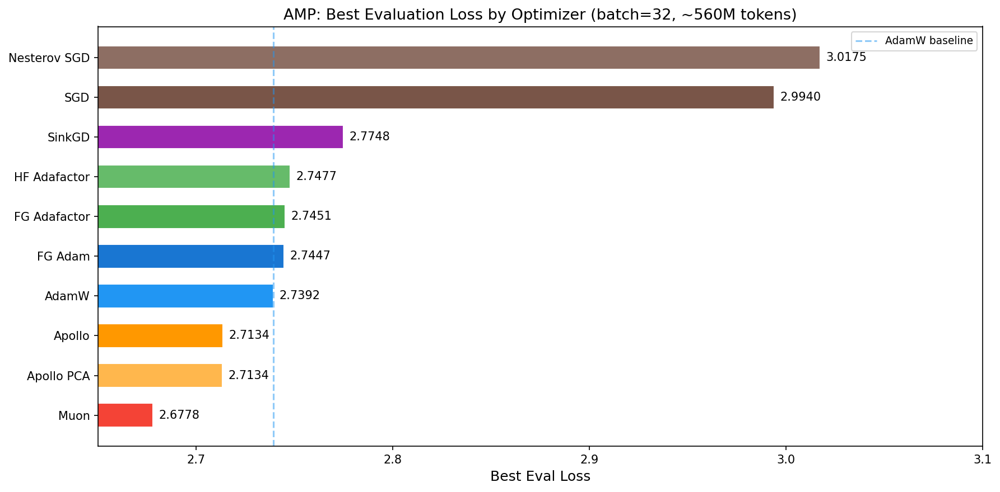
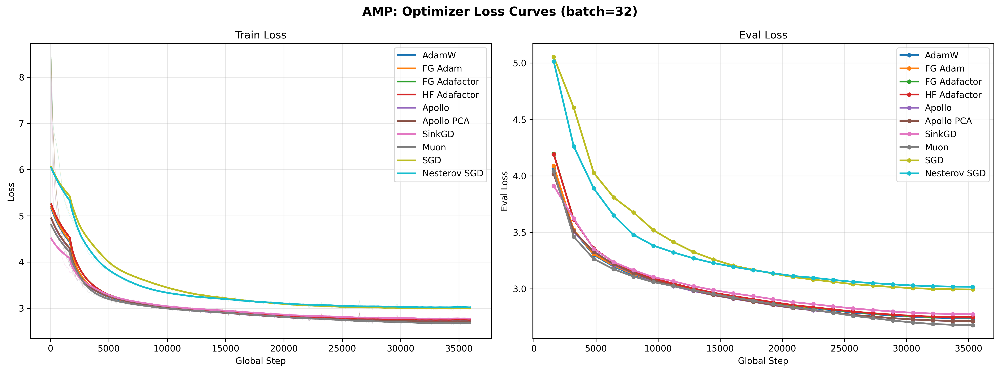
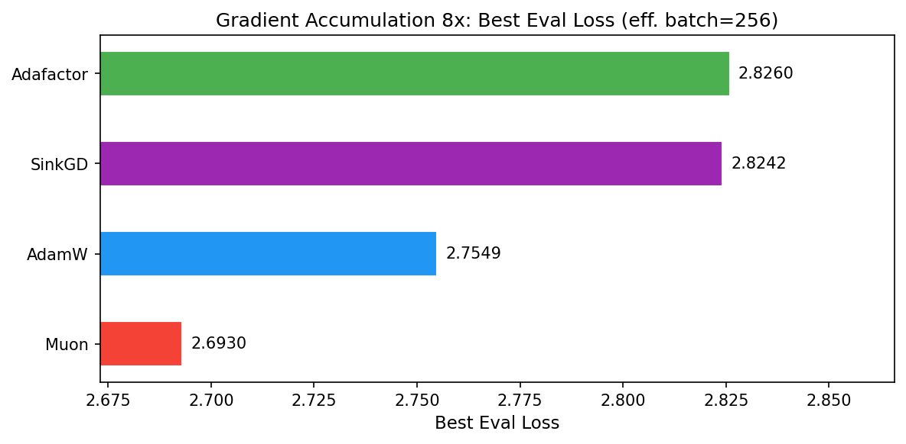
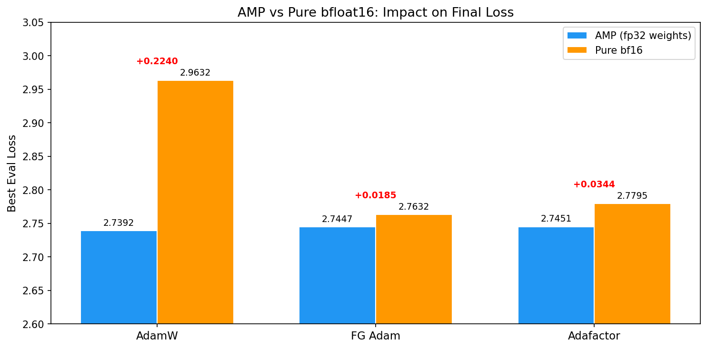
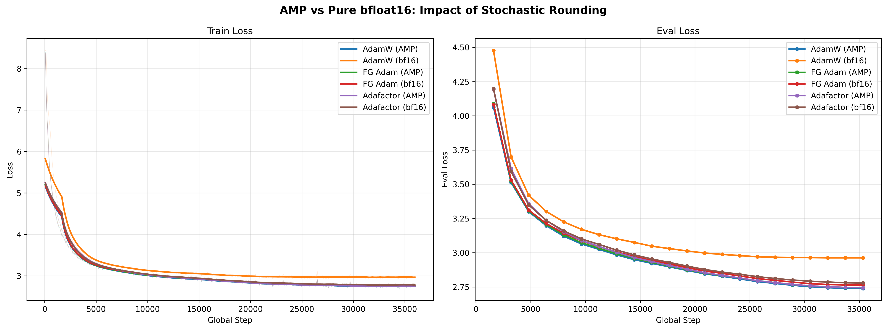
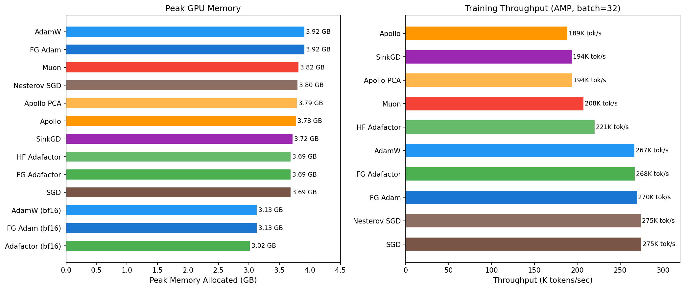

## Optimizer Comparison: Small Batch Training for Language Models

A systematic comparison of optimizer implementations for LLM pre-training, with
a focus on small-batch regimes. We test 10 optimizer configurations across three
training modes (AMP, pure bfloat16, and gradient accumulation) using a
30M-parameter Llama model on the FineWeb-Edu dataset.

### Motivation

Recent work by Marek et al. (["Small Batch Size Training for Language Models: When
Vanilla SGD Works, and Why Gradient Accumulation Is
Wasteful"](https://arxiv.org/abs/2507.07101)) challenges the assumption that
adaptive optimizers are essential for language model training. Their key claims:

1. With proper hyperparameter scaling, **vanilla SGD can train language models
   stably** even at batch size 1.
2. Small batches offer **equal or better per-FLOP performance** than larger
   batches.
3. **Gradient accumulation is wasteful** -- it merely simulates a larger batch
   without the throughput benefits of actual parallelism.
4. The critical insight for scaling Adam across batch sizes is to **hold beta2's
   half-life fixed in terms of tokens** rather than steps.

Our experiments test these claims empirically across a range of optimizer
families: Adam variants, Adafactor, Apollo, Muon, SinkGD, and SGD.

### Experimental Setup

All experiments share the following configuration:

| Parameter | Value |
|---|---|
| Model | Llama (30.3M params): hidden=512, layers=10, heads=8, KV heads=2, vocab=4000, untied embeddings |
| Dataset | HuggingFaceTB/smollm-corpus (FineWeb-Edu subset), packed, ~560M tokens |
| Sequence length | 512 |
| Batch size | 32 sequences/device (16,384 tokens/step) |
| LR schedule | Cosine annealing with 10% linear warmup |
| LR scaling | `lr = base_lr * sqrt(tokens_per_step / 16384)` |
| beta2 scaling | `scaled_beta2 = 0.999 ^ (tokens_per_step / 16384)` (per Marek et al.) |
| Precision | AMP (bf16 compute, fp32 weights) unless noted |
| Compilation | torch.compile enabled |
| Hardware | Single NVIDIA RTX 4090 per run |
| Total steps | 35,968 (batch=32) or 4,496 (grad accumulation 8x) |

The beta2 scaling follows Marek et al.'s recommendation: maintaining a constant
half-life in tokens ensures the second moment estimate decays at the same rate
regardless of batch size.

---

### Optimizers Tested

**Adaptive (full state):**
- **AdamW** (`torch.optim.AdamW`): The baseline control. Fused implementation,
  with scaled beta2.
- **FG Adam** (`forgather.ml.optim.AdamW`): Forgather's Adam implementation with
  stochastic rounding support for bf16 training.
- **Adafactor** (`forgather.ml.optim.adafactor.Adafactor`, `torch.optim.Adafactor`,
  `transformers.Adafactor`): Factored second-moment estimation. Stores row and
  column factors instead of the full second-moment matrix, reducing memory.

**Low-rank adaptive:**
- **Apollo** ([arXiv:2412.05270](https://arxiv.org/abs/2412.05270)): Approximates
  AdamW's per-channel scaling via low-rank random projections. Projects gradients
  into a rank-128 subspace, computes moments there, derives a per-channel scaling
  factor. Memory cost approaches SGD. Uses a multiopt setup routing
  embeddings/norms/biases to Adam and all weight matrices to Apollo.
- **Apollo PCA**: Apollo variant using an OnlinePCAProjector (updated every 10
  steps) instead of random projections. Captures the actual principal gradient
  directions rather than random ones.

**Matrix-orthogonalization:**
- **Muon** ([arXiv:2502.16982](https://arxiv.org/abs/2502.16982)): MomentUm
  Orthogonalized by Newton-schulz. Runs Nesterov SGD (beta=0.95), then projects
  each 2D weight matrix's update onto the Stiefel manifold via 5 Newton-Schulz
  iterations. The `adjust_lr_fn="match_rms_adamw"` scaling allows direct reuse of
  AdamW-scale learning rates. Only stores one momentum buffer (50% less optimizer
  state than AdamW). Applied only to 2D weight matrices; embeddings/norms/biases
  use AdamW. Recently adopted in production by Kimi K2, GLM-4.5, and INTELLECT-3;
  now in PyTorch core (`torch.optim.Muon`).

**Gradient normalization:**
- **SinkGD** ([arXiv:2502.06742](https://arxiv.org/abs/2502.06742)): Sinkhorn
  Gradient Descent. Alternates row-wise and column-wise L2 normalization of
  gradient matrices (5 iterations), recovering the square-root Sinkhorn algorithm.
  Completely **stateless** -- zero optimizer buffers, same memory as vanilla SGD.
  Scaled by `alpha * lr` where alpha=0.05. Applied only to 2D weight matrices;
  embeddings/norms/biases use Adam.

**SGD variants:**
- **SGD** (`forgather.ml.optim.SGD`): Vanilla SGD, no momentum. Base LR=1.0.
- **Nesterov SGD** (`torch.optim.SGD`): Nesterov momentum (beta=0.9), fused
  implementation. Base LR=0.1.

---

## Results

### 1. AMP: Mixed-Precision Training (batch=32)

The primary experiment group. All optimizers use bf16 autocast with fp32 master
weights.



| Optimizer | Best Eval Loss | Train Loss | Peak Mem | Throughput | Time |
|---|---|---|---|---|---|
| **Muon** | **2.6778** | 2.7020 | 3.82 GB | 208K tok/s | 47.8 min |
| Apollo PCA | 2.7134 | 2.7382 | 3.79 GB | 194K tok/s | 50.9 min |
| Apollo | 2.7134 | 2.7391 | 3.78 GB | 189K tok/s | 52.4 min |
| AdamW | 2.7392 | 2.7654 | 3.92 GB | 267K tok/s | 37.4 min |
| FG Adam | 2.7447 | 2.7699 | 3.92 GB | 270K tok/s | 37.1 min |
| FG Adafactor | 2.7451 | 2.7702 | 3.69 GB | 268K tok/s | 37.4 min |
| HF Adafactor | 2.7477 | 2.7728 | 3.69 GB | 221K tok/s | 45.1 min |
| SinkGD | 2.7748 | 2.8003 | 3.72 GB | 194K tok/s | 51.1 min |
| SGD | 2.9940 | 3.0165 | 3.69 GB | 275K tok/s | 36.4 min |
| Nesterov SGD | 3.0175 | 3.0420 | 3.80 GB | 275K tok/s | 36.5 min |



**Key observations:**

**Muon wins at small batch size.** Despite the small 16K token batch, Muon
achieves the best eval loss of 2.6778 -- beating AdamW by 0.061 and Apollo by
0.036. This is a strong result: Muon's orthogonalized updates extract more
information per gradient step than any other optimizer tested, even in the
high-noise small-batch regime. The 28% throughput penalty (208K vs 267K tok/s)
is more than compensated by the convergence advantage.

**Apollo is second-best.** Both Apollo variants achieve 2.7134 eval loss,
beating AdamW by 0.026. The OnlinePCA projector variant matches random
projections exactly, suggesting rank-128 is sufficient for this model size.

**The adaptive optimizer cluster.** AdamW, FG Adam, FG Adafactor, and HF
Adafactor form a tight cluster between 2.739 and 2.748 -- a spread of only
0.009. At this batch size and model scale, the choice among these standard
adaptive optimizers is nearly irrelevant.

**SinkGD is competitive but not dominant.** At 2.7748, SinkGD trails AdamW by
0.036 despite being completely stateless (zero optimizer memory). Its throughput
penalty (~30% slower than AdamW) comes from the iterative normalization, but its
memory savings are real: identical footprint to SGD.

**SGD underperforms but trains.** Both SGD variants converge to eval losses
around 3.0 -- roughly 0.26 worse than AdamW. This confirms Marek et al.'s claim
that SGD *can* train language models, but the gap to adaptive methods remains
substantial at this scale. Interestingly, Nesterov momentum provides almost no
benefit over vanilla SGD (3.0175 vs 2.9940 -- Nesterov is slightly *worse*),
suggesting that at small batch sizes the momentum signal is too noisy to help.

---

### 2. Gradient Accumulation 8x (effective batch=256)

These runs use 8x gradient accumulation, increasing the effective batch from
16K to 131K tokens per optimization step. This reduces total steps from ~36K
to ~4.5K for the same data.



| Optimizer | Best Eval Loss | Train Loss | Peak Mem | Time |
|---|---|---|---|---|
| **Muon** | **2.6930** | 2.7183 | 3.96 GB | 37.9 min |
| AdamW | 2.7549 | 2.7810 | 4.06 GB | 38.2 min |
| SinkGD | 2.8242 | 2.8502 | 3.86 GB | 40.1 min |
| Adafactor | 2.8260 | 2.8491 | 3.83 GB | 36.8 min |

**Muon excels at larger batch sizes.** Muon leads the grad8 group by 0.062 over
AdamW (2.6930 vs 2.7549). This aligns with published results: Muon's gradient
orthogonalization produces higher-quality updates that scale efficiently with
batch size, retaining data efficiency far beyond the critical batch size.

**Gradient accumulation is a tradeoff, not free.** Comparing across batch sizes
(AdamW: 2.7392 at batch=32 vs 2.7549 at batch=256), the larger batch achieves
slightly worse eval loss despite seeing the same total tokens. The 8x fewer
optimization steps mean fewer chances for the model to update. This is consistent
with Marek et al.'s argument that gradient accumulation is often wasteful -- it
reduces update frequency without improving gradient quality enough to compensate.

**The gap between optimizers widens.** At batch=32, AdamW beats Adafactor by only
0.006. At batch=256, the gap grows to 0.071. Larger batches appear to amplify
optimizer differences, as each update carries more weight.

---

### 3. Pure bfloat16: Stochastic Rounding

These experiments compare AMP training (bf16 compute with fp32 master weights)
against pure bf16 training (bf16 weights throughout). The Forgather optimizer
implementations (`forgather.ml.optim`) support stochastic rounding, which
compensates for bf16's limited mantissa precision during weight updates.



| Optimizer | AMP Eval | bf16 Eval | Delta | bf16 Savings |
|---|---|---|---|---|
| AdamW (torch) | 2.7392 | 2.9632 | **+0.2240** | 0.79 GB |
| FG Adam (stochastic rounding) | 2.7447 | 2.7632 | **+0.0185** | 0.79 GB |
| Adafactor (stochastic rounding) | 2.7451 | 2.7795 | **+0.0344** | 0.67 GB |



**Stochastic rounding is critical for bf16 training.** Torch's AdamW without
stochastic rounding suffers a catastrophic 0.224 loss degradation in pure bf16
mode, rendering it nearly as bad as SGD. The FG Adam implementation with
stochastic rounding reduces this to just 0.019 -- a 12x improvement. Adafactor
with stochastic rounding shows a moderate 0.034 degradation.

**Why it matters:** Pure bf16 training saves ~0.7-0.8 GB of GPU memory (no fp32
weight copy needed) and runs faster (FG Adam bf16: 573K tok/s vs AMP: 518K tok/s,
a 10% speedup). With stochastic rounding, the quality cost is minimal.

**How stochastic rounding works:** In standard bf16 weight updates, small
gradient updates are silently truncated to zero due to limited mantissa bits (7
bits, vs 23 in fp32). Stochastic rounding randomly rounds up or down with
probability proportional to the truncated portion, ensuring the expected value of
the update is correct. Over many steps, the accumulated updates converge to the
same result as fp32 arithmetic.

---

### 4. Memory and Throughput



**Memory tiers:**

| Tier | Optimizers | Peak Memory | Optimizer State |
|---|---|---|---|
| Full state (AMP) | AdamW, FG Adam | 3.92 GB | 2 buffers/param (m, v) |
| Reduced state (AMP) | Muon | 3.82 GB | 1 buffer/param (momentum) |
| Factored (AMP) | Adafactor, Apollo, SinkGD, SGD | 3.69-3.79 GB | Factored or none |
| Full state (bf16) | FG Adam bf16 | 3.13 GB | 2 buffers (bf16 weights save ~0.8 GB) |
| Factored (bf16) | Adafactor bf16 | 3.02 GB | Factored + bf16 weights |

**A note on model size:** At 30M parameters, optimizer state differences are
modest in absolute terms (0.2 GB between AdamW and SGD) because activations and
framework overhead dominate. At scale, the picture changes dramatically: for a
model with N parameters in fp32, AdamW stores 2N floats of state (m, v),
effectively **tripling** the parameter memory. Muon stores N floats (momentum),
**doubling** it. Apollo stores low-rank approximations, a meaningful but smaller
overhead. Adafactor stores only row and column factors -- virtually zero overhead
for large matrices. SGD and SinkGD store nothing at all.

For practitioners training large models on limited hardware, these differences
determine whether a model fits in memory at all. A 7B-parameter model in bf16
occupies ~14 GB for weights alone; AdamW adds ~28 GB of optimizer state (in
fp32), while SinkGD and SGD add zero.

**Throughput tiers:**

| Tier | Optimizers | Throughput | Notes |
|---|---|---|---|
| Fastest | SGD, Nesterov SGD | 275K tok/s | Minimal per-step computation |
| Fast | FG Adam, Adafactor, AdamW | 267-270K tok/s | Fused/compiled kernels |
| Medium | HF Adafactor | 221K tok/s | Pure Python implementation |
| Slow | Apollo, SinkGD, Muon | 189-208K tok/s | Matrix operations per step |

**A note on implementation maturity:** The throughput numbers above reflect the
current state of each implementation, not the inherent cost of the algorithms.
Forgather's AdamW and Adafactor implementations are fairly optimized and support
`torch.compile`, explaining their strong throughput. In contrast, the SinkGD and
Apollo implementations used here are experimental and have not been optimized --
their throughput penalties are partly an artifact of implementation rather than
algorithmic cost. Muon uses PyTorch's built-in `torch.optim.Muon`, which is
reasonably well-optimized but still involves 5 matrix multiplications per weight
matrix per step.

A more optimized SinkGD implementation is under development in the
[`examples/tiny_experiments/sinkgd/`](../sinkgd/README.md) project. Early results there
show that a single Sinkhorn iteration produces results nearly identical to 5
iterations; combined with `torch.compile` and stochastic rounding support, this
makes compiled SinkGD competitive in throughput with the fast tier while retaining
its zero-state memory advantage.

---

### 5. Optimizer Deep Dives

#### Apollo: Low-Rank Gradient Scaling

Apollo ([Zhu et al., 2024](https://arxiv.org/abs/2412.05270)) approximates
Adam's per-channel adaptive scaling using low-rank random projections:

1. Project gradient G into rank-r subspace: `R = P @ G` (where P is r x m)
2. Maintain moments M, V in the low-rank space
3. Compute scaling: `S_j = ||R_tilde[:,j]|| / ||R[:,j]||` where
   `R_tilde = M / (sqrt(V) + eps)`
4. Apply channel-wise scaling to the full gradient

With rank=128 (25% of hidden_dim=512) and random projections updated every 200
steps, Apollo achieves the **second-best eval loss** (2.7134, behind only Muon's
2.6778) while using significantly less optimizer memory than AdamW. The OnlinePCA
variant
(which tracks actual principal gradient directions, updated every 10 steps)
achieves identical results, suggesting that at sufficient rank the projection
basis does not matter.

The multiopt routing sends embedding, LM head, norm, and bias parameters to
standard Adam, while all weight matrices use Apollo.

#### Muon: Orthogonalized Momentum

Muon ([Jordan, 2024](https://kellerjordan.github.io/posts/muon/); scaled in
[Moonshot AI, 2025](https://arxiv.org/abs/2502.16982)) replaces Adam's
element-wise adaptivity with a global matrix operation:

1. Compute Nesterov momentum (beta=0.95)
2. Orthogonalize via 5 Newton-Schulz iterations using quintic polynomials
3. Scale by `0.2 * sqrt(max(m,n))` to match AdamW's update RMS

The Newton-Schulz iteration approximates the polar decomposition (nearest
orthogonal matrix) in O(5 matrix multiplications), running entirely in bf16 on
tensor cores. The result need not be perfectly orthogonal -- approximate forms
work fine in practice.

Muon stores only one momentum buffer (50% less optimizer state than AdamW) and
scales particularly well at larger batch sizes, where its orthogonalized updates
remain high-quality even as gradient noise decreases.

#### SinkGD: Stateless Gradient Normalization

SinkGD ([Scetbon et al., 2025](https://arxiv.org/abs/2502.06742)) applies the
Sinkhorn algorithm to gradients:

1. For L=5 iterations:
   - Normalize each row to unit L2 norm
   - Normalize each column to unit L2 norm
2. Scale by `alpha * lr` (alpha=0.05)

This is completely stateless -- no momentum, no second moments, no buffers. The
alternating normalization produces a doubly-balanced gradient that automatically
adapts the update scale per row and column. At O(L * m * n) element-wise
operations per step, it is cheaper than Muon's matrix multiplications but still
slower than Adam's element-wise operations due to the 5 sequential passes.

In our experiments, SinkGD trails AdamW by 0.036 at batch=32 but achieves
competitive results at larger batch sizes (SinkGD-8: 2.8242 vs Adafactor-8:
2.8260). Its zero-memory-overhead property makes it attractive for memory-bound
training at scale.

Note: the SinkGD implementation used here is unoptimized (5 iterations, no
compile support). The [`examples/tiny_experiments/sinkgd/`](../sinkgd/README.md) project
contains a more optimized, work-in-progress implementation with `torch.compile`
support, stochastic rounding, and additional experimentation options. Testing
there has shown that a single Sinkhorn iteration produces nearly identical
results to 5, which combined with compilation makes SinkGD's per-step cost
comparable to standard optimizers.

---

### 6. Discussion

Our conclusions are broadly aligned with those of Marek et al.

#### Keep the batch size small

The small-batch (batch=32, 16K tokens/step) results consistently match or beat
the gradient-accumulation results (batch=256, 131K tokens/step) for AdamW,
Adafactor, and SinkGD. For example, AdamW achieves 2.7392 at batch=32 vs 2.7549
at batch=256 -- the 8x larger batch actually hurts by 0.016 despite seeing the
same total tokens. Fewer optimization steps means fewer chances to update, and
the cleaner gradients from larger batches do not compensate.

The practical recommendation: **tune for the smallest batch size that maximizes
throughput (tokens/second) on your hardware.** On a single GPU, this is typically
the largest batch that keeps the GPU compute-bound without spilling to gradient
accumulation. Gradient accumulation should only be used when needed to save
inter-device communication bandwidth in distributed training.

The exception is Muon, which benefits from larger batches (2.6778 at batch=32 vs
2.6930 at batch=256 -- only 0.015 degradation from 8x fewer steps). Muon's
orthogonalized updates extract more value from cleaner gradients, so larger
effective batches are less wasteful.

#### Adaptive optimizers are interchangeable at small batch sizes

AdamW, FG Adam, FG Adafactor, and HF Adafactor produce eval losses within 0.009
of each other (2.739-2.748). Prior experience suggesting Adafactor and AdamW are
close to equivalent at small batch sizes is confirmed. The factored second-moment
approximation in Adafactor loses almost nothing at this scale.

Given this near-equivalence, **Adafactor offers the best overall tradeoff when
memory is a consideration.** It matches AdamW quality while storing only row and
column factors instead of full moment matrices -- virtually zero overhead for
large weight matrices. At scale, this difference matters: AdamW's optimizer state
can triple the parameter memory footprint, while Adafactor's is negligible.

#### SGD is viable but not practical

Both SGD variants train stably and converge, confirming Marek et al.'s core claim.
However, the eval loss gap of ~0.26 versus AdamW is substantial -- roughly the
same as the gap between 1 epoch and 0.5 epochs of AdamW training. At this scale,
adaptive methods provide a meaningful quality improvement that SGD does not
recover.

We also tested SGD at batch=1 (512 tokens/step, 1.15M steps). It trains
successfully, achieving 3.0242 eval loss -- only 0.030 worse than batch=32 SGD
(2.9940) despite 32x smaller batches and 32x more optimization steps. This
confirms Marek et al.'s demonstration that SGD is viable even at batch size 1.
However, throughput drops from 275K tok/s (batch=32) to 116K tok/s (batch=1),
a 2.4x slowdown from GPU underutilization -- the hardware cannot be kept busy
with a single sequence. This makes batch=1 training primarily of theoretical
interest rather than practical value.

Nesterov momentum surprisingly provides no benefit (and marginally hurts:
3.0175 vs 2.9940), suggesting that at 16K tokens/step the gradient noise
dominates the momentum signal.

#### Beta2 scaling has marginal impact at moderate batch sizes

Marek et al. recommend scaling beta2 to maintain a constant half-life in tokens:
`scaled_beta2 = 0.999 ^ (tokens_per_step / base_batch_size)`. We tested this
at two batch sizes:

| Effective Batch | Scaled beta2 | Default beta2 | Scaled Eval | Default Eval | Delta |
|---|---|---|---|---|---|
| 256 (ga=8) | 0.992 | 0.999 | ~marginal improvement | -- | small |
| 1024 (ga=32) | 0.970 | 0.999 | **2.8817** | 2.9711 | **0.089** |

At batch=256, the correction is small (0.992 vs 0.999) and the impact is
marginal. At batch=1024, the correction is much larger (0.970 vs 0.999) and
produces a meaningful 0.089 improvement in eval loss. This confirms Marek et al.'s
recommendation: beta2 scaling becomes increasingly important as batch size grows.
If you are training with large batches, scaling beta2 to maintain a constant
token half-life is a free improvement.

#### Which optimizer should you use?

For **maximum quality regardless of batch size**: Muon is the clear winner,
achieving the best eval loss in both the small-batch (2.6778) and grad8 (2.6930)
experiments while using less memory than AdamW. The throughput penalty is
meaningful (~25%) but justified by the convergence benefit.

For **small-batch, single-GPU training with fast iteration**: AdamW, FG Adam, or
Adafactor are all excellent choices. They are 30% faster than Muon and the
quality differences among them are negligible, so choose based on practical
considerations -- AdamW for ecosystem compatibility, Adafactor for memory
savings, FG Adam for bf16 training with stochastic rounding.

For **memory-constrained large-model training**: Optimizer state memory becomes
the dominant factor at scale -- AdamW triples the parameter memory footprint,
which can determine whether a model fits on available hardware. SinkGD and SGD
add zero state memory, Adafactor is virtually zero, and Apollo adds a small
low-rank overhead. SinkGD is the strongest stateless option (matching Adafactor
quality with zero state); Apollo offers the best quality-to-memory tradeoff among
low-state optimizers.

For **pure bf16 training**: Use an optimizer with stochastic rounding (FG Adam or
FG Adafactor). Without it, bf16 weight updates are catastrophically lossy.

---

### Available Configurations

```
forgather ls
```

Configurations are organized into four groups:

- `amp/` -- Mixed precision (bf16 compute, fp32 weights), batch=32
- `bfloat16/` -- Pure bf16 with stochastic rounding, batch=32
- `grad8/` -- 8x gradient accumulation (effective batch=256)
- `grad32/` -- 32x gradient accumulation (effective batch=1024), beta2 scaling test

### Running Experiments

```bash
# Train with default settings (single GPU)
forgather -t amp/adamw.yaml train

# Specify GPU
forgather -t amp/fg_apollo.yaml train -d 3

# Override hyperparameters via CLI
forgather -t amp/fg_apollo.yaml train --apollo-lr 0.008 --apollo-rank 128

# Custom log name for comparison runs
forgather -t amp/fg_apollo.yaml train --log-name apollo_test_run

# View training logs
forgather logs summary --all --format one-line
forgather logs plot --loss-curves --compare run1/ run2/ --labels "Run 1" "Run 2"
```

### Regenerating Plots

```bash
# Generate all plots (loss curves via forgather + summary charts via python)
./generate_all_plots.sh

# Summary charts only (bar charts, memory/speed comparison)
python generate_plots.py
python generate_plots.py --dpi 300  # higher resolution
```

### References

1. Marek, M. et al. "Small Batch Size Training for Language Models: When Vanilla
   SGD Works, and Why Gradient Accumulation Is Wasteful."
   [arXiv:2507.07101](https://arxiv.org/abs/2507.07101), 2025.
2. Zhu, H. et al. "Apollo: SGD-like Memory, AdamW-level Performance."
   [arXiv:2412.05270](https://arxiv.org/abs/2412.05270), 2024.
3. Jordan, K. "Muon: An optimizer for hidden layers in transformers."
   [Blog post](https://kellerjordan.github.io/posts/muon/), 2024.
4. Moonshot AI. "Muon is Scalable for LLM Training."
   [arXiv:2502.16982](https://arxiv.org/abs/2502.16982), 2025.
5. Scetbon, M. et al. "Gradient Multi-Normalization for Stateless and Scalable
   LLM Training." [arXiv:2502.06742](https://arxiv.org/abs/2502.06742), 2025.
