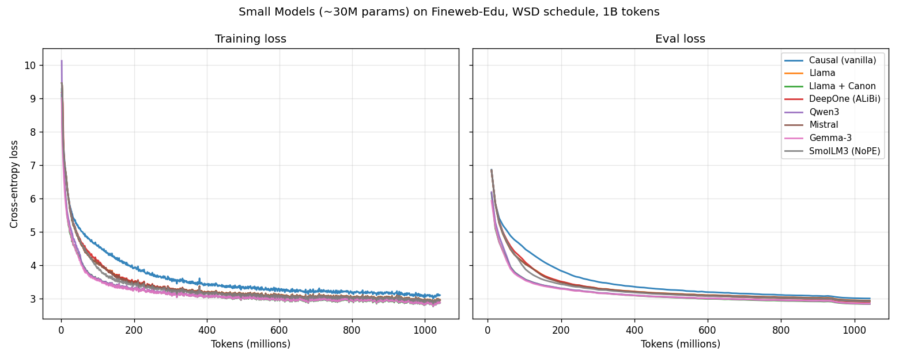
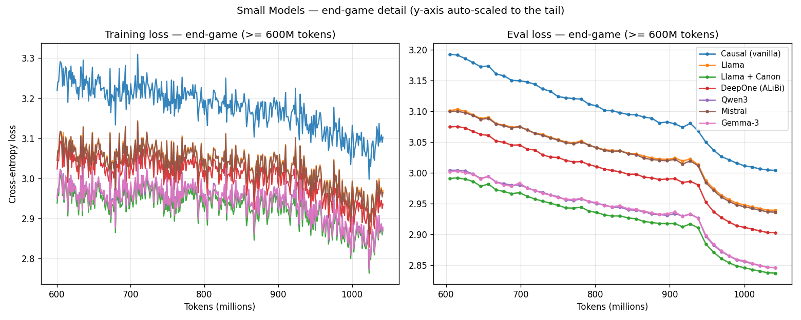
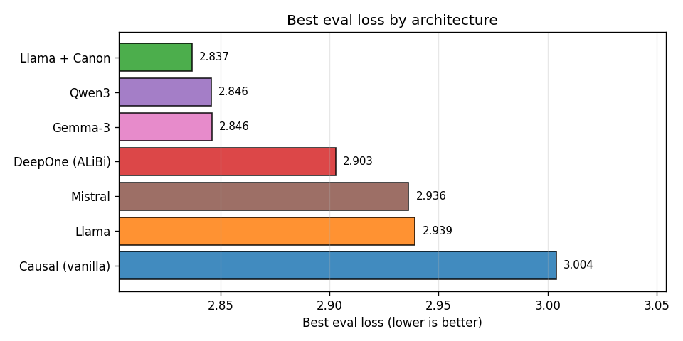

# Small Models

Train and compare different small language model architectures on the
[Fineweb-Edu](https://huggingface.co/datasets/HuggingFaceTB/smollm-corpus)
dataset with a shared 8K-token wikitext BPE tokenizer. All models are ~30M
parameters, allowing direct comparison of architecture choices under identical
conditions.

This is the larger sibling of [`tiny_models`](../tiny_models/): real text
(Fineweb-Edu rather than TinyStories), a longer context (`seq_len` 4096), and a
~7x bigger model — a fairer test of architecture differences than the 4M-param
TinyStories models, where the task is almost too easy to separate them.

The project builds on the **`projects/small.yaml`** base template (DDP trainer,
`flex_attention`, `torch.compile`), with two project-level changes in
[`templates/project.yaml`](templates/project.yaml):

- **WSD learning-rate schedule** (warmup-stable-decay), matching the
  [`diloco`](../diloco/) example: constant LR after warmup, then anneal to
  `min_lr` over the final phase.
- **1B-token budget** (double the small baseline's 500M), with the WSD
  **annealing phase set to 10%** of the budget (100M tokens).

## Configurations

All seven are Forgather-native model implementations, each ~30M parameters with
the shared wikitext-8K tokenizer:

| Config | Architecture | Key features | Params |
|--------|-------------|--------------|-------:|
| `small_causal.yaml` | Vanilla Transformer | Basic decoder-only transformer (MHA, learned PE) | 32M |
| `small_llama.yaml` | Llama | Pre-layer-norm, RoPE, SiLU GLU, GQA (untied embeddings) | 34M |
| `small_llama_canon.yaml` | Llama + Canon | Llama with Canon convolutional layers for local token mixing (tied embeddings) | 30M |
| `small_deepone.yaml` | DeepOne | Post-layer-norm, Deepnet initialization, ALiBi positional encoding | 38M |
| `small_qwen3.yaml` | Qwen3 | QK-norm, GQA, tied embeddings | 30M |
| `small_mistral.yaml` | Mistral | Llama variant with sliding-window attention, GQA | 34M |
| `small_gemma3.yaml` | Gemma-3 | Interleaved sliding/full attention, GLU + gelu-tanh, dual RoPE, tied embeddings | 34M |

Each config points the base template at a model project's `small.yaml`
definition under [`examples/models/`](../../models/). All seven share the same
wikitext-8K tokenizer and ~512-hidden / 10-layer shape, so differences in the
loss curves reflect architecture, not size or vocabulary.

## Usage

### Train a single model

Run locally in the foreground on a chosen GPU:

```bash
forgather -t small_qwen3.yaml train -d 0
```

### Train all models for comparison

Submit every config to the forgather-server scheduler. Jobs run in the
background and are placed on GPUs automatically as they free up; with seven
configs on five GPUs, five run concurrently and the rest start as GPUs free:

```bash
# Queue every config at one GPU per job (skips the project template).
for cfg in $(forgather ls | grep -oP '[\w./-]+\.yaml' | grep -v '^project\.yaml' | tr -d '[]'); do
    forgather -t "$cfg" submit --requested-gpus 1
done
```

`forgather submit` is the explicit spelling of `forgather train --schedule`.
The base template is a DDP config (`nproc_per_node = "gpu"`), so it would
otherwise spread one model across every visible GPU; `--requested-gpus 1` pins
each job to a single GPU (the DDP trainer transparently falls back to the
single-process path at world-size 1). To instead run one model across multiple
GPUs, raise the count — e.g. `--requested-gpus 4`.

> The bracket-stripping (`tr -d '[]'`) and `grep -v project.yaml` are there
> because `forgather ls` wraps the **default** config in `[brackets]` and lists
> the project template alongside the runnable configs.

These runs use `flex_attention` + `torch.compile` (from the base template).
Compilation adds a one-time startup cost of a couple of minutes but is well
worth it over a 1B-token run — it roughly doubles throughput and keeps ALiBi
(DeepOne) and sliding-window (Gemma-3) attention memory-flat at `seq_len` 4096.

This requires a running forgather server (`forgather server` starts one in
cluster mode). See `docs/guides/server-cli.md` for the full guide.

### Working with the scheduler

```bash
forgather job list                  # queued / running / done, per row
forgather job status <queue_id>     # live loss / step / throughput
forgather job tail <queue_id>       # stream a running job's output
forgather job logs <queue_id>       # dump the full captured log
forgather job stop <queue_id>       # graceful stop (saves a final checkpoint)
forgather job abort <queue_id>      # stop immediately without saving (e.g. a throughput probe)
forgather job cancel <queue_id>     # cancel a queued or running job
forgather job scheduler pause       # hold the queue (running jobs continue)
forgather job scheduler resume
forgather job cleanup               # remove terminal job records
```

Check GPU usage:

```bash
nvidia-smi                 # hardware view: memory + utilization per GPU
forgather gpu status       # scheduler's view: which GPUs it considers in use
```

### Compare results

```bash
python assets/generate_plots.py
```

## Experimental results

All seven configs were trained under an identical recipe — 1B tokens of
Fineweb-Edu, `seq_len` 4096, per-device batch 8, the WSD schedule (warmup 50M,
constant LR `~2.1e-4`, anneal over the final 100M), AdamW, gradient clipping at
3.0, `flex_attention` + `torch.compile` — one GPU each, scheduled across the
cluster. Differences in the curves therefore reflect **architecture**, not
size, vocabulary, data, or tuning.



At full scale the architectures pile on top of each other; the end-game view
below zooms to the final stretch (≥600M tokens, y-axis auto-scaled) where the
ordering separates and the WSD anneal pulls every curve down over the last 100M
tokens:





| Model | Best eval | Final train | Avg MFU | Notes |
|-------|----------:|------------:|--------:|-------|
| `small_llama_canon` | **2.837** | 2.871 | 11.4% | best loss, slowest (Canon convs) |
| `small_qwen3` | 2.846 | 2.878 | 20.3% | QK-norm, GQA, tied |
| `small_gemma3` | 2.846 | 2.878 | **22.8%** | best loss/throughput trade-off |
| `small_deepone` | 2.903 | 2.936 | 13.3% | post-LN + ALiBi |
| `small_mistral` | 2.936 | 2.965 | 22.4% | sliding-window |
| `small_llama` | 2.939 | 2.969 | 21.1% | pre-LN RoPE baseline |
| `small_causal` | 3.004 | 3.103 | 19.9% | vanilla (learned PE, no GLU) |

(Numbers from `assets/results.csv`; regenerate with `python assets/generate_plots.py`.)

### Observations

- **A clear top cluster.** `llama_canon`, `qwen3`, and `gemma3` finish within
  0.01 of each other (2.837–2.846) — a three-way statistical tie well ahead of
  the field. All three pair GQA with tied embeddings and modern norm placement
  (QK-norm in Qwen3/Gemma-3); those ingredients, not any single trick, are what
  separate the leaders.

- **Gemma-3 is the standout on the efficiency frontier.** It ties for the best
  loss *and* posts the highest MFU (22.8%), so it reaches a given loss in the
  fewest FLOPs and the least wall-clock — the interleaved sliding/full attention
  costs nothing in quality here and helps throughput.

- **Canon layers help, but they aren't free.** Adding Canon convolutional
  mixing to the Llama backbone improves best eval loss from 2.939 (`llama`) to
  2.837 (`llama_canon`) — a real, consistent gain — but roughly halves MFU
  (21.1% → 11.4%). It wins on quality-per-token and loses on quality-per-second.

- **The vanilla transformer is clearly last** (3.004). Learned positional
  embeddings, MHA, and a plain MLP leave a visible gap to every model with
  RoPE/ALiBi + GLU + GQA — a clean illustration of how much the now-standard
  Llama-era ingredients buy at this scale.

- **DeepOne holds the middle** (2.903) despite being the least stable run: its
  post-LN + DeepNet design let grad-norm creep into the ~1.8–2.6 band mid-run,
  but the clip guard plus the WSD LR decay brought it home without divergence.

### A note on stability (gradient clipping)

The base `small` template ships with no gradient clipping. On the first attempt,
**Qwen3 diverged** ~80M tokens in: a single bad data batch produced a monster
gradient spike (grad-norm ~39 vs the normal <2) that, unclipped, blew up the
weights and tripped the divergence detector. Several other models spiked at the
same batch but rode through it. Adding `max_grad_norm: 3.0` to the project (just
above the healthy grad-norm band, read off the TensorBoard plot) defuses the
spike while leaving normal training untouched; with it, all seven complete the
full 1B-token budget. This is a good illustration of why a loose gradient clip
is cheap insurance for small-model pretraining even when the median step looks
perfectly stable.

### Reproducing

```bash
# 1. queue all configs at one GPU each (see "Train all models" above)
for cfg in $(forgather ls | grep -oP '[\w./-]+\.yaml' | grep -v '^project\.yaml' | tr -d '[]'); do
    forgather -t "$cfg" submit --requested-gpus 1
done

# 2. wait for `forgather job list` to show them all `done`, then plot
python assets/generate_plots.py
```

## Adding a new model

1. Create a model project under `examples/models/` (or use an existing one),
   with a `small.yaml` config that uses the shared wikitext-8K tokenizer and is
   sized to ~30M parameters (verify with
   `forgather -t small.yaml model -r construct`).
2. Add a config in `templates/configs/` that sets `ns.model_project_dir` and
   `ns.model_project_config` to point to it.
3. Run `forgather ls` to verify it parses, and
   `forgather -t <cfg> model -r --device cuda:0 test` to confirm the model runs.

Note: with five GPUs, the first five models run concurrently and any extras
start as GPUs free up — so growing the set past five adds roughly one model's
runtime per extra GPU-wave rather than running everything at once.
