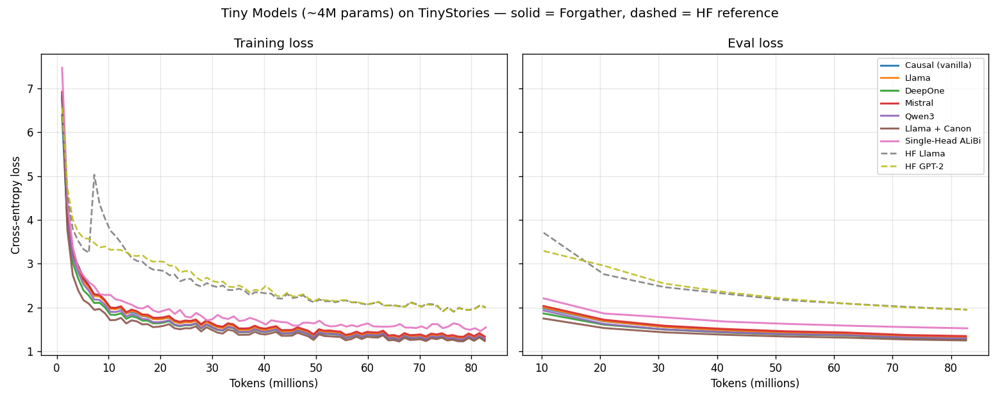
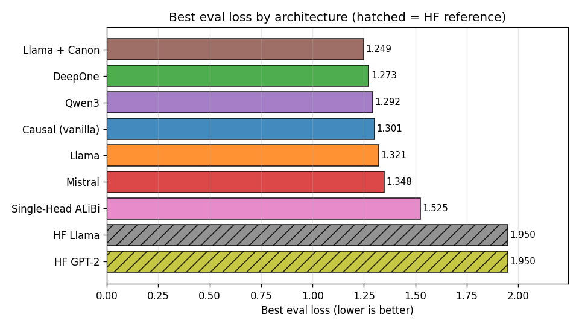

# Tiny Models

Train and compare different small language model architectures on the TinyStories
dataset with a shared 2K-token BPE tokenizer. All models are ~4M parameters,
allowing direct comparison of architecture choices under identical conditions.

The project is built on the **`projects/tinyv2.yaml`** base template (the
token-budget-driven `lm_training_project` line). Every config trains for the
same token budget (~80M tokens, `seq_len` 2048, per-device batch 8), with a
cosine-decay LR schedule and AdamW, so differences in the loss curves reflect
architecture rather than tuning.

## Configurations

**Forgather model implementations:**

| Config | Architecture | Key features |
|--------|-------------|--------------|
| `tiny_causal.yaml` | Vanilla Transformer | Basic decoder-only transformer, loosely based on "Attention is All You Need" |
| `tiny_fg_llama.yaml` | Llama | Pre-layer-norm, RoPE, SiLU activation, GQA |
| `tiny_deepone.yaml` | DeepOne | Post-layer-norm, Deepnet initialization, ALiBi positional encoding |
| `tiny_fg_mistral.yaml` | Mistral | Llama variant with sliding-window attention and GQA |
| `tiny_fg_qwen3.yaml` | Qwen3 | Qwen3 architecture |
| `tiny_llama_canon.yaml` | Llama + Canon | Llama with Canon convolutional layers for local token mixing |
| `tiny_single_head.yaml` | Single-Head ALiBi | Single attention head with ALiBi, using eager attention |

**HuggingFace model implementations** (for comparison with Forgather equivalents):

| Config | Architecture | Notes |
|--------|-------------|-------|
| `tiny_hf_llama.yaml` | HF LlamaForCausalLM | Llama reference baseline (HF implementation; see results for caveats vs. `tiny_fg_llama`) |
| `tiny_hf_gpt2.yaml` | HF GPT2LMHeadModel | GPT-2 architecture |

## Usage

### Train a single model

Run locally in the foreground (one GPU, attached to your terminal):

```bash
forgather -t tiny_fg_llama.yaml train
```

### Train all models for comparison

The recommended way to run the whole sweep is to **submit every config to the
forgather-server scheduler**. Jobs run in the background and are placed on GPUs
automatically as they free up, so you can queue all nine at once and walk away:

```bash
# Queue every config (skips the project template). The scheduler runs as many
# in parallel as there are free GPUs and holds the rest in the queue.
for cfg in $(forgather ls | grep -oP '[\w./-]+\.yaml' | grep -v '^project\.yaml' | tr -d '[]'); do
    forgather -t "$cfg" submit
done
```

`forgather submit` is the explicit spelling of `forgather train --schedule`:
it hands the job to the scheduler instead of running it in your terminal. Each
prints a queue id, e.g. `queued: q_..._... (priority=0, gpus=1)`.

> The bracket-stripping (`tr -d '[]'`) and `grep -v project.yaml` are there
> because `forgather ls` wraps the **default** config in `[brackets]` and lists
> the project template alongside the runnable configs.

This requires a running forgather server. If you don't have one, start one in
cluster mode (loopback is fine):

```bash
forgather server          # background, default cluster "default"
```

See `docs/guides/server-cli.md` for the full server/scheduler guide.

### Working with the scheduler

Once jobs are queued, manage them with `forgather job`:

```bash
# Which jobs are queued / running / done (project + config shown per row)
forgather job list

# Live status (loss, step, throughput) for one running job
forgather job status <queue_id>

# Tail a running job's output until it ends or you Ctrl-C
forgather job tail <queue_id>

# Dump the full captured log for any job (running or terminal)
forgather job logs <queue_id>

# Stop a job gracefully (saves a final checkpoint), or cancel a queued one
forgather job stop <queue_id>
forgather job cancel <queue_id>

# Pause / resume the scheduler (running jobs keep going; queued ones wait)
forgather job scheduler pause
forgather job scheduler resume

# Remove terminal job records once you're done with them
forgather job cleanup
```

Check GPU usage at any time — both the live hardware view and the scheduler's
own GPU bookkeeping:

```bash
nvidia-smi                 # hardware view: memory + utilization per GPU
forgather gpu status       # scheduler's view: which GPUs it considers in use
```

### Compare results

Once the runs finish, compare their loss curves:

```bash
forgather logs plot --compare output_models/*/runs/*/trainer_logs.json \
    --loss-curves --output tmp/compare.png
```

## Experimental results

All nine configs were trained under identical conditions on the v2 template —
~82M tokens of TinyStories, `seq_len` 2048, per-device batch 8, the same
cosine-decay LR schedule (peak `1.5e-3`, warmup 4M tokens) and AdamW — one GPU
each, scheduled across the cluster as described above. Because the budget and
schedule are shared, differences in the curves reflect **architecture and
initialization**, not tuning.





| Model | Family | Final train | Final eval | Best eval | Avg MFU |
|-------|--------|------------:|-----------:|----------:|--------:|
| `tiny_llama_canon` | Forgather | 1.236 | 1.249 | **1.249** | 5.0% |
| `tiny_deepone` | Forgather | 1.263 | 1.273 | 1.273 | 5.9% |
| `tiny_fg_qwen3` | Forgather | 1.279 | 1.292 | 1.292 | 5.4% |
| `tiny_causal` | Forgather | 1.289 | 1.301 | 1.301 | 7.7% |
| `tiny_fg_llama` | Forgather | 1.308 | 1.321 | 1.321 | 6.0% |
| `tiny_fg_mistral` | Forgather | 1.339 | 1.348 | 1.348 | 5.4% |
| `tiny_singlehead` | Forgather | 1.545 | 1.525 | 1.525 | 2.8% |
| `tiny_hf_llama` | HF ref | 2.000 | 1.950 | 1.950 | 8.3% |
| `tiny_hf_gpt2` | HF ref | 1.990 | 1.950 | 1.950 | 5.3% |

(Numbers from `assets/results.csv`; regenerate with `python assets/generate_plots.py`.)

### Observations

- **The Forgather implementations cluster tightly** between ~1.25 and ~1.35
  eval loss. `tiny_llama_canon` leads — the Canon convolutional mixing layers
  give a small but consistent edge at this scale — with DeepOne, Qwen3, the
  vanilla causal transformer, Llama, and Mistral close behind. The differences
  among them are small relative to run-to-run noise, which is the expected
  outcome at ~4M parameters on a dataset this simple.

- **Single-Head ALiBi (1.525) is the weakest Forgather model**, as designed:
  it is a deliberately minimal single-attention-head baseline, and its lower
  MFU (2.8%) reflects the `eager` attention path it forces.

- **The HuggingFace reference models lag well behind (~1.95)** despite training
  on the same data, budget, and LR schedule. The gap opens early — by 10M
  tokens the HF curves are already a full nat above the Forgather cluster — and
  persists. The likeliest driver is **initialization**: the Forgather model
  library applies tuned init schemes (e.g. DeepNet-style residual scaling,
  scaled output projections) that matter disproportionately for very small,
  short-budget models, whereas the HF references use their library-default init.
  The architectures are also not byte-identical (the HF Llama here uses 2 heads
  / 1024 intermediate vs. the Forgather Llama's 4 heads / 768), so this is a
  *reference baseline*, not a controlled ablation of a single variable. The HF
  Llama run also shows a brief loss spike near 7M tokens before recovering — a
  reminder that tiny models on an aggressive LR can be transiently unstable.

- **MFU is low across the board (3–8%)** because these models are far too small
  to saturate the GPU; throughput here is dominated by launch/kernel overhead,
  not compute, so MFU is not a meaningful efficiency ranking at this scale.

### Reproducing

```bash
# 1. queue all configs (see "Train all models for comparison" above)
for cfg in $(forgather ls | grep -oP '[\w./-]+\.yaml' | grep -v '^project\.yaml' | tr -d '[]'); do
    forgather -t "$cfg" submit
done

# 2. wait for `forgather job list` to show them all `done`, then plot
python assets/generate_plots.py
```

## Adding a new model

1. Create a model project under `examples/models/` (or use an existing one)
2. Add a config in `templates/configs/` that sets `ns.model_project_dir` and
   `ns.model_project_config` to point to your model
3. Run `forgather ls` to verify it parses correctly
