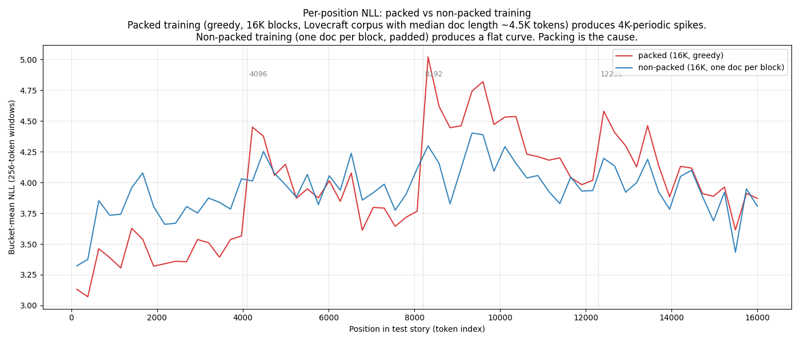

# H.P. Lovecraft fine-tunes: investigation of the 4K-periodic NLL spike

This document is a live investigation log for the 4096-token-periodic per-token
NLL spikes observed in all Lovecraft long-context fine-tunes.  See
`long_context_experiments.md` for the parent experiment.  Findings are noted
as they come in; some hypotheses are refuted here without being removed so the
reasoning trail is visible.

## Observation

All five trained Lovecraft variants (Mistral / Llama × default / YaRN ×
sliding / noslide) show **exactly-4096-token-periodic** NLL spikes when
evaluated on a continuous long-context held-out story.  The spike phase
varies by story (4352 in *At the Mountains of Madness*, 2304 in *The Case of
Charles Dexter Ward*), but within any given story the spacing is always
exactly 4096.  Peak values are 2-3 NLL higher than the adjacent low, and
NLL decays smoothly over ~4K tokens back to the low before the next spike.

The untrained base model does *not* show this pattern -- it has a smooth NLL
with gradual degradation past the pretrain context.  So the spike is
introduced by fine-tuning.

## Refuted hypotheses

### Story-content explanation (refuted)

Three spikes at exact 4K multiples can't plausibly be story content
coincidence.  And the phase-vs-content dependence argues against pure
position-locking.  *Partial* evidence: the story text at spike positions is
ordinary prose, not structural markers.  Confirmed refuted by subsequent
experiments.

### Mistral sliding-window hypothesis (refuted)

Initially suspected that Mistral's sliding_window=4096 caused the first spike
via the BOS-drops-out-of-window mechanism (Xiao et al. 2023, *Efficient
Streaming Language Models with Attention Sinks*,
[arxiv:2309.17453](https://arxiv.org/abs/2309.17453)).  Refuted by two
observations:

1. Sliding window is continuous past the first transition; it doesn't predict
   additional spikes at 8K and 12K.
2. Investigation of the Forgather code found that the SDPA path was *ignoring*
   the sliding_window setting entirely -- `causal_mask.py` read
   `config.window_size` but the field is named `sliding_window`, so the
   create_sliding_window_causal_mask branch was never taken.  Both "with
   sliding" and "without sliding" variants were architecturally identical.
   (Separately fixed -- see parent doc.)

### RoPE frequency resonance (refuted)

Observed that the geometric distribution of RoPE inv-freqs with
`rope_theta=10000, d_head=128` places many dimensions (roughly dims 28-45) at
periods that are integer-fraction harmonics of 4096.  Hypothesised that
collective phase alignment at 4K multiples might be driving the spikes.

**Refuted by direct experiment.**  Trained four Mistral variants with
rope_theta ∈ {5000, 20000, 40000, 500000} (spanning a 100× range) and one
Llama-2-7B with `rope_type: "llama3"`.  If the hypothesis were correct, spike
spacing should scale with `rope_theta^0.703`:

| Variant | rope_theta | Predicted dim-45 period | **Observed spikes** | Observed spacing |
|---------|-----------:|------------------------:|---------------------|-----------------:|
| theta=5000 | 5000 | 2506 | 4224, 8320, 12672 | 4096 |
| theta=10000 (baseline) | 10000 | 4080 | 4352, 8448, 12544 | 4096 |
| theta=20000 | 20000 | 6643 | 4224, 8320, 12672 | 4096 |
| theta=40000 | 40000 | 10814 | 4224, 8320, 12672 | 4096 |
| theta=500000 | 500000 | 63866 (past eval window) | 4224, 8320, 12672 | 4096 |
| llama3_rope | — | — | 4224, 8320, 12416 | 4096 |

Spike spacing is *independent* of rope_theta across a 100× range.  Even at
theta=500000, where the fundamental RoPE period (63866) is almost 4× the
entire eval window, spikes still land at exactly 4K intervals.  RoPE is not
the cause.

## Confirmed cause: packed-data document-boundary distribution

Context-length sweep (8K, 12K, 16K training with packed data) all show 4K
spikes -- spike spacing is *not* set by training context length.  Even
8K-context-trained models show spikes at positions 4224, 8320, 12672 on a
16K evaluation sequence, despite never having seen positions beyond 8192
during training.

The decisive test was **non-packed training** (`packed: False`, each 16K
block is one padded document with no mid-block document boundaries).  Its
per-position NLL is *flat* (3.3-4.4 range, no local maxima) -- no 4K
spikes.  Conclusion: the 4K-periodic pattern is introduced by packed
training, specifically by the distribution of document boundaries in the
packed data.

### Why exactly 4096 (for this corpus)?

The Lovecraft corpus has median story length ≈ 4527 tokens.  31 of 63
stories are in the 2K-6K range.  With greedy packing into 16K blocks, a
typical block contains 3-4 stories and document boundaries concentrate
around multiples of the median story length -- which for this corpus
happens to be near 4K.  The "4K" is not an architectural constant; it is
a property of the specific corpus.

During training, the data collator uses `document_starts` to build
position_ids that reset at each document boundary.  The attention mask
also confines each document's tokens to attend only within their own
document.  The model learns "attention resets every ~4K tokens" as a
feature of the training data.  At eval on a continuous story (no
boundaries), the model still fires the learned reset expectation at ~4K
multiples -- producing the NLL spikes.

### What this explains

- **Untrained model**: no spikes -- hasn't seen packed training.
- **Any `rope_theta`**: same spikes -- it's not RoPE.
- **Any training context length**: same spikes -- it's not the training window.
- **Non-packed training**: **no spikes** -- decisive.
- **Phase varies by story**: spike position tracks where the learned
  reset cadence aligns with the story's token stream.  Story-specific
  phase is what you would expect from a learned expectation colliding
  with unfamiliar content.

### Implications

For long-context fine-tunes where coherent generation matters, the choice
is between:

1. **Packed training with corpus-aware spike**: efficient use of data
   (~95% token utilisation) at the cost of periodic NLL artefacts tied to
   the typical document length of the corpus.
2. **Non-packed training**: smoother NLL profile but worse data
   efficiency, since each block has one document plus padding.
3. **Randomised-offset packing**: packed data with document boundaries
   deliberately placed at uniformly random positions (not implemented
   here).  Would keep the data efficiency while breaking the
   deterministic 4K-periodic learned signal.

For the Lovecraft headline YaRN result (30% PPL reduction at 16K on
Llama-2-7B), the spike pattern is averaged over and doesn't affect the
conclusion -- but it does mean the *local* NLL shape of packed-trained
models is less usable as a diagnostic than it first appeared.

### What this does *not* explain

Why the spike has magnitude ~2-3 NLL (not smaller).  A single "expected
reset" event at an attention-head level ought to be correctable through
later forward compute.  Some understanding of why the model fails to
recover quickly from the spurious-reset expectation (and whether it
recovers at all past the spike) would be a useful follow-up -- probably
requires inspection of which attention heads fire the periodic signal
and whether the per-head contributions can be surgically disabled.

## Infrastructure

- `/tmp/run_theta_sweep_eval.sh` -- parallel eval across 5 GPUs
- `/tmp/analyze_spikes.py` -- extract spike positions from eval reports
- `/tmp/rope_phase_analysis.py`, `/tmp/rope_similarity_to_origin.py` -- RoPE
  phase analysis that partially invalidated the resonance hypothesis before
  the training sweep sealed it
