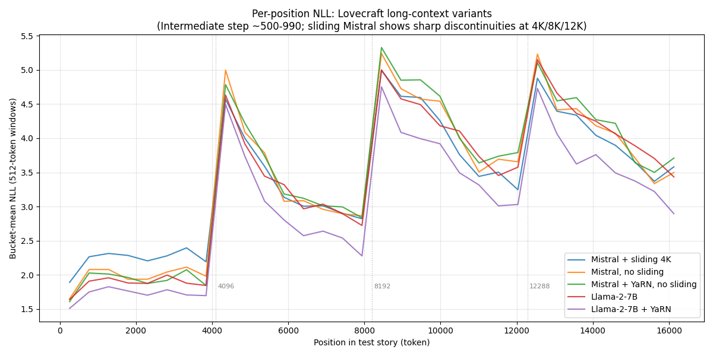

# H.P. Lovecraft long-context experiments — preliminary findings

> **Important caveat (2026-04).**  Every experiment in this document was
> produced with the tutorial's pre-`finetune_v2` template stack, which had a
> plumbing gap: the training project exposed `--window-size` as a CLI flag
> but never forwarded it into the dataset's `block_tokenize_fn`.  The
> tokenizer therefore kept its default `max_length=4096` on every run,
> regardless of the CLI argument.  "16K training" was actually 4K-tokenized
> data, packed or padded to a 16K sequence by the data collator.
>
> What was being compared across variants -- YaRN on/off, sliding window
> on/off, rope_theta sweep -- is still a valid *apples-to-apples* comparison,
> because every variant hit the same plumbing gap.  But the absolute numbers
> below are "what a 4K fine-tune does when evaluated at 16K", not "what a
> real 16K fine-tune does."  The YaRN headline in particular should be
> re-verified on a properly-plumbed 16K fine-tune before being treated as a
> definitive claim.  See `4k_spike_investigation.md` for the plumbing-gap
> write-up and how the newer `projects/finetune_v2.yaml` template closes it.

## Background: RoPE, extrapolation, and YaRN

Decoder-only transformers encode token position through **Rotary Position Embedding (RoPE)** -- Su et al. 2021, *RoFormer* ([arxiv:2104.09864](https://arxiv.org/abs/2104.09864)).  RoPE rotates each query/key vector by a position-dependent angle before the attention dot-product, so the similarity between two tokens depends on their *relative* distance.  The rotation frequencies `inv_freq_d = 1 / base ** (2d / D)` cover many scales: the highest-index dimension rotates by a tiny angle per token (useful for long-range attention), the lowest-index dimensions rotate fast (useful for local).  RoPE's distinguishing property is that distances only matter up to positions the model has *seen* during training -- the function itself is well-defined at any position, but Q/K projections were never optimised against angle values they didn't encounter.  A Llama-2 model trained at 4096 positions behaves strangely when asked about positions beyond 4096, especially for the slow-rotating high-index frequencies which effectively become new rotation *phases* past the training max.

The simplest "fix" for extending context is **Position Interpolation** -- Chen et al. 2023, [arxiv:2306.15595](https://arxiv.org/abs/2306.15595) -- which divides every inverse frequency by a scale factor `s`, so positions `0..s·L_train` map back into the model's pretrained range `0..L_train`.  This works but compresses every frequency equally, including the high-frequency dimensions that already generalise fine.  The unnecessary compression of high-frequency dimensions pulls the model off-distribution even at positions inside the original range.

**NTK-aware scaling** (community work summarised by bloc97; later formalised) observed that the high-frequency dimensions don't need rescaling -- only the low-frequency, slow-rotating ones drift out-of-distribution at new positions.  Applied per-frequency rather than uniformly, the model's short-range behaviour is preserved.

**YaRN** -- Peng, Quesnelle, Fan, and Shippole 2023, *YaRN: Efficient Context Window Extension of Large Language Models* ([arxiv:2309.00071](https://arxiv.org/abs/2309.00071)) -- combines the above into a single method and adds a third component:

1. **NTK-by-parts frequency scaling.**  For each RoPE frequency `inv_freq_d`, compute both an extrapolated version (unchanged) and an interpolated version (divided by `factor`).  Blend them via a linear ramp indexed by frequency band.  Two hyperparameters `beta_fast` and `beta_slow` determine where the ramp starts and ends: below the ramp, frequencies are unchanged; above, they are interpolated.  This keeps high-frequency dimensions faithful to the pretraining distribution while correcting the slow-rotating tail.
2. **Length-dependent attention temperature.**  As sequences get longer, attention softmax tends to distribute its mass more uniformly -- a known problem for transformers at scale.  YaRN adds a small correction `mscale = 0.1 * ln(factor) + 1` that scales the final Q·K dot-products before the softmax, countering the entropy-increasing effect of longer sequences.
3. **Original context window as an anchor.**  The ramp bounds depend on the model's original pretrained position limit, so YaRN's behaviour differs by architecture: a factor of 4 with `original_max_position_embeddings=4096` (Llama-2-7B's pretraining) scales differently than `original_max_position_embeddings=8192` or `32768`.

These three components together recover most of the model's in-distribution behaviour at extrapolated positions while adding no trainable parameters.  YaRN can be applied at inference-time only (swap in a patched `config.json`) or during fine-tuning (for tighter adaptation).

### Implementations drawn from

- **HuggingFace Transformers `modeling_rope_utils.py`** -- YaRN, NTK, linear, LongRoPE reference implementations.  Forgather's `apply_yarn_scaling()` ports the same math but keeps the existing rotary-module structure.
- **Mistral 7B** -- Jiang et al. 2023, [arxiv:2310.06825](https://arxiv.org/abs/2310.06825).  The sliding-window attention is documented in section 3.1; the 4096-token window is a deliberate architectural choice to cap the per-token attention cost and soften the long-context problem.
- **Llama 2** -- Touvron et al. 2023, [arxiv:2307.09288](https://arxiv.org/abs/2307.09288).  Llama-2-7B was pretrained with `max_position_embeddings=4096` and no sliding window, so it is an archetypal extrapolation-fix target.

## Experimental setup

Five 7B fine-tunes on the Lovecraft corpus, all at lr=5e-5, batch 1, 16K context, packed dataset.  Training stopped at comparable step counts (990-1270) via `forgather control save-stop`.  Stack: Adafactor, gradient checkpointing, activation offload, SDPA flash/mem-efficient backend, fused cross-entropy loss.

| Variant | Architecture | Sliding window | RoPE | Final step | Final train loss |
|---------|-------------|----------------|------|-----------|------------------|
| mistral_base | Mistral-7B-v0.1 | 4096 (default) | default θ=10000 | 990 | 2.47 |
| mistral_noslide | Mistral-7B-v0.1 | null | default θ=10000 | 1160 | 1.79 |
| mistral_yarn_noslide | Mistral-7B-v0.1 | null | yarn factor=2, orig=8192 | 1170 | **1.69** |
| llama_base | Llama-2-7B | null (no sliding) | default θ=10000 | 1270 | 1.91 |
| llama_yarn | Llama-2-7B | null | yarn factor=4, orig=4096 | 1160 | 2.44 |

Note the apparent discrepancy between training loss and test PPL (below) for Llama variants — llama_yarn has *higher* train loss (2.44) but lower test PPL (20.5) at 16K.  This is because YaRN's position-remapping makes the training *objective* harder to fit (it's learning against unfamiliar rescaled positions) while making the *inference* generalisation smoother.

## Headline result: YaRN on Llama-2-7B gives a 30% PPL reduction at 16K

Windowed perplexity at each context length, evaluated on the held-out "At the Mountains of Madness" story:

| Context | mistral_base | mistral_noslide | mistral_yarn_noslide | llama_base | **llama_yarn** |
|---------|-------------:|----------------:|---------------------:|-----------:|---------------:|
| 2048 | 8.9 | 6.9 | 6.7 | 6.3 | **5.5** |
| 4096 | 9.3 | 7.2 | 6.8 | 6.5 | **5.6** |
| 8192 | 16.5 | 15.2 | 14.9 | 13.7 | **10.7** |
| 12288 | 25.0 | 25.3 | 25.8 | 22.8 | **16.6** |
| 16384 | 30.6 | 31.5 | 32.7 | 29.7 | **20.5** |

llama_yarn wins at every context length.  The improvement over llama_base grows with length (12% at 2K, 30% at 16K), consistent with YaRN's mechanism: negligible effect on positions within the pretrained range, strong effect where the model would otherwise be extrapolating into uncalibrated position territory.

## Per-position NLL: a 4096-periodic spike pattern

**Resolved (2026-04).**  The spikes are a direct consequence of the
4K-tokenized training data described in the caveat above.  The model learned
a 4K "within-bundle" structure and reproduced it as periodic NLL spikes when
evaluated on continuous text.  See `4k_spike_investigation.md` for the full
walk-through of the hypotheses that were refuted before the plumbing gap was
identified.

The historical hypothesis chain below is preserved for reference; the text
predates the plumbing-gap discovery.



All five **trained** variants show NLL spikes at *exactly* 4096-token intervals.  On "At the Mountains of Madness" the spikes are at positions 4352, 8448, 12544 (spacing = 4096).  On "The Case of Charles Dexter Ward" they are at positions 2304, 6400, 10496, 14592 (spacing = 4096).  Each spike peaks 2-3 NLL above the baseline then decays over the following 4K tokens until the next spike.

ΔNLL from pos 3328 to pos 4352 (the first spike on ATMoM):

| Variant | ΔNLL | Pre-spike NLL | At-spike NLL |
|---------|-----:|---------------:|-------------:|
| mistral_base (sliding 4K) | +2.17 | 2.40 | 4.57 |
| mistral_noslide | +2.89 | 2.11 | 5.00 |
| mistral_yarn_noslide | +2.71 | 2.08 | 4.79 |
| llama_base | +2.75 | 1.88 | 4.63 |
| llama_yarn | +2.79 | 1.71 | 4.50 |

What is actually going on is not yet fully understood.  Initial speculation attributed the first spike to Mistral's 4K sliding window losing the BOS token as context slides past it (a plausible mechanism for *one* discontinuity at 4K -- see Xiao et al. 2023, *Efficient Streaming Language Models with Attention Sinks*, [arxiv:2309.17453](https://arxiv.org/abs/2309.17453)).  That theory does not extend to three spikes at 4K, 8K, and 12K -- a sliding window is continuous past the first transition.  The "story-content" hypothesis is also ruled out: the spikes occur at different phases on different stories.

Controls that have been run:

- **Untrained base Mistral** (no Lovecraft fine-tuning): smooth NLL for the first ~9K tokens, then monotonic degradation beyond.  No 4K-periodic spikes at all.  **The pattern is introduced by fine-tuning.**
- **Same story, shorter eval window**: evaluating just positions 0-5000 still produces the spike at 4352, identical to when the full 16K is evaluated.  **The spike is not a long-context or SDPA-backend artifact** — it is produced by the model's prediction of a specific token given the prior context.
- **Different story, same model**: spikes still 4096 apart but with a different phase offset.  **The position of the first spike depends on story content.**
- **Both trained Mistral variants** (`sliding_window=4096` vs `sliding_window=null` in the config): show identical spike patterns.  Investigation showed the sliding-window config is dead code under the SDPA backend in Forgather's current attention wiring (it reads `config.window_size`, but the config field is `sliding_window`).  So the two "sliding-window" variants are architecturally identical and the 4K pattern is not sliding-window-induced.

### RoPE resonance hypothesis — partially tested, not cleanly confirmed

An appealing hypothesis was that the geometric spacing of RoPE inv-freqs (with `rope_theta=10000`, `d_head=128`) places many consecutive dimensions at periods that divide 4096, producing a "phase alignment" at 4K multiples that the model learns as a structural cue.  The relevant dimensions:

| dim range | period (tokens) | naive alignment with 4096 |
|-----------|----------------:|---------------------------|
| 28-29 | 353, 408 | 4096 / 10 or 11 |
| 30-31 | 471, 544 | 4096 / 8 or 9 |
| 32-33 | 628, 726 | 4096 / 6 or 7 |
| 34 | 838 | 4096 / 5 |
| 35-36 | 968, 1117 | 4096 / 4 |
| 37-38 | 1290, 1490 | 4096 / 3 |
| 40 | 1987 | 4096 / 2 |
| 45 | 4080 | **4096 / 1** |

These dimensions *individually* return to their phase-0 angle at 4096 multiples.  However, a closer analysis invalidates the simple version of the story: the summed RoPE similarity to the identity rotation, `sum_d cos(P * inv_freq_d)`, shows the top peaks at positions 580, 1189, 1835, 2445, 3261, 4348, 5020, 5798, 6696, 7733, 8940, ... -- **not at 4K multiples**.  Position 4096 itself has a negative similarity score (-3.38), meaning the RoPE vector there is anti-aligned with the origin, not aligned.  Position 4348 happens to be near ATMoM's 4352 spike, but the peak structure does not repeat at 4K spacing.

So:

- **The per-dimension harmonics table above is true but misleading.**  Individual dims 28-45 do align at 4096, but the RoPE vector as a whole does *not* return to the identity rotation at 4K multiples -- other dimensions are in different phases.
- **Phase alignment is a more general phenomenon than the 4K spikes.**  Strong alignment occurs at many positions (580, 1189, 1835, ...), but the NLL spikes are only at 4K multiples.  So alignment alone is not sufficient to cause spikes.
- **The 4K-spike periodicity is unexplained** by the simple RoPE story.  The spike positions are still training-induced (absent on the untrained model), still content-phase-dependent (different offsets per story), and still exactly 4096 apart.

### Experiments that would help invalidate the hypothesis

To nail this down, the productive next steps are:

1. **Vary `rope_theta` and retrain.**  If the spike spacing is set by dim-45's period, retraining with `rope_theta=8000` or `20000` should move the spikes proportionally.  If the spacing stays at 4096, RoPE is not the cause.
2. **Llama-3 RoPE variant.**  Llama-3 uses `rope_theta=500000`, making dim-45's period roughly 63K tokens.  A fine-tune with Llama-3-style RoPE should show no 4K spikes at all within a 16K eval window.
3. **Pack on randomised document-start offsets.**  The current packing puts document starts at content-determined positions.  Force document_starts at uniformly-random offsets during packing and retrain.  If the spikes disappear, they were induced by the packing geometry, not RoPE.
4. **Train on a non-Lovecraft corpus at the same seq_len.**  Spikes that appear at identical absolute positions regardless of corpus argue for a position-anchored (RoPE / packing) cause.  Spikes at different positions argue for content-specific attention-sink effects.
5. **Vary `max_position_embeddings` at fine-tune time.**  At 8K context, do spikes still happen at 4K or do they halve to 2K?  A spacing that tracks context length suggests something about packing or attention-window propagation; a spacing that stays at 4K points at a position-encoding or pretraining-induced cause.

### Why 4K and not other powers of 2?

Taking the user's observation seriously: if simple phase alignment caused spikes, we'd see them at many powers of 2 (1024, 2048, 4096, 8192, ...), not just 4096.  We don't -- spikes are *only* at 4K multiples.  This favours interpretations where 4K is special for some *non-generic* reason: Mistral's pretrain sliding-window was 4096, so the pretrained weights may encode features keyed to a 4K window.  Llama-2-7B's pretrain `max_position_embeddings` was 4096.  Both base models have "first-4K-only" experience from pretraining, and a 16K fine-tune may surface that as periodic NLL artefacts.

Worth noting that this resonance / aliasing phenomenon shows up in many unrelated domains: timing-wheels in real-time systems, sampling artefacts in signal processing, etc.  A standard trick is to make all periods mutually prime so no two frequencies alias at any reachable position.  Substituting `inv_freq = 1 / prime[d]` (for a list of increasing primes) in RoPE would preserve the rough geometric spread but eliminate integer-ratio alignments -- plausibly worth trying as a future experiment.

**What the spike is NOT, based on the controls run:**
- Not a sliding-window artifact (sliding-window config is not active in the SDPA path).
- Not a pretrained-weight artifact (absent from the untrained base model).
- Not a long-context or SDPA-backend artifact (survives a 5K-context eval).
- Not a story-content artifact (different phase per story, but always exactly 4096 apart).

This is flagged as an open question for future investigation.  Regardless of the cause, the llama_yarn PPL result below — measured as an average over the full 16K window, so it integrates over the spike pattern — remains valid.

However, looking at the **absolute** NLL at each position rather than the jump, llama_yarn is consistently lowest:

| Position | llama_base | llama_yarn | YaRN Δ |
|----------|-----------:|-----------:|-------:|
| 256 | 1.64 | 1.51 | -0.13 |
| 2304 | 1.88 | 1.70 | -0.18 |
| 4352 (spike) | 4.63 | 4.50 | -0.14 |
| 6400 | 2.97 | 2.57 | **-0.40** |
| 8448 (spike) | 5.00 | 4.75 | -0.25 |
| 10496 | 4.11 | 3.49 | **-0.62** |
| 12544 (spike) | 5.15 | 4.73 | -0.42 |
| 14592 | 4.06 | 3.49 | **-0.57** |
| 15616 | 3.70 | 3.22 | -0.48 |

The YaRN improvement is *smaller* at spike positions (where story-content dominates) and *larger* in between.  Away from natural spikes, YaRN brings a consistent 0.4-0.6 NLL reduction at positions past 6K.

## YaRN is neutral on Mistral (pretrained at 32K)

Mistral-7B-v0.1 was pretrained with `max_position_embeddings=32768`.  At 16K context, the model isn't extrapolating beyond its pretraining distribution, so YaRN's rescaling has nothing to correct:

| Context | mistral_noslide | mistral_yarn_noslide | YaRN Δ ppl |
|---------|----------------:|---------------------:|-----------:|
| 2048 | 6.9 | 6.7 | -3% |
| 4096 | 7.2 | 6.8 | -6% |
| 8192 | 15.2 | 14.9 | -2% |
| 12288 | 25.3 | 25.8 | +2% |
| 16384 | 31.5 | 32.7 | +4% |

Training loss showed a small YaRN advantage for Mistral (1.69 vs 1.79) — but this doesn't transfer to held-out PPL.  The training advantage is likely the model fitting YaRN's rescaled positions onto the training distribution specifically; it doesn't generalise.

## Sliding window creates a small PPL penalty, not a catastrophic one

Comparing mistral_base (sliding=4096) to mistral_noslide at 16K: PPL 30.6 vs 31.5 — a 3% difference, where sliding window is *slightly better*.  The sliding window is not the catastrophic bottleneck the intermediate eval suggested.

What sliding window *does* do is cap the information flow: the model at position 10K cannot see anything from positions 0-6K.  For the Lovecraft fine-tune test story, the per-token prediction doesn't suffer much because short-range dependencies dominate the loss.  The real impact would be in tasks requiring long-range integration (tracking characters, plot coherence) — which isn't measured by next-token PPL.

## Inference-time YaRN on Llama: extrapolation fix without retraining

The most practical finding: a Llama-2-7B fine-tuned at 16K with plain RoPE has PPL 29.7 at 16K.  Swapping to YaRN (factor=4, original=4096) during fine-tuning improves this to 20.5 — but YaRN is also applicable at *inference time only*, as a config-file change.  Users can take any existing Llama-2 fine-tune, set `rope_type: "yarn"` in config.json, and reap the long-context benefit without retraining.

(The fine-tune itself benefits from learning against YaRN positions, but the bulk of the positional-encoding correction is architectural — it's inherent to the rotary-embedding calculation, not learned by the model.)

## Training cost

Each 10-epoch run targeted 1560 steps on a single RTX 4090.  Actual durations:
- mistral_base: 990 steps (early save-stop) in ~4h
- Others: 1160-1270 steps in ~5-7h (variable due to 5-way GPU contention)

Total GPU-hours: ~30.  LR was 5e-5 throughout; the default tutorial LR of 3.5e-6 was severely undertrained (plateaued at loss ~5.3 after 500 steps; lr=5e-5 reaches ~2.0 in similar step budget).

## Infrastructure added to Forgather

- **YaRN scaling** in `modelsrc/transformer/rotary_embeddings.py` (commit 7c36805, 3 unit tests).  Configure via `rope_parameters` in the model config.
- **Long-context eval harness** at `examples/tutorials/hp_lovecraft_project/long_context_eval.py` (commits 1fe4831, 4e45a5a).  Windowed PPL + per-position NLL + long-form generation.
- **`--lr` config-flow fix** in the tutorial's `long_context.yaml`.  Previously a hard-coded `lr: 3.5e-6` silently overrode the CLI arg.

## Reproducing the experiments

> **Heads up.**  The commands below are preserved for reference but target
> the *pre-migration* template stack (`long_context.yaml` +
> `long_context_packed.yaml`), which is what produced the numbers in this
> document.  Those configs have been removed from the reference project and
> replaced with the `finetune_v2`-based `default.yaml` / `16k.yaml`
> (finetune side) and `lovecraft-packed.yaml` (dataset side).  Adapt the
> commands below to the new template names before re-running.

The five variants used these model directories (copies of the base model
with `config.json` / `mistral.py` patched as appropriate):

```bash
# Base models are assumed already converted:
#   ~/models/fg_mistral_7b      (Mistral-7B-v0.1, sliding_window=4096)
#   ~/models/fg_llama_7b        (Llama-2-7B, no sliding window)

# Mistral without sliding window
cp -r ~/models/fg_mistral_7b ~/models/fg_mistral_7b_v_noslide
python3 -c "
import json
p = '$HOME/models/fg_mistral_7b_v_noslide/config.json'
c = json.load(open(p)); c['sliding_window'] = None
json.dump(c, open(p, 'w'), indent=2); open(p, 'a').write('\n')
"

# Mistral + YaRN + no sliding window
cp -r ~/models/fg_mistral_7b ~/models/fg_mistral_7b_v_yarn_noslide
python3 -c "
import json
p = '$HOME/models/fg_mistral_7b_v_yarn_noslide/config.json'
c = json.load(open(p))
c['sliding_window'] = None
c['rope_parameters'] = {
    'rope_theta': 10000.0, 'rope_type': 'yarn',
    'factor': 2.0, 'original_max_position_embeddings': 8192,
    'beta_fast': 32, 'beta_slow': 1,
}
json.dump(c, open(p, 'w'), indent=2); open(p, 'a').write('\n')
"

# Llama-2-7B + YaRN
cp -r ~/models/fg_llama_7b ~/models/fg_llama_7b_v_yarn
python3 -c "
import json
p = '$HOME/models/fg_llama_7b_v_yarn/config.json'
c = json.load(open(p))
c['rope_parameters'] = {
    'rope_theta': 10000.0, 'rope_type': 'yarn',
    'factor': 4.0, 'original_max_position_embeddings': 4096,
    'beta_fast': 32, 'beta_slow': 1,
}
json.dump(c, open(p, 'w'), indent=2); open(p, 'a').write('\n')
"
```

Then train each variant (5 runs, 10 epochs, 16K context, `lr=5e-5`):

```bash
cd lovecraft_reference/finetune_lovecraft
for pair in \
    "0:fg_mistral_7b:lr5e5" \
    "1:fg_mistral_7b_v_noslide:noslide_lr5e5" \
    "3:fg_mistral_7b_v_yarn_noslide:yarn_noslide_lr5e5" \
    "4:fg_llama_7b:llama_lr5e5" \
    "5:fg_llama_7b_v_yarn:llama_yarn_lr5e5" ; do
  IFS=':' read -r gpu model tag <<< "$pair"
  PYTORCH_CUDA_ALLOC_CONF=expandable_segments:True \
    forgather -t long_context.yaml train \
      --epochs 10 --dataset-config long_context_packed.yaml \
      -M ~/models/${model} \
      --output-dir ~/models/${model%/}_lovecraft_16k_${tag} \
      --seq-len 16384 --window-size 16384 --batch-size 1 \
      --attn-implementation sdpa --lr 5e-5 --log-name ${tag} \
      -d ${gpu} -P &
done
wait
```

Then run the eval script pointing at the trained variants:

```bash
python3 long_context_eval.py \
    --variant mistral_base:~/models/fg_mistral_7b:~/models/fg_mistral_7b_lovecraft_16k_lr5e5 \
    --variant mistral_noslide:~/models/fg_mistral_7b_v_noslide:~/models/fg_mistral_7b_v_noslide_lovecraft_16k_noslide_lr5e5 \
    --variant mistral_yarn_noslide:~/models/fg_mistral_7b_v_yarn_noslide:~/models/fg_mistral_7b_v_yarn_noslide_lovecraft_16k_yarn_noslide_lr5e5 \
    --variant llama_base:~/models/fg_llama_7b:~/models/fg_llama_7b_lovecraft_16k_llama_lr5e5 \
    --variant llama_yarn:~/models/fg_llama_7b_v_yarn:~/models/fg_llama_7b_v_yarn_lovecraft_16k_llama_yarn_lr5e5 \
    --test-file hp_lovecraft/at_the_mountains_of_madness.txt \
    --ppl-windows 2048,4096,8192,12288,16384 \
    --per-position-max 16384 \
    --gen-tokens 16384 \
    --output-md lovecraft_eval.md
```

On 5 × RTX 4090 running in parallel, full training + eval takes roughly 6-8 hours.
