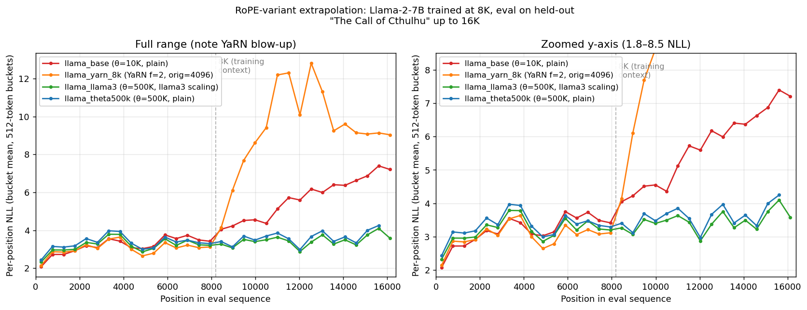

# H.P. Lovecraft long-context experiments

How does a Llama-2-7B fine-tune extrapolate past its training context?
This document compares four RoPE configurations, trained identically at
8K context, evaluated at 2K–16K on a held-out story.

## TL;DR

Llama-2-7B trained at 8K context, evaluated at 2K–16K on held-out
`the_call_of_cthulhu.txt` (excluded from training):

| Variant | RoPE | 2K | 4K | 8K⭐ | 12K | **16K** | 8K→16K |
|---|---|---:|---:|---:|---:|---:|---:|
| `llama_base`       | θ=10K, plain                            | 13.6 | 19.3 | 24.1 |  40.8 | **84.8**  | 3.5×   |
| `llama_yarn_8k`    | θ=10K, YaRN factor=2 orig=4096          | 14.8 | 20.7 | 20.7 | 142.4 | **492.3** | **24×** |
| `llama_theta500k`  | θ=500K, plain                           | 19.4 | 28.1 | 27.8 |  29.2 | **32.0**  | 1.15×  |
| `llama_llama3`     | θ=500K, Llama-3 NTK-by-parts scaling    | 16.6 | 24.0 | 24.5 |  25.6 | **27.8**  | 1.13×  |

⭐ 8K is the training context; columns to the right are extrapolation.

Headline: **bumping RoPE base frequency from 10 000 to 500 000 is the
single biggest intervention.** Llama-3's frequency-band scaling layered
on top gives a small additional improvement. Plain Llama-2 RoPE at
θ=10 000 cannot extrapolate past its training window. Fine-tune-time
YaRN with a factor that doesn't cover the eval window is
**catastrophic** in the extrapolation region.

## Background: RoPE, extrapolation, and scaling variants

Decoder-only transformers encode position through **Rotary Position
Embedding** ([Su et al. 2021](https://arxiv.org/abs/2104.09864)): each
query/key vector is rotated by a position-dependent angle before the
attention dot product, so the dot product depends on *relative*
position. The rotation frequencies `inv_freq_d = 1 / θ^(2d/D)` cover
many scales -- low-index dims rotate fast (local detail), high-index
dims rotate slowly (long-range structure). `θ` (`rope_theta`, default
10 000 in Llama-2) controls the base period: at θ=10 000 and head
dimension 128, the slowest-rotating dimension has a wavelength around
4000 tokens; at θ=500 000 it's around 63 000.

When a Llama-2-7B model that was pretrained at 4K is asked about
positions beyond 4K, the slow-rotating dimensions move into rotation
phases the model's Q/K projections were never optimised against. That
is the source of the "long-context degradation" the community has
worked around in several ways:

- **Bump θ.** If the slowest-rotating dimension has a wavelength much
  longer than anything the model sees at eval time, no extrapolation
  is actually happening -- all positions lie in a short arc. Llama-3
  took this approach for its base config: θ = 500 000.
- **Position Interpolation** ([Chen et al. 2023](https://arxiv.org/abs/2306.15595)).
  Divide *every* inverse frequency by a scale factor `s` to compress a
  longer eval range back into the pretrained range. Works, but
  needlessly compresses high-frequency dimensions that already
  generalise.
- **NTK-by-parts / Llama-3 scaling.** Apply a piece-wise blend: leave
  high-frequency dimensions alone, divide only the slow-rotating tail
  by the factor. Llama-3 uses this pattern when it extends its own
  context (`rope_type: llama3` with `low_freq_factor`,
  `high_freq_factor`, `original_max_position_embeddings`).
- **YaRN** ([Peng et al. 2023](https://arxiv.org/abs/2309.00071)).
  Per-frequency ramp between "extrapolated" (unscaled) and
  "interpolated" (divided by factor) inverse frequencies, plus a
  small attention-temperature correction. Configured by
  `factor` (target extension ratio) and
  `original_max_position_embeddings` (pretrained limit).

## Setup

Four variants, all Llama-2-7B, all fine-tuned identically on the 62
non-held-out Lovecraft stories at 8K context:

- **`llama_base`** -- plain RoPE, θ=10 000 (Llama-2 default).
- **`llama_yarn_8k`** -- RoPE with `rope_type: yarn`,
  `factor=2.0, original_max_position_embeddings=4096,
  beta_fast=32, beta_slow=1`. YaRN configured for a 4K→8K extension.
- **`llama_theta500k`** -- plain RoPE with θ bumped to 500 000. No
  scaling type change beyond θ.
- **`llama_llama3`** -- θ=500 000 plus `rope_type: llama3,
  factor=2.0, low_freq_factor=1.0, high_freq_factor=4.0,
  original_max_position_embeddings=4096`.

**Training.** `seq_len=8192`, `batch_size=1`, Adafactor at `lr=2e-5`,
warmup 0.5M tokens, WSD scheduler, SDPA attention, gradient
checkpointing + activation offloading + fused optimizer step + fused
linear-CE loss (24 GB single-GPU budget). Budget 10M tokens; each run
save-stopped around step 400-650 (see per-run log for exact step).
The dataset excludes `the_call_of_cthulhu.txt` from training
([`lovecraft-heldout-packed.yaml`](./lovecraft_reference/lovecraft_dataset/templates/configs/lovecraft-heldout-packed.yaml)).

**Evaluation.** Windowed perplexity and per-position NLL on the full
held-out `the_call_of_cthulhu.txt` (~70 K chars, ~20 K tokens) via
[`long_context_eval.py`](./long_context_eval.py).

## Results

### Windowed perplexity

The PPL table at the top of this document summarises the headline
result. A few ways to read it:

**In-domain PPL** (≤ 8K, the training context length). `llama_base`
is the lowest at 13.6/19.3/24.1 -- unsurprising, since plain RoPE at
θ=10 000 is closest to the pretrained model's weight distribution, so
there's less re-learning required. The scaled variants pay a small
(~3-5 PPL) tax in-domain for the flexibility they give out-of-domain.
`llama_yarn_8k` is close to `llama_base` in-domain because YaRN's
factor-2 rescaling still targets an 8K window.

**Extrapolation** (12K, 16K). The ranking inverts completely:

- `llama_llama3` and `llama_theta500k` stay flat. 8K→16K PPL growth
  is only 13-15%, and the 16K numbers (27.8, 32.0) are *lower* than
  the in-domain PPLs of the same variants at 4K. The model is
  extrapolating cleanly into territory 2× longer than its training.
- `llama_base` blows up: 8K→16K is 3.5× worse. Classic Llama-2 RoPE
  failure past the trained range.
- `llama_yarn_8k` blows up **dramatically worse than `llama_base`**:
  24× PPL growth to 492 at 16K. YaRN factor=2 targeting a 4K→8K
  extension means positions 0-8K are mapped into the Q/K
  distribution the model learned during YaRN training; positions
  8K-16K are *4×* beyond the original pretrain, outside both the
  pretrained distribution *and* the YaRN-adapted distribution. The
  model is worse at extrapolation than if YaRN had never been applied.

### Per-position NLL



Left panel: full range, with `llama_yarn_8k` climbing sharply past the
8K training cutoff. Right panel: same data with the y-axis clamped to
1.8–8.5 NLL so the three extrapolating variants can be compared
directly. Vertical dashed line marks the 8K training context.

- **`llama_base`** -- NLL oscillates in a narrow 2-4 band through
  position ~8400, then climbs monotonically from 4.0 at position 8448
  to 7.4 at position 15616. Classic out-of-distribution positional
  decay: smooth, not periodic.
- **`llama_yarn_8k`** -- same flat in-domain band, then NLL climbs
  much more steeply after 8K, plateauing at 9-13 in the 10K-16K
  region. NLL of ~12 is approximately `ln(vocab_size/3)` -- the model
  is approaching "random one of a few thousand tokens" territory.
- **`llama_llama3`** and **`llama_theta500k`** -- stay in a 3.0-4.2
  NLL band throughout the full 0-16K range. No structural
  degradation at any position.

No variant shows the 4096-periodic NLL spike pattern that the early
pre-migration experiments saw -- that turned out to be a plumbing
artefact, not a RoPE phenomenon (see footnote below).

## Interpretation

**Bumping θ is the lever that actually matters.**  At θ=500 000 the
slowest-rotating RoPE dimension has a wavelength of ~63 000 tokens, so
every position in a 16K eval lies in a short arc of the unit circle.
The model never has to generalise across full rotations. This captures
most of the extrapolation benefit by itself (`llama_theta500k`:
32.0 PPL at 16K).

**Llama-3 NTK-by-parts scaling adds a smaller refinement.** On top of
θ=500 000, the piecewise blend keeps high-frequency dimensions
untouched and divides the slow-rotating tail by the factor. The 16K
PPL drops from 32.0 to 27.8, and in-domain PPL is *lower* than
`llama_theta500k` across the board -- the high-frequency preservation
means the model can continue to rely on short-range token-level cues
without losing them to uniform compression.

**YaRN needs its factor to cover the eval window.** `llama_yarn_8k`
was configured for factor=2 (4K pretrain → 8K target), which matches
the 8K training context but not the 16K eval. Beyond 2× the original,
YaRN's rescaling formula extrapolates outside its adapted
distribution, and the result is worse than unscaled RoPE. A YaRN
variant with `factor=4, orig=4096` (targeting 16K) would likely
perform differently; that's a follow-up experiment worth running.

**Plain Llama-2 RoPE cannot extrapolate.** At θ=10 000 with no
scaling, the model simply cannot handle positions past its training
window. Not surprising, but the magnitude (3.5× PPL growth at 2×
extrapolation after a proper 8K fine-tune) is worth documenting.

## Caveats

- **Small held-out text** (~20 K tokens of *The Call of Cthulhu*).
  PPL numbers should be read as *relative*, not absolute. A broader
  eval across non-Lovecraft text would firm up the absolute
  numbers. Since the training corpus is only ~640 K tokens of
  Lovecraft-style prose, domain overfit is high and the in-domain
  PPL of ~14-19 reflects that, not zero-shot language modelling.
- **Final step counts were not perfectly matched** (404-652 across
  variants -- see "Reproducing" below). The over-trained variant is
  `llama_theta500k`, and since more training tends to improve
  in-domain PPL while *hurting* extrapolation (by saturating the
  model's representation to the training range), its strong
  extrapolation result at 16K is if anything conservative.
- **The YaRN result is specific to `factor=2`.** A YaRN run with
  `factor=4, orig=4096` targeting 16K would test a different claim
  and isn't part of this sweep.
- Training losses dropped to 0.04-0.40 at stop -- models partially
  memorised their 62-story training set. The eval is on a held-out
  story to remove memorisation from the extrapolation signal.

## Implications for pretraining

The experiment was designed as a *fine-tuning* comparison, but two
results have direct bearing on pretraining recipes.

**1. The θ that matters is a deployment knob, not a pretraining
commitment.**  `llama_theta500k` and `llama_llama3` were *pretrained
at 4 K context with θ=10 000*.  We flipped θ to 500 000 at the start
of fine-tuning and spent roughly 4 M tokens adapting the Q/K
projections.  The result: clean extrapolation to 2× the fine-tune
length (8 K → 16 K) with 13-15% PPL growth.  Plain Llama-2 after the
same fine-tune budget couldn't do it at all.  If this generalises,
it means long-context capability is closer to a *post-hoc*
intervention than a pretraining commitment -- provided the base
wavelength of the slowest RoPE dimension is longer than the
eventual deployment window.

**2. Long-context pretraining may be paying for the wrong thing.**
The expensive part of pretraining long is the attention cost on
every step.  If the bulk of extrapolation quality is coming from the
RoPE base frequency rather than from the model having seen long
sequences during pretrain, then the compute-efficient recipe is:

- Pretrain at a short context (cheap), with θ chosen for your
  deployment window.
- Fine-tune briefly at a modest intermediate length (~2× the pretrain
  context) to adapt the Q/K projections to the new θ.
- Deploy at 2-4× the fine-tune length.

For a 4 M-parameter tutorial model this is a curiosity.  At 7 B+ the
arithmetic swings compound quickly.

### Proposed follow-up: "how much of long-context capability is θ vs. data?"

Train a 30-50 M model from scratch in a 2 × 3 grid at *matched pretrain
compute*:

|                            | pretrain θ = 10 000 | pretrain θ = 500 000 | θ annealed 10 K → 500 K |
|----------------------------|:---:|:---:|:---:|
| pretrain 2 K → FT 4 K      | A1  | A2  | A3  |
| pretrain 4 K only (no FT)  | B1  | B2  | B3  |

Evaluate windowed PPL at 2 K, 4 K, 8 K, 16 K, 32 K on held-out text.
Headline questions:

- Does pretraining at θ=500 000 *hurt* in-domain PPL vs θ=10 000 at
  matched compute?  (The concern: with 63 K-token wavelengths, the
  high-index RoPE dims barely vary across 2-4 K pretrain positions
  and may go underused.)
- After a 2 K pretrain, does fine-tuning at 4 K recover the same
  extrapolation curve that an 8 K fine-tune buys after a 4 K pretrain?
  If so, long-context capability scales by *stages*, not by total
  training-time context.
- Is θ-annealing during pretraining a real improvement over constant
  θ=500 000?  A plausible mechanism: low θ early lets the model learn
  short-range patterns efficiently, then raising θ mid-training
  unlocks the long-range dimensions without re-training short-range
  behaviour.  A null result would simplify the recipe ("just pretrain
  with your deployment-target θ").

A second-order observation from this experiment: **YaRN with a factor
that doesn't cover the deployment window is worse than no scaling at
all** (`llama_yarn_8k` at 16 K was 6× worse than `llama_base`).  For
pretraining, that's an argument for preferring plain θ-bumps over
scaling recipes with a configured target -- plain θ has no failure
mode past any specific position, it just rotates more slowly.

### Configuring this in Forgather

Forgather exposes `rope_parameters` as a structured dict on every
model, settable in three places:

**Set in a model project's config template** (preferred for
pretraining):

```yaml
[model_config]
    == super()
    rope_parameters: {{ rope_parameters | toyaml({
        'rope_theta': 500000.0,
        'rope_type': 'default',
    }) }}
```

This is how `examples/models/llama/templates/configs/llama3.2_1b.yaml`
sets θ=500 000 with Llama-3-style scaling for its built-in variant.
If your model project exposes `rope_parameters` as a `!var` reference,
it can also be overridden from the training project without editing
the model project itself.

**Patch `config.json` on a pretrained Forgather-format model** (the
path this experiment took):

```python
import json
p = "~/models/fg_llama_7b_v_theta500k/config.json"
c = json.load(open(p))
c["rope_parameters"] = {"rope_theta": 500000.0, "rope_type": "default"}
json.dump(c, open(p, "w"), indent=2); open(p, "a").write("\n")
```

On the next load, the RoPE module reads `rope_parameters` from the
config and recomputes `inv_freq`.  The fine-tune run picks up the
new base frequency, adapts the Q/K projections, and you're done.

**`rope_type` choices** implemented in
[`modelsrc/transformer/rotary_embeddings.py`](../../modelsrc/transformer/rotary_embeddings.py):

- `default` -- plain RoPE with the specified `rope_theta`.
- `linear` -- position-interpolation; divides all inv_freqs by `factor`.
- `llama3` -- NTK-by-parts frequency-band scaling
  (`factor`, `low_freq_factor`, `high_freq_factor`,
  `original_max_position_embeddings`).
- `yarn` -- YaRN with ramp bounds `beta_fast`, `beta_slow`,
  plus `factor`, `original_max_position_embeddings`,
  optional `attention_factor`.

**θ-annealing across pretraining stages.** Forgather doesn't ship a
built-in callback that retunes θ mid-run; the rotary module computes
`inv_freq` at model-construction time, so changing θ requires either
(a) a custom callback that rewrites `model.*.rotary.inv_freq` in place
at scheduled steps, or (b) a multi-stage run: train with θ=10 000
until step N₁ → save-stop → patch `config.json` to θ=50 000 → resume
→ save-stop → patch to θ=500 000 → resume.  The resume path works
today with `forgather control save-stop` followed by re-launching the
same config with an updated `rope_parameters`.  The callback path
would be a small addition to
[`src/forgather/ml/trainer/callbacks/`](../../src/forgather/ml/trainer/callbacks/).

## Reproducing

The four variants were prepared by copying `fg_llama_7b` and patching
`config.json`'s `rope_parameters`:

```python
import json

variants = {
    "fg_llama_7b_v_yarn_8k": {
        "rope_theta": 10000.0, "rope_type": "yarn",
        "factor": 2.0, "original_max_position_embeddings": 4096,
        "beta_fast": 32, "beta_slow": 1,
    },
    "fg_llama_7b_v_llama3": {
        "rope_theta": 500000.0, "rope_type": "llama3",
        "factor": 2.0, "low_freq_factor": 1.0, "high_freq_factor": 4.0,
        "original_max_position_embeddings": 4096,
    },
    "fg_llama_7b_v_theta500k": {
        "rope_theta": 500000.0, "rope_type": "default",
    },
}
# for each: cp -rL base_model copy/; json.dump({... c, 'rope_parameters': rp}, ...)
```

`llama_base` uses `fg_llama_7b` unchanged.

Train each:

```bash
cd lovecraft_reference/finetune_lovecraft
for pair in \
    "1:fg_llama_7b:base" \
    "1:fg_llama_7b_v_yarn_8k:yarn" \
    "1:fg_llama_7b_v_llama3:llama3" \
    "1:fg_llama_7b_v_theta500k:theta500k" ; do
  IFS=':' read -r gpu model tag <<< "$pair"
  PYTORCH_CUDA_ALLOC_CONF=expandable_segments:True \
    forgather -t 8k.yaml train --total-tokens 10 \
      -M ~/models/${model} \
      --output-dir ~/models/${model}_lovecraft_8k \
      --attn-implementation sdpa --log-name $tag \
      -d $gpu
  # save-stop at step ~400 via `forgather control save-stop JOB_ID`
done
```

The `8k.yaml` config points at
[`lovecraft-heldout-packed.yaml`](./lovecraft_reference/lovecraft_dataset/templates/configs/lovecraft-heldout-packed.yaml),
which holds out `the_call_of_cthulhu.txt` from the training split.

Evaluate:

```bash
python3 long_context_eval.py \
    --variant llama_base:~/models/fg_llama_7b:~/models/fg_llama_7b_lovecraft_8k \
    --variant llama_yarn_8k:~/models/fg_llama_7b_v_yarn_8k:~/models/fg_llama_7b_v_yarn_8k_lovecraft \
    --variant llama_llama3:~/models/fg_llama_7b_v_llama3:~/models/fg_llama_7b_v_llama3_lovecraft \
    --variant llama_theta500k:~/models/fg_llama_7b_v_theta500k:~/models/fg_llama_7b_v_theta500k_lovecraft \
    --test-file hp_lovecraft/the_call_of_cthulhu.txt \
    --ppl-windows 2048,4096,8192,12288,16384 \
    --per-position-max 16384 --bucket-size 512 \
    --skip-generation \
    --output-md lovecraft_rope_eval.md
```

Full training + eval takes ~90 min across 3-4 GPUs.

---

## Footnote: earlier experiments used a broken training pipeline

An earlier revision of this document reported 16K PPL around 20-30 for
five variants and highlighted a mysterious 4096-periodic NLL spike
pattern. The investigation of that pattern
([`4k_spike_investigation.md`](./4k_spike_investigation.md)) eventually
found that the pre-`finetune_v2` training template had a configuration
gap: it accepted `--window-size 16384` on the CLI but never forwarded
the value into the dataset's block tokenizer. Every "16K training"
run was actually on 4K-tokenized data padded or packed to a 16K
sequence length. The 4K spike was the model's learned response to a
4K block structure it had been trained on without anyone realising
it.

The earlier absolute PPL numbers are therefore not comparable to the
ones in this document; the old variants were trained on an entirely
different regime. The results above are from the corrected pipeline
(real 8K tokens per optimizer step, `projects/finetune_v2.yaml` base
template) and supersede the earlier findings. No periodic NLL spike
appears in any variant here.

The main practical lesson from that episode: **when a result seems
surprising, verify by instrumenting the leaf of the pipeline, not the
preprocessed config.** `forgather pp` showed `window_size: 16384`
everywhere; a single `print()` inside `block_tokenize_fn` would have
settled the question in one run.
