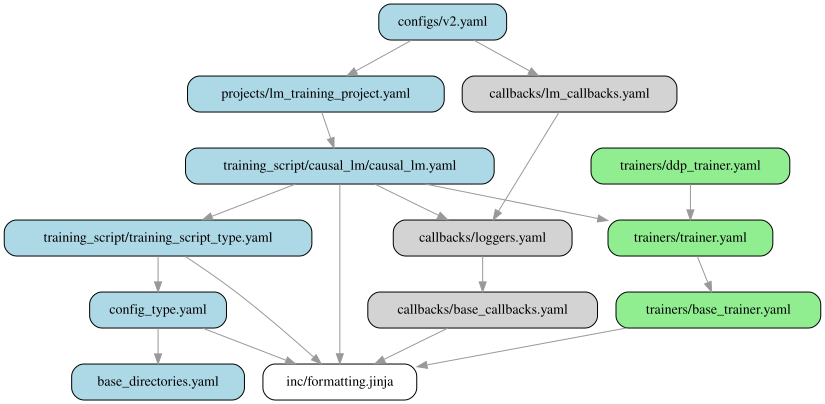

# Tiny Llama

This tutorial trains a ~5M-parameter Llama model from scratch on the
[TinyStories](https://huggingface.co/datasets/roneneldan/TinyStories) dataset.
On a single RTX 4090 it takes roughly 5-10 minutes. When it finishes, the
model produces surprisingly coherent short stories.

The tutorial is intended as a first introduction to Forgather. It doesn't
assume you know how anything Forgather-specific works; each command is
explained in context, and the "Anatomy" section at the bottom walks through
*why* the config is shaped the way it is.

There is also a companion [Jupyter notebook](project_index.ipynb) that
covers the same material interactively, with a pre-existing configuration
(`train_tiny_llama.yaml`) built directly on Forgather's lower-level
templates. This README focuses on the newer `v2.yaml` configuration, which
is built on Forgather's recommended `lm_training_project.yaml` base
template and is the pattern you'd copy for a new project.

**Hardware:** one or more NVIDIA GPUs. The default `v2.yaml` config uses
DDP (DistributedDataParallel -- each GPU runs a copy of the model on a
different slice of the batch, and gradients are averaged across GPUs at
each step). It works on anything from a single GPU upward; on a single
GPU, DDP degrades to plain training with no performance penalty.

## Before You Start

From a shell, from this directory:

```bash
cd examples/tutorials/tiny_llama
```

List the available configurations:

```bash
forgather ls
```

You should see five entries. This tutorial uses the last one:

```
v2.yaml    Tiny Llama v2 : Train Tiny Llama using the new lm_training_project.yaml template
```

Inspect the fully-resolved configuration for `v2.yaml`:

```bash
forgather -t v2.yaml pp | less
```

Everything you'll see in later sections (trainer arguments, dataset paths,
optimizer choice, learning rate schedule, etc.) is derived from this one
file and its parents -- `lm_training_project.yaml` and the templates
`lm_training_project.yaml` itself extends. `pp` ("pre-process") is the
quickest way to check whether the config is valid and see what each knob
resolves to.

**Debugging a broken config:** if `forgather ls` shows `PARSE ERROR`
instead of a config's description, try (in order of increasing verbosity):

```bash
forgather ls -d                      # dumps the preprocessed file with
                                     # line numbers; shows YAML errors
                                     # directly, or the Jinja2 error if
                                     # preprocessing itself failed
forgather -t v2.yaml pp --debug      # dumps every template in the chain
```

## 1. Train the Model

```bash
forgather -t v2.yaml train
```

That's the whole command. On a machine with multiple GPUs it launches one
DDP worker per GPU; on a single-GPU box it runs as a single process. The
training script:

1. Loads TinyStories from `examples/datasets/roneneldan` (packed into
   2048-token blocks so nearly every token in a batch is real text).
2. Constructs a fresh 4M-parameter Llama from `examples/models/llama`.
3. Trains for 80M tokens (roughly 10× the Chinchilla training-optimal
   budget for a 4M model -- see the "Training budget" section further
   down) with a cosine-decay LR schedule and automatic batch-size-aware
   LR scaling.
4. Saves checkpoints to `output_models/v2/checkpoints/` and TensorBoard
   logs to `output_models/v2/runs/`.

**Quick profile run** (no checkpoints, 200 steps, then exits cleanly):

```bash
forgather -t v2.yaml train --save-strategy no --max-steps 200
```

Useful for sanity-checking a new config change -- you get tokens/sec, loss
curve, and peak memory without committing a full run's worth of disk.
Note: because `--save-strategy no` writes no checkpoints, a profile run
alone won't give you a model for sections 4 and 5. Run the full `train`
command above at least once to produce `output_models/v2/checkpoints/`.

**Resume behaviour:** After a checkpoint has been written, any subsequent
`train` invocation with the same config resumes from the newest checkpoint.
If you run `train` again after a completed run, the trainer will see it
has already reached `max_steps` and exit immediately. To extend training,
either raise the token budget (`--total-tokens 160`, for example) or
delete the output directory.

**Re-building after editing model source code:** the generator writes
Python source into `output_models/v2/` on first construction and reuses it
on subsequent runs. If you change the underlying model templates, remove
the output directory before retraining so the new source is regenerated:

```bash
rm -rf output_models/v2
forgather -t v2.yaml train
```

## 2. Monitor Training

While training runs, open TensorBoard on the output directory:

```bash
forgather -t v2.yaml tb        # watch just the v2 config's output
forgather tb --all             # watch every model in output_models/
```

TensorBoard reads each `runs/<timestamp>/` subdirectory automatically.
The `--all` form is handy once you have several configs under this
project -- you can compare loss curves in the same TensorBoard view.

**Remote / headless machines.** TensorBoard binds to `localhost:6006`
by default. If your browser isn't running on the training machine:

- **SSH port-forward (recommended).** Connect with
  `ssh -L 6006:localhost:6006 training-host` and then open
  `http://localhost:6006` in the browser on your laptop.
- **Bind to all interfaces.** Pass `-- --bind_all` to TensorBoard:
  `forgather -t v2.yaml tb -- --bind_all`.  This opens port 6006 on
  every network interface with no authentication or TLS -- only do it
  on a trusted network.

For quick offline inspection of a completed run (no arg = auto-detect
the latest run in the current project):

```bash
forgather logs summary                     # latest run
forgather logs plot --loss-curves          # latest run
```

Both commands accept an explicit path too -- `forgather logs summary
path/to/trainer_logs.json`. `forgather logs summary --all` prints a
compact one-line-per-run table across every run under `output_models/`.

## 3. Control a Running Job

Forgather attaches a control server to each training process. From a
second shell while training is in flight:

```bash
forgather control list                 # see running jobs
forgather control status JOB_ID        # detailed status for one job
forgather control save JOB_ID          # force checkpoint save
forgather control stop JOB_ID          # graceful stop (saves a final checkpoint)
forgather control save-stop JOB_ID     # save then stop
forgather control abort JOB_ID         # stop without saving (use for failed experiments)
forgather control cleanup              # prune dead job endpoint files
```

`JOB_ID` is the token printed in the training log (`Trainer control
endpoint: http://.../jobs/<JOB_ID>`). Prefer these commands over Ctrl-C --
Ctrl-C can leave worker processes hanging, especially under DDP.

## 4. Evaluate the Model

After training completes, run the TinyStories test-split evaluation.
Pass `-t v2.yaml` so the eval subcommand knows which project config to
read (otherwise it falls back to the project's default config, which
produces a different `output_models/` subdirectory and fails to find
your checkpoint):

```bash
forgather -t v2.yaml eval test tinystories
```

Output looks like:

```
========================================================================
Evaluation: tinystories  (Eval: TinyStories)
------------------------------------------------------------------------
Model:            .../output_models/v2
Dataset:          .../examples/datasets/roneneldan  [tinystories-packed.yaml]
Target:           test_dataset
Trainer:          ddp  (world_size=1)
Batch size:       16  max_length=2048
Dtype:            bfloat16  attn=sdpa
========================================================================
...
eval_loss:        1.46
perplexity:       4.32
wall_time:        5.84 s
========================================================================
```

**Reading the numbers:**

- **`eval_loss`** -- intuitively, *how surprised the model was by the
  correct next token, averaged over every token in the test set*. Zero
  means the model assigned 100% probability to the right token every
  time; higher numbers mean it was consistently uncertain. Technically,
  it's the average *per-token cross-entropy* in nats. At each token
  position, the model outputs a probability distribution over every
  token in the vocabulary; the loss for that position is `-log(p)`
  where `p` is the probability the model assigned to the token that
  actually came next. `ln(vocab_size)` (≈ 7.6 for our 2K vocabulary)
  is the loss of a uniform-random guesser.
- **`perplexity = exp(eval_loss)`** -- intuitively, *how many options
  the model was effectively juggling when predicting the next token*.
  Perplexity 4.32 means "on average, the model acts as if it's picking
  between about four equally-plausible next tokens." Lower = more
  confident. Technically it's the same cross-entropy rescaled to an
  "effective branching factor": perplexity 1.0 is perfection (always
  right), perplexity equal to vocab size is random guessing.
  4.32 on a 2K-vocab tokenizer means our model has narrowed 2,000
  possibilities down to the equivalent of ~4 per step -- strong for a
  5M-parameter model trained in a couple of minutes.

Perplexity is only directly comparable between models that use the
**same tokenizer** (a smaller vocabulary makes perplexity artificially
lower, because there are fewer things to choose among). To compare
against a Llama-2 / Mistral / GPT-style model you'd need to run the
same test text through each model's own tokenizer and compare
cross-entropy per *byte* rather than per *token*.

By default, `forgather eval test` evaluates the latest checkpoint of the
current project's output directory. To evaluate a different model, pass
`--model /path/to/model`. `forgather eval list` shows all available eval
configs (openorca, fineweb-edu-dedup, tinystories, etc.).

Results are written under `output_models/v2/evals/` as markdown + JSON.

## 5. Generate Text

Start the OpenAI-compatible inference server. `-m` points at the model
directory; `-c` tells it to resume from the latest checkpoint in that
directory rather than loading the base model weights in place.

```bash
forgather inf server -c -m output_models/v2
```

**Alternative: link the checkpoint into the model directory.** Forgather
stores checkpoints in `output_models/v2/checkpoints/checkpoint-N/`, while
the base model code + `config.json` live at `output_models/v2/` itself.
Hugging Face's `AutoModelForCausalLM.from_pretrained()` only looks in the
directory you give it, so if you want to load the trained weights with a
third-party tool that expects a plain HF model directory, symlink the
latest checkpoint's weight files up into the base directory:

```bash
forgather -t v2.yaml checkpoint link
```

After this, `AutoModelForCausalLM.from_pretrained("output_models/v2")`
loads the trained weights without needing `-c`. See `generate_demo.py`
in this directory for a runnable example.

From another shell, send it a completion prompt:

```bash
forgather inf client --completion "Once upon a time" --max-tokens 256
```

Or chat interactively:

```bash
forgather inf client
```

The model was trained without a chat template, so completion mode ("give
the model some text and let it continue") produces the most natural
output. Try different sampling settings:

```bash
# Greedier (more "safe" outputs)
forgather inf client --completion "Once upon a time" --temperature 0.3

# Wilder (more varied, occasionally incoherent)
forgather inf client --completion "Once upon a time" --temperature 1.3
```

Stop the server with Ctrl-C.

### Alternative: generate from Python directly

The inference server is convenient for interactive use and for tools
that speak the OpenAI API. If you'd rather generate text from a plain
Python script -- say, for a batch job, a notebook, or just to poke at
the sampling internals -- this project ships a standalone
[`generate_demo.py`](generate_demo.py) that does exactly that.

Before first use, make sure the latest checkpoint has been linked into
the model directory (see the `checkpoint link` section above). Then:

```bash
./generate_demo.py                                # run both modes on default prompts
./generate_demo.py --mode hf                      # model.generate() only
./generate_demo.py --mode manual                  # hand-rolled sampling only
./generate_demo.py --max-new-tokens 200           # longer continuations
./generate_demo.py --model output_models/my_experiment   # different model
```

The script demonstrates two equivalent ways to sample from a causal LM:

- **`--mode hf`** calls `model.generate(...)` with a standard
  `GenerationConfig` (temperature 0.7, top-p 0.9, repetition penalty
  1.15). This is the normal way to use an HF model.
- **`--mode manual`** does the same job without calling
  `generate`: it runs one forward pass per new token and applies
  repetition penalty, temperature scaling, top-p filtering, and
  multinomial sampling to the logits in plain PyTorch. Read the
  `sample_token` function if you've ever wondered *what* `generate`
  actually does under the hood -- every operation is ~5 lines of
  tensor math with a comment explaining which knob does what.

The manual path is what you'd use when you need behaviour the high-level
API doesn't expose: custom stopping conditions, logit introspection,
streaming token-by-token, or a custom sampler. Because it loads the
model through plain HF `AutoModelForCausalLM.from_pretrained`, the
same pattern works for any model compatible with transformers, not
just Forgather-format ones.

## 6. Export to a Plain HF Llama Model

Forgather-format models work with Forgather's own tooling
(`forgather inf server`, the inference client, `forgather convert`) and
with `AutoModelForCausalLM.from_pretrained(..., trust_remote_code=True)`
in transformers. To hand the trained model off to tooling that expects a
"plain" HF Llama checkpoint -- e.g. vLLM, llama.cpp conversion, a third-
party evaluation harness -- convert it to the vanilla
`transformers.LlamaForCausalLM` architecture:

```bash
forgather convert --reverse --model-type llama \
    output_models/v2 /tmp/tiny_llama_hf
```

The `--reverse` flag forces a Forgather→HF conversion; `--model-type
llama` selects the target HF architecture. The output directory holds a
standard HF layout (`config.json` with `model_type: llama`,
`model.safetensors`, tokenizer files), loadable by any HF-compatible
tool:

```python
from transformers import AutoModelForCausalLM, AutoTokenizer
model = AutoModelForCausalLM.from_pretrained("/tmp/tiny_llama_hf")
tok   = AutoTokenizer.from_pretrained("/tmp/tiny_llama_hf")
```

No `trust_remote_code=True` is needed -- the converter writes standard
HF Llama weights, not Forgather's dynamic-code format.

> **Note:** at time of writing, the converter's auto-detection
> misclassifies Forgather-native models as HF and fails without
> `--reverse`. Passing both `--reverse` and `--model-type llama`
> explicitly is the reliable path until that's fixed.

---

At this point you've trained, monitored, controlled, evaluated, served,
and exported a language model. The rest of this document explains *how
the config that made that possible is put together*, and shows how to
modify it.

## How Forgather Configs Work

A Forgather config is a YAML document pre-processed through Jinja2. The
pre-processing step is how small child configs can inherit from large,
feature-rich parent templates and override only what they want to change.

The layers:

```
v2.yaml                             <- this project's config
  extends lm_training_project.yaml  <- Forgather's LM training template
    extends training_script/causal_lm/causal_lm.yaml
      extends ...                   <- base templates
```

Each level can override named blocks from any level above it using Jinja2
syntax. Forgather uses line statements (`--` prefix at column 0) so YAML
remains readable:

```yaml
-- extends "projects/lm_training_project.yaml"

[config_metadata]
    == super()
    -- set ns.config_name = "Tiny Llama v2"
```

`[config_metadata]` is a named YAML block; `== super()` injects everything
the parent template wrote there, and `-- set ns.config_name = ...`
overrides one namespace variable. You can read the fully-rendered,
post-inheritance result any time with `forgather -t v2.yaml pp`.

To explore the inheritance tree for this config:

```bash
forgather -t v2.yaml trefs

# The image below was generated with
forgather -t v2.yaml trefs --format svg -o v2.svg
```



For the complete syntax reference see
[docs/configuration/syntax-reference.md](../../../docs/configuration/syntax-reference.md).

For the `lm_training_project.yaml` parameter list see
[docs/project-templates/lm-training-projects.md](../../../docs/project-templates/lm-training-projects.md).

For a complete listing of a training options see
[docs/trainers/trainer_options.md](../../../docs/trainers/trainer_options.md)

## v2.yaml Anatomy

Open [`templates/configs/v2.yaml`](./templates/configs/v2.yaml) side-by-side with the explanation below.
The file is ~80 lines; almost every line corresponds to one knob documented
at the top of [`lm_training_project.yaml`](../../../templatelib/examples/projects/lm_training_project.yaml).

### Metadata and dataset

```yaml
[config_metadata]
    == super()
    -- set ns.config_name = "Tiny Llama v2"
    -- set ns.model_name = model_name | default("v2")

    -- set ns.trainer_type = trainer_type | default("ddp")
```

`ns` is the configuration namespace the parent templates build up -- each
`-- set ns.X = ...` line pushes a value into it. The `| default("...")`
filter means "if the variable X wasn't passed on the CLI, use this
default." `ns.trainer_type = "ddp"` selects the DistributedDataParallel
trainer; `"basic"` (single-GPU), `"fsdp2"`, and `"pipeline"` are the other
choices.

```yaml
    -- set ns.dataset_proj = abspath(dataset_proj | default(joinpath(ns.forgather_dir, "examples", "datasets", "roneneldan")))
    -- set ns.dataset_config = dataset_config | default("fast-iter-packed.yaml")
```

These two lines point at a sibling dataset *project* (not a raw dataset
file). Dataset projects are themselves Forgather projects that describe
how raw text is tokenized, packed, and split. `fast-iter-packed.yaml`
takes the TinyStories corpus, packs variable-length stories into
fixed-size 2048-token blocks with document boundaries marked for the
collator, and streams the result as an iterable dataset.

### Model

```yaml
    -- set ns.model_project_dir = abspath(model_project | default((joinpath(ns.forgather_dir, "examples", "models", "llama"))))
    -- set ns.model_project_config = model_config | default("4M.yaml")
```

Same pattern for the model: `lm_training_project.yaml` instantiates the
model by loading a sibling *model project*. `4M.yaml` selects the
4M-parameter Llama variant; sibling configs in `examples/models/llama/`
include `10M.yaml`, `30M.yaml`, etc.

### Training budget

```yaml
    -- set ns.total_tokens = total_tokens | default(80)          # millions
    -- set ns.warmup_tokens = warmup_tokens | default(8)
    -- set ns.min_cooldown_tokens = min_cooldown_tokens | default(40)
```

`lm_training_project.yaml` derives the number of optimizer steps from the
token budget and the batch/sequence settings below. `80M` tokens at
2048 seq_len × 8 batch-size on a single GPU works out to ~5140 steps.
Cosine LR decay anneals over the last `total_steps - warmup_steps`,
clamped to at least `min_cooldown_tokens` so a short budget doesn't crush
LR to zero in a few hundred steps.

**Why 80M tokens for a 4M-parameter model?** There are two different
questions hiding inside "how much data do I train on":

- **Training-optimal** (the Chinchilla recipe; Hoffmann et al. 2022):
  *given a fixed training compute budget, what parameter-count / token-count
  split gets the lowest loss?* Chinchilla fit a scaling law to a sweep
  of runs and found the sweet spot for this tutorial's 4M-parameter
  model to be around **8M tokens** (≈ 1× Chinchilla). Training longer
  than that still reduces loss, but less than doubling the parameter
  count would at the same extra compute cost -- so from a *training-
  compute-per-unit-loss* perspective it's "wasteful."
- **Inference-optimal:** *given that I'll serve this model many times,
  how do I minimize total cost (training + inference)?* Once the model
  ships, each inference call runs every parameter, so a smaller
  over-trained model is cheaper to serve than a larger
  Chinchilla-optimal model at the same loss. Modern recipes therefore
  train well past Chinchilla -- Llama-2 was ~10× Chinchilla, Llama-3
  was ~75×.

`v2.yaml` defaults to `total_tokens = 80` (80M, roughly 10×
Chinchilla-optimal for a 4M model), in the inference-optimal
direction. For a 1B model Chinchilla-optimal would be ~20B tokens; at
10× that's 200B. For a 70B model, Chinchilla is ~1.4T and 10× is ~14T.
You can move back toward training-optimal for quicker experiments
with `--total-tokens 8` (or any other number), at the cost of a
somewhat-higher final loss.

### Batching, LR scaling

```yaml
    -- set ns.seq_len = seq_len | default(2048)
    -- set ns.per_device_train_batch_size = batch_size | default(8)
    -- set ns.base_lr = lr | default(1.0e-3)
```

`ns.base_lr` is the learning rate at the reference batch size of 16K
tokens per step. If you change `batch_size`, `seq_len`, or the number of
GPUs, the parent template scales LR by
`(actual_tokens_per_step / 16384) ^ 0.5` -- so the same config stays
stable across 1-GPU and 8-GPU runs without retuning. Override with
`--lr`.

### Trainer arguments

The `[trainer_args]` block adds to what the parent already set:

```yaml
[trainer_args]
    == super()
    eval_on_save: True            # run eval every time we checkpoint
    torch_compile_dynamic: False  # fixed sizes; slightly faster
    mixed_precision: bf16
    max_grad_norm: 1.0            # clip gradients (insurance vs. spikes)
```

### Generation during training

```yaml
    -- set ns.eval_prompts_file = "prompts/tiny_stories.yaml"
    -- set ns.eval_max_new_tokens = 40
    -- set ns.generation_steps = 500
```

Every 500 steps, a text-generation callback samples continuations for
each prompt in `prompts/tiny_stories.yaml` and writes them to
TensorBoard. This gives you *qualitative* feedback during training
without having to stop and run inference manually.

## Dynamic CLI Arguments

Look at the last section of `lm_training_project.yaml`
(`[dynamic_args]`). Every knob exposed there becomes a CLI flag you can
override at the command line. Examples:

```bash
forgather -t v2.yaml train --batch-size 16                  # larger per-device batch
forgather -t v2.yaml train --total-tokens 160               # double training budget
forgather -t v2.yaml train --lr 5e-4                        # halve the LR
forgather -t v2.yaml train --trainer-type basic -d 0        # single GPU
forgather -t v2.yaml train --attn-implementation sdpa       # fall back from flex_attention
forgather -t v2.yaml train --compile false                  # disable torch.compile
```

`forgather -t v2.yaml train --help` lists everything.

**When to use them.** Dynamic args are optimised for *quick iteration*:
you're trying to figure out which combination of settings works best on
your hardware, and you want to try six variations without editing a
YAML file each time. Perfect for that.

**When to stop using them.** Once you've found a combination you want
to keep, commit it to a config file -- write a new derived config that
extends `v2.yaml` and bakes the settings in. The reason is
*reproducibility*: a run reproduced from a committed config will
always give the same training setup, while a run reproduced from "the
v2.yaml config plus whatever flags I happened to type in the shell
six weeks ago" depends on remembering exactly what you typed. The
shell history is not a lab notebook.

(The examples under `forgather/examples/` sometimes look like they
violate this principle -- lots of CLI overrides in their READMEs. That
is because the examples have to run across a wide range of hardware,
so they ship with generic defaults and rely on CLI overrides to adapt.
Your own project doesn't have that constraint; prefer committed
configs.)

As an experiment, you can try training a 30M parameter Llama model to
10x Chinchilla optimal with:

```bash
forgather -t v2.yaml train --model-config small.yaml --model-name small --total-tokens 600
```

## Create Your Own Experiment

Let's do a quick experiment: train a 4M model with half the base
learning rate, and -- instead of specifying a fixed warmup token
budget -- make the warmup *proportional to total training steps*
(10%). This shows off two different layers of the config system:
overriding a knob in `[config_metadata]` (simple), and computing a
derived value in `[globals]` (a bit more advanced).

```bash
forgather project new_config my_experiment.yaml templates/configs/v2.yaml
```

That copies `v2.yaml` to `templates/configs/my_experiment.yaml`. Open it
and trim it down to:

```yaml
-- extends 'configs/v2.yaml'

[config_metadata]
    == super()
    -- set ns.config_name = "My Experiment"
    -- set ns.config_description = "Half the LR, 10% warmup, auto-derived"
    -- set ns.model_name = "my_experiment"       # new output directory

    ## Halve the learning rate.  Simple scalar override.
    -- set ns.base_lr = lr | default(5.0e-4)

[globals]
    == super()
    ## Warmup = 10% of total training steps.  We override this in
    ## [globals] rather than [config_metadata] because ns.total_steps
    ## is computed by the parent template's [globals] block (from
    ## total_tokens / tokens_per_step), so it's only available here,
    ## *after* super() has run.
    -- set ns.warmup_steps = (ns.total_steps * 0.1) | int
```

The two blocks do different jobs:

- **`[config_metadata]`** is where you set *input* parameters:
  `ns.base_lr`, `ns.seq_len`, `ns.total_tokens`, etc. These feed into
  the parent templates' step/LR/schedule derivations.
- **`[globals]`** is where those derivations happen -- it's the block
  the parent templates use to turn "80M tokens at batch size 8" into
  concrete things like `ns.total_steps = 5140`. To *use* any derived
  value (like `ns.total_steps`) in your own override, you need to do
  it in `[globals]` after `== super()`.

**Why can't I just set `warmup_steps` in `[config_metadata]`?** This is
a consequence of how Jinja2 template inheritance orders block
execution. Roughly: your child `[config_metadata]` runs (with its
`== super()` pulling in the parent's), then the parent's `[globals]`
runs and unconditionally assigns `ns.warmup_steps = ns.warmup_tokens
// ns.tokens_per_step`. Anything you set earlier in
`[config_metadata]` is simply *overwritten* at that point. By placing
your override in `[globals]` **after** `== super()`, your assignment
happens *last* and wins. The `[config_metadata]` vs `[globals]`
distinction isn't semantic -- it's "I set inputs" vs. "I correct
outputs after the parent has computed them."

Confirm it parses and see the derived values:

```bash
forgather ls                                    # should list my_experiment.yaml
forgather -t my_experiment.yaml pp | grep -E "^# ns\.(total_steps|warmup_steps|global_lr)"
# expect: warmup_steps ≈ 514 (10% of total_steps 5140)
```

Short profile run to confirm it trains:

```bash
forgather -t my_experiment.yaml train --save-strategy no --max-steps 200
```

Real run:

```bash
forgather -t my_experiment.yaml train
```

Both runs write to separate output directories (`output_models/v2/` vs
`output_models/my_experiment/`), so you can compare loss curves in
TensorBoard:

```bash
forgather tb --all
```

### `model_name` vs `log_name`: when to change which

Two knobs control where output lands:

- **`ns.model_name`** sets the *model output directory*:
  `output_models/<model_name>/`. This is where checkpoints go, where
  the generated model source code lives, and the top-level root for
  this config's artifacts.
- **`ns.log_name`** sets a *per-run TensorBoard subdirectory* inside
  that model directory: `output_models/<model_name>/runs/<log_name>_<timestamp>/`.

Two rules of thumb follow:

- **Shared `model_name`, different `log_name`, no checkpoints** is
  safe and often useful. For example: a profile/LR sweep where you
  run the same config with `--save-strategy no` five times at
  different learning rates and want all five curves in one TensorBoard
  view. Just pass `--log-name lr_1e-3`, `--log-name lr_3e-4`, etc.
- **Shared `model_name` across configs that DO save checkpoints** is
  hazardous. Forgather resumes from the newest checkpoint in the
  model directory by default, so config B will happily pick up
  config A's checkpoint at startup, continue training into it, and
  quietly mix weights from two different experiments. The loss curve
  will look plausible; the model will be nonsense. **Always give a
  distinct `model_name` to any config that saves checkpoints** --
  that's why `my_experiment.yaml` above sets
  `ns.model_name = "my_experiment"`.

## Comparing with the Older train_tiny_llama.yaml

The original Tiny Llama tutorial (see the notebook) uses
`train_tiny_llama.yaml`, which is built directly on
`training_script/causal_lm/causal_lm.yaml` (one layer below
`lm_training_project.yaml`). It's a useful reference for seeing what
`lm_training_project.yaml` automates:

- **Step cadence** -- the older config pins `logging_steps`, `eval_steps`,
  `save_steps` to specific numbers. `v2.yaml` derives them from a
  token-budget cadence (`base_logging_tokens` etc.) that scales with
  batch and sequence length.
- **LR schedule** -- the older config wires up `CosineLRScheduler`
  itself. `v2.yaml` inherits it from the parent.
- **Dataset handling** -- the older config hard-codes a tokenizer args
  block for the dataset. `v2.yaml` passes `ns.seq_len` through
  automatically.

Both configs produce working Tiny Llama models. `v2.yaml` is
recommended as the starting point for new projects; the older one is
kept because it's easier to *read* as a first exposure to how
training-script configs are assembled.

## Troubleshooting

- **"config failed to parse"** (shows as `PARSE ERROR` in `forgather ls`):
  run `forgather -t v2.yaml pp --debug` to dump each preprocessed
  template in the chain.
- **Training runs but loss diverges within the first few steps:** drop
  `--lr` by 2-4×. Also check `forgather tb` for the gradient-norm curve;
  if it explodes early, either add warmup (`--warmup-tokens`) or clip
  harder (`max_grad_norm`).
- **OOM on a modest GPU:** lower `--batch-size`, or add
  `--gradient-checkpointing true`. The 4M model should fit on a 6 GB
  card at `batch_size=1`.
- **`train` exits immediately on a second run:** the previous run
  reached `max_steps` and a checkpoint recorded that fact. Either
  increase the token budget (`--total-tokens N`) or delete
  `output_models/v2/`.
- **Model source changes don't take effect:** the generator writes code
  into `output_models/v2/` on first construction. Delete that directory
  to force a re-generation.

## Reference

- [`templates/configs/v2.yaml`](templates/configs/v2.yaml) -- the config
  walked through above.
- [`templates/configs/train_tiny_llama.yaml`](templates/configs/train_tiny_llama.yaml)
  -- the older, more explicit config covered by the notebook.
- [`generate_demo.py`](generate_demo.py) -- standalone Python script that
  loads the trained model with HF `AutoModelForCausalLM` and generates
  continuations two ways: via `model.generate(...)` and a hand-rolled
  autoregressive sampling loop (temperature, top-p, repetition penalty
  applied explicitly to the logits).
- [`project_index.ipynb`](project_index.ipynb) -- interactive companion
  covering the same material with `train_tiny_llama.yaml`.
- [docs/project-templates/lm-training-projects.md](../../../docs/project-templates/lm-training-projects.md)
  -- full parameter list for `lm_training_project.yaml`.
- [docs/configuration/syntax-reference.md](../../../docs/configuration/syntax-reference.md)
  -- the Jinja2-flavoured YAML syntax used throughout.
- [docs/trainers/trainer_options.md](../../../docs/trainers/trainer_options.md)
  -- every option the trainer accepts.
